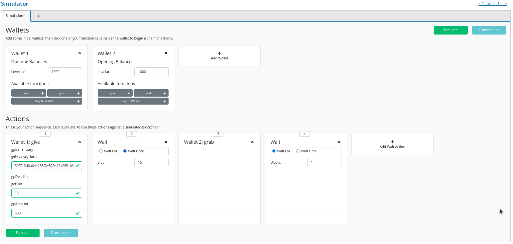

# Plutus Pioneer Program Lectures

This is a written version of the Plutus Pioneer Program YouTube lectures by Lars Brünjes.

[The lectures notes are being moved to a better format](https://plutus-pioneer-program.readthedocs.io/en/latest/).

If this is useful, and you fancy helping out a small Cardano Stake Pool, please consider staking a little of your ADA with CHESS https://chess.ihpapp.com, or any of the many other small pools run by single stake pool operators.

- [Week 01](#week-01)
  * [Welcome](#welcome)
  * [The (E)UTxO Model](#the-eutxo-model)
    + [Overview](#overview)
    + [When Is Spending Allowed?](#when-is-spending-allowed)
    + [Script Context](#script-context)
      - [The Bitcoin approach](#the-bitcoin-approach)
      - [The Ethereum approach](#the-ethereum-approach)
      - [The Cardano approach](#the-cardano-approach)
  * [Running an example auction contract on a local Playground](#running-an-example-auction-contract-on-a-local-playground)
    + [Plutus Setup](#plutus-setup)
      - [Server](#server)
      - [Client](#client)
    + [The English Auction contract](#the-english-auction-contract)
- [Week 02](#week-02)
  * [Overview](#overview-1)
  * [PlutusTx.Data](#plutustxdata)
  * [Plutus Validator](#plutus-validator)
    + [Example 1 - The Gift Contract](#example-1---the-gift-contract)
    + [Example 2 - Burn](#example-2---burn)
    + [Example 3 - Forty Two](#example-3---forty-two)
    + [Example 4 - Typed](#example-4---typed)
    + [Example 5 - Custom IsData types](#example-5---custom-isdata-types)
- [Week 03](#week-03)
  * [Housekeeping](#housekeeping)
    + [Porting IsData](#porting-isdata)
      - [Code Changes](#code-changes)
      - [Playground Changes](#playground-changes)
  * [Recap](#recap)
  * [ScriptContext](#scriptcontext)
    + [txInfoValidRange](#txinfovalidrange)
    + [Slot](#slot)
  * [Example - Vesting](#example---vesting)
    + [In the playground](#in-the-playground)
  * [Example 2 - Parameterized Contract](#example-2---parameterized-contract)
    + [An Observation](#an-observation)
    + [Another Way of Doing It](#another-way-of-doing-it)
      - [The Lift Class](#the-lift-class)
    + [Back to the playground](#back-to-the-playground)
- [Week 04](#week-04)
  * [Overview](#overview-2)
  * [Monads](#monads)
    + [Hello World](#hello-world)
    + [getLine](#getline)
    + [Maybe](#maybe)
    + [Either](#either)
    + [Writer](#writer)
    + [What is a Monad?](#what-is-a-monad)
    + [Why Is This useful?](#why-is-this-useful)
    + ['do' notation](#do-notation)


# Week 01

 This is a written version of [Lecture #1](https://youtu.be/IEn6jUo-0vU).

 It covers an introduction to Plutus, the (E)UTxO model (and how it compares to other models), and concludes with an example English Auction managed with a Plutus smart contract running on the Plutus Playground.

 Please feel free to raise pull requests for typos, poor formatting, poor grammar, or anything else that is poor or inaccurate.

## Welcome

Learning Plutus isn't easy, and there are a number of reasons for that.

1. Plutus uses the (E)UTxO model. This is different and less intuitive than the Ethereum method for creating smart contracts. It has a lot of advantages, but it requires a new way of thinking about smart contracts. And that's before we even start with the language itself.
2. Plutus is new and still under rapid development.
3. Tooling is not ideal, yet. So, experienced Haskell developers will notice that the experience with Plutus is not as pleasant, for example, when trying to access documentation or get syntax hints from the REPL. It can also be a challenge to build Plutus in the first place. The easiest way currently is to use Nix. The Plutus team is working on providing a Docker image, which will help.
4. Plutus is Haskell, more or less, which can have a tough learning curve for those coming from an imperative programming background.
5. Plutus is brand new and this means that there are not many help resources available, such as StackOverflow posts.

## The (E)UTxO Model

### Overview

One of the most important things you need to understand in order to write Plutus smart contracts is the accounting model that Cardano uses, the Extended Unspent Transaction Output model.

The UTxO model, without the (E) is the one that was introduced by Bitcoin, but there are other models. Ethereum for example, uses the so-called account-based model, which is what you are used to from normal banking, where everybody has an account and each account has a balance and if you transfer money from one account to another then the balances get updated accordingly. 

That is not how the UTxO model works.

Unspent transaction outputs are exactly what the name says. They are transaction outputs from previous transactions that have happened on the blockchain that have not yet been spent. Let's look at an example where we have two such UTxOs.


Alice wants to send 10 ADA to Bob, so she creates a transaction. A transaction is something that contains an arbitrary number of inputs and an arbitrary number of outputs.

The important thing is that you can only ever use complete UTxOs as input. Alice cannot simply split her existing 100 ADA into a 90 and a 10, she has to use the full 100 ADA as the input to a transaction.


Alice's transaction is no longer a UTxO (an unspent transaction). It has been spent as an input to Tx 1. And now, she can create outputs for her transaction.

She wants to pay 10 ADA to Bob, so one output will be 10 ADA (to Bob), and then she wants her change back so she creates a second output of 90 ADA (to herself). The full UTxO of 100 ADA has been spent, with Bob receiving a new transaction of 10 ADA, and Alice receiving the "change" of 90 ADA. 


In any transaction, the sum of the output values must match the sum of the input values. Although, strictly speaking, this is not true. There are two exceptions.

1. Transaction fees. In a real blockchain, you have to pay fees for each transactions.
2. Native Tokens. It's possible for transactions to create new tokens, or to burn tokens, in which case the inputs will be lower or higher than the outputs, depending on the scenario.

*The effect of a transaction is to consume inputs and produce new outputs.*

Let's take a look at a slightly more complicated example.

Alice and Bob want to transfer 55 ADA each to Charlie. Alice has no choice, as she only has one UTxO. Bob also has no choice as neither of his two UTxOs is large enough to cover the 55 ADA he wishes to send to Charlie. Bob will have to use both his UTxOs as input.


### When Is Spending Allowed?

Obviously it wouldn't be a good idea if any transaction could spend arbitrary UTxOs. If that was the case then Bob could spend Alice's money without her consent.

The way it works is by adding signatures to transactions.

In transaction 1, Alice's signature has to be added to the transaction.
In transaction 2, both Alice and Bob need to sign the transaction.

Everything explained so far is just about the UTxO model, not the (E)UTxO model.

The extended part comes in when we talk about smart contracts, so in order to understand that, let's concentrate on the consumption of Alice's UTxO of 100 ADA by Tx 1.


In the UTxO model, the validation that decides whether the transaction that this input belongs to is allowed to consume the UTxO, relies on digital signatures. In this case, that means that Alice has to sign the transaction in order for the consumption of the UTxO to be valid.

The idea of the (E)UTxO model is to make this more general.

Instead of having just one condition, namely that the appropriate signature is present in the transaction, we replace this with arbitrary logic. This is where Plutus comes in.

Instead of just having an address that corresponds to a public key that can be verified by a signature that is added to the transaction, we have more general logic, not based on public keys or the hashes of public keys, but instead arbitrary logic which decides under which conditions a particular UTxO can be spent by particular transaction.

The input will justify that it is allowed to consume this output with some arbitrary piece of logic that is called the Redeemer.


What exactly does that mean?

It is important to consider the context that the script has. There are several options.

### Script Context

#### The Bitcoin approach

One option is that all the script sees is the Redeemer. In this case, the Redeemer contains all the logic necessary to verify the transaction. This is, incidentally, what Bitcoin does. In Bitcoin, there are smart contracts, but they are just not very smart. They are called Bitcoin Script, which works exactly like this. There is a script on the UTxO side and a redeemer on the input side, and the script gets the redeemer and uses it to determine if it is ok to consume the UTxO or not.

But this is not the only option. We can decide to give more information to the script.

#### The Ethereum approach

Ethereum uses a different concept. In Ethereum, the script can see everything - the whole blockchain - the opposite extreme of Bitcoin. In Bitcoin, the script has very little context, all it can see is the redeemer. In Ethereum, the Solidity scripts can see the complete state of the blockchain.

This makes Ethereum scripts more powerful, but it also comes with problems. Because the scripts are so powerful it is difficult to predict what a given script will do and that opens the door to all sorts of security issues and dangers. It is very hard for the developers of an Ethereum smart contract to predict everything that can happen.

#### The Cardano approach

What Cardano does is something in the middle.

In Plutus, the script cannot see the whole blockchain, but it can see the whole transaction that is being validated. In contrast to Bitcoin, it can't see only the redeemer of the one input, but it can also see all the inputs and outputs of the transaction, and the transaction itself. The Plutus script can use this information to decide whether it is ok to consume the output.

There is one last ingredient that Plutus scripts need in order to be as powerful and expressive as Ethereum scripts. That is the so-called Datum. That is a piece of data that can be associated with a UTxO along with the UTxO value.


With this it is possible to prove mathematically that Plutus is at least as powerful as the Ethereum model - any logic you can express in Ethereum you can also it can express using the (E)UTxO model.

But it also has a lot of advantages compared to the Ethereum model. For example, in Plutus, it is possible to check whether a transaction will validate in your wallet, before you ever send it to the chain. 

Things can still go wrong with off-chain validation, however. For example in the situation where you submit a transaction that has been validated in the wallet but gets rejected when it attempts to consume an output on-chain that has already been consumed by another transaction.

In this case, your transaction will fail without you having to pay any fees.

But if all the inputs are still there that your transaction expects, then you can be sure that the transaction will validate and will have the predicted effect.

This is not the case with Ethereum. In Ethereum, the time between you constructing a transaction and it being incorporated into the blockchain, a lot of stuff can happen concurrently, and that is unpredictable and can have unpredictable effects on what will happen when your script finally executes.

In Ethereum it is always possible that you have to pay gas fees for a transaction even if the transaction eventually fails with an error. And that is guaranteed to never happen with Cardano.

In addition to that, it is also easier to analyse a Plutus script and to check, or even prove, that it is secure, because you don't have to consider the whole state of the blockchain, which is unknowable. You can concentrate on this context that just consists of the spending transaction. So you have a much more limited scope and that makes it much easier to understand what a script is actually doing and what can possibly go wrong.

The (E)UTxO model is not tied to a particular programming language. What we have is Plutus, which is Haskell, but in principal you could use the same model with a completely different programming language, and we intend to write compilers for other programming languages to Plutus Script which is the "assembly" language underlying Plutus.

## Running an example auction contract on a local Playground

Rather than start the traditional way, i.e. starting very simple and doing a crash course on Haskell, followed by some simple Plutus contracts and slowly add more complicated stuff, it will be more interesting, especially for the first lecture, to showcase a more interesting contract and demonstrate what Plutus can do. We can then use that to look at certain concepts in more detail.

### Plutus Setup

Before compiling the sample contract code, we need to setup Plutus. It is advisable to set up a Nix shell from the main Plutus repository at which can also be used to compile the example contracts.

[There are detailed notes on how to do this here](https://www.evernote.com/shard/s426/client/snv?noteGuid=b34acc67-c94b-fc64-9350-398a8f6fc6ec&noteKey=7e6b84c9501e9949eef2cadf6e35eaff&sn=https%3A%2F%2Fwww.evernote.com%2Fshard%2Fs426%2Fsh%2Fb34acc67-c94b-fc64-9350-398a8f6fc6ec%2F7e6b84c9501e9949eef2cadf6e35eaff&title=Installation).

This will setup your environment with the dependencies necessary to compile the sample contracts.

Once you are inside the Nix shell, you can start the Plutus client and server from the cloned Plutus repository.

The lecture videos were recorded at various times and the Plutus code that goes along with them was compiled against specific commits of the Plutus main branch. You can find the commit tag in the cabal.project file.

#### Server

```bash
cd /path/to/plutus/repo/plutus-playground-client
plutus-playground-server
```

#### Client

```bash
cd /path/to/plutus/repo/plutus-playground-client
npm run start
```

To check that everything is in order, you can then compile the code for Week 01. This is not  necessary to run the code in the playground, as the playground can compile the code itself.

```bash
cd /path/to/plutus-pioneer-program/repo/code/week01
cabal build all
```

### The English Auction contract

The code for the English Auction contract is at

    /path/to/plutus-pioneer-program/repo/code/week01/src/Week01/EnglishAuction.hs

We will run this contract in our local Plutus Playground.

If all went well above, you should be able to open the playground at https://localhost:8009. You will likely receive a certificate error, which can be bypassed.


Copy and paste the EnglishAuction.sh file contents into the playground, replacing the existing demo contract.

When using the original tag for Week 01 (3746610e53654a1167aeb4c6294c6096d16b0502), you will need to remove the "module" header from the script in order to compile it in the playground. This is not required in future iterations of Plutus.

Another thing to note in this version of the playground is that fees are not considered - this also changes in upcoming lectures working with later Plutus commits.


Click the compile button. Once it has compiled, click the Simulate button.


The default wallets are setup with 10 Lovelace and 10 T, where T is a native token simulated by the script in the following lines:

```haskell
myToken :: KnownCurrency
myToken = KnownCurrency (ValidatorHash "f") "Token" (TokenName "T" :| [])

mkKnownCurrencies ['myToken]
```

We are going to treat the token T as a non-fungible token (NFT), and simulate this by changing the wallets such that Wallet 1 has 1 T and the other wallets have 0 T.

Click the "Add Wallet" option, the adjust the balances accordingly:


You can see in the playground that the contract has three endpoints: start, bid, and close.

The "Pay to Wallet" endpoint is always there by default in the playground. It allows a simple transfer of Lovelace from one wallet to another.

Click "start" on wallet 1, to create an action:


This is where the seller is going to set the rules for the auction.

The getSlot field specifies the deadline for the auction. Bidding after this deadline will not be allowed by the contract.

Enter 20 into the getSlot field.

The spMinField specifies the minimum amount of ADA that must be bid. If this minimum is not met by the deadline, no bid will succeed.

Enter 3 into the spMinBid field.

The last two fields - spCurrencySymbol and unTokenName specify the currency of the NFT that is the subject of the auction. In Plutus a native token is defined by a currency symbol and a name.

In this case, the symbol is 66 and the token name, as we have seen is T.

Enter these values into their respective fields.


We can also insert "wait" actions, to wait for a certain number of slots. We will need to wait for at least one slot in order for the transaction to start the auction to complete.


Now bidding can start.

Let's say that Wallets 2 and 3 want to bid for this token.

Wallet 2 is faster, and bids 3 Lovelace by invoking the bid endpoint with the parameters as shown below.


We now insert another wait action, and a bid by Wallet 3.


Let's say that these two bids are the only bids.

We now add a wait action that will wait until slot 20, the deadline of the auction.


At this point, anybody can invoke the "close" endpoint. The auction will not settle on its own, it needs to be triggered by an endpoint.

When the "close" endpoint is triggered, the auction will be settled according to the rules.

- If there was at least one bid, the highest bidder will receive the token. This will always be the last bidder as the script will not allow bids that are not higher than the existing highest bid or bids that are lower than the minimum bid level.
- If there were no bidders, Wallet 1 will get the token back.

Let's say that Wallet 1 invokes the "close" endpoint. We will add this and also add another wait action, which we need at the end in order to see the final transaction when we run the simulation.


Now, click the "Evaluate" button - either the one at the bottom or the one at the top of the page.

After a little while, you will see the simulator view.

Towards the top of the page you will see the slots that are relevant to the simulation, that is, the slots where an action occurred. Here we see that these are slots 1,2,3,4 and 20.

Slot zero is not caused by our contract, it is the Genesis transaction that sets up the initial balances of the wallets. There are three outputs for this transaction.


The first transaction has one input and two outputs. The input is the only UTxO that Wallet 1 has. Even though it is two tokens, 10 Lovelace and 1 T, they sit in one UTxO. As mentioned earlier, UTxOs always need to be consumed in their entirety, so the entire UTxO is sent as input.

The output is 10 ADA back to Wallet 1, and 1 T to the contract to hold onto while the bidding takes place. Here you also see the script address.

As we know from the introduction to the UTxO model, there can also be a Datum, and there is a Datum, but this is not visible in this display.


So now the auction is set up, let's look at the next transaction, where Wallet 2 makes a bid of 3 Lovelace.

There are two inputs - the script UTxO and the UTxO that Wallet 2 owns.

There are also two outputs - one giving change to Wallet 2, and the other locking the bid into the contract.

The script validator here must make sure that Wallet 2 can't just take the token, so it will only validate in a scenario where there is an output where the token ends up in the contract again. Remember that in the (E)UTxO model, all inputs and outputs are visible to the script.


Now let's look at the next transaction. This is where Wallet 3 bids 4 Lovelace (it is 5 Lovelace in Lars' videos, but I entered it as 4 and I'd rather not take all those screenshots again).

The inputs here are Wallet 3's UTxO and the script address.

The outputs are the change of 6 Lovelace to Wallet 3, the updated script with the new high bid of 4 Lovelace, and the return of Wallet 2's bid of 3 Lovelace to Wallet 2's address.

Again, the logic in the script must make sure that all of this is handled correctly, i.e. that the new bid is higher than the previous bid and that the token T continues to be locked in the contract along with the new bid.


The last transaction is the "close" action. This one only has the script UTxO as input. Its outputs are the successful bid of 4 Lovelace to the seller (Wallet 1) and the transfer of the NFT to the successful bidder, Wallet 3.


If we scroll down, we can now see the final balances.


Let's check what happens when something goes wrong.

So, if Wallet 2 makes a bid that is below the minimum bid, and Wallet 3 makes the same error.

In this scenario, both bids should fail and the seller (Wallet 1) should get the token back.

Now we see that we have only three transactions. The Genesis transaction is the same.


But now the biddings don't happen, because there is logic in the Plutus code that determines that the bid is two low.


The last transaction is the close transaction. As this is a failed auction, where there was no successful bid, this transaction returns the NFT to Wallet 1.


And the balances reflect this.


If you scroll down further, you will find error messages, such as this one showing that the bid from Wallet 2 was too low.


So there you have it. A relatively realistic and complete auction written as a Plutus smart contract.

When writing a Plutus contract it is important to realise that there are two parts to a contract.

The first is the script that lives on the blockchain, that governs which inputs can be consumed by a transaction and under what conditions.

The other part is the part that allows wallets to create valid transactions that then will be validated by the on-chain script.

The nice thing about Plutus is that everything is written in Haskell and the data types can be shared between the on-chain and the off-chain parts.

For example, in this contract there is a datatype Auction:

```haskell
data Auction = Auction
    { aSeller   :: !PubKeyHash
    , aDeadline :: !Slot
    , aMinBid   :: !Integer
    , aCurrency :: !CurrencySymbol
    , aToken    :: !TokenName
    } deriving (Show, Generic, ToJSON, FromJSON, ToSchema)
```

Then later there is the logic that defines the script that lives on the chain - the validation logic of the script.  

    mkAuctionValidator :: AuctionDatum -> AuctionAction -> ValidatorCtx -> Bool

Then, from line 231, is the off-chain (wallet) part.

These three data types define the parameters of the three endpoints:

```haskell
data StartParams = StartParams
    { spDeadline :: !Slot
    , spMinBid   :: !Integer
    , spCurrency :: !CurrencySymbol
    , spToken    :: !TokenName
    } deriving (Generic, ToJSON, FromJSON, ToSchema)

data BidParams = BidParams
    { bpCurrency :: !CurrencySymbol
    , bpToken    :: !TokenName
    , bpBid      :: !Integer
    } deriving (Generic, ToJSON, FromJSON, ToSchema)

data CloseParams = CloseParams
    { cpCurrency :: !CurrencySymbol
    , cpToken    :: !TokenName
    } deriving (Generic, ToJSON, FromJSON, ToSchema)
```

Then there is the logic of the three endpoints, defined by the functions:

```haskell
start :: (HasBlockchainActions s, AsContractError e) => StartParams -> Contract w s e ()

bid :: forall w s. HasBlockchainActions s => BidParams -> Contract w s Text ()

close :: forall w s. HasBlockchainActions s => CloseParams -> Contract w s Text ()
```

An example of sharing code between the on-chain part and the off-chain part is the minBid function:

```haskell
{-# INLINABLE minBid #-}
minBid :: AuctionDatum -> Integer
minBid AuctionDatum{..} = case adHighestBid of
    Nothing      -> aMinBid adAuction
    Just Bid{..} -> bBid + 1
```

This is used during the validation both on the wallet side and on the blockchain side. The wallet doesn't have to do this, it could just submit the transaction, which would then fail, but it's neater that it does.

Most of the rest of the script is boilerplate.

# Week 02

 These is a written version of [Lecture #2](https://youtu.be/E5KRk5y9KjQ).

 It covers low-level, untyped on-chain validation scripts and high-level, typed on-chain validation scripts.

 Please feel free to raise pull requests for typos, poor formatting, poor grammar, or anything else that is poor or inaccurate.

 ## Overview

We saw in the first lecture that there are two sides to a smart contract - an on-chain part and an off-chain part.

The on-chain part is about validation. It allows nodes to validate a given transaction and whether it is allowed to consume a given UTxO.

The off-chain part lives in the user's wallet. It constructs and submits suitable transactions.

Both are important topics. We have to master both in order to write smart contracts, but for now we will concentrate on the on-chain part.

Let's recall the Extended UTxO model where the idea is that we introduce a new type of address. 


In the simple UTxO model are so-called public key addresses, where the address is given by the hash of the public key. If a UTxO sits at such a public key address, then a transaction can consume that UTxO as an input if the signature belonging to that public key is included in the transaction.

What the (E)UTxO model does is extend this by adding script addresses that can run arbitrary logic.

When a transaction wants to consume a UTxO sitting at a script address is validated by a node, the node will run the script and then, depending on the result of the script, decide whether the transaction is valid or not.

And recall that there were three more additions:

1. Instead of just having signatures on transactions, we have so-called Redeemers - arbitrary pieces of data.
2. On the UTxO output side, we have an additional arbitrary piece of data called Datum, which you can think of as a little piece of state that sits on the UTxO.
3. Finally, we have the context. There are various choices of what this context can be. It can be very restrictive, consisting just of the Redeemer (as in Bitcoin), or very global, consisting of the whole state of the blockchain (as in Ethereum). In Cardano, it is the transaction that is being validated, including all its inputs and outputs.

So, there are three pieces of data that a Plutus script gets. The Datum, sitting at the UTxO, the Redeemer coming from the input and the validation, and the Context, consisting of the transaction being validated and its inputs and outputs.

In a concrete implementation like Plutus, these pieces of information need to be represented by a concrete data type - a Haskell data type. As it happens, the choice was made to use the same data type for all three of them. At least at the low-level implementation.

We will look at that first, but in real life nobody would actually use this low-level. There are more convenient ways to use more suitable data types for these things, and we will come to that later in this lecture.

## PlutusTx.Data

As mentioned, the Datum, Redeemer and Context share a data type. That data type is defined in the package *plutus-tx*, in the module [*PlutusTx.Data*](https://github.com/input-output-hk/plutus/blob/master/plutus-tx/src/PlutusTx/Data.hs). It is called, simply, *Data*. 

```haskell
data Data =
      Constr Integer [Data]
    | Map [(Data, Data)]
    | List [Data]
    | I Integer
    | B BS.ByteString
    deriving stock (Show, Eq, Ord, Generic)
    deriving anyclass (Serialise, NFData)
```

It has five constructors.

- *Constr* takes an Integer and, recursively, a list of *Data*
- *Map* takes a list of pairs of *Data*. You can think of this as a lookup table of key-value pairs where both the key and the value are of type *Data*
- *List* takes a list of *Data*
- *I* takes a single Integer
- *B* takes a Bytestring

For those familiar with the JSON format, this is very similar. The constructors are not exactly the same, but, like JSON, you can represent numbers, strings, lists of data and key-value pairs. It can represent arbitrary data, which makes it very suitable for our purpose.

We can also explore this type in the REPL.

From the plutus-pioneers-program repository. Remember that you may need to start a nix-shell from the Plutus repository before changing into the week02 directory.

    cd code/week02
    cabal repl

You should get a response like the following:

    Ok, 9 modules loaded.

You may also see a whole bunch of warning messages regarding unused imports, which you can ignore.

From with the REPL:

    import PlutusTx
    :i Data

This will give information about the type *Data*.

```haskell
Prelude Week02.Burn> import PlutusTx.Data
Prelude PlutusTx.Data Week02.Burn> :i Data
type Data :: *
data Data
    = Constr Integer [Data]
    | Map [(Data, Data)]
    | List [Data]
    | I Integer
    | B bytestring-0.10.12.0:Data.ByteString.Internal.ByteString
    -- Defined in ‘PlutusTx.Data’
instance Eq Data -- Defined in ‘PlutusTx.Data’
instance Ord Data -- Defined in ‘PlutusTx.Data’
instance Show Data -- Defined in ‘PlutusTx.Data’
Prelude PlutusTx.Data Week02.Burn> 
```

Now we can play with it. We can use the *I* constructor to create a value of type *Data*.

```haskell
Prelude PlutusTx.Data Week02.Burn> I 7
I 7
```

We can ask for its type, and confirm that it is indeed of type *Data*:

```haskell
Prelude PlutusTx.Data Week02.Burn> :t I 7
I 7 :: Data
```

The easiest way to create a value of type *Data* using the *B* constructor is to use the GHC Extension *OverloadedStrings*. This allows literal strings to be used in place of string-like data types and the compiler will interpret them as their intended type.

```haskell
Prelude PlutusTx.Data Week02.Burn> :set -XOverloadedStrings
Prelude PlutusTx.Data Week02.Burn> :t B "Haskell"
B "Haskell" :: Data
```

We can also use more complicated constructors, like Map and List:

```haskell
Prelude PlutusTx.Data Week02.Burn> :t Map [(I 7, B "Haskell"), (List [I 0], I 1000)]
Map [(I 7, B "Haskell"), (List [I 0], I 1000)] :: Data
```

## Plutus Validator

Now we are ready to implement our very first Validator.

As we know, a validator is a script that takes three pieces of input - the Datum, the Redeemer and the Context, which, at the lowest level are represented by the *Data* data type.

### Example 1 - The Gift Contract

We start the script by copy pasting a list of GHC language extensions, plus some dependency imports.

```haskell
{-# LANGUAGE DataKinds           #-}
{-# LANGUAGE FlexibleContexts    #-}
...

module Week02.Gift where

import           Control.Monad       hiding (fmap)
import           Data.Map            as Map
...
import           Text.Printf         (printf)
```

Then, we write the Validator. It is a Haskell function that takes three arguments, all of type *Data*.

```haskell
mkValidator :: Data -> Data -> Data -> ()
```

Somewhat surprisingly, the result of the function is (). This is the Haskell Unit type, similar to *void* in some other languages, like C++ or C# or Java - it's the type that carries no information.

Unit is a built-in type in Haskell and it has just one value, which is written in the same way as the type itself, as we can see from the REPL.

```haskell
Prelude Week02.Burn> ()
()
```

A function with a return type of () is quite unusual in Haskell. In more mainstream languages, it is quite common for functions or procedures to return no value. In these situations, the functions are only important for their side-effects, such as a Java function that prints something to the console.

But Haskell is a pure language. If you want side-effects, this will be shown by the type system. For example if the mkValidator were to perform any IO, it would have a type signature of:

```haskell
mkValidator :: Data -> Data -> Data -> IO ()
```

This would indicate a function that performs IO side-effects but has no interesting return value.    

But, as we know that the real mkValidator function performs no side-effects and returns no value, there is really nothing useful that it can do.

However, there is something that the function can do as well as returning (), namely it can throw an exception or have an error. And that's what Plutus uses.

The idea is that if the mkValidator function does not run into an error or throw an exception, then validation succeeds. If it throws an error then validation fails and the transaction is rejected.

Let's write the simplest Validator that we can.

```haskell
mkValidator :: Data -> Data -> Data -> ()
mkValidator _ _ _ = ()
```

The first argument is the Datum, the second argument is the Redeemer and the third argument is the Context, and the most simple thing we can do is to completely ignore all three arguments and immediately return Unit.

What this means is that this script address that corresponds to this Validator doesn't care about the Datum, it doesn't care about the Redeemer, and it doesn't care about the Context. It will always succeed, and this means that any transaction can consume the script at this address as an input.

This function is not yet Plutus code, it is just a Haskell function. In order to turn it into a Plutus script, we need to compile it.

The result of our compilation to Plutus will be of type *Validator*. Below the function in Gift.hs, we add the following code.

```haskell
validator :: Validator
validator = mkValidatorScript $$(PlutusTx.compile [|| mkValidator ||])
```

The mkValidatorScript function takes the type *CompiledCode (Data -> Data -> Data -> ()) -> Validator*. In order to create this type, we must compile the mkValidator script using something called Template Haskell. 

Template Haskell is an advanced feature of Haskell that solves a similar problem as macro systems in other languages. A macro being something that gets expanded at compile time. Code generating code.

So, with this code

```haskell
$$(PlutusTx.compile [|| mkValidator ||])
```

We are asking the compiler to write the code for the *validator* function at compile time based on our mkValidator function, and then proceed with the normal compilation.

You do not need to understand very much about Template Haskell to write Plutus as it is always the same pattern. Once you have seen a couple of examples, you can more or less just copy and paste.

Template Haskell expects all the code to be available within the Oxford Brackets - [[ ]]. With more complicated Validators you will likely be relying on multiple helper functions, and you do not want to have to add them within the Oxford Brackets.

To avoid this, there is one thing we need to do to the mkValidator function, and that is to make it inlinable by adding the INLINABLE pragma.

```haskell
{-# INLINABLE mkValidator #-}
mkValidator :: Data -> Data -> Data -> ()
mkValidator _ _ _ = ()
```

You will see this often in Plutus scripts, and it is usually an indication that a function is meant to be used within a validation script. All the functions on which the Validator depends must be inlinable.

Let's go back to the REPL and take a look at the Validator.

```haskell
:l src/Week02/Gift.hs
Ok, one module loaded.
Prelude Week02.Gift> validator
Validator { <script> }
Prelude Week02.Gift> :t validator
validator
    :: plutus-ledger-api-0.1.0.0:Plutus.V1.Ledger.Scripts.Validator
```

Back to the code, there are two more types that we want the value of - the validator hash and the address. These are easy to define now that we have our validator.

```haskell
valHash :: Ledger.ValidatorHash
valHash = Scripts.validatorHash validator

scrAddress :: Ledger.Address
scrAddress = ScriptAddress valHash
```

Now we have a script address represented as *scrAddress*.

With the exception of the *mkValidator* function logic (in our case, one line), the rest of the code we have written so far is boilerplate and will be very similar for all Plutus scripts.

In order to actually try this script, we need wallet code. The focus of this lecture is validation and not wallet code, but briefly, here is the rest of the code. 

Two endpoints are defined. The *give* endpoint will take an Integer argument to specify the number of Lovelace that will be deposited to the contract.  The *grab* endpoint will take no argument and will simply look for UTxOs at this script address and consume them.

```haskell
type GiftSchema =
    BlockchainActions
        .\/ Endpoint "give" Integer
        .\/ Endpoint "grab" ()
```

*Give* takes the Integer argument and uses the helper function *mustPayToOtherScript* which takes the *valHash* and a Datum that, in this example, is completely ignored. It uses the *Datum* constructor to turn a *Data* into a *Datum*. In this case the *Data* is created using the *Constr* constructor taking a 0 and an empty list. Finally the amount to send to the address is specified using the helper function *Ada.lovelaceValueOf*.

The transaction is then submitted, the script waits for it to be confirmed and then prints a log message.

```haskell
give :: (HasBlockchainActions s, AsContractError e) => Integer -> Contract w s e ()
give amount = do
    let tx = mustPayToOtherScript valHash (Datum $ Constr 0 []) $ Ada.lovelaceValueOf amount
    ledgerTx <- submitTx tx
    void $ awaitTxConfirmed $ txId ledgerTx
    logInfo @String $ printf "made a gift of %d lovelace" amount
```

The *grab* endpoint is a little bit more complicated. We use *utxoAt* with our shiny new Plutus script address *scrAddress* to lookup all the UTxOs sitting at that address. We then need lookups which will be explained in a later lecture.

We then define the transaction by using *mustSpendScriptOutput* for each UTxO found. We also pass a Redeemer which is completely ignored in our example, so we can put anything there - in this case a Redeemer created using the *I* constructor of type *Data* will a value of 17.

Again, we submit, wait for confirmation, and then write a log message.

```haskell
grab :: forall w s e. (HasBlockchainActions s, AsContractError e) => Contract w s e ()
grab = do
    utxos <- utxoAt scrAddress
    let orefs   = fst <$> Map.toList utxos
        lookups = Constraints.unspentOutputs utxos      <>
                    Constraints.otherScript validator
        tx :: TxConstraints Void Void
        tx      = mconcat [mustSpendScriptOutput oref $ Redeemer $ I 17 | oref <- orefs]
    ledgerTx <- submitTxConstraintsWith @Void lookups tx
    void $ awaitTxConfirmed $ txId ledgerTx
    logInfo @String $ "collected gifts"
```

We then have some boilerplate.

```haskell
endpoints :: Contract () GiftSchema Text ()
endpoints = (give' `select` grab') >> endpoints
    where
    give' = endpoint @"give" >>= give
    grab' = endpoint @"grab" >>  grab
```

And these last two lines are just for the playground. As we saw in lecture 1, for example, the *mkKnownCurrencies* list is used to define tokens for the playground.

```haskell
    mkSchemaDefinitions ''GiftSchema

    mkKnownCurrencies []
```

We will now test the Validator in the playground.

Again we are using commit 3746610e53654a1167aeb4c6294c6096d16b0502 of the Plutus repository. This requires us to remove the *module* part of the code before pasting it into the playground editor.

Remove this line

```haskell
module Week02.Gift where
```

Then, compile the script in the playground and press the *Simulate* button.    

 

 And let's add a third wallet.

 

We will create a scenario where wallets 1 and 2 give Lovelace, and wallet 3 grabs all of it.

 

And now click *Evaluate*. We see that there have been four transactions. The first one is the Genesis transaction that distributes the initial funds to the wallets.

 

And there are two transactions which occur at Slot 1. They are the two *give* transactions.

The first one, Tx 0, is from Wallet 2. We see the two outputs - one putting 6 Lovelace into the script address (the script address is a hash of the script), and the other returning the 4 Lovelace change to Wallet 2.

 

And the second, Tx 1, is from Wallet 1. Again, with similar output UTxOs.

 

We now have two UTxOs sitting at the script address.

Then we have the *grab* at Slot 2 triggered by Wallet 3. We see the two UTxOs from the script as inputs, and the single output of 10 Lovelace to Wallet 3.


And, by scrolling down, we see the final wallet balances.


As mentioned, this script uses the simplest validator possible, one that always succeeds. But this stupid little validator may be useful in a situation where someone wants to donate some Lovelace to the community and leave it up for grabs!

### Example 2 - Burn

Let's look at the second example of validation, using the Burn module. We will start with the Burn.hs code being identical to the Gift.hs script.

Recall that the way a validator indicates failure is by throwing an error. 

```haskell
mkValidator :: Data -> Data -> Data -> ()
mkValidator _ _ _ = error ()
```

If we load the module in the REPL and look at *error*

```haskell
Prelude Week02.Burn> :t error
error :: [Char] -> a
```

We see the definition for the standard Haskell error function. However, the one in scope in our code is in fact the following *error* function.

```haskell
Prelude Week02.Burn> :t PlutusTx.Prelude.error
PlutusTx.Prelude.error :: () -> a
```

In regular Haskell, you have the *error* function which takes an error message string and triggers an error.

In Plutus, the *error* function does not take a string - it just takes Unit. And that takes us to an important point.

We mentioned earlier that we use the INLINABLE pragma on the *mkValidator* function in order to allow it to be used by the Template Haskell code. In Haskell there are many functions available via the *Prelude* module, but these will not be usable in Plutus as they are not inlinable. So, the Plutus team have provided an alternative *Prelude* that can be used in validation.

The way that the Plutus Prelude is able to take precedence over the Haskell Prelude, which is normally in scope by default, is by using the following LANGUAGE pragma in the code.

```haskell
{-# LANGUAGE NoImplicitPrelude   #-}
```

Then, by importing PlutusTx.Prelude, its functions are used in place of the standard Prelude functions.

```haskell
import PlutusTx.Prelude hiding (Semigroup(..), unless)
```

You may also notice that the standard Prelude is also imported. However, it is only in order to bring in *Semigroup*, which we explicitly hid in the PlutusTx.Prelude import. But this is not important right now.

```haskell
import Prelude (Semigroup (..))
```

Just remember that when you are using something in a Plutus script that looks like a function from the standard Prelude, what you are actually using is a function from the Plutus Prelude. Often they will have the same signature, but, as we can see in the case of *error*, they are not always identical.

Looking again at our new validator, we now have a validator that will always fail.

```haskell
mkValidator :: Data -> Data -> Data -> ()
mkValidator _ _ _ = error ()
```

We will leave everything else as it was and check the effect in the playground.


Here, the script address is different. The script is different an so has a different hash.

We also notice that the *grab* transaction did not work, and if we scroll down to look at the logs, we see that it was not validated.


So, in our first example we had a validator that would always succeed and would allow anyone to grab the UTxOs from it. In the second example, we have a validator that always fails and any UTxOs sent to this script address can never be retrieved. This is basically a way to burn funds, which may be useful under some circumstances.

When we look at the logs, we see that validation fails, but we have no clue why it fails. here's a way to change that by using a variant of error - *traceError*. 

```haskell
mkValidator _ _ _ = traceError "NO WAY!"
```

The function takes a string, but not a Haskell string. It is a Plutus string. In order for this to compile, we need to use the OverloadedStrings GHC extension.    

```haskell
{-# LANGUAGE OverloadedStrings   #-}
```

If we now run the same scenario in the playground with the new code, we will see the custom error message that we added.


### Example 3 - Forty Two

Now let's write a validator that looks at at least one of the arguments. Let's write a simple one that expects a simple Redeemer.

Now that we care about the redeemer, we need to be able to reference it.

```haskell
{-# INLINABLE mkValidator #-}
mkValidator :: Data -> Data -> Data -> ()
mkValidator _ r _
```

We can now reference the redeemer as *r* in the code.

Let's say that we expect the redeemer to be I 42. If so, validation passes. If not, we fail with an error message.

```haskell
{-# INLINABLE mkValidator #-}
mkValidator :: Data -> Data -> Data -> ()
mkValidator _ r _
    | r == I 42 = ()
    | otherwise = traceError "wrong redeemer"
```

If we were to run this now in the playground, validation would always fail. We need to add an input to the *grab* endpoint so that Wallet 3 can pass in the redeemer which will be used by the *mkValidator* function.

```haskell
type GiftSchema =
    BlockchainActions
        .\/ Endpoint "give" Integer
        .\/ Endpoint "grab" Integer
```

And now, the redeemer is no longer to be ignored in the *grab* part of the code. Instead we will pass in the value of the redeemer given to the endpoint.

We add the redeemer argument to the *grab* declaration. Note the addition of the Integer in the function signature, as well as the new *r* parameter which is used to reference it.

```haskell
grab :: forall w s e. (HasBlockchainActions s, AsContractError e) => Integer -> Contract w s e ()
grab r = do
```

And then pass it to the *mustSpendScriptOutput* instead of the throw-away value we used earlier.

```haskell
tx = mconcat [mustSpendScriptOutput oref $ Redeemer $ I r | oref <- orefs]
```

One more change, we need to change the ">>" to ">>=" in the following code, now that *grab* has an argument. You can use the REPL to look at the types ">>" and ">>=" to see why the second one is now needed. Basically, they both sequence actions, but >> ignores any wrapped values, whereas >>= accesses the wrapped value and passes it to the next action.

```haskell
grab' = endpoint @"grab" >>= grab
```

Now we can try it out in the playground. After adding the new code and clicking *Simulate* you will notice that the old scenario has gone. That is because the schema has changed and the old scenario is no longer valid.

Let's set up a scenario that doesn't require a third wallet.


Here wallet one is going to put 3 lovelace into the contract, and wallet two is going to try to grab them, but this time, wallet 2 will need to pass in a value which will be used to construct the redeemer.

If we pass in 100 as the value for the grab endpoint, and click *Evaluate*, we see in the logs that validation has failed.


If we go back to scenario and change the value to 42, we should see that validation succeeds.


And indeed, wallet 2 now manages to unlock the UTxO held at the script address and grab it.

We see that the final balances are as we expect, and also the logs show that validation did not throw an error, which means that validation succeeded.

### Example 4 - Typed

It was mentioned at the beginning of the lecture, this is low-level Plutus and in reality, no-one will write validation functions like this.

Now we will see how it is actually done.

Even though the *Data* type is powerful and you can encode all sorts of data into it, it doesn't really feel like Haskell. It is almost like you are writing in an untyped language like Javascript or Python. It is just a like a blob of data, it can contain anything so you don't really have any type safety. You will always need to check, for example, if you are expecting an integer that you are indeed given an integer.

We would rather use more specific data types that are tailored to the business logic.

This is indeed possible with so-called Typed Validators. What this means is that we can replace the occurrences of *Data* in the mkValidator signature with more suitable types.

```haskell
mkValidator :: Data -> Data -> Data -> ()
```

In our silly little example, we completely ignore the Datum, so a more suitable type would be just the Unit type - ().

```haskell
mkValidator :: () -> Data -> Data -> ()
```

For the redeemer, in this example, we are only dealing with integers, so it would probably make more sense to use Integer instead.

```haskell
mkValidator :: () -> Integer -> Data -> ()
```

We haven't talked yet about what the Context actually looks like, but you can imagine that its translation into the *Data* type is quite awkward and it wouldn't be pleasant to work with.

There is a much nicer type called *ValidatorCtx* that's made exactly for this purpose.

Note: this type gets replaced with ScriptContext in later Plutus builds and will be used from Lecture 3 onwards.

```haskell
mkValidator :: () -> Integer -> ValidatorCtx -> ()
```

Finally, we have already mentioned that it is a bit unusual to use Unit as a return type. Much more natural would be to use Bool to indicate successful or failed validation.

```haskell
mkValidator :: () -> Integer -> ValidatorCtx -> Bool
```

So, this is a better way to write validation code. The last two types *ValidatorCtx* and *Bool* will always be the same (but see note above), but the first two types can be different depending on the situation.

In this case, let's now rewrite the function accordingly using these new types. The parameter *r* is now no longer of type *Data* - it is an *Integer*, so we can simply check that it is equal to 42 rather than against a constructed *Data* type.

And, we no longer want to return Unit - we will return True or False.

```haskell
{-# INLINABLE mkValidator #-}
mkValidator :: () -> Integer -> ValidatorCtx -> Bool
mkValidator () r _
    | r == 42   = True
    | otherwise = False
```

This will not yet compile as other parts of the code are not yet type correct.

Remember that the mkValidatorScript expected code of type *Data -> Data -> Data -> ()* but we now have something of type *() -> Integer -> ValidatorCtx -> Bool*.

In order for this to work we first need one more import.

```haskell
import qualified Ledger.Typed.Scripts as Scripts
```

In this example, it is being imported qualified and using the Scripts prefix, but this is arbitrary and you could pick some other way of referencing the module.

Now we need some boilerplate, the purpose of which is to tell the compiler which types we have picked for Datum and Redeemer.

```haskell
data Typed
instance Scripts.ScriptType Typed where
    type instance DatumType Typed = ()
    type instance RedeemerType Typed = Integer
```

This is quite advanced Haskell, so-called type-level programming, but just like the Template Haskell we have already encountered, you don't really need a deep understanding of it as all scripts will follow the same schema.

We these changes, the Haskell code will compile, and we now need to change the Template Haskell boilerplate that creates the *validator* function from the *mkValidator* function.

Again, this pattern will be the same for all scripts that use typed validators.

```haskell
inst :: Scripts.ScriptInstance Typed
inst = Scripts.validator @Typed
    $$(PlutusTx.compile [|| mkValidator ||])
    $$(PlutusTx.compile [|| wrap ||])
where
    wrap = Scripts.wrapValidator @() @Integer

validator :: Validator
validator = Scripts.validatorScript inst
```

We have now turned our untyped version into a typed version.

In this extremely simply example, it probably doesn't seem worth the effort, but for realistic contracts, it is much nicer to do it like this.

At this point the code will run as before in the simulator. However, we can make the *give* endpoint slightly simpler.

Although we have not yet gone over this part of the code in detail, the following changes can be made.

```haskell
let tx = mustPayToTheScript () $ Ada.lovelaceValueOf amount
ledgerTx <- submitTxConstraints inst tx
```

The *mustPayToOtherScript* function has been replaced with *mustPayToTheScript*. We can pass in just () as we longer need to construct a value of type *Data*. And we also no longer need to pass in the script hash.

Also, *submitTx* has been replaced with *submitTxConstraints* and takes the *inst* as one of its arguments.

Now we will explain how that actually works. How does Plutus convert these custom data types to the actual low-lever implementation - the *Data* type.

We can look at the code in the *PlutusTx.IsData.Class* module.

Here we see that there is a quite simple type class defined, called *IsData*. The code here is taken directly from the Plutus code at commit 3746610e53654a1167aeb4c6294c6096d16b0502.

```haskell
-- | A typeclass for types that can be converted to and from 'Data'.
class IsData (a :: Type) where
    toData :: a -> Data
    -- TODO: this should probably provide some kind of diagnostics
    fromData :: Data -> Maybe a
```

This class allows us to translate between the *Data* type and types that are instances of the class.

It provides two functions

- toData - takes a value and converts it to *Data*
- fromData - takes a value of type *Data* and attempts to convert it to an instance of type *IsData*. This can fail because not all values of type *Data* will be convertible to the target type.

Let's try this out in the REPL.

```haskell
Prelude Week02.Burn> :l src/Week02/Typed.hs 
Ok, one module loaded.
Prelude Week02.Typed> import PlutusTx.IsData
Prelude PlutusTx.IsData Week02.Typed>
```

We know that *Unit* and *Integer* are both instances of *IsData* because they worked in our example.

Let's convert an *Integer* to *Data*

```haskell
Prelude PlutusTx.IsData Week02.Typed> toData (42 :: Integer)
I 42
```

We see that this has been converted to an instance of type *Data* using the *I* constructor, which we did manually before we used typed validation.    

Now let's do it the other way around

First we need to import PlutusTx to make the *Data* type available to us.    

```haskell
Prelude PlutusTx.IsData Week02.Typed> import PlutusTx
```

Then we will convert from *Data* to *Integer*.

```haskell
Prelude PlutusTx.IsData PlutusTx Week02.Typed> fromData (I 42) :: Maybe Integer
Just 42
```

We get a *Just 42* back - *Just* being the Maybe constructor when Maybe is not Nothing.

And when it fails, when it can't convert to the target type, we will get back Nothing.

```haskell
Prelude PlutusTx.IsData PlutusTx Week02.Typed> fromData (List []) :: Maybe Integer
Nothing
```

If we examine *IsData* we can see all the types that this pattern will work for - all the types that have an *IsData* instance defined.

If we examine *IsData*

```haskell
Prelude PlutusTx.IsData Week02.Typed> :i IsData
type IsData :: * -> Constraint
class IsData a where
toData :: a -> PlutusTx.Data.Data
fromData :: PlutusTx.Data.Data -> Maybe a
{-# MINIMAL toData, fromData #-}
    -- Defined in ‘PlutusTx.IsData.Class’
instance IsData a => IsData (Maybe a)
-- Defined in ‘plutus-tx-0.1.0.0:PlutusTx.IsData.Instances’
instance (IsData a, IsData b) => IsData (Either a b)
-- Defined in ‘plutus-tx-0.1.0.0:PlutusTx.IsData.Instances’
instance IsData Bool
-- Defined in ‘plutus-tx-0.1.0.0:PlutusTx.IsData.Instances’
instance (IsData a, IsData b, IsData c, IsData d) =>
        IsData (a, b, c, d)
-- Defined in ‘plutus-tx-0.1.0.0:PlutusTx.IsData.Instances’
instance (IsData a, IsData b, IsData c) => IsData (a, b, c)
-- Defined in ‘plutus-tx-0.1.0.0:PlutusTx.IsData.Instances’
instance (IsData a, IsData b) => IsData (a, b)
-- Defined in ‘plutus-tx-0.1.0.0:PlutusTx.IsData.Instances’
instance IsData ()
-- Defined in ‘plutus-tx-0.1.0.0:PlutusTx.IsData.Instances’
instance IsData a => IsData [a]
-- Defined in ‘PlutusTx.IsData.Class’
instance IsData Integer -- Defined in ‘PlutusTx.IsData.Class’
```

This is still quite a short list of possible types. We would like to use many more types than this for our Datum and Redeemer.

In order to do this, we would normally need to define an *IsData* instance for any type that we wish to use. This will allow us to tell the compiler how to do the back and forth conversions.

However, this again would be tedious as it is such a mechanical process. So, there is a mechanism in Plutus that does this for us.

### Example 5 - Custom IsData types

Before we look at that mechanism, let's rewrite the validation function.

```haskell
{-# INLINABLE mkValidator #-}
mkValidator :: () -> Integer -> ValidatorCtx -> Bool
mkValidator () r _ = r == 42
```

This does the same job, but is now a one-liner. However, we no longer have our error message. To solve this, there is a function called *traceIfFalse* that takes a *String* and a *Bool*. If the *Bool* is true, the string will be ignored, otherwise it will be logged. The result of the function will be the value of the *Bool*.

```haskell
{-# INLINABLE mkValidator #-}
mkValidator :: () -> Integer -> ValidatorCtx -> Bool
mkValidator () r_ = traceIfFalse "wrong redeemer" $ r == 42
```

Now let's talk about custom data types. Let's define a silly one and use it in our validator function.

```haskell
newtype MySillyRedeemer = MySillyRedeemer Integer
    deriving Show

{-# INLINABLE mkValidator #-}
mkValidator :: () -> MySillyRedeemer -> ValidatorCtx -> Bool
mkValidator () (MySillyRedeemer r) _ = traceIfFalse "wrong redeemer" $ r == 42
```

And we need to change some of the boilerplate.

```haskell
data Typed
instance Scripts.ScriptType Typed where
...
    type instance RedeemerType Typed = MySillyRedeemer

inst :: Scripts.ScriptInstance Typed
...
where
    wrap = Scripts.wrapValidator @() @MySillyRedeemer
```

If we try to compile the code now, either on the command line or in the playground, we will get an error because Plutus doesn't know how to convert back and forth between *IsData* and *MySillyRedeemer*.

We could write an instance of *IsData* for *MySillyRedeemer* by hand. But, we don't need to.

Instead we can use another bit of Template Haskell magic.

```haskell
PlutusTx.unstableMakeIsData ''MySillyRedeemer
```

At compile time, the compiler will use the Template Haskell to write an *IsData* instance for us. And now, it will compile. 

Let's check it in the REPL.

```haskell
Prelude PlutusTx.IsData PlutusTx> :l src/Week02/IsData.hs 
Ok, one module loaded.
```

Converting to *IsData*.

```haskell
Prelude PlutusTx.IsData PlutusTx Week02.IsData> toData (MySillyRedeemer 17)
Constr 0 [I 17]
Prelude PlutusTx.IsData PlutusTx Week02.IsData>
```

And converting back again.

```haskell
Prelude PlutusTx.IsData PlutusTx Week02.IsData> fromData (Constr 0 [I 3]) :: Maybe MySillyRedeemer
Just (MySillyRedeemer 3)
```

Note that in order to run this conversion back to Maybe MySillyRedeemer in the REPL, it relies on MySillyRedeemer deriving Show, so that the REPL knows how to display the result.

So far, so good.

That is the on-chain part and now we need to do something in the off-chain part where we produce the Redeemer.

```haskell
grab r = do
...
    tx = mconcat [mustSpendScriptOutput oref $ Redeemer $ PlutusTx.toData $ MySillyRedeemer r | oref <- orefs]
```

If you try this code (in IsData.hs) in the playground, you should see that it behaves in the same way as before. 

We have seen a couple of examples of simple validators and we have seen both the low-level approach and the higher-level typed approach where we can use custom type.

We completely ignore the third argument, the validation context, which allows us to inspect the spending transaction which we haven't done so far.

We will look at that in the next lecture.

# Week 03

These is a written version of [Lecture #3](https://youtu.be/Lk1eIVm_ZTQ).

In this lecture we learn about the script context (the third validation argument), handling time, and parameterized contracts.

Please feel free to raise pull requests for typos, poor formatting, poor grammar, or anything else that is poor or inaccurate.

## Housekeeping

For this lecture we will be working with a later commit of Plutus than in previous lectures. You will find the commit in the cabal.project file for Week03.

    cd /path/to/Plutus
    git checkout 3aa86304e9bfc425667051a8a94db73fcdc38878

It would, of course, be better for everyone if we could keep the Plutus dependencies stable, but this is not really possible as Plutus is evolving very quickly while heading towards the Alonzo release, where Plutus is fully integrated into the Cardano node.

If we wait too long and stay on an outdated version, then when we finally have to upgrade to use Plutus on the testnet, there will be lots of changes.

This does mean that some of the code from the first two lectures will not compile against the new version.

But, luckily, the changes are not that bad.

Let's take the last example from Week 02 and port it to the new Plutus version to see what has changed.

### Porting IsData

#### Code Changes

The first difference is in the *mkValidator* function.

```haskell
mkValidator :: () -> MySillyRedeemer -> ScriptContext -> Bool
mkValidator () (MySillyRedeemer r) _ = traceIfFalse "wrong redeemer" $ r == 42
```

In the previous version, the third argument was called *ValidatorCtx*. Luckily, we have not yet looked at this argument in detail.

The second change is where we create the scrAddress.

```haskell
scrAddress :: Ledger.Address
scrAddress = scriptAddress validator
```

Previously, *scrAddress* was created using *ScriptAddress* (capital S), passing in a validator hash. This is because the address type has now changed in order to allow a component of the address relating to a staking address. But there is still a smart constructor *scriptAddress* (small s).

We don't need the validator hash anymore. It still exists and we could compute it, but we don't need it.

#### Playground Changes

There have also been some changes in the playground.

One is a pleasant surprise. In previous lectures, we needed to remove the *module* header in the script after copy-pasting the code into the playground. We no longer need to do that.

Another interesting change is that fees are now considered in the playground. They are not yet realistic. The fees are always 10 lovelace, but in the real system the fees will depend on the memory consumption and the time it takes to execute the validators.

But, in any case, as there is now a fee of 10 lovelace, it no longer makes sense to have examples with such small balances in the wallets. So, instead of starting with 10 lovelace in each wallet, we should choose a bigger number, for example 1000.

Let's look at the changes in the playground.


The Genesis transaction is the same, with the exception that the wallets are now given 1000 lovelace each, rather than 10.


Now, we see the *give* transaction, with an addition fee output of 10 lovelace. This 10 lovelace has been deducted from the UTxO that represents the change of 300 (1000-700) for wallet 1.


Now, the *grab*. Again, 10 lovelace in fees is deducted from the 700 lovelace that Wallet 2 grabbed.


## Recap

When we explained the (E)UTxO model in Lecture One, we mentioned that in order to unlock a script address, the script attached to the address is run, and that script gets three pieces of information - the *Datum*, the *Redeemer* and the *Context*.

In the second lecture, we saw examples of that, and we saw how it actually works in Haskell. 

We saw the low-level implementation, where all three arguments are represented by the *Data* type. We also saw that in practice this is not used.

Instead, we use the typed version, where *Datum* and *Redeemer* can be custom types (as long as they implement the *IsData* type class), and where the third argument is of type *ScriptContext* (previously *ValidatorCtx*).

In the examples we have seen so far we have looked at the *Datum* and the *Redeemer*, but we have always ignored the *Context*. But the *Context* is, of course, very important. So, in this lecture we will start looking at the *Context*.

## ScriptContext

The *ScriptContext* type is defined in package *plutus-ledger-api*, which is a package that, until now, we haven't needed. But now we do need it, and it is included in this week's cabal.project file. It is defined in module *Plutus.V1.Ledger.Contexts*.

```haskell
data ScriptContext = ScriptContext{scriptContextTxInfo :: TxInfo, scriptContextPurpose :: ScriptPurpose }
```

It is a record type (a Haskell type where the fields are given names, rather than being referred to only by their position and type, although it can still be treated in such a manner if desired).

The second field is of type *ScriptPurpose*, which is defined in the same module. It defines for which purpose a script is being run. 

```haskell
-- | Purpose of the script that is currently running
data ScriptPurpose
    = Minting CurrencySymbol
    | Spending TxOutRef
    | Rewarding StakingCredential
    | Certifying DCert
```

For us, the most important is *Spending*. This is what we have talked about so far in the context of the (E)UTxO model. This is when a script is run in order to validate a spending input for a transaction.

The *Minting* purpose comes into play when you want to define a native token. Its purpose us to describe under which circumstances the native token can be minted or burned.

There are also two new brand new purposes - *Rewarding* - related to staking and *Certifying* - related to stake delegation.

The most interesting field is *scriptContextTxInfo* which is of type *TxInfo*, also defined in the same module.

```haskell
-- | A pending transaction. This is the view as seen by validator scripts, so some details are stripped out.
data TxInfo = TxInfo
    { txInfoInputs      :: [TxInInfo] -- ^ Transaction inputs
    , txInfoInputsFees  :: [TxInInfo]     -- ^ Transaction inputs designated to pay fees
    , txInfoOutputs     :: [TxOut] -- ^ Transaction outputs
    , txInfoFee         :: Value -- ^ The fee paid by this transaction.
    , txInfoForge       :: Value -- ^ The 'Value' forged by this transaction.
    , txInfoDCert       :: [DCert] -- ^ Digests of certificates included in this transaction
    , txInfoWdrl        :: [(StakingCredential, Integer)] -- ^ Withdrawals
    , txInfoValidRange  :: SlotRange -- ^ The valid range for the transaction.
    , txInfoSignatories :: [PubKeyHash] -- ^ Signatures provided with the transaction, attested that they all signed the tx
    , txInfoData        :: [(DatumHash, Datum)]
    , txInfoId          :: TxId
    -- ^ Hash of the pending transaction (excluding witnesses)
    } deriving (Generic)
```

It describes the spending transaction. In the (E)UTxO model, the context of validation is the spending transaction and its inputs and outputs. This context is expressed in the *TxInfo* type.

In particular you will see the list of all the inputs (*txInfoInputs*) and the list of all the outputs (*txInfoOutputs*), whose types provide a variety of fields to drill into each individual input or output.

We also see fields for fees *txFee*, the forge value *txInfoForge*, used when minting or burning native tokens.

The field *txInfoValidRange*, which we will come to in a moment, defines the slot range for which this transaction is valid.

The *txInfoData* field is a list associating *Datums* with their respective hashes.  If there is a transaction output to a script address that carries some *Datum*, you don't need to include the *Datum*, you can just include the *Datum* hash. However, you can optionally attach the *Datum*, in which case it will be done in the *txInfoData* list.

The *txInfoId* field is a hash of the transaction including all its inputs and outputs.

### txInfoValidRange

While there is a lot of information contained in this *txInfo* type, for our first example of how to use the third argument to validation, we will concentrate on the *txInfoValidRange* field.

This brings us to an interesting dilemma. We have stressed several times that the big advantage that Cardano has over something like Ethereum is that validation can happen in the wallet. But we have also noted that a transaction can still fail on-chain following  validation if, when the transaction arrives on the blockchain, it has been consumed already by someone else. In this case, the transaction fails without having to pay fees.

What should never happen under normal circumstances is that a validation script runs and then fails. This is because you can always run the validation under exactly the same conditions in the wallet, so it would fail before you ever submit it.

So that is a very nice feature, but it is not obvious how to manage time in that context. Time is important, because we want to be able to express that a certain transaction is only valid before or only valid after a certain time has been reached.

We saw an example of this in lecture one - the auction example, where bids are only allowed until the deadline has been reached, and the *close* endpoint can only be called after the deadline has passed.

That seems to be a contradiction, because time is obviously flowing. So, when you try to validate a transaction that you are constructing in your wallet, the time that you are doing that can, of course, be different than the time that the transaction arrives at a node for validation. So, it's not clear how to bring these two together so that validation is deterministic, and to guarantee that if, and only if, validation succeeds in the wallet, it will also succeed at the node.

The way Cardano solves that, is by adding the slot range field *txInfoValidRange* to a transaction, which essentially says "This transaction is valid between *this* and *that* slot". 

When a transaction gets submitted to the blockchain and validated by a node, then before any scripts are run, some general checks are made, for example that all inputs are present and that the balances add up, that the fees are included and so on. One of those checks is to check that the slot range is valid.

This means that we are completely deterministic again because if the script is run, we know that we are within the valid slot range.

By default, a script will use the infinite slot range, one that covers all slots until the end of time, but we do have the option to set a different slot range, and that is what we have to do if we deal with time-critical smart contracts, like in the auction example.

So, let's look at this slot range type in more detail.

### Slot

One relevant module, found in package *plutus-ledger-api* is:

```haskell
Plutus.V1.Ledger.Slot
```

When we look at the file in which *Slot* is defined, we see that it is a type wrapper around *Integer*.

```haskell
-- | The slot number. This is a good proxy for time, since on the Cardano blockchain
-- slots pass at a constant rate.
newtype Slot = Slot { getSlot :: Integer }
    deriving stock (Haskell.Eq, Haskell.Ord, Show, Generic)
    deriving anyclass (FromJSON, FromJSONKey, ToJSON, ToJSONKey, NFData)
    deriving newtype (Haskell.Num, AdditiveSemigroup, AdditiveMonoid, AdditiveGroup, Enum, Eq, Ord, Real, Integral, Serialise, Hashable, PlutusTx.IsData)
```

In order to construct a value of type *Slot*, we can use the *Slot* constructor, but it's even easier if you look at the implemented type classes, where we can see that it also implements the *Num* type class, which means that we can use numeric literals, so we can simply write 17, for example, rather than "Slot 17", or "Slot {getSlot=17}".

The definition of *SlotRange* is

```haskell
-- | An 'Interval' of 'Slot's.
type SlotRange = Interval Slot
```

So *SlotRange* is an *Interval Slot* - so what is *Interval*? That is defined in a module in the same package - *plutus-ledger-api*.

This is more general and is not necessarily for *Slot*s. Here, we are only concerned with the case where the type variable *a* is *Slot*.

```haskell
--   The interval can also be unbounded on either side.
data Interval a = Interval { ivFrom :: LowerBound a, ivTo :: UpperBound a }
    deriving stock (Haskell.Eq, Haskell.Ord, Show, Generic)
    deriving anyclass (FromJSON, ToJSON, Serialise, Hashable, NFData)
```

There are some slight complications. For example, you can specify whether one or both of the bounds are inclusive, and you have the special case where the upper bound is infinity and the case where the lower bound is the beginning of time.

Normally, we don't have to deal with types directly because we have nice helper functions. The most general of these helper functions is probably the *interval* function, which takes an inclusive lower bound and an inclusive upper bound and constructs an interval from those values.

The comment on this function in the commit we are working with in this lecture is incorrect - it claims that the upper bound is not inclusive, but it actually is.

```haskell
interval :: a -> a -> Interval a
interval s s' = Interval (lowerBound s) (upperBound s')
```

There is also the *singleton* helper, which constructs an interval which consists of just one slot.

```haskell
singleton :: a -> Interval a
singleton s = interval s s
```

We have *from* which constructs an *Interval* starting from a given slot and extending to the end of time.

```haskell
from :: a -> Interval a
from s = Interval (lowerBound s) (UpperBound PosInf True)
```

And we have *to*, which is the opposite. It constructs an *Interval* starting from the genesis block up to, and including, the given slot. Again, the comments in the code for the commit we are working with claims that it is not inclusive, but it is.

```haskell
to :: a -> Interval a
to s = Interval (LowerBound NegInf True) (upperBound s)
```

We have *always* which contains all slots from the beginning of time until the end of eternity. This is the default.

```haskell
always :: Interval a
always = Interval (LowerBound NegInf True) (UpperBound PosInf True)
```

And we have the opposite, *never*, which contains no slots.

```haskell
never :: Interval a
never = Interval (LowerBound PosInf True) (UpperBound NegInf True)
```

In addition to these helper functions for constructing values of type *Interval*, we have various helpers for working with *Interval*s.

The *member* function checks whether a value is contained within an *Interval*.

```haskell
member :: Ord a => a -> Interval a -> Bool
member a i = i `contains` singleton a
```

The *overlaps* function checks whether two intervals overlap, that is, whether there is a value that is a member of both intervals.

```haskell
overlaps :: Ord a => Interval a -> Interval a -> Bool
overlaps l r = isEmpty (l `intersection` r)
```

The *intersection* function determines the largest interval that is contained in both the given intervals. This is an *Interval* that starts from the largest lower bound of the two intervals and extends until the smallest upper bound.

```haskell
intersection :: Ord a => Interval a -> Interval a -> Interval a
intersection (Interval l1 h1) (Interval l2 h2) = Interval (max l1 l2) (min h1 h2)
```

The function *hull* gives the smallest interval containing both the given intervals.

```haskell
hull :: Ord a => Interval a -> Interval a -> Interval a
hull (Interval l1 h1) (Interval l2 h2) = Interval (min l1 l2) (max h1 h2)
```

The *contains* function takes two intervals and determines if the second interval is completely contained within the first one.

```haskell
contains :: Ord a => Interval a -> Interval a -> Bool
contains (Interval l1 h1) (Interval l2 h2) = l1 <= l2 && h2 <= h1
```

And we have the *before* and *after* functions to determine if a given *Slot* is before or after a given *Interval*, respectively.

```haskell
before :: Ord a => a -> Interval a -> Bool
before h (Interval f _) = lowerBound h < f

after :: Ord a => a -> Interval a -> Bool
after h (Interval _ t) = upperBound h > t
```

Let's have a play in the REPL.

```haskell
Prelude Week03.IsData> import Plutus.V1.Ledger.Slot 
Prelude Plutus.V1.Ledger.Slot Week03.IsData> import Plutus.V1.Ledger.Interval 
```

There are two ways to define a slot. First, you can use the *Slot* constructor.

```haskell
Prelude Plutus.V1.Ledger.Slot Plutus.V1.Ledger.Interval Week03.IsData> Slot 3
Slot {getSlot = 3}
```

Secondly, you can just write it as an *Integer*, but in this case you need to tell the compiler what type it is.

```haskell
Prelude Plutus.V1.Ledger.Slot Plutus.V1.Ledger.Interval Week03.IsData> 3 :: Slot
Slot {getSlot = 3}
```

Let's use some of the helper functions for constructing intervals. This will give us slots 3,4,5,6,7,8,9,10:

```haskell
Prelude Plutus.V1.Ledger.Slot Plutus.V1.Ledger.Interval Week03.IsData> interval (Slot 3) 10
Interval {ivFrom = LowerBound (Finite (Slot {getSlot = 3})) True, ivTo = UpperBound (Finite (Slot {getSlot = 10})) True}
```

You see that there are two finite slots defined as the lower and upper bounds, and that they both have the value *True*, which indicates that they are both inclusive bounds.

We can check whether a slot is a member of an interval:

```haskell
Prelude Plutus.V1.Ledger.Slot Plutus.V1.Ledger.Interval Week03.IsData> member 5 $ interval (Slot 3) 10
True

Prelude Plutus.V1.Ledger.Slot Plutus.V1.Ledger.Interval Week03.IsData> member 3 $ interval (Slot 3) 10
True

Prelude Plutus.V1.Ledger.Slot Plutus.V1.Ledger.Interval Week03.IsData> member 10 $ interval (Slot 3) 10
True

Prelude Plutus.V1.Ledger.Slot Plutus.V1.Ledger.Interval Week03.IsData> member 11 $ interval (Slot 3) 10
False
```

We can use the *from* constructor. Here we see that the lower bound is again a finite slot, but that the upper bound is positive infinity.

```haskell
Prelude Plutus.V1.Ledger.Slot Plutus.V1.Ledger.Interval Week03.IsData> from (Slot 20)
Interval {ivFrom = LowerBound (Finite (Slot {getSlot = 20})) True, ivTo = UpperBound PosInf True}
```

And we can check slots for membership of this interval:

```haskell
Prelude Plutus.V1.Ledger.Slot Plutus.V1.Ledger.Interval Week03.IsData> member 20 $ from (Slot 20)
True

Prelude Plutus.V1.Ledger.Slot Plutus.V1.Ledger.Interval Week03.IsData> member 19 $ from (Slot 20)
False

Prelude Plutus.V1.Ledger.Slot Plutus.V1.Ledger.Interval Week03.IsData> member 1000000 $ from (Slot 20)
True
```

And the *to* constructor. Here we see that now the lower bound is negative infinity, while the upper bound is a finite slot number.

```haskell
Prelude Plutus.V1.Ledger.Slot Plutus.V1.Ledger.Interval Week03.IsData> to (Slot 100)
Interval {ivFrom = LowerBound NegInf True, ivTo = UpperBound (Finite (Slot {getSlot = 100})) True}
```

And let's check various slots for membership:

```haskell
Prelude Plutus.V1.Ledger.Slot Plutus.V1.Ledger.Interval Week03.IsData> member 7 $ to (Slot 100)
True

Prelude Plutus.V1.Ledger.Slot Plutus.V1.Ledger.Interval Week03.IsData> member 100 $ to (Slot 100)
True

Prelude Plutus.V1.Ledger.Slot Plutus.V1.Ledger.Interval Week03.IsData> member 101 $ to (Slot 100)
False
```

Now, let's try the *contains* function:

```haskell
Prelude Plutus.V1.Ledger.Slot Plutus.V1.Ledger.Interval Week03.IsData> contains (to $ Slot 100) $ interval 30 50
True

Prelude Plutus.V1.Ledger.Slot Plutus.V1.Ledger.Interval Week03.IsData> contains (to $ Slot 100) $ interval 30 110
False
```

And *overlaps*:

```haskell
Prelude Plutus.V1.Ledger.Slot Plutus.V1.Ledger.Interval Week03.IsData> overlaps (to $ Slot 100) $ interval 30 110
True

Prelude Plutus.V1.Ledger.Slot Plutus.V1.Ledger.Interval Week03.IsData> overlaps (to $ Slot 100) $ interval 101 110
False
```

And now, we can look, for the first time, at a contract that actually looks at the third validation argument, the *Context*, and does something interesting with it.

## Example - Vesting

Imagine you want to give a gift of Ada to a child. You want the child to own the Ada, but you only want the child to have access to it he or she turns eighteen.

Using Plutus, it is very easy to implement a vesting scheme like that.

We start by copying the IsData function, the one we modified at the start of the lecture, into a new module called Vesting.

The first step is to think about the *Datum* and *Redeemer*.

For *Datum* it makes sense to have two pieces of information:

- The beneficiary
- The deadline

So, let's define this type:

```haskell
data VestingDatum = VestingDatum
    { beneficiary :: PubKeyHash
    , deadline    :: Slot
    } deriving Show

PlutusTx.unstableMakeIsData ''VestingDatum
```

In this case, we don't need any information in the *Redeemer*, because all the information we need about the entity that can claim the Ada and the time is contained in the *Context*.

```haskell
mkValidator :: VestingDatum -> () -> ScriptContext -> Bool
```

We need to check two conditions.

1. That only the correct beneficiary can unlock a UTxO sitting at this address. This we can validate by checking that the beneficiary's signature is included in the transaction.
2. That this transaction is only executed after the deadline is reached.

We could probably just write this in one go, but we will write it in a more top-down fashion and delegate to some helper functions.

Let's start by writing the conditions without implementing them and by also giving appropriate error messages.

```haskell
mkValidator dat () ctx =
    traceIfFalse "beneficiary's signature missing" checkSig      &&
    traceIfFalse "deadline not reached"            checkDeadline
where
    ...
    checkSig :: Bool
    ...
    checkDeadline :: Bool
    ...
```

Let's look back at the *ScriptContext* type.

```haskell
data ScriptContext = ScriptContext{scriptContextTxInfo :: TxInfo, scriptContextPurpose :: ScriptPurpose }
```

We are not interest in the script purpose, as we know that it is a spending script. The interesting one for us here is *TxInfo*, as this provides both the signatures and the timing information.

So let's add a helper function that gets this for us from our third argument - *ctx*.

```haskell
mkValidator dat () ctx =
    traceIfFalse "beneficiary's signature missing" checkSig      &&
    traceIfFalse "deadline not reached"            checkDeadline
where
    info :: TxInfo
    info = scriptContextTxInfo ctx
    ...
    checkSig :: Bool
    ...
    checkDeadline :: Bool
    ...
```

For the first helper function, *checkSig*, we must check that the beneficiary has signed the transaction.

Here we use the `elem` function here from the Plutus Prelude, which is a copy of the same function from the standard Prelude. You will recall that this is because it is not possible to make functions in standard Prelude INLINABLE, which is required for our validation scripts to compile.

```haskell
checkSig = beneficiary dat `elem` txInfoSignatories info
```

To check the deadline we need the *txInfoValidRange* field of *TxInfo*, which gives us a value of type *SlotRange*.     

We must check that this transaction is only submitted once the deadline has been reached.

As we saw before, the way time is handled is that, during validation, before any script is run, it is checked that this range that the transaction gives actually includes the current slot.

We don't know exactly what the current slot is because the interval may be large, but what we do know is that one of those slots is the current time.

So, in order to make sure that the deadline has been reached, we must check that all the slots in the slot range are after the deadline. And one way to do this, is to ask if the valid slot range is included in the interval that starts at the deadline and extends to the end of time.

```haskell
checkDeadline = from (deadline dat) `contains` txInfoValidRange info
```

Remember that if the current slot was not in the *txInfoValidRange*, then the validation script would not even be running.

That completes the validation logic. Let's take care of some boilerplate.

```haskell
data Vesting
instance Scripts.ScriptType Vesting where
    type instance DatumType Vesting = VestingDatum
    type instance RedeemerType Vesting = ()

inst :: Scripts.ScriptInstance Vesting
inst = Scripts.validator @Vesting
    $$(PlutusTx.compile [|| mkValidator ||])
    $$(PlutusTx.compile [|| wrap ||])
where
    wrap = Scripts.wrapValidator @VestingDatum @()
```

We will focus more on the wallet part of the script later, but here are the changes.

We have created a *GiveParams* type, and modified the *grab* endpoint to require no parameters.

```haskell
data GiveParams = GiveParams
    { gpBeneficiary :: !PubKeyHash
    , gpDeadline    :: !Slot
    , gpAmount      :: !Integer
    } deriving (Generic, ToJSON, FromJSON, ToSchema)

type VestingSchema =
    BlockchainActions
        .\/ Endpoint "give" GiveParams
        .\/ Endpoint "grab" ()
```

For the *give* endpoint, the *Datum* is constructed from the *GiveParams*.

```haskell
give :: (HasBlockchainActions s, AsContractError e) => GiveParams -> Contract w s e ()
give gp = do
    let dat = VestingDatum
                { beneficiary = gpBeneficiary gp
                , deadline    = gpDeadline gp
                }
        tx  = mustPayToTheScript dat $ Ada.lovelaceValueOf $ gpAmount gp
    ledgerTx <- submitTxConstraints inst tx
    void $ awaitTxConfirmed $ txId ledgerTx
    logInfo @String $ printf "made a gift of %d lovelace to %s with deadline %s"
        (gpAmount gp)
        (show $ gpBeneficiary gp)
        (show $ gpDeadline gp)
```

The *grab* endpoint is a bit more involved. Here, the grabber needs to find the UTxOs that they can actually consume, which is performed by the *isSuitable* helper function.

This looks at the all UTxOs and only keeps those that are suitable. It first checks that the *Datum* hash exists, nad, if so, it deserialises it, and, if that succeeds it checks that the beneficiary of the UTxO is the public key hash of the grabber. It then checks that the deadline is not in the future.

We see here that, from the wallet, we have access to the current slot and to our own public key hash.

```haskell
grab :: forall w s e. (HasBlockchainActions s, AsContractError e) => Contract w s e ()
grab = do
    now   <- currentSlot
    pkh   <- pubKeyHash <$> ownPubKey
    utxos <- Map.filter (isSuitable pkh now) <$> utxoAt scrAddress
    if Map.null utxos
        then logInfo @String $ "no gifts available"
        else do
            let orefs   = fst <$> Map.toList utxos
                lookups = Constraints.unspentOutputs utxos  <>
                        Constraints.otherScript validator
                tx :: TxConstraints Void Void
                tx      = mconcat [mustSpendScriptOutput oref $ Redeemer $ PlutusTx.toData () | oref <- orefs] <>
                        mustValidateIn (from now)
            ledgerTx <- submitTxConstraintsWith @Void lookups tx
            void $ awaitTxConfirmed $ txId ledgerTx
            logInfo @String $ "collected gifts"
where
    isSuitable :: PubKeyHash -> Slot -> TxOutTx -> Bool
    isSuitable pkh now o = case txOutDatumHash $ txOutTxOut o of
        Nothing -> False
        Just h  -> case Map.lookup h $ txData $ txOutTxTx o of
            Nothing        -> False
            Just (Datum e) -> case PlutusTx.fromData e of
                Nothing -> False
                Just d  -> beneficiary d == pkh && deadline d <= now
```

Note the call:

```haskell
mustValidateIn (from now)
```

If we do not do this, the default would be the infinite slot range, and this would cause validation to fail in our case.

We could use a singleton slot here, but, if there were any issues, for example network delays, and the transaction arrived at a node a slot or two later, then validation would no longer work.

Another thing to note is that, if there is no suitable UTxO available, we don't even try to submit the transaction. We want to make sure that when the grabber submits, they get something in return. Otherwise they would have to pay fees for a transaction that doesn't have any outputs.

### In the playground

First, let's get Wallet 1 to send some lovelace.


Here we run into a technical problem. We need to supply the beneficiary address, but there is no way in the playground to get the public key hash of a wallet.

But we can get it from the REPL.

```haskell
Prelude Week03.IsData> import Wallet.Emulator
Prelude Wallet.Emulator Week03.IsData> import Ledger
Prelude Wallet.Emulator Ledger Week03.IsData> pubKeyHash $ walletPubKey $ Wallet 2
39f713d0a644253f04529421b9f51b9b08979d08295959c4f3990ee617f5139f
```

Let's create a scenario where validation passes. Wallet 1 gives 500 lovelace with a deadline of slot 15. We wait for 15 slots, and then Wallet 2 grabs.



After evaluation, we see the Genesis transaction, plus the give and the grab transactions.


And the final balances.


Now let's look at the case where the grab happens too early. We'll change the wait time to 14 slots.


Now we see just two transactions - the Genesis transaction, and the give.
    


The grab transaction has failed validation.


## Example 2 - Parameterized Contract

Our next example will be parameterized contracts, but let's start with an observation about our existing contract.

### An Observation

We will set up a scenario where both wallets give and both wallets grab.

Again, in this example, the public key hash of Wallet 1's address was obtained from the REPL in the same way as with the Wallet 2 example above.


After evaluation...

The Genesis transaction, as always.


The give of Wallet 2...


The give of Wallet 1...


The grab of Wallet 2...


And, the grab of Wallet 1...


Now, what we want to focus on here is the script addresses for the give of Wallet 1 and the give of Wallet 2. If you look back at those screenshots, you will notice that the script address in both cases is the same.

And this is not surprising. Recall that the address of the script is calculated by taken the hash of the compiled Plutus code of the validator. Since the same validator is being used in both those transactions, the script address is the same.

Keep this in mind for what we are about to cover in the following section.

### Another Way of Doing It

In our example, we have put the beneficiary and the deadline into the datum. But there are other choices.

You could also parameterize the whole script on those two pieces of data - the beneficiary and the deadline.

A parameterized script is like a family of scripts. You can instantiate it with different parameters, and you get different scripts. They all behave the same, but they have these different parameters.

We start by making a copy of Vesting.hs and creating a new module - Week03.Parameterized.

Now, instead of using the *VestedDatum*, we are going to parameterize the script with it. It makes sense to first change its name.

```haskell
data VestingParam = VestingParam
    { beneficiary :: PubKeyHash
    , deadline    :: Slot
    } deriving Show
```

Next, we will return to using Unit as our datum type, but we will add a new validation argument, before the other arguments, of our new type *VestingParam*.

```haskell
mkValidator :: VestingParam -> () -> () -> ScriptContext -> Bool
```

The idea is that mkValidator is now a function that takes a VestingParam and returns a custom validator based on those params.

We don't need to change much, just the function header and the parts that previously accessed the datum.

```haskell
mkValidator :: VestingParam -> () -> () -> ScriptContext -> Bool
mkValidator p () () ctx =
    traceIfFalse "beneficiary's signature missing" checkSig      &&
    traceIfFalse "deadline not reached"            checkDeadline
where
    info :: TxInfo
    info = scriptContextTxInfo ctx

    checkSig :: Bool
    checkSig = beneficiary p `elem` txInfoSignatories info

    checkDeadline :: Bool
    checkDeadline = from (deadline p) `contains` txInfoValidRange info
```

And, we need to change another piece of code that previously referenced the datum.

```haskell
data Vesting
instance Scripts.ScriptType Vesting where
    type instance DatumType Vesting = ()
    type instance RedeemerType Vesting = ()
```

And now we come to an interesting question. What do we do here?

```haskell
inst :: Scripts.ScriptInstance Vesting
inst = Scripts.validator @Vesting
    $$(PlutusTx.compile [|| mkValidator ||])
    $$(PlutusTx.compile [|| wrap ||])
where
    wrap = Scripts.wrapValidator @VestingDatum @()
```

As is, this won't work because now *mkValidator* has the wrong type. Remember that it must be a function that takes three arguments and returns a boolean. But now, it has four arguments.

Also, we won't always get the same instance, so this must now become a function that takes *VestingParam* as an argument.

```haskell
inst :: VestingParam -> Scripts.ScriptInstance Vesting
inst p = Scripts.validator @Vesting
```

The first idea would be to simply do something like this - adding the *p* as a parameter, which would make the type correct again.

```haskell
-- this won't work
$$(PlutusTx.compile [|| mkValidator p ||])
```

But the problem is that, as we have seen before, in Template Haskell, the things inside the Oxford Brackets must be known at compile time, but the value of *p* here will not be known until runtime.

Luckily, there is a way around this.

We have something called applyCode, which takes two Plutus scripts, and, assuming that the first one is a function, it applies this function to the second argument.

```haskell
-- partial code
($$(PlutusTx.compile [|| mkValidator ||]) `PlutusTx.applyCode` -- ...
```

So, now, this...

```haskell
($$(PlutusTx.compile [|| mkValidator ||])
```

...is now a Plutus script for a function that takes such a parameter. So, now, we must write a Plutus script for that parameter. Then *applyCode* will apply the function to the script for the parameter, and we will get a script of the right type out of that.

But this looks like it still doesn't solve the problem because what do we write after *applyCode*? How do we get the parameter there. We can't use PlutusTx.compile, as we have already seen.

This is where another important class comes in - the so-called *Lift* class.

#### The Lift Class

The *Lift* class is defined in package *plutus-tx*.

```haskell
module PlutusTx.Lift.Class
```

It only has one function, *Lift*. However, we won't use this function directly.

The importance of the class is that it allows us to, at runtime, lift Haskell values into corresponding Plutus script values. And this is exactly what we need to convert our parameter *p* into code.

We will use a different function, defined in the same package but in a different module.

```haskell
module PlutusTx.Lift
```

The function we will use is called *liftCode*

```haskell
-- | Get a Plutus Core program corresponding to the given value as a 'CompiledCodeIn', throwing any errors that occur as exceptions and ignoring fresh names.
liftCode
    :: (Lift.Lift uni a, Throwable uni fun, PLC.ToBuiltinMeaning uni fun)
    => a -> CompiledCodeIn uni fun a
liftCode x = unsafely $ safeLiftCode x
```

It takes a Haskell value of type *a*, provided *a* is an instance of the *Lift* class, and turns it into a piece of Plutus script code corresponding to the same type.

So, let's use that.

```haskell
($$(PlutusTx.compile [|| mkValidator ||]) `PlutusTx.applyCode` PlutusTx.liftCode p)
```

There is still a problem, however. We need a *Lift* instance for *p*.

Luckily, similar to how we got an instance for *IsData* there is also a Template Haskell function for *Lift*.

```haskell
PlutusTx.makeLift ''VestingParam
```

But, it still won't compile. We need another GHC extension.

```haskell
{-# LANGUAGE MultiParamTypeClasses #-}
```

Now we have to some more little modifications.

```haskell
validator :: VestingParam -> Validator
validator = Scripts.validatorScript . inst

scrAddress :: VestingParam -> Ledger.Address
scrAddress = scriptAddress . validator
```

Changes are also necessary in the wallet part.

The *GiveParams* stay the same, but the endpoints are slightly different, because in the *grab* endpoint earlier we only had the Unit argument, but now we need the slot.

This is because, in order to construct the address that we grab from, we need the params - the beneficiary and the deadline. We already now the beneficiary, as it will be the address of the wallet that is doing the grabbing, but we need to pass in the slot value for the deadline.

In the *give* endpoint, there are also some differences.

Whenever we need an *inst* we must pass in the params.

```haskell
ledgerTx <- submitTxConstraints (inst p) tx
```

And in the *grab* endpoint, we have the additional parameter.

```haskell
grab d = do
```

And we can use that to construct the parameters, along with our own public key hash.

```haskell
let p = VestingParam
            { beneficiary = pkh
            , deadline    = d
            }
```

And again, when we use something like *scrAddress*, we need to pass in the parameters.

```haskell
utxos <- utxoAt $ scrAddress p
```

Now, the good thing with this is that we don't need the filter helper function *isSuitable* anymore. Previously, we got all the UTxOs sitting at the script address and filtered them based on beneficiary and deadline. But now, it's much easier because the script is already parameterized by beneficiary, so we know that this script will only hold UTxOs that are for us.

So, all we need to do is to check that *now* is not earlier than the deadline.

```haskell
if now < d
    then logInfo @String $ "too early"
    else do
    ...
```

### Back to the playground

If we copy paste this new contract into the playground and setup the same scenario as before...


We can see that now, one of the disadvantages to doing it this way is that the wallets now need to know the deadline in order to construct the script address.

If you evaluate this, you will see that it succeeds.


But now, compare the script address that Wallet 1 sends to with the script address that Wallet 2 sends to.


They are now different. The UTxOs are being held at different addresses.

This is because of the parameters. The same script but with different parameters will have a different hash.

Whether this is a good thing or a bad thing will depend on the use case.

# Week 04

These is a written version of [Lecture #4](https://youtu.be/6Reuh0xZDjY).

In this lecture we learn about Monads. In particular the EmulatorTrace and Contract monads.

## Overview

We have spent the last two lectures talking about the on-chain part of Plutus - the validation logic that is compiled to Plutus script and actually lives on the blockchain and is executed by nodes that validate a transaction.

There is a lot more to say about that on-chain part.

We haven't looked at more complex examples of validation yet that make more sophisticated use of the context, and we haven't see how native tokens work, yet (Plutus script is also used to validate the minting and burning of native tokens).

We will definitely have to talk about those topics, and come back to that.

However, before we go into too many sophisticated topics of on-chain validation, we mustn't neglect the off-chain part, because it is equally important.

The on-chain part takes care of validation but, in order for there to be something to be validated, we must build a transaction and submit it to the blockchain. And, that is what the off-chain part does.

So, we will start talking about how to write off-chain Plutus code.

Unfortunately there is a slight problem concerning the Haskell features needed.

The on-chain part that we have seen so far is somewhat alien and takes a little getting used to, due to the fact that we have the additional complication of the compilation to Plutus script. But, we don't really have to worry about that if we use the Template Haskell magic.  In that case the validator function is just a plain function. 

And it is actually a very simple Haskell function from the technical point of view. We don't use any fancy Haskell features to write this function.

One of the reasons for that is the way Plutus compilation works. We have seen how, in order for the compilation to Plutus to succeed, all the code used by the validation function must be available within the Oxford Brackets. This means that all the functions relied on by the *mkValidator* function must use the INLINABLE pragma.

```haskell
{-# INLINABLE mkValidator #-}
mkValidator :: Data -> Data -> Data -> ()
mkValidator _ _ _ = ()

$$(PlutusTx.compile [|| mkValidator ||])
```

And recall, that because the standard Haskell functions don't have this INLINABLE pragma, there is a new Plutus Prelude module that is similar to the standard Haskell Prelude, but with the functions defined with the INLINABLE pragma.

But, of course, there are hundreds of Haskell libraries out there and most of them weren't written with Plutus in mind, so we can't use them inside validation. And, that has the effect that the Haskell inside validation will be relatively simple and won't have many dependencies.

## Monads

In the off-chain part of Plutus, the situation is reversed. We don't have to worry about compilation to Plutus script - it is just plain Haskell. But, the flip side is that, the way this is implemented, it uses much more sophisticated Haskell features - e.g. so-called effect systems, streaming and, in particular, monads.

All the off-chain code (the wallet code), is written in a special monad - the Contract Monad.

Monads are infamous in the Haskell world. It is normally the first stumbling block for beginning Haskell coders.

There are a lot of tutorials out there that try to explain Monads. Monads get compared to burritos, and all sorts of metaphors are employed to try to explain the concept. But here, let's at least try to give a crash course in monads for those who are new to Haskell.

Before we get to general monads, we will start with *IO*, which is how IO side-effects are handled in Haskell. But, before we get to Haskell, let's look at a mainstream language like Java.

Let's look at the following Java method.

```java
public static int foo() {
    ...
}
```

This function takes no arguments, and it returns an *int*. Let's imagine it gets called twice in the code.

```java
...
final int a = foo();
...
final int b = foo();
```

Now, we note that, so long as we don't know what is going on inside the foo() function, the return value of the following expression is unknown.

```java
a == b; // true or false? at compile time, we don't know
```

We do not know if *a* is the same as *b* because, in Java, it is perfectly possible that some IO happens inside *foo()*. For example, there code be code that asks the user to enter input on the console and uses this to compute the return value.

This means that, in order to reason about the code, we need to look inside *foo()*, which makes testing, for example, more difficult. And it means that, it the first call to *foo()* returns, for example, 13 - we cannot just replace all other calls to *foo()* with the known return value of 13.

In Haskell the situation is very different because Haskell is a pure functional language. The equivalent signature in Haskell would be something like:

```haskell
foo :: Int
foo = ...
```

Now, if we have a situation where we call *foo* twice, even though we don't know what the value of *foo* is, we know for sure that the two return values will be the same.

```haskell
let a = foo
let b = foo

if a == b
  then ... -- we know this to be true
  else ... -- the compiler could tell you here not to waste your typing
```

This is a very important feature that is called *referential transparency*. There are, in fact, some escape hatches to get around this, but we can ignore this.

This makes tasks such as refactoring and testing much easier.

This is all very well, but you need side-effects in order to have an effect on the world. Otherwise, all your program does is heat up the processor.

You need input and output. You must be able to write output to the screen, or read input from the keyboard, or a network connection, or a file, for example.

There is a famous [video by Simon Peyton-Jones called Haskell Is Useless](https://www.youtube.com/watch?v=iSmkqocn0oQ) which explains that it is beautiful mathematically to have a pure, side effect-free language, but in the end you do need side effects to make anything happen.

And Haskell does have a way to handle side effects and that is the IO Monad. But, don't worry about the monad part just yet.

Here is how we do it in Haskell.

```haskell
foo :: IO Int
foo = ...
```

*IO* is a type constructor that takes one argument, like some other examples of type constructors such as *Maybe* and *List*. However, unlike those examples, *IO* is special, in the sense that you can't implement it in the language itself. It is a built-in primitive.

The return value *IO Int* tells us that this is a recipe to compute an *Int*, and this recipe can cause side effects. A list of instructions telling the computer what to do in order to end up with an *Int*.

It is important to notice that referential transparency is not broken here. The result of the evaluation of *foo* is the recipe itself, not the *Int* value. And as the recipe is always the same, referential transparency is maintained.

The only way to actually execute such a recipe in a Haskell program is from the main entry point of the program - the *main* function. You can also execute *IO* actions in the REPL.

### Hello World

Hello World in Haskell looks like this:

```haskell
main :: IO ()
main = putStrLn "Hello, world!"
```

Here, *main* is a recipe that performs some side effects and returns Unit - nothing of interest.

Let's look at *putStrLn* in the REPL. We see that it is an IO action that takes a *String* and returns no interesting result.

```haskell
Prelude Week04.Contract> :t putStrLn
putStrLn :: String -> IO ()

Prelude Week04.Contract> :t putStrLn "Hello, world!"
putStrLn "Hello, world!" :: IO ()
```

We can also run this. Open up the app/Main.sh file and edit the *main* function so it reads:

```haskell
main :: IO ()
main = putStrLn "Hello, world!"
```

Then run

```bash
cabal run hello
```

We will take a quick look at the cabal file now.

In previous lectures we only needed the *library* section in the *plutus-pioneer-program-week04.cabal* file as we were dealing only with library functions. Now, we need to add an *executable* stanza.

```cabal
executable hello
  hs-source-dirs:      app
  main-is:             hello.hs
  build-depends:       base ^>=4.14.1.0
  default-language:    Haskell2010
  ghc-options:         -Wall -O2
```

This specifies the source directory and which file holds the main function. Normally the file name must match the module name, but the *main* is an exception.

Rather than just asking for the type of *putStrLn*, we can run it in the REPL. As mentioned, the REPL allows us to execute IO actions.

```haskell
Prelude Week04.Contract> putStrLn "Hello, world!"
Hello, world!
```

### getLine

Let's look at *getLine*

```haskell
Prelude Week04.Contract> :t getLine
getLine :: IO String
```

This shows that it is a recipe, possibly producing side-effects, that, when executed will produce a *String*. In the case of *getLine*, the side-effect in question is that it will wait for user input from the keyboard.

If we execute *getLine* in the REPL.

```haskell
Prelude Week04.Contract> getLine
```

It waits for keyboard input. Then, if we enter something, it returns the result.

```haskell
Haskell
"Haskell"
```

There are a variety of IO actions defined in Haskell to do all sorts of things like reading files, writing files, reading from and writing to sockets.

But no matter how many predefined actions you have, that will never be enough to achieve something complex, so there must be a way to combine these primitive, provided IO actions into bigger, more complex recipes.

One thing we can do is make use of the *Functor* type instance of IO. Let's look at the type instances of *IO* in the REPL.

```haskell
Prelude Week04.Contract> :i IO
type IO :: * -> *
newtype IO a
  = ghc-prim-0.6.1:GHC.Types.IO (ghc-prim-0.6.1:GHC.Prim.State#
                                   ghc-prim-0.6.1:GHC.Prim.RealWorld
                                 -> (# ghc-prim-0.6.1:GHC.Prim.State#
                                         ghc-prim-0.6.1:GHC.Prim.RealWorld,
                                       a #))
  	-- Defined in ‘ghc-prim-0.6.1:GHC.Types’
instance Applicative IO -- Defined in ‘GHC.Base’
instance Functor IO -- Defined in ‘GHC.Base’
instance Monad IO -- Defined in ‘GHC.Base’
instance Monoid a => Monoid (IO a) -- Defined in ‘GHC.Base’
instance Semigroup a => Semigroup (IO a) -- Defined in ‘GHC.Base’
instance MonadFail IO -- Defined in ‘Control.Monad.Fail’
```

We see the dreaded *Monad* instance, but we also see a *Functor* instance. *Functor* is a very important type class in Haskell. If we look at it in the REPL:

```haskell
Prelude Week04.Contract> :i Functor
type Functor :: (* -> *) -> Constraint
class Functor f where
  fmap :: (a -> b) -> f a -> f b
  (<$) :: a -> f b -> f a
  {-# MINIMAL fmap #-}
  	-- Defined in ‘GHC.Base’
instance Functor (Either a) -- Defined in ‘Data.Either’
instance Functor [] -- Defined in ‘GHC.Base’
instance Functor Maybe -- Defined in ‘GHC.Base’
instance Functor IO -- Defined in ‘GHC.Base’
instance Functor ((->) r) -- Defined in ‘GHC.Base’
instance Functor ((,,,) a b c) -- Defined in ‘GHC.Base’
instance Functor ((,,) a b) -- Defined in ‘GHC.Base’
instance Functor ((,) a) -- Defined in ‘GHC.Base’
```

The important method here is *fmap*. The second function *(<$)* is a convenience function.

```haskell
fmap :: (a -> b) -> f a -> f b
```

This function, *fmap*, that all *Functor*s have tells us that, if we give it has access to a function that can turn an *a* into a *b*, then it can turn an *f a* into an *f b* for us. Here, we are interested in the case where *f* is *IO*.

If we specialized the function for *IO*, we would have a function like:

```haskell
fmap' :: (a -> b) -> IO a -> IO b
```

How does that work. Well, *IO a* is a recipe that has side effects and produces an *a*. So, how do we get a *b* out of that? We perform the recipe, but, before return the *a*, we apply the *(a -> b)* function to to *a* and return the result, which is the *b*.

In the REPL, let's look at the *toUpper* function.

```haskell
Prelude Week04.Contract> import Data.Char
Prelude Data.Char Week04.Contract> :t toUpper
toUpper :: Char -> Char
Prelude Data.Char Week04.Contract> toUpper 'q'
'Q'
```

If we want to apply that to a *String* rather than a *Char* we can use the *map* function. *String*s in Haskell are just lists of *Char*s.

```haskell
Prelude Data.Char Week04.Contract> map toUpper "Haskell"
"HASKELL"
```

The *map toUpper* function is a function from *String* to *String*.

```haskell
Prelude Data.Char Week04.Contract> :t map toUpper
map toUpper :: [Char] -> [Char]
```

And we can use this in combination with *fmap*. If we use *map toUpper* as our function to convert an *a* to a *b*, we can see what the type of output of *fmap* would be when applied to an *IO a*.

```haskell
Prelude Data.Char Week04.Contract> :t fmap (map toUpper) getLine
fmap (map toUpper) getLine :: IO [Char]
```

Let's see it in action.

```haskell
Prelude Data.Char Week04.Contract> fmap (map toUpper) getLine
haskell
"HASKELL"
```

We can also use the *>>* operator. This chains two *IO* actions together, ignoring the result of the first. In the following example, both actions will be performed in sequence.

```haskell
Prelude Week04.Contract> putStrLn "Hello" >> putStrLn "World"
Hello
World
```

Here, there is no result from *putStrLn*, but if there were, it would have been ignored. Its side effects would have been performed, its result ignored, then the second *putStrLn* side effects would been performed before returning the result of the second call.

Then, there is an important operator that does not ignore the result of the first *IO* action, and that is called *bind*. It is written as the *>>=* symbol.

```haskell
Prelude Week04.Contract> :t (>>=)
(>>=) :: Monad m => m a -> (a -> m b) -> m b
```

We see the *Monad* constraint, but we can ignore that for now and just think of *IO*.

What this says is that if I have a recipe that performs side effects then gives me a result *a*, and given that I have a function that takes an *a* and gives me back a recipe that returns a *b*, then I can combine the recipe *m a* with the recipe *m b* by taking the value *a* and using it in the recipe that results in the value *b*.

An example will make this clear.

```haskell
Prelude Week04.Contract> getLine >>= putStrLn
Haskell
Haskell
```

Here, the function *getLine* is of type *IO String*. The return value *a* is passed to the function *(a -> m b)* which then generates a recipe *putStrLn* with an input value of *a* and an output of type *IO ()*. Then, *putStrLn* performs its side effects and returns *Unit*.

There is another, very important, way to create *IO* actions, and that is to create recipes that immediately return results without performing any side effects.

That is done with a function called *return*.

```haskell
Prelude Week04.Contract> :t return
return :: Monad m => a -> m a
````

Again, it is general for any Monad, we only need to think about *IO* right now.

It takes a value *a* and returns a recipe that produces the value *a*. In the case of *return*, the recipe does not actually create any side effects.

For example:

```haskell
Prelude Week04.Contract> return "Haskell" :: IO String
"Haskell"
```

We needed to specify the return type so that the REPL knows which Monad we are using:

```haskell
Prelude Week04.Contract> :t return "Haskell" :: IO String
return "Haskell" :: IO String :: IO String

Prelude Week04.Contract> :t return "Haskell"
return "Haskell" :: Monad m => m [Char]
```

If we now go back to our *main* program, we can now write relatively complex *IO* actions. For example, we can define an *IO* action that will ask for two strings and print result of concatenating those two strings to the console.

```haskell
main :: IO ()
main = bar

bar :: IO ()
bar = getLine >>= \s ->
      getLine >>= \t ->
      putStrLn (s ++ t)
```

And then, when we run it, the program will wait for two inputs and then output the concatenated result.

```bash
cabal run hello
one
two
onetwo
```

This is enough now for our purposes, although we won't need the *IO* Monad until perhaps later in the course when we talk about actually deploying Plutus contracts. However, the *IO* Monad is an important example, and a good one to start with.

So, for now, let's completely forget about *IO* and just write pure, functional Haskell, using the *Maybe* type.

### Maybe

The *Maybe* type is one of the most useful types in Haskell.

```haskell
Prelude Week04.Contract> :i Maybe
type Maybe :: * -> *
data Maybe a = Nothing | Just a
  	-- Defined in ‘GHC.Maybe’
instance Applicative Maybe -- Defined in ‘GHC.Base’
instance Eq a => Eq (Maybe a) -- Defined in ‘GHC.Maybe’
instance Functor Maybe -- Defined in ‘GHC.Base’
instance Monad Maybe -- Defined in ‘GHC.Base’
instance Semigroup a => Monoid (Maybe a) -- Defined in ‘GHC.Base’
instance Ord a => Ord (Maybe a) -- Defined in ‘GHC.Maybe’
instance Semigroup a => Semigroup (Maybe a)
  -- Defined in ‘GHC.Base’
instance Show a => Show (Maybe a) -- Defined in ‘GHC.Show’
instance Read a => Read (Maybe a) -- Defined in ‘GHC.Read’
instance Foldable Maybe -- Defined in ‘Data.Foldable’
instance Traversable Maybe -- Defined in ‘Data.Traversable’
instance MonadFail Maybe -- Defined in ‘Control.Monad.Fail’
```

It is often called something like *Optional* in other programming languages.

It has two constructors - *Nothing*, which takes no arguments, and *Just*, which takes one argument.

```haskell
data Maybe a = Nothing | Just a
```

Let's look at an example.

In Haskell, if you want to pass a *String* to a value that has a *read* instance, you will normally do this with the *read* function.

```haskell
Week04.Maybe> read "42" :: Int
42
```

But, *read* is a bit unpleasant, because if we have something that can't be parsed as an *Int*, then we get an error.

```haskell
Week04.Maybe> read "42+u" :: Int
*** Exception: Prelude.read: no parse
```

Let's import *readMaybe* to do it in a better way.

```haskell
Prelude Week04.Maybe> import Text.Read (readMaybe)
Prelude Text.Read Week04.Contract>
```

The function *readMaybe* does the same as *read*, but it returns a *Maybe*, and in the case where it cannot parse, it will return a *Maybe* created with the *Nothing* constructor.

```haskell
Prelude Text.Read Week04.Contract> readMaybe "42" :: Maybe Int
Just 42

Prelude Text.Read Week04.Contract> readMaybe "42+u" :: Maybe Int
Nothing
```

Let's say we want to create a new function that returns a *Maybe*.

```
foo :: String -> String -> String -> Maybe Int
```

The idea is that the function should try to parse all three *String*s as *Int*s. If all the *String*s can be successfully parsed as *Int*s, then we want to add those three *Int*s to get a sum. If one of the parses fails, we want to return *Nothing*.

One way to do that would be:

```haskell
foo :: String -> String -> String -> Maybe Int
foo x y z = case readMaybe x of
    Nothing -> Nothing
    Just k  -> case readMaybe y of
        Nothing -> Nothing
        Just l  -> case readMaybe z of
            Nothing -> Nothing
            Just m  -> Just (k + l + m)
```
            
Let's see if it works. First, the case where is succeeds:

```haskell
Prelude Week04.Contract> :l Week04.Maybe 
Prelude Week04.Maybe> foo "1" "2" "3"
Just 6
```

But, if one of the values can't be parsed, we get *Nothing*:

```haskell
Prelude Week04.Maybe> foo "" "2" "3"
Nothing
```

The code is not ideal because we repeat the same pattern three times. Each time we have to consider the two cases - whether the result of the read is a *Just* or a *Nothing*.

Ask Haskellers, we hate repetition like this.

The thing we want to do is very simple. We want to pass the three *String*s and add the result, but with all those cases it is very noisy and very ugly. We want to abstract away this pattern.

One way to do that would be to define something like:

```haskell
bindMaybe :: Maybe a -> (a -> Maybe b) -> Maybe b
bindMaybe Nothing = Nothing
bindMaybe (Just x) f = f x
```

Let's write the same function again using *bindMaybe*.

```haskell
foo' :: String -> String -> String -> Maybe Int
foo' x y z = readMaybe x `bindMaybe` \k ->
             readMaybe y `bindMaybe` \l ->
             readMaybe z `bindMaybe` \m ->
             Just (k + l + m)
```

And then, in the REPL, we get the same results for *foo'* as we got for *foo*.

```haskell
Prelude Week04.Maybe> foo "1" "2" "3"
Just 6

Prelude Week04.Maybe> foo "" "2" "3"
Nothing
```

This does exactly the same as *foo*, but it is much more compact, there is far less noise, and the business logic is much clearer.

It may, or may not, help to view the function with it not being used with infix notation:

```haskell
Prelude Text.Read Week04.Maybe> bindMaybe (readMaybe "42" :: Maybe Int) (\x -> Just x)
Just 42
```

Here you can see the function clearly taking the *Maybe* and then the function that takes the *a* from the *Maybe* and uses it as the input to a function that returns a new *Maybe*.

This produces nothing useful, until we add the second *readMaybe*

```haskell
Prelude Text.Read Week04.Maybe> bindMaybe (readMaybe "42" :: Maybe Int) (\x -> bindMaybe (readMaybe "5" :: Maybe Int) (\y -> Just (y + x)))
Just 47
```

In some ways *Nothing* is a bit like an exception in other languages. If any of the computations returns *Nothing*, the remainder of the computations in the block are not performed and *Nothing* is returned.

### Either

Another very useful type in Haskell is the *Either* type.

```haskell
Prelude Week04.Contract> :i Either
type Either :: * -> * -> *
data Either a b = Left a | Right b
  	-- Defined in ‘Data.Either’
instance Applicative (Either e) -- Defined in ‘Data.Either’
instance (Eq a, Eq b) => Eq (Either a b)
  -- Defined in ‘Data.Either’
instance Functor (Either a) -- Defined in ‘Data.Either’
instance Monad (Either e) -- Defined in ‘Data.Either’
instance (Ord a, Ord b) => Ord (Either a b)
  -- Defined in ‘Data.Either’
instance Semigroup (Either a b) -- Defined in ‘Data.Either’
instance (Show a, Show b) => Show (Either a b)
  -- Defined in ‘Data.Either’
instance (Read a, Read b) => Read (Either a b)
  -- Defined in ‘Data.Either’
instance Foldable (Either a) -- Defined in ‘Data.Foldable’
instance Traversable (Either a) -- Defined in ‘Data.Traversable’
```

*Either* takes two parameters, *a* and *b*. Like *Maybe* it has two constructors, but unlike *Maybe* both take a value. It can *Either* be an *a* or a *b*. The two constructors are *Left* and *Right*.

For example:

```haskell
Prelude Week04.Contract> Left "Haskell" :: Either String Int
Left "Haskell"
```

Or

```haskell
Prelude Week04.Contract> Right 7 :: Either String Int
Right 7
```

If we take the exception analogy a little further, then one issue with *Maybe* is that if we return *Nothing*, there is no error message. But, if we want something that gives a message, we can replace *Maybe* with an *Either* type.

In that case, *Right* can correspond to *Just* and *Left* can correspond to an error, as *Nothing* did. But, depending on what type we choose for *a*, we can give appropriate error messages.

Let's define something called *readEither* and see what it does when it can and when it cannot parse its input.

```haskell
readEither :: Read a => String -> Either String a
readEither s case readMaybe s of
    Nothing -> Left $ "can't parse: " ++ s
    Just a  -> Right a
```

```haskell
Prelude Week04.Either> readEither "42" :: Either String Int
Right 42
```

```haskell
Prelude Week04.Either> readEither "42+u" :: Either String Int
Left "can't parse: 42+u"
```

Using this, we can now rewrite *foo* in terms of *Either*. First, using the long-winded method:

```haskell
foo :: String -> String -> String -> Either String Int
foo x y z = case readEither x of
    Left err -> Left err
    Right k  -> case readEither y of
        Left err -> Left err
        Right l  -> case readEither z of
            Left err -> Left err
            Right m  -> Right (k + l + m)
```

Let's try it. First, the happy path:

```haskell
Prelude Week04.Either> foo "1" "2" "3"
Right 6
```

Then, when we have a problem:

```haskell
Prelude Week04.Either> foo "ays" "2" "3"
Left "can't parse: ays"
```

But, we have the same problem that we had with *Maybe*; we have a lot of repetition.

The solution is similar.

```haskell
bindEither :: Either String a -> (a -> Either String b) -> Either String b
bindEither (Left err) _ = Left err
bindEither (Right x)  f = f x

foo' :: String -> String -> String -> Either String Int
foo' x y z = readEither x `bindEither` \k ->
             readEither y `bindEither` \l ->
             readEither z `bindEither` \m ->
             Right (k + l + m)
```            

You can run this again in the REPL and it will behave in the same way as its long-winded version.

### Writer

So far we have looked at three examples: *IO a*, *Maybe a* and *Either String a*. *IO a* represents plans that can involve side effects and, when executed, produce an *a*. *Maybe a* and *Either String a* represent computations that can produce an *a* but can also fail. The difference between *Maybe* and *Either* is just that *Maybe* does not produce any error message, but *Either* does.

Now let's look at a completely different example that captures the idea of computations that can also produce log output.

We can represent that with a type.

```haskell
data Writer a = Writer a [String]
    deriving Show
```    

As an example, let's write a function that returns a *Writer* for an *Int* and writes a log message.

```haskell
number :: Int -> Writer Int
number n = Writer n $ ["number: " ++ show n]
```

In the REPL:

```haskell
Prelude Week04.Writer> number 42
Writer 42 ["number: 42"]
```

Now, let's do something similar to that which we have done with *Maybe* and *Either*.

Let's write a function that takes three logging computations that each produce an *Int* and we want to return a single computation that produces the sum of those *Int*s.

```haskell
foo :: Writer Int -> Writer Int -> Writer Int -> Writer Int
foo (Writer k xs) (Writer l ys) (Writer m zs) =
  Writer (K + l + m) $ xs ++ ys ++ zs
```

In the REPL:

```haskell
Prelude Week04.Writer> foo (number 1) (number 2) (number 3)
Writer 6 ["number: 1","number: 2","number: 3"]
```

Now, let's write another useful function that takes a list of message and producers a *Writer* with no useful result.

```haskell
tell :: [String] -> Writer ()
tell = Writer ()
```

Now, we can update *foo* to add an extra log message showing the sum of the numbers.

```haskell
foo :: Writer Int -> Writer Int -> Writer Int -> Writer Int
foo (Writer k xs) (Writer l ys) (Writer m zs) =
  let
    s = k + l + m
    Writer _ us = tell ["sum: " ++ show s]
  in
    Writer s $ xs ++ ys ++ zs ++ us
```

In the REPL:

```haskell
Prelude Week04.Writer> foo (number 1) (number 2) (number 3)
Writer 6 ["number: 1","number: 2","number: 3","sum: 6"]
```

As before, we can write a bind function:

```haskell
bindWriter :: Writer a -> (a -> Writer b) -> Writer b
bindWriter (Writer a xs) f =
  let
    Writer b ys = f a
  in
    Writer b $ xs ++ ys
```    

Here, the *bindWriter* function is returning the *Writer b* and producing log messages which are a concatenation of the *xs* that we pattern matched on input, and the *ys* that we pattern matched when calling *f a* in order to produce the *Writer b*.

Now, we can rewrite *foo* using *bindWriter* and make it much nicer.

```haskell
foo' :: Writer Int -> Writer Int -> Writer Int -> Writer Int
foo' x y z = x `bindWriter` \k ->
             y `bindWriter` \l ->
             z `bindWriter` \m ->
             let s = k + l + m
             in tell ["sum: " ++ show s] `bindWriter` \_ ->
                Writer s []
```

What we did with *foo* before, we can now do with *foo'*, and we get the same result.

```haskell
Prelude Week04.Writer> foo' (number 1) (number 2) (number 3)
Writer 6 ["number: 1","number: 2","number: 3","sum: 6"]
```

Admittedly, it is longer than it was before, but it is much nicer. We no longer need to do the pattern matching to extract the messages. We don't have to explicitly combine the log messages, where we could make a mistake and forget one, or get the order wrong. Instead, we abstract all that away and can just concentrate on the business logic.

Although the pattern is the same as with *Maybe* and *Either*, note that the special aspect of these computations is completely different. With *Maybe* and *Either* we dealt with the notion of failure, whereas here, with the *Writer*, there is no failure, but we instead have additional output.

### What is a Monad?

Now, we are in a position to explain what a Monad is.

Looking back at the four examples, what did they have in common? In all four cases, We had a type constructor with one type parameter - *IO*, *Maybe*, *Either String* and *Writer* all take a type parameter.

And, for all four of these examples, we had a bind function. For *IO*, we had the *>>=* function and for the others we had the bind functions that we wrote ourselves.


```haskell
bindWriter :: Writer a -> (a -> Writer b) -> Writer b
bindEither :: Either String a -> (a -> Either String b) -> Either String b
bindMaybe :: Maybe a -> (a -> Maybe b) -> Maybe b
```

How the bind works depends on the case. In the case of *IO* it is built-in magic, but you can think of it as just combining the two plans describing the actions to take during computation. For *bindMaybe* and *bindEither* the logic is for the whole plan to fail if any part of it fails, and for *bindWriter*, the logic was to combine the list of log messages.

And that is the main idea of Monads. It's a concept of computation with some additional side effects, and the ability to bind two such computations together.

There is another aspect that we briefly mentioned in the case of *IO* but not for the other examples - another thing that we can always do. 

Whenever we have such a concept of computation with side effects, we also also always have the ability to produce a computation of this kind that *doesn't* have any side effects.

In the example of *IO*, this was done with *return*. Given an *a*, you can create an *IO a* which is the recipe that always simply returns the *a* with no side effects. Each of the other example has this ability as well, as shown below.

```haskell
return              :: a -> IO a
Just                :: a -> Maybe a
Right               :: a -> Either String a
(\a -> Writer a []) :: a -> Writer a
```

And it is the combination of these two features that defines a Monad.

- the ability to bind two computations together
- the possibility to construct a computation from a pure value without making use of any of the potential side effects

If we look in the REPL:

```haskell
Prelude Week04.Contract> :i Monad
type Monad :: (* -> *) -> Constraint
class Applicative m => Monad m where
  (>>=) :: m a -> (a -> m b) -> m b
  (>>) :: m a -> m b -> m b
  return :: a -> m a
  {-# MINIMAL (>>=) #-}
  	-- Defined in ‘GHC.Base’
instance Monad (Either e) -- Defined in ‘Data.Either’
instance Monad [] -- Defined in ‘GHC.Base’
instance Monad Maybe -- Defined in ‘GHC.Base’
instance Monad IO -- Defined in ‘GHC.Base’
instance Monad ((->) r) -- Defined in ‘GHC.Base’
instance (Monoid a, Monoid b, Monoid c) => Monad ((,,,) a b c)
  -- Defined in ‘GHC.Base’
instance (Monoid a, Monoid b) => Monad ((,,) a b)
  -- Defined in ‘GHC.Base’
instance Monoid a => Monad ((,) a) -- Defined in ‘GHC.Base’
```

We see the bind function

```haskell
(>>=) :: m a -> (a -> m b) -> m b
```

And the *return* function that takes a pure value and turns it into a computation that has potential for side effects, but does not use them.

```haskell
return :: a -> m a
```

The other function *>>* can easily be defined in terms of *>>=*, but is provided for convenience.

```haskell
(>>) :: m a -> m b -> m b
```

What this function does is to throw away the result of the first computation, so you could define it in terms of *>>=* by just ignoring the argument to the function parameter.

There's another technical computation. We see that *Monad* has the super class *Applicative*, so every Monad is *Applicative*.

```haskell
Prelude Week04.Contract> :i Applicative
type Applicative :: (* -> *) -> Constraint
class Functor f => Applicative f where
  pure :: a -> f a
  (<*>) :: f (a -> b) -> f a -> f b
  GHC.Base.liftA2 :: (a -> b -> c) -> f a -> f b -> f c
  (*>) :: f a -> f b -> f b
  (<*) :: f a -> f b -> f a
  {-# MINIMAL pure, ((<*>) | liftA2) #-}
  	-- Defined in ‘GHC.Base’
instance Applicative (Either e) -- Defined in ‘Data.Either’
instance Applicative [] -- Defined in ‘GHC.Base’
instance Applicative Maybe -- Defined in ‘GHC.Base’
instance Applicative IO -- Defined in ‘GHC.Base’
instance Applicative ((->) r) -- Defined in ‘GHC.Base’
instance (Monoid a, Monoid b, Monoid c) =>
         Applicative ((,,,) a b c)
  -- Defined in ‘GHC.Base’
instance (Monoid a, Monoid b) => Applicative ((,,) a b)
  -- Defined in ‘GHC.Base’
instance Monoid a => Applicative ((,) a) -- Defined in ‘GHC.Base’
```

We see it has a bunch of functions, but we only need the first two.

```haskell
pure :: a -> f a
(<*>) :: f (a -> b) -> f a -> f b
```

The function *pure* has the same type signature as *return*. Then there is <\*> (pronounced 'ap') which looks a bit more complicated. But, the truth is that, once you have *return* and *>>=* in a Monad, we can easily define both *pure* and <*>.

We see that *Applicative* also has a superclass *Functor*.

```haskell
Prelude Week04.Contract> :i Functor
type Functor :: (* -> *) -> Constraint
class Functor f where
  fmap :: (a -> b) -> f a -> f b
  (<$) :: a -> f b -> f a
  {-# MINIMAL fmap #-}
  	-- Defined in ‘GHC.Base’
instance Functor (Either a) -- Defined in ‘Data.Either’
instance Functor [] -- Defined in ‘GHC.Base’
instance Functor Maybe -- Defined in ‘GHC.Base’
instance Functor IO -- Defined in ‘GHC.Base’
instance Functor ((->) r) -- Defined in ‘GHC.Base’
instance Functor ((,,,) a b c) -- Defined in ‘GHC.Base’
instance Functor ((,,) a b) -- Defined in ‘GHC.Base’
instance Functor ((,) a) -- Defined in ‘GHC.Base’
```

As we mentioned in the context of *IO*, *Functor* has the *fmap* function which, given a function from *a* to *b* will turn an *f a* into an *f b*. 

The prototypical example for *fmap* is lists where *fmap* is just *map*. Given a function from *a* to *b*, you can create a list of type *b* from a list of type *a* by applying the *map* function to each of the elements of the list.

Again, once you have *return* and *>>=*, it is easy to define *fmap*.

So, whenever you want to define a Monad, you just define *return* and *>>=*, and to make the compiler happy and to give instances for *Functor* and *Applicative*, there's always a standard way of doing it.

We can do this in the example of *Writer*.

```haskell
import Control.Monad

instance Functor Writer where
    fmap = liftM

instance Applicative Writer where
    pure = return
    (<*>) = ap

instance Monad Writer where
    return a = Writer a []
    (>>=) = bindWriter
```    

We don't have to do the same for *Maybe*, *Either* or *IO* because they are already Monads defined by the Prelude. 

### Why Is This useful?

It is always useful, in general, to identify a common pattern and give it a name.

But, maybe the most important advantage is that there are lots of functions that don't care which Monad we are dealing with - they will work with all Monads.

Let's generalize the example where we compute the sum of three integers. We use a *let* in the example below for reasons that will become clear in moment.

```haskell
threeInts :: Monad m => m Int -> m Int -> m Int -> m Int
threeInts mx my mz =
    mx >>= \k ->
    my >>= \l ->
    mz >>= \m ->
    let s = k + l + m in return s
```

Now we have this function, we can return to the *Maybe* example and rewrite it.

```haskell
foo'' :: String -> String -> String -> Maybe Int
foo'' x y z = threeInts (readMaybe x) (readMaybe y) (readMaybe z)
```

We can do the same for the *Either* example.

```haskell
foo'' :: String -> String -> String -> Either String Int
foo'' x y z = threeInts (readEither x) (readEither y) (readEither z)
```

The *Writer* example is not exactly the same.

If we are happy not to have the log message for the sum, it is very simple as it is already an instance of *threeInts*.

```haskell
foo'' :: Writer Int -> Writer Int -> Writer Int -> Writer Int
foo'' x y z = threeInts
```

However, if we want the final log message, it becomes a little more complicated.

```haskell
foo'' :: Writer Int -> Writer Int -> Writer Int -> Writer Int
foo'' x y z = do
    s <- threeInts x y z
    tell ["sum: " ++ show s]
    return s
```

If you look into the Control.Monad module in the standard Haskell Prelude, you will see that there are many useful functions that you can use for all Monads.

One way to think about a Monad is as a computation with a super power.

In the case of *IO*, the super power would be having real-world side-effects. In the case of *Maybe*, the super power is being able to fail. The super power of *Either* is to fail with an error message. And in the case of *Writer*, the super power is to log messages.

There is a saying in the Haskell community that Haskell has an overloaded semi-colon. The explanation for this is that in many imperative programming languages, you have semi-colons that end with a semi-colon - each statement is executed one after the other, each separated by a semi-colon. But, what exactly the semi-colon means depends on the language. For example, there could be an exception, in which case computation would stop and wouldn't continue with the next lines.

In a sense, *bind* is like a semi-colon. And the cool thing about Haskell is that it is a programmable semi-colon. We get to say what the logic is for combining two computations together.

Each Monad comes with its own "semi-colon".

### 'do' notation

Because this pattern is so common and monadic computations are all over the place, there is a special notation for this in Haskell, called *do* notation.

It is syntactic sugar. Let's rewrite *threeInts* using *do* notation.

```haskell
threeInts' :: Monad m => m Int -> m Int -> m Int -> m Int
threeInts' mx my mz = do
    k <- mx
    l <- my
    m <- mz
    let s = k + l + m
    return s
```

This does exactly the same thing as the non-*do* version, but it has less noise.

Note that the *let* statement does not use an *in* part. It does not need to inside a *do* block.

And that's Monads. There is a lot more to say about them but hopefully you now have an idea of what Monads are and how they work.

Often you are in a situation where you want several effects at once - for example you may want optional failure *and* log messages. There are ways to do that in Haskell. For example there are Monad Transformers where one can basically build custom Monads with the features that you want.

There are other approaches. One is called Effect Systems, which has a similar objective. And this is incidentally what Plutus uses for important Monads. In particular the Contact Monad in the wallet, and the Trace Monad which is used to test Plutus code.

The good news is that you don't need to understand Effect Systems to work with these Monads. You just need to know that you are working with a Monad, and what super powers it has.


