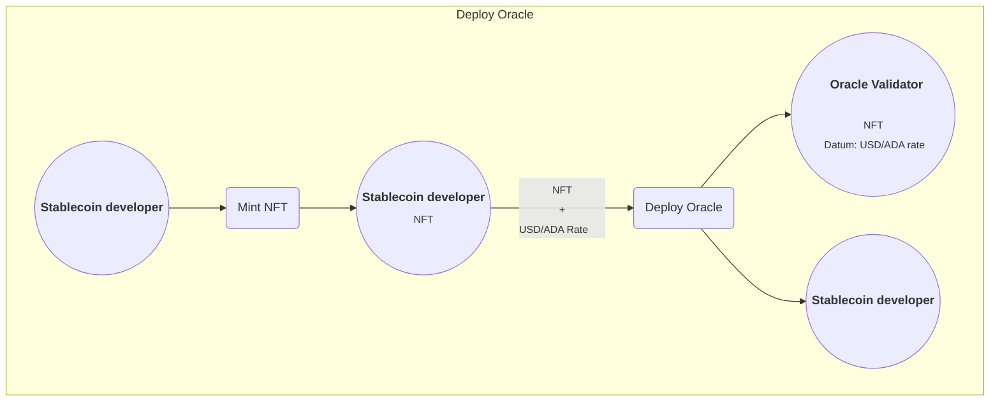
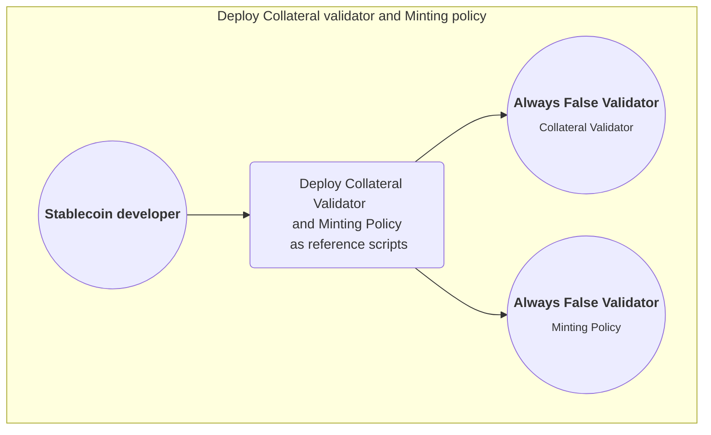
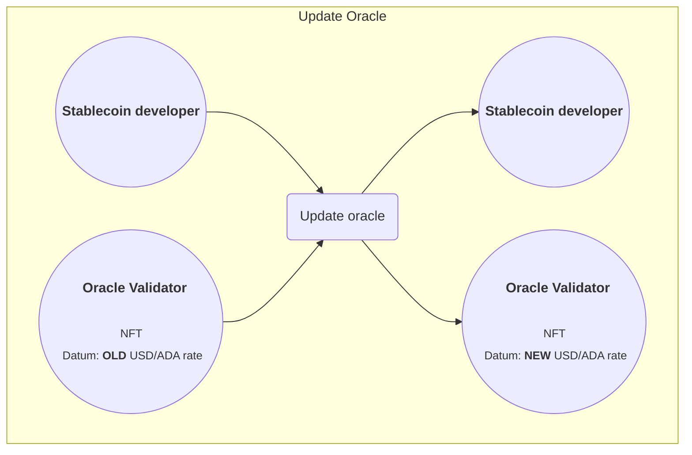
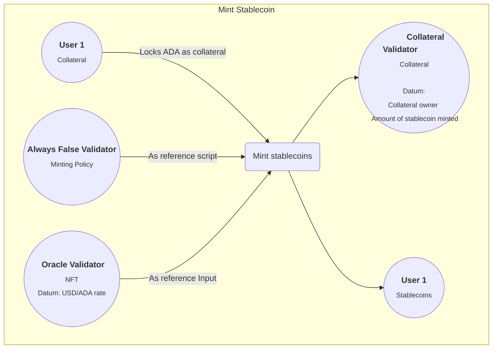
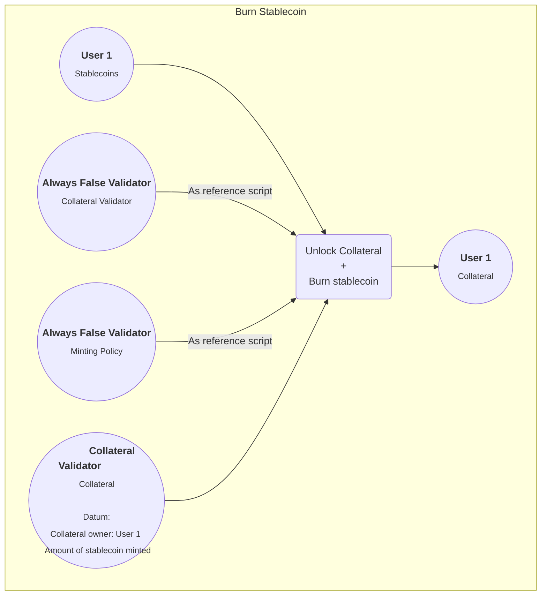
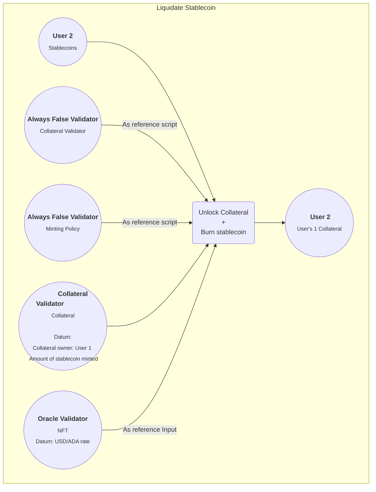
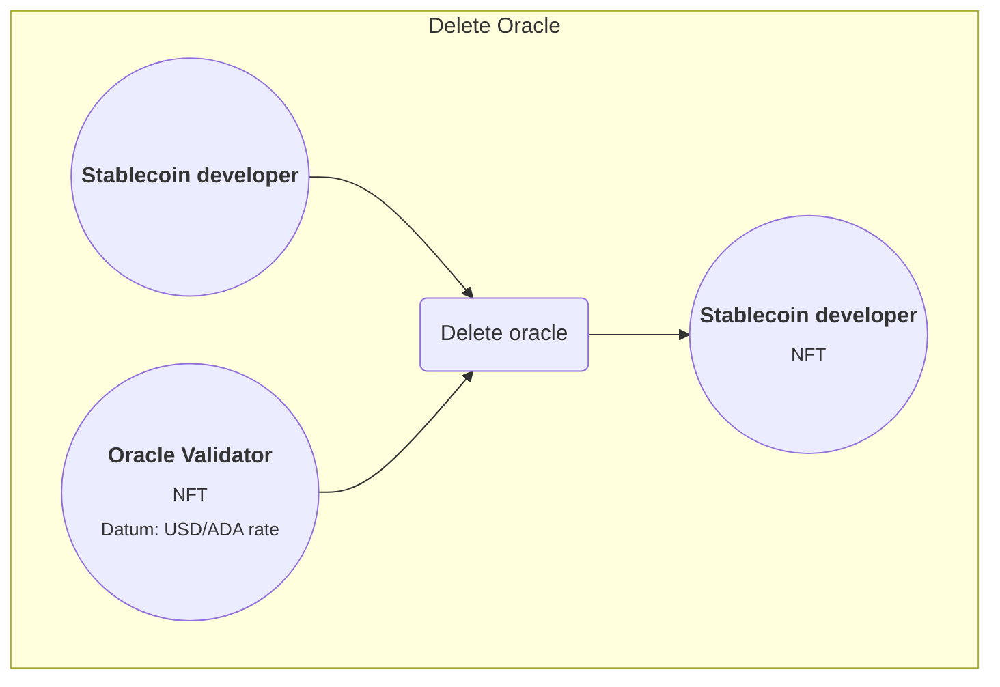

> Navigate to this file in GitHub or install the [Markdown Preview Mermaid Support](https://marketplace.visualstudio.com/items?itemName=bierner.markdown-mermaid) extension in VSCode to be able to see the diagrams.

> This implementation is for learning purposes only and has some issues introduced for the pioneers to solve as homework. It's not the only way to implement an over-collateralized stablecoin, and we don't recommend using this algorithm in production.

## How our stablecoin works

Depending on the stablecoin, you might see different mechanisms to (try to) maintain the peg. In this lecture, we’ll implement an over-collateralized algorithmic stablecoin that uses a liquidation mechanism to incentivize stability.

As the name suggests, we need to provide collateral to be able to mint the stablecoin. We will use a validator called "Collateral" to lock and release collateral (in ADA) and a minting policy called "Minting" to manage the minting and burning of stablecoins. These two will always run together—in a single transaction—as minting or burning stablecoins require locking or releasing collateral, respectively. Because we use smart contracts to enforce an algorithm that tries to control the price of the stablecoin, it's an algorithmic stablecoin.

The value of the collateral must exceed the value of the coins minted. This extra value that is locked but can't be minted is the reward someone gets when liquidating someone else's position. Liquidating means burning the same number of stablecoins someone else minted to get their collateral. You can liquidate someone else's position only if the relation between the value of their locked collateral and the coins they minted with it is below a certain pre-defined threshold (e.g., 150%). This is the mechanism we use to keep the stablecoin pegged. If the price of ADA goes up, you can mint more. If it goes down, you have to add more collateral or burn stablecoins; If you don't, someone else will liquidate your position and get that extra value at your expense.

This mechanism makes it so the value of the stablecoin is dependent on the locked collateral. Because the collateral is in ADA, if we only do this with the two previously mentioned validators, we'll be pegged to the value of ADA. To peg our stablecoin to a fiat currency, we use an oracle that keeps the USD/ADA rate up-to-date to calculate the amount of collateral needed. That way, the collateral depends on the price of USD, and so does our stablecoin.

Let's see how all this works in practice:

### Deploying the stablecoin

The stablecoin developer has to provide:

-   One "Oracle" validator with the USD/ADA rate (the price of ADA in USD).
-   The "Collateral" validator that locks the collateral (ADA).
-   The "Minting" policy to mint/burn stablecoins based on the collateral.

These are the transactions to deploy the oracle to the blockchain (square means Tx, rounded means UTxO):

1. First, we mint an NFT.
2. Once we have that NFT, send it to the oracle's address with the current USD/ADA rate.

To deploy the "Collateral" and "Minting" validators, we need to submit a single transaction to attach them as reference scripts to the "Always False" validator (or a developer-controlled) address.

We're ready to mint stablecoins. But, as soon as we deploy the oracle, its value is outdated. We need a mechanism to keep it up to date.

### Updating the Oracle

To keep the oracle up-to-date, we need a process in our backend checking the current USD/ADA rate from a reliable and trusted source. Because this is for learning purposes, we'll use a simple API.

As soon as the real rate differs from ours, our backend will automatically create a transaction to update our oracle:

### Minting Stablecoins

To obtain our stablecoins, we use the "Collateral" validator to lock our ADA and the "Minting" policy to mint the tokens. The stablecoin developer chose to overcollateralize by 50% (we have to lock 150% of the value minted). So, if the USD/ADA rate is 1, and we lock 150 ADA (150 USD), we'll be able to mint, at most, 100 stablecoins (100 USD).

These are the transactions to mint some stablecoins:

### Burning Stablecoins

We (the user that minted the stablecoins) burn the stablecoins to unlock our collateral and get it back.
In this case, because we're consuming a UTxO from the collateral validator, we have to provide it as refrence script aswell.

### Liquidating a position

Finally, if the USD/ADA in the up-to-date oracle changes in a way that the value in our locked collateral is lower than 150% of the minted value (let's say 130%), anyone with enough stablecoins can liquidate our position.

When a user liquidates someone else's position, it has to burn the same amount of stablecoins that were minted when the collateral was locked. But, because there's more value locked (in this example, 30% more) than the value of the stablecoins burned, the liquidator takes the difference home.

This means that if the total value of the locked collateral is between 101% and 149%, there's an incentive for someone else to mint their own (correctly collateralized) stablecoins and use them to liquidate that position. Maintaining the stablecoin price stable while making a profit.

### Shutting down the stablecoin

If the developer wants to call it quits, he can shut down the stablecoin by deleting the oracle. By doing that, users won't be able to mint more stablecoins or liquidate one another, but they'll be able to burn their own stablecoins and get their collateral back.

Transaction to shut down the stablecoin:

And that's it! Feel free to take a look at the implementation of this algorithm in the `on-chain` folder!
