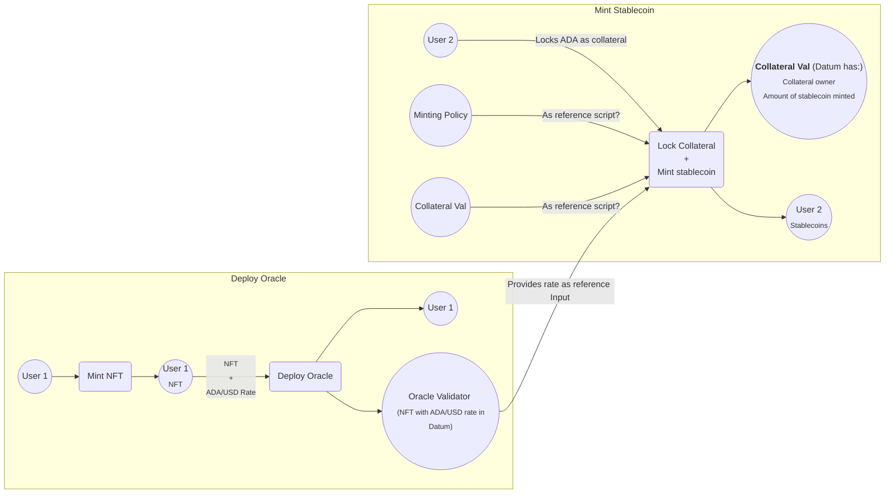

## TODOS (remove after completion)

- Create diagrams showing transactions
- Remove `Use` Redeemer from Oracle and use it as reference input + inline datum
- Create off chain code
- Change `Minting.hs` code to be more concise
- Change `Collateral.hs` code to be more concise
- Write tests (already started)

## How the algorithm works

