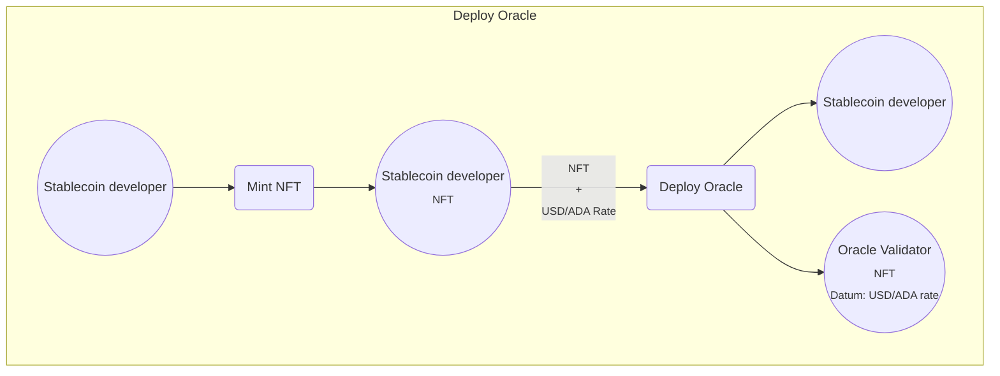
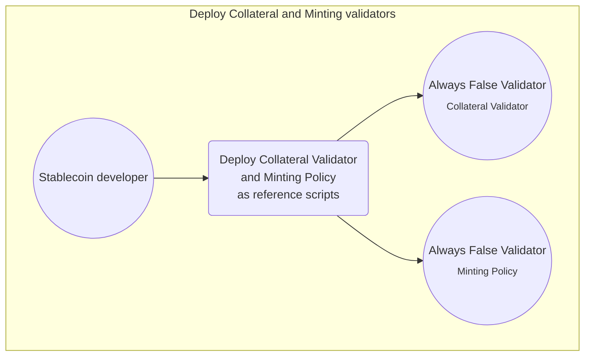
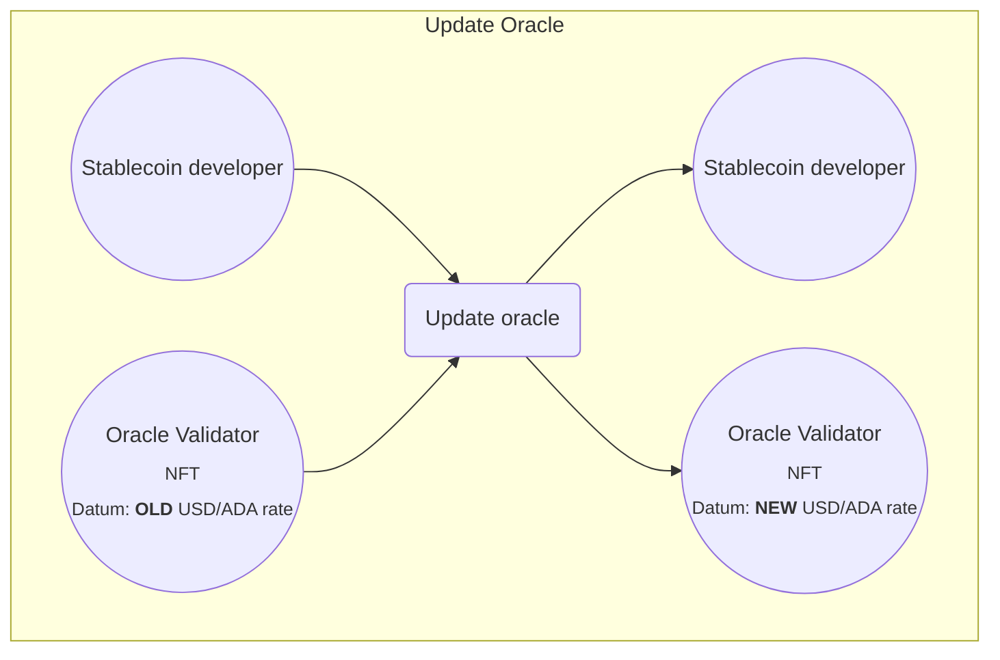
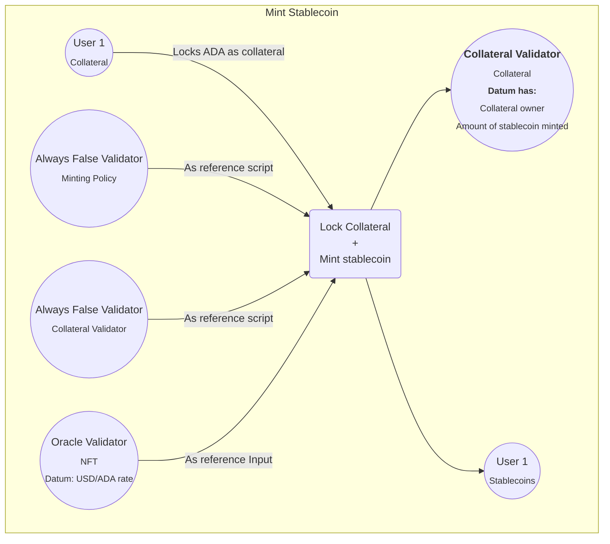
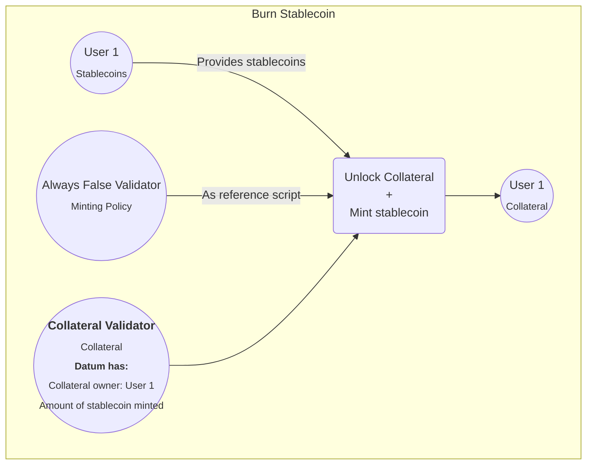
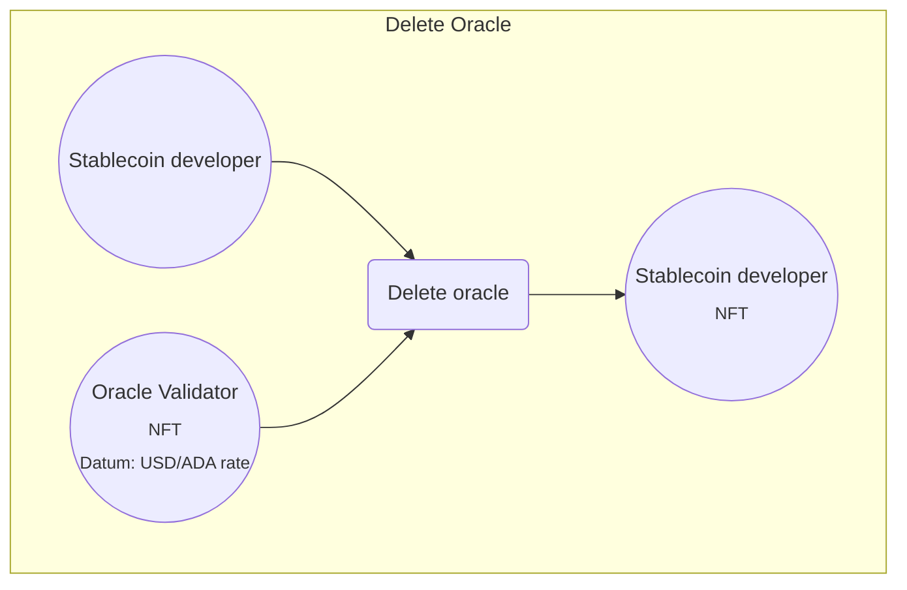

> To have the best experience with the diagrams, install the [Markdown Preview Mermaid Support](https://marketplace.visualstudio.com/items?itemName=bierner.markdown-mermaid) extension in VSCode.

## How the stablecoin works

This is a collateralized stablecoin. That means the value of the stablecoin depends on collateral. In our case, we'll use a validator called "Collateral" to lock this collateral (in ADA) and a validator called "Minting" that will mint, at most, the number of stablecoins equivalent to a bit less of the value we locked.

This extra value that is locked but can't be minted is the reward someone gets when liquidating someone else's position. Liquidating means burning the same number of stablecoins someone else minted to get their collateral. This is the mechanism we use to keep the stablecoin stable. If the price of ADA goes up, you can mint more. If it goes down, you have to add more collateral or burn stablecoin; If you don't, someone else will liquidate your position and get that extra value at your expense.

Because the collateral is in ADA, if we only do this with the two previously mentioned validators, we'll be pegged to the value of ADA. To peg our stablecoin to a fiat currency, we use an oracle that keeps the USD/ADA rate up-to-date and use it to calculate the amount of collateral needed. That way, the collateral depends on the price of USD, and so does our stablecoin.

Let's see how all this works in practice:

### Deploying the stablecoin

The stablecoin developer has to provide:
- One "Oracle" validator with the USD/ADA rate (the price of ADA in USD).
- The "Collateral" validator that locks the collateral (ADA).
- The "Minting" policy to mint/burn stablecoins based on the collateral.

These are the transactions to deploy the oracle to the blockchain (square means Tx, rounded means UTxO):

1. First, we mint an NFT.
2. Once we have that NFT, send it to the oracle's address with the current USD/ADA rate.


To deploy the "Collateral" and "Minting" validators, we need to submit a single transaction to attach them as reference scripts to the "Always False" validator (or a developer-controlled) address.



We're ready to mint stablecoins. But, as soon as we deploy the oracle, its value is outdated. We need a mechanism to keep it up to date.

### Updating the Oracle

To keep the oracle up-to-date, we need a process in our backend checking the current USD/ADA rate from a reliable and trusted source. Because this is for learning purposes, we'll use a simple API.

As soon as the real rate differs from ours, our backend will automatically create a transaction to update our oracle:



### Minting Stablecoins

To obtain our stablecoins, we use the "Collateral" validator to lock our ADA and the "Minting" policy to mint the tokens. The stablecoin developer chose to overcollateralize by 50% (we have to lock 150% of the value minted). So, if the USD/ADA rate is 1, and we lock 150 ADA (150 USD), we'll be able to mint, at most, 100 stablecoins (100 USD). 

These are the transactions to mint some stablecoins:



### Burning Stablecoins

We perform the same process to get rid of your stablecoins but in reverse. 
We (the user that minted the stablecoins) burn the stablecoins to unlock our collateral and get it back:



 ### Liquidating a position

Finally, if the USD/ADA in the up-to-date oracle changes in a way that the value in our locked collateral is lower than 150% of the minted value (let's say 130%), anyone with enough stablecoins can liquidate our position.

When a user liquidates someone else's position, it has to burn the same amount of stablecoins that were minted when the collateral was locked. But, because there's more value locked (in this example, 30% more) than the value of the stablecoins burned, the liquidator takes the difference home.

This means that if the total value of the locked collateral is between 101% and 149%, there's an incentive for someone else to mint their own (correctly collateralized) stablecoins and use them to liquidate that position. Maintaining the stablecoin price stable while making a profit.

 ```mermaid
flowchart LR
    subgraph Burn [Liquidate Stablecoin]
    direction LR
    A6(("Oracle Validator <br> <sub>NFT <br> Datum: USD/ADA rate </sub>"))
    A9((Always False Validator <br> <sub>Minting Policy</sub>))
    M5(("<b>Collateral Validator</b> <br> <sub>Collateral <br> <b>Datum has:</b> <br> Collateral owner: User 1  <br> Amount of stablecoin minted"))
    M6((User 2 <br> <sub>Stablecoins</sub>))

    M6 --> |Provides stablecoins| B4(Unlock Collateral <br> + <br> Mint stablecoin)
    A9 -->|As reference script| B4
    M5 --> B4
    A6 --> |Provides rate as reference Input|B4
    B4 --> B6((User 2<br> <sub>User's 1 Collateral</sub> ))
    end
```

### Shutting down the stablecoin

If the developer wants to call it quits, he can shut down the stablecoin by deleting the oracle. By doing that, users won't be able to mint more stablecoins or liquidate one another, but they'll be able to burn their own stablecoins and get their collateral back.

Transaction to shut down the stablecoin:



And that's it! Feel free to take a look at the implementation of this algorithm in the `on-chain` folder!
