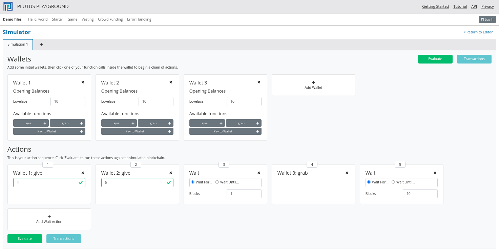
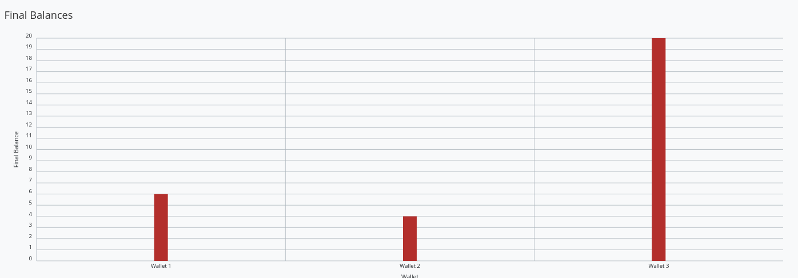
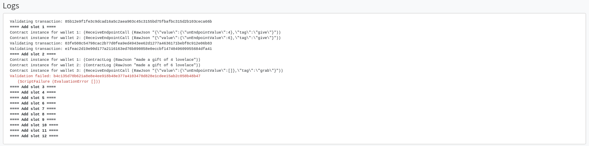

# Week 02

 These is a written version of [Lecture #2](https://youtu.be/E5KRk5y9KjQ).

 It covers low-level, untyped on-chain validation scripts and high-level, typed on-chain validation scripts.

 Please feel free to raise pull requests for typos, poor formatting, poor grammar, or anything else that is poor or inaccurate.

 ## Overview

We saw in the first lecture that there are two sides to a smart contract - an on-chain part and an off-chain part.

The on-chain part is about validation. It allows nodes to validate a given transaction and whether it is allowed to consume a given UTxO.

The off-chain part lives in the user's wallet. It constructs and submits suitable transactions.

Both are important topics. We have to master both in order to write smart contracts, but for now we will concentrate on the on-chain part.

Let's recall the Extended UTxO model where the idea is that we introduce a new type of address. 

 

In the simple UTxO model are so-called public key addresses, where the address is given by the hash of the public key. If a UTxO sits at such a public key address, then a transaction can consume that UTxO as an input if the signature belonging to that public key is included in the transaction.

What the (E)UTxO model does is extend this by adding script addresses that can run arbitrary logic.

When a transaction wants to consume a UTxO sitting at a script address is validated by a node, the node will run the script and then, depending on the result of the script, decide whether the transaction is valid or not.

And recall that there were three more additions:

1. Instead of just having signatures on transactions, we have so-called Redeemers - arbitrary pieces of data.
2. On the UTxO output side, we have an additional arbitrary piece of data called Datum, which you can think of as a little piece of state that sits on the UTxO.
3. Finally, we have the context. There are various choices of what this context can be. It can be very restrictive, consisting just of the Redeemer (as in Bitcoin), or very global, consisting of the whole state of the blockchain (as in Ethereum). In Cardano, it is the transaction that is being validated, including all its inputs and outputs.

So, there are three pieces of data that a Plutus script gets. The Datum, sitting at the UTxO, the Redeemer coming from the input and the validation, and the Context, consisting of the transaction being validated and its inputs and outputs.

In a concrete implementation like Plutus, these pieces of information need to be represented by a concrete data type - a Haskell data type. As it happens, the choice was made to use the same data type for all three of them. At least at the low-level implementation.

We will look at that first, but in real life noboby would actually use this low-level. There are more convenient ways to use more suitable data types for these things, and we will come to that later in this lecture.

## PlutusTx.Data

As mentioned, the Datum, Redeemer and Context share a data type. That data type is defined in the package *plutus-tx*, in the module [*PlutusTx.Data*](https://github.com/input-output-hk/plutus/blob/master/plutus-tx/src/PlutusTx/Data.hs). It is called, simply, *Data*. 

    data Data =
          Constr Integer [Data]
        | Map [(Data, Data)]
        | List [Data]
        | I Integer
        | B BS.ByteString
        deriving stock (Show, Eq, Ord, Generic)
        deriving anyclass (Serialise, NFData)

It has five constructors.

- *Constr* takes an Integer and, recursively, a list of *Data*
- *Map* takes a list of pairs of *Data*. You can think of this as a lookup table of key-value pairs where both the key and the value are of type *Data*
- *List* takes a list of *Data*
- *I* takes a single Integer
- *B* takes a Bytestring

For those familiar with the JSON format, this is very similar. The constructors are not exactly the same, but, like JSON, you can represent numbers, strings, lists of data and key-value pairs. It can represent arbitrary data, which makes it very suitable for our purpose.

We can also explore this type in the REPL.

From the plutus-pioneers-program repository. Remember that you may need to start a nix-shell from the Plutus repository before changing into the week02 directory.

    cd code/week02
    cabal repl

You should get a response like the following:

    Ok, 9 modules loaded.

You may also see a whole bunch of warning messages regarding unused imports, which you can ignore.

From with the REPL:

    import PlutusTx
    :i Data

This will give information about the type *Data*.

    Prelude Week02.Burn> import PlutusTx.Data
    Prelude PlutusTx.Data Week02.Burn> :i Data
    type Data :: *
    data Data
      = Constr Integer [Data]
      | Map [(Data, Data)]
      | List [Data]
      | I Integer
      | B bytestring-0.10.12.0:Data.ByteString.Internal.ByteString
        -- Defined in ‘PlutusTx.Data’
    instance Eq Data -- Defined in ‘PlutusTx.Data’
    instance Ord Data -- Defined in ‘PlutusTx.Data’
    instance Show Data -- Defined in ‘PlutusTx.Data’
    Prelude PlutusTx.Data Week02.Burn> 

Now we can play with it. We can use the *I* constructor to create a value of type *Data*.

    Prelude PlutusTx.Data Week02.Burn> I 7
    I 7

We can ask for its type, and confirm that it is indeed of type *Data*:

    Prelude PlutusTx.Data Week02.Burn> :t I 7
    I 7 :: Data

The easiest way to create a value of type *Data* using the *B* constructor is to use the GHC Extension *OverloadedStrings*. This allows literal strings to be used in place of string-like data types and the compiler will interpret them as their intended type.

    Prelude PlutusTx.Data Week02.Burn> :set -XOverloadedStrings
    Prelude PlutusTx.Data Week02.Burn> :t B "Haskell"
    B "Haskell" :: Data

We can also use more complicated constructors, like Map and List:

    Prelude PlutusTx.Data Week02.Burn> :t Map [(I 7, B "Haskell"), (List [I 0], I 1000)]
    Map [(I 7, B "Haskell"), (List [I 0], I 1000)] :: Data

## Plutus Validator

Now we are ready to implement our very first Validator.

As we know, a validator is a script that takes three pieces of input - the Datum, the Redeemer and the Context, which, at the lowest level are represented by the *Data* data type.

### Example 1 - The Gift Contract

We start the script by copy pasting a list of GHC language extensions, plus some dependency imports.

    {-# LANGUAGE DataKinds           #-}
    {-# LANGUAGE FlexibleContexts    #-}
    ...

    module Week02.Gift where

    import           Control.Monad       hiding (fmap)
    import           Data.Map            as Map
    ...
    import           Text.Printf         (printf)

Then, we write the Validator. It is a Haskell function that takes three arguments, all of type *Data*.

    mkValidator :: Data -> Data -> Data -> ()

Somewhat surprisingly, the result of the function is (). This is the Haskell Unit type, similar to *void* in some other languages, like C++ or C# or Java - it's the type that carrys no information.

Unit is a built-in type in Haskell and it has just one value, which is written in the same way as the type itself, as we can see from the REPL.

    Prelude Week02.Burn> ()
    ()

A function with a return type of () is quite unusual in Haskell. In more mainstream languages, it is quite common for functions or procedures to return no value. In these situations, the functions are only important for their side-effects, such as a Java function that prints something to the console.

But Haskell is a pure language. If you want side-effects, this will be shown by the type system. For example if the mkValidator were to perform any IO, it would have a type signature of:

    mkValidator :: Data -> Data -> Data -> IO ()

This would indicate a function that performs IO side-effects but has no interesting return value.    

But, as we know that the real mkValidator function performs no side-effects and returns no value, there is really nothing useful that it can do.

However, there is something that the function can do as well as returning (), namely it can throw an exception or have an error. And that's what Plutus uses.

The idea is that if the mkValidator function does not run into an error or throw an exception, then validation succeeds. If it throws an error then validation fails and the transaction is rejected.

Let's write the simplest Validator that we can.

    mkValidator :: Data -> Data -> Data -> ()
    mkValidator _ _ _ = ()

The first argument is the Datum, the second argument is the Redeemer and the third argument is the Context, and the most simple thing we can do is to completely ignore all three arguments and immediately return Unit.

What this means is that this script address that corresponds to this Validator doesn't care about the Datum, it doesn't care about the Redeemer, and it doesn't care about the Context. It will always succeed, and this means that any transaction can consume the script at this address as an input.

This function is not yet Plutus code, it is just a Haskell function. In order to turn it into a Plutus script, we need to compile it.

The result of our compilation to Plutus will be of type *Validator*. Below the function in Gift.hs, we add the following code.

    validator :: Validator
    validator = mkValidatorScript $$(PlutusTx.compile [|| mkValidator ||])

The mkValidatorScript function takes the type *CompiledCode (Data -> Data -> Data -> ()) -> Validator*. In order to create this type, we must compile the mkValidator script using something called Template Haskell. 

Template Haskell is an advanced feature of Haskell that solves a similar problem as macro systems in other languages. A macro being something that gets expanded at compile time. Code generating code.

So, with this code

    $$(PlutusTx.compile [|| mkValidator ||])

We are asking the compiler to write the code for the *validator* function at compile time based on our mkValidator function, and then proceed with the normal compilation.

You do not need to understand very much about Template Haskell to write Plutus as it is always the same pattern. Once you have seen a couple of examples, you can more or less just copy and paste.

Template Haskell expects all the code to be available within the Oxford Brackets (|| ||). With more complicated Validators you will likely be relying on multiple helper functions, and you do not want to have to add them within the Oxford Brackets.

To avoid this, there is one thing we need to do to the mkValidator function, and that is to make it inlinable by adding the INLINABLE pragma.

    {-# INLINABLE mkValidator #-}
    mkValidator :: Data -> Data -> Data -> ()
    mkValidator _ _ _ = ()

You will see this often in Plutus scripts, and it is usually an indication that a function is meant to be used within a validation script. All the functions on which the Validator depends must be inlinable.

Let's go back to the REPL and take a look at the Validator.

    :l src/Week02/Gift.hs
    Ok, one module loaded.
    Prelude Week02.Gift> validator
    Validator { <script> }
    Prelude Week02.Gift> :t validator
    validator
      :: plutus-ledger-api-0.1.0.0:Plutus.V1.Ledger.Scripts.Validator

Back to the code, there are two more types that we want the value of - the validator hash and the address. These are easy to define now that we have our validator.

    valHash :: Ledger.ValidatorHash
    valHash = Scripts.validatorHash validator

    scrAddress :: Ledger.Address
    scrAddress = ScriptAddress valHash

Now we have a script address represented as *scrAddress*.

With the exception of the *mkValidator* function logic (in our case, one line), the rest of the code we have written so far is boilerplate and will be very similar for all Plutus scripts.

In order to actually try this script, we need wallet code. The focus of this lecture is validation and not wallet code, but briefly, here is the rest of the code. 

Two endpoints are defined. The *give* endpoint will take an Integer argument to specify the number of Lovelace that will be depostied to the contract.  The *grab* endpoint will take no argument and will simply look for UTxOs at this script address and consume them.

    type GiftSchema =
        BlockchainActions
            .\/ Endpoint "give" Integer
            .\/ Endpoint "grab" ()

*Give* takes the Integer argument and uses the helper function *mustPayToOtherScript* which takes the *valHash* and a Datum that, in this example, is completely ignored. It uses the *Datum* constructor to turn a *Data* into a *Datum*. In this case the *Data* is created using the *Constr* construtor taking a 0 and an empty list. Finally the amount to send to the address is specified using the helper function *Ada.lovelaceValueOf*.

The transaction is then submitted, the script waits for it to be confirmed and then prints a log message.

    give :: (HasBlockchainActions s, AsContractError e) => Integer -> Contract w s e ()
    give amount = do
        let tx = mustPayToOtherScript valHash (Datum $ Constr 0 []) $ Ada.lovelaceValueOf amount
        ledgerTx <- submitTx tx
        void $ awaitTxConfirmed $ txId ledgerTx
        logInfo @String $ printf "made a gift of %d lovelace" amount

The *grab* endpoint is a little bit more complicated. We use *utxoAt* with our shiny new Plutus script address *scrAddress* to lookup all the UTxOs sitting at that address. We then need lookups which will be explained in a later lecture.

We then define the transaction by using *mustSpendScriptOutput* for each UTxO found. We also pass a Redeemer which is completely ignored in our example, so we can put anything there - in this case a Redeemer created using the *I* constructor of type *Data* will a value of 17.

Again, we submit, wait for confirmation, and then write a log message.

    grab :: forall w s e. (HasBlockchainActions s, AsContractError e) => Contract w s e ()
    grab = do
        utxos <- utxoAt scrAddress
        let orefs   = fst <$> Map.toList utxos
            lookups = Constraints.unspentOutputs utxos      <>
                      Constraints.otherScript validator
            tx :: TxConstraints Void Void
            tx      = mconcat [mustSpendScriptOutput oref $ Redeemer $ I 17 | oref <- orefs]
        ledgerTx <- submitTxConstraintsWith @Void lookups tx
        void $ awaitTxConfirmed $ txId ledgerTx
        logInfo @String $ "collected gifts"

We then have some boilerplate.

    endpoints :: Contract () GiftSchema Text ()
    endpoints = (give' `select` grab') >> endpoints
      where
        give' = endpoint @"give" >>= give
        grab' = endpoint @"grab" >>  grab

And these last two lines are just for the playground. As we saw in lecture 1, for example, the *mkKnownCurrencies* list is used to define tokens for the playground.

    mkSchemaDefinitions ''GiftSchema

    mkKnownCurrencies []

## In the Playground

We will now test the Validator in the playground.

Again we are using commit 3746610e53654a1167aeb4c6294c6096d16b0502 of the Plutus repository. This requires us to remove the *module* part of the code before pasting it into the playground editor.

Remove this line

    module Week02.Gift where

Then, compile the script in the playground and press the *Simulate* button.    

 

 And let's add a third wallet.

 

We will create a scenario where wallets 1 and 2 give Lovelace, and wallet 3 grabs all of it.

 

And now click *Evaluate*. We see that there have been four transactions. The first one is the Genesis transaction that distributes the initial funds to the wallets.

 

And there are two transactions which occur at Slot 1. They are the two *give* transactions.

The first one, Tx 0, is from Wallet 2. We see the two outputs - one putting 6 Lovelace into the script address (the script address is a hash of the script), and the other returning the 4 Lovelace change to Wallet 2.

 

And the second, Tx 1, is from Wallet 1. Again, with similar output UTxOs.

 

We now have two UTxOs sitting at the script address.

Then we have the *grab* at Slot 2 triggered by Wallet 3. We see the two UTxOs from the script as inputs, and the single output of 10 Lovelace to Wallet 3.

And, by scrolling down, we see the final wallet balances.

As mentioned, this script uses the simplest validator possible, one that always succeeds. But this stupid little validator may be useful in a situation where someone wants to donate some Lovelace to the community and leave it up for grabs!

## Example 2 - Burn

Let's look at the second example of validation, using the Burn module. We will start with the Burn.hs code being identical to the Gift.hs script.

Recall that the way a validator indicates failure is by throwing an error. 

    mkValidator :: Data -> Data -> Data -> ()
    mkValidator _ _ _ = error ()

If we load the module in the REPL and look at *error*

    Prelude Week02.Burn> :t error
    error :: [Char] -> a

We see the definition for the standard Haskell error function. However, the one in scope in our code is in fact the following *error* function.

    Prelude Week02.Burn> :t PlutusTx.Prelude.error
    PlutusTx.Prelude.error :: () -> a

In regular Haskell, you have the *error* function which takes an error message string and triggers an error.

In Plutus, the *error* function does not take a string - it just takes Unit. And that takes us to an important point.

We mentioned earlier that we use the INLINABLE pragma on the *mkValidator* function in order to allow it to be used by the Template Haskell code. In Haskell there are many functions available via the *Prelude* module, but these will not be usable in Plutus as they are not inlinable. So, the Plutus team have provided an alternative *Prelude* that can be used in validation.

The way that the Plutus Predule is able to take precedence over the Haskell Prelude, which is normally in scope by default, is by using the following LANGUAGE pragma in the code.

    {-# LANGUAGE NoImplicitPrelude   #-}

Then, by importing PlutusTx.Prelude, its functions are used in place of the standard Prelude functions.

    import PlutusTx.Prelude hiding (Semigroup(..), unless)

You may also notice that the standard Prelude is also imported. However, it is only in order to bring in *Semigroup*, which we explicity hid in the PlutusTx.Prelude import. But this is not important right now.

    import Prelude (Semigroup (..))

Just remember that when you are using something in a Plutus script that looks like a function from the standard Prelude, what you are actually using is a function from the Plutus Prelude. Often they will have the same signature, but, as we can see in the case of *error*, they are not always identical.

Looking again at our new validator, we now have a validator that will always fail.

    mkValidator :: Data -> Data -> Data -> ()
    mkValidator _ _ _ = error ()

We will leave everything else as it was and check the effect in the playground.

Here, the script address is different. The script is different an so has a different hash.

We also notice that the *grab* transaction did not work, and if we scroll down to look at the logs, we see that it was not validated.

So, in our first example we had a validator that would always succeed and would allow anyone to grab the UTxOs from it. In the second example, we have a validator that always fails and any UTxOs sent to this script address can never be retrieved. This is basically a way to burn funds, which may be useful under some circumstances.

When we look at the logs, we see that validation fails, but we have no clue why it fails. here's a way to change that by using a variant of error - *traceError*. 

    mkValidator _ _ _ = traceError "NO WAY!"

The function takes a string, but not a Haskell string. It is a Plutus string. In order for this to compile, we need to use the OverloadedStrings GHC extension.    

    {-# LANGUAGE OverloadedStrings   #-}

If we now run the same scenario in the playground with the new code, we will see the custom error message that we added.

## Example 3 - Forty Two

Now let's write a validator that looks at at least one of the arguments. Let's write a simple one that expects a simple Redeemer.

Now that we care about the redeemer, we need to be able to reference it.

    {-# INLINABLE mkValidator #-}
    mkValidator :: Data -> Data -> Data -> ()
    mkValidator _ r _

We can now reference the redeemer as *r* in the code.

Let's say that we expect the redeemer to be I 42. If so, validation passes. If not, we fail with an error message.

    {-# INLINABLE mkValidator #-}
    mkValidator :: Data -> Data -> Data -> ()
    mkValidator _ r _
        | r == I 42 = ()
        | otherwise = traceError "wrong redeemer"

If we were to run this now in the playground, validation would always fail. We need to add an input to the *grab* endpoint so that Wallet 3 can pass in the redeemer which will be used by the *mkValidator* function.

    type GiftSchema =
        BlockchainActions
            .\/ Endpoint "give" Integer
            .\/ Endpoint "grab" Integer

And now, the redeemer is no longer to be ignored in the *grab* part of the code. Instead we will pass in the value of the redeemer given to the endpoint.

We add the redeemer argument to the *grab* declaration. Note the addition of the Integer in the function signature, as well as the new *r* parameter which is used to reference it.

    grab :: forall w s e. (HasBlockchainActions s, AsContractError e) => Integer -> Contract w s e ()
    grab r = do

And then pass it to the *mustSpendScriptOutput* instead of the throw-away value we used earlier.

    tx = mconcat [mustSpendScriptOutput oref $ Redeemer $ I r | oref <- orefs]

One more change, we need to change the ">>" to ">>=" in the following code, now that *grab* has an argument. You can use the REPL to look at the types ">>" and ">>=" to see why the second one is now needed. Basically, they both sequence actions, but >> ignores any wrapped values, whereas >>= accesses the wrapped value and passes it to the next action.

    grab' = endpoint @"grab" >>= grab

Now we can try it out in the playground. After adding the new code and clicking *Simulate* you will notice that the old scenario has gone. That is because the schema has changed and the old scenario is no longer valid.

Let's set up a scenario that doesn't require a third wallet.

Here wallet one is going to put 3 lovelace into the contract, and wallet two is going to try to grab them, but this time, wallet 2 will need to pass in a value which will be used to construct the redeemer.

If we pass in 100 as the value for the grab endpoint, and click *Evaluate*, we see in the logs that validation has failed.

If we go back to scenario and change the value to 42, we should see that validation succeeds.

And indeed, wallet 2 now manages to unlock the UTxO held at the script address and grab it.

We see that the final balances are as we expect, and also the logs show that validation did not throw an error, which means that validation succeeded.

## Example 4 - Typed

