Week 03 - Script Context
========================

.. note::
      This is a written version of `Lecture
      #3, Iteration #2 <https://www.youtube.com/watch?v=6_rfCCY9_gY>`__.

      In this lecture we learn about the script context (the third validation
      argument), handling time, and parameterized contracts.

      The code in this lecture uses Plutus commit ``81ba78edb1d634a13371397d8c8b19829345ce0d``.

Before We Start
---------------

Since the last lecture there has been an update to the playground, which is present in the Plutus commit we are using for this lecture (see note above).

There was an issue whereby the timeout, which was hardcoded into the playground was too short. This would cause simulations to fail if they took longer than the
hardcoded timeout.

There is now an option when you start the Plutus Playground Server which allows you to specify the timeout. The following example sets the timeout to 120 seconds.

.. code::

      plutus-playground-server -i 120s

Recap
-----

When we explained the (E)UTxO model in the first lecture, we mentioned that in
order to unlock a script address, the script attached to the address is
run, and that script gets three pieces of information - the *datum*, the
*redeemer* and the *context*.

In the second lecture, we saw examples of that, and we saw how it
actually works in Haskell.

We saw the low-level implementation, where all three arguments are
represented by the ``Data`` type. We also saw that in practice this is not
used.

Instead, we use the typed version, where the datum and redeemer can be
custom types (as long as they implement the ``IsData`` type class), and
where the third argument is of type ``ScriptContext``.

In the examples we have seen so far we have looked at the datum and
the redeemer, but we have always ignored the context. But the
context is, of course, very important. So, in this lecture we will
start looking at the context.

ScriptContext
-------------

The ``ScriptContext`` type is defined in package ``plutus-ledger-api``,
which is a package that, until now, we haven't needed. But now we do
need it, and it is included in this week's ``.cabal`` file. It is
defined in module ``Plutus.V1.Ledger.Contexts``.

.. code:: haskell

      data ScriptContext = ScriptContext { 
                  scriptContextTxInfo :: TxInfo, 
                  scriptContextPurpose :: ScriptPurpose 
            }

It is a record type with two fields.

The second field is of type ``ScriptPurpose``, which is defined in the same module. It defines for which purpose a script is being run.

.. code:: haskell

      data ScriptPurpose
         = Minting CurrencySymbol
         | Spending TxOutRef
         | Rewarding StakingCredential
         | Certifying DCert

For us, the most important is ``Spending``. This is what we have talked
about so far in the context of the (E)UTxO model. This is when a script
is run in order to validate a spending input for a transaction.

The ``Minting`` purpose comes into play when you want to define a native
token. Its purpose us to describe under which circumstances the native
token can be minted or burned.

There are also two new brand new purposes - ``Rewarding`` - related to
staking and ``Certifying`` - related to stake delegation.

The most interesting field, the one that contains the actual context, is ``scriptContextTxInfo``, which is of type
``TxInfo``, also defined in the same module.

.. code:: haskell

      data TxInfo = TxInfo
         { txInfoInputs      :: [TxInInfo] -- ^ Transaction inputs
         , txInfoOutputs     :: [TxOut] -- ^ Transaction outputs
         , txInfoFee         :: Value -- ^ The fee paid by this transaction.
         , txInfoForge       :: Value -- ^ The 'Value' forged by this transaction.
         , txInfoDCert       :: [DCert] -- ^ Digests of certificates included in this transaction
         , txInfoWdrl        :: [(StakingCredential, Integer)] -- ^ Withdrawals
         , txInfoValidRange  :: SlotRange -- ^ The valid range for the transaction.
         , txInfoSignatories :: [PubKeyHash] -- ^ Signatures provided with the transaction, attested that they all signed the tx
         , txInfoData        :: [(DatumHash, Datum)]
         , txInfoId          :: TxId
         -- ^ Hash of the pending transaction (excluding witnesses)
         } deriving (Generic)

It describes the spending transaction. In the (E)UTxO model, the context of validation is the spending transaction and its 
inputs and outputs. This context is expressed in the ``TxInfo`` type.

There are a couple of fields that are global to the whole transaction and in particular we have the list of all the inputs ``txInfoInputs``
and the list of all the outputs ``txInfoOutputs``. Each of those has a variety of fields to drill into each individual input or output.

We also see fields for fees ``txFee``, the forge value ``txInfoForge``, used when minting or burning native tokens.

Then we have a list of delegation certificates in ``txInfoDCert`` and a field ``txInfoWdrl`` to hold information about staking withdrawals.

The field ``txInfoValidRange``, which we will look at in much more detail in a moment, defines the slot range for which this transaction is valid.

``txInfoSignatories`` is the list of public keys that have signed this transaction.

Transactions that spend a script output need to include the datum of the script output.
The ``txInfoData`` field is a list associating datums with their respective hashes. If there is a transaction output to a script address
that carries some datum, you don't need to include the datum, you can just include the datum hash. However, scripts that spend an output do need to include the datum, in which case it will be included in the ``txInfoData`` list.

Finally, the ``txInfoId`` field is the ID of this transaction.

txInfoValidRange
~~~~~~~~~~~~~~~~

While there is a lot of information contained in this ``txInfo`` type, for
our first example of how to use the third argument to validation, we
will concentrate on the ``txInfoValidRange`` field.

This brings us to an interesting dilemma. We have stressed several times
that the big advantage that Cardano has over something like Ethereum is
that validation can happen in the wallet. But we have also noted that a
transaction can still fail on-chain following validation if, when the
transaction arrives on the blockchain, it has been consumed already by
someone else. In this case, the transaction fails without having to pay
fees.

What should never happen under normal circumstances is that a validation
script runs and then fails. This is because you can always run the
validation under exactly the same conditions in the wallet, so it would
fail before you ever submit it.

So that is a very nice feature, but it is not obvious how to manage time
in that context. Time is important, because we want to be able to
express that a certain transaction is only valid before or only valid
after a certain time has been reached.

We saw an example of this in lecture one - the auction example, where
bids are only allowed until the deadline has been reached, and the
``close`` endpoint can only be called after the deadline has passed.

That seems to be a contradiction, because time is obviously flowing. So,
when you try to validate a transaction that you are constructing in your
wallet, the time that you are doing that can, of course, be different
than the time that the transaction arrives at a node for validation. So,
it's not clear how to bring these two together so that validation is
deterministic, and to guarantee that if, and only if, validation
succeeds in the wallet, it will also succeed in the node.

The way Cardano solves that, is by adding the slot range field
``txInfoValidRange`` to a transaction, which essentially says "This
transaction is valid between *this* and *that* slot".

When a transaction gets submitted to the blockchain and validated by a
node, then before any scripts are run, some general checks are made, for
example that all inputs are present and that the balances add up, that
the fees are included and so on. 

One of those checks that happens before validation is to check that the slot range is valid. The 
node will look at the current time and check that it falls into the valid slot range of the transaction. If it does not, then validation fails immediately without
ever running the validator scripts.

So, if the pre-checks succeed, then this means that the current time does fall into the valid slot range.
This, in turn, means that we are completely deterministic again. The validation script can simply assume that it is being run at a valid slot.

By default, a script will use the infinite slot range, one that covers all slots starting from the genesis block and running until the end of time.

There is one slight complication with this, and that is that Ouroboros, the consensus protocol powering Cardano doesn't use POSIX time, it uses slots. But Plutus
uses real time, so we need to be able to convert back and forth between real time and slots. This is no problem so long as the slot time is fixed. Right now it is 
one second, so right now it is easy. 

However, this could change in the future. There could be a hard fork with some parameter change that would change the slot time. We can't know that in advance.
We don't know what the slot length will be in ten years, for example.

That means that slot intervals that are defined for transactions mustn't have a definite upper bound that is too far in the future. It must only be as far in the
future as it is possible to know what the slot length will be. This happens to be something like 36 hours. We know that if there is going to be a hard fork, we would
know about it at least 36 hours in advance.

POSIXTimeRange
~~~~~~~~~~~~~~

Let's look at this ``POSIXTimeRange`` type, which is defined in ``Plutus.V1.Ledger.Time``.

.. code:: haskell

      type POSIXTimeRange = Interval POSIXTime.

It is a type synonym for ``Interval POSIXTime`` and we see that ``Interval`` is defined by a ``LowerBound`` and an ``UpperBound``.

.. code:: haskell

      Interval
            ivFrom :: LowerBound a
            inTo   :: UpperBound a      

If we drill into ``LowerBound`` we see the constructor

.. code:: haskell

      data LowerBound a = LowerBound (Extended a) Closure

``Closure`` is a synonym for ``Bool`` and specifies whether a bound is included in the ``Interval`` or not.      

``Extended`` can be ``NegInf`` for negative infinity, ``PosInf`` for positive infinity, or ``Finite a``.

We also find some helper functions including the ``member`` function which checks if a given ``a`` is part of a given ``Interval``, so long as the type of ``a`` is a subtype 
of ``Ord``, which is the case for ``POSIXTime``.

.. code:: haskell

      member :: Ord a => a -> Interval a -> Bool
      member a i = i `contains` singleton a

``interval`` is a smart constructor for the ``Interval`` type which creates an ``Interval`` with an inclusive upper and lower bound.

.. code:: haskell

      interval :: a -> a -> Interval a
      interval s s' = Interval (lowerBound s) (upperBound s')
     
Then we have ``from`` which constructs an ``Interval`` which starts at ``a`` and lasts until eternity.

.. code:: haskell

      from :: a -> Interval a
      from s = Interval (lowerBound s) (UpperBound PosInf True)

And we have ``to``, which is the opposite. It constructs an ``Interval`` starting from the genesis block up to, and including ``a``.

.. code:: haskell

      to :: a -> Interval a
      to s = Interval (LowerBound NegInf True) (upperBound s)

``always`` is the default ``Interval`` which includes all times.

.. code:: haskell

      always :: Interval a
      always = Interval (LowerBound NegInf True) (UpperBound PosInf True)
      
And we have the opposite, ``never``, which contains no slots.

.. code:: haskell

      never :: Interval a
      never = Interval (LowerBound PosInf True) (UpperBound NegInf True)

There is also the ``singleton`` helper, which constructs an interval which consists of just one slot.

.. code:: haskell

      singleton :: a -> Interval a
      singleton s = interval s s      

The function ``hull`` gives the smallest interval containing both the given intervals.

.. code:: haskell

      hull :: Ord a => Interval a -> Interval a -> Interval a
      hull (Interval l1 h1) (Interval l2 h2) = Interval (min l1 l2) (max h1 h2)

The ``intersection`` function determines the largest interval that is contained in both the given intervals. This is an ``Interval`` that starts
from the largest lower bound of the two intervals and extends until the smallest upper bound.

.. code:: haskell

      intersection :: Ord a => Interval a -> Interval a -> Interval a
      intersection (Interval l1 h1) (Interval l2 h2) = Interval (max l1 l2) (min h1 h2)    
      
The ``overlaps`` function checks whether two intervals overlap, that is, whether there is a value that is a member of both intervals.

.. code:: haskell

      overlaps :: Ord a => Interval a -> Interval a -> Bool
      overlaps l r = isEmpty (l `intersection` r)

``contains`` takes two intervals and determines if the second interval is completely contained within the first one.

.. code:: haskell

      contains :: Ord a => Interval a -> Interval a -> Bool
      contains (Interval l1 h1) (Interval l2 h2) = l1 <= l2 && h2 <= h1

And we have the ``before`` and ``after`` functions to determine, if a given time is, respectively, before or after everything in a given ``Interval``.

.. code:: haskell

      before :: Ord a => a -> Interval a -> Bool
      before h (Interval f _) = lowerBound h < f

      after :: Ord a => a -> Interval a -> Bool
      after h (Interval _ t) = upperBound h > t

Let's have a play in the REPL.

.. code:: haskell

      Prelude Week03.Homework1> import Plutus.V1.Ledger.Interval
      Prelude Plutus.V1.Ledger.Interval Week03.Homework1>

Let's construct the ``Interval`` between 10 and 20, inclusive.

.. code:: haskell

      Prelude Plutus.V1.Ledger.Interval Week03.Homework1> interval (10 :: Integer) 20
      Interval {ivFrom = LowerBound (Finite 10) True, ivTo = UpperBound (Finite 20) True}

We can check whether a value is a member of an interval:

.. code:: haskell

      Prelude Plutus.V1.Ledger.Interval Week03.Homework1> member 9 $ interval (10 :: Integer) 20
      False
      
      Prelude Plutus.V1.Ledger.Interval Week03.Homework1> member 10 $ interval (10 :: Integer) 20
      True
      
      Prelude Plutus.V1.Ledger.Interval Week03.Homework1> member 12 $ interval (10 :: Integer) 20
      True
      
      Prelude Plutus.V1.Ledger.Interval Week03.Homework1> member 20 $ interval (10 :: Integer) 20
      True
      
      Prelude Plutus.V1.Ledger.Interval Week03.Homework1> member 21 $ interval (10 :: Integer) 20
      False
     
We can use the ``from`` constructor. Here the lower bound is again a finite slot, but the upper bound is positive infinity.

.. code:: haskell

      Prelude Plutus.V1.Ledger.Interval Week03.Homework1> member 21 $ from (30 :: Integer)
      False

      Prelude Plutus.V1.Ledger.Interval Week03.Homework1> member 30 $ from (30 :: Integer)
      True
      
      Prelude Plutus.V1.Ledger.Interval Week03.Homework1> member 300000 $ from (30 :: Integer)
      True

And the ``to`` constructor. Here the lower bound is negative infinity, while the upper bound is a finite slot number.

.. code:: haskell

      Prelude Plutus.V1.Ledger.Interval Week03.Homework1> member 300000 $ to (30 :: Integer)
      False

      Prelude Plutus.V1.Ledger.Interval Week03.Homework1> member 31 $ to (30 :: Integer)
      False
      
      Prelude Plutus.V1.Ledger.Interval Week03.Homework1> member 30 $ to (30 :: Integer)
      True

      Prelude Plutus.V1.Ledger.Interval Week03.Homework1> member 7 $ to (30 :: Integer)
      True

Now, let's try the ``intersection`` function on the ``Interval`` from 10 to 20 and the ``Interval`` from 18 to 30.

.. code:: haskell

      Prelude Plutus.V1.Ledger.Interval Week03.Homework1> intersection (interval (10 :: Integer) 20) $ interval 18 30
      Interval {ivFrom = LowerBound (Finite 18) True, ivTo = UpperBound (Finite 20) True}

As expected, we get the ``Interval`` that runs from 18 to 20, inclusive.

We can check whether one ``Interval`` contains another.

.. code:: haskell

      Prelude Plutus.V1.Ledger.Interval Week03.Homework1> contains (to (100 :: Integer)) $ interval 30 80
      True

      Prelude Plutus.V1.Ledger.Interval Week03.Homework1> contains (to (100 :: Integer)) $ interval 30 100
      True

      Prelude Plutus.V1.Ledger.Interval Week03.Homework1> contains (to (100 :: Integer)) $ interval 30 101
      False
            
We see that as soon as the second ``Interval`` extends to 101, it is no longer fully contained within the ``Interval`` that runs to 100.

However, if we check with ``overlaps``, then it will be true because there are elements, such as 40, that are contained in both intervals.

.. code:: haskell

      Prelude Plutus.V1.Ledger.Interval Week03.Homework1> overlaps (to (100 :: Integer)) $ interval 30 101
      True

      Prelude Plutus.V1.Ledger.Interval Week03.Homework1> overlaps (to (100 :: Integer)) $ interval 101 110
      False

Example - Vesting
-----------------

Imagine you want to give a gift of Ada to a child. You want the child to own the Ada, but you only want the child to have access to it he or she
turns eighteen.

Using Plutus, it is very easy to implement. As our first contract that will look at the context argument, we will
implement a contract that implements a vesting scheme. Money will be put into a script and then it can be retrieved by a certain person, but only once
a certain deadline has been reached.

We start by copying the ``IsData`` contract from lecture two into a new module called ``Vesting``. 

The first step is to think about the types for the datum and redeemer.

For datum, it makes sense to have two pieces of information, the beneficiary and the deadline. So, let's define this type:

.. code:: haskell

      data VestingDatum = VestingDatum
         { beneficiary :: PubKeyHash
         , deadline    :: POSIXTime
         } deriving Show

      PlutusTx.unstableMakeIsData ''VestingDatum

In order to know if someone can spend this script output, two pieces information are required, i.e. the beneficiary's signature and the time of the transaction. In 
this case, both those pieces of information are contained in the transaction itself. This means that we don't need any information in the redeemer, so we can just
use ``()`` for the redeemer.

.. code:: haskell

      mkValidator :: VestingDatum -> () -> ScriptContext -> Bool

We need to check two conditions.

1. That only the correct beneficiary can unlock a UTxO sitting at this
   address. This we can validate by checking that the beneficiary's
   signature is included in the transaction.
2. That this transaction is only executed after the deadline is reached.

We could probably just write this in one go, but we will write it in a
more top-down fashion and delegate to some helper functions.

.. code:: haskell

      mkValidator dat () ctx =
            mkValidator dat () ctx = traceIfFalse "beneficiary's signature missing" signedByBeneficiary &&
                                     traceIfFalse "deadline not reached" deadlineReached
      where
            info :: TxInfo
            info = scriptContextTxInfo ctx
      
To check that the transaction is signed by the beneficiary, we can get the public key of the beneficiary from the datum and pass it, along with the transaction
information to the ``txSignedBy`` function.

.. code:: haskell

      signedByBeneficiary :: Bool
      signedByBeneficiary = txSignedBy info $ beneficiary dat

How do we check that the deadline has passed?

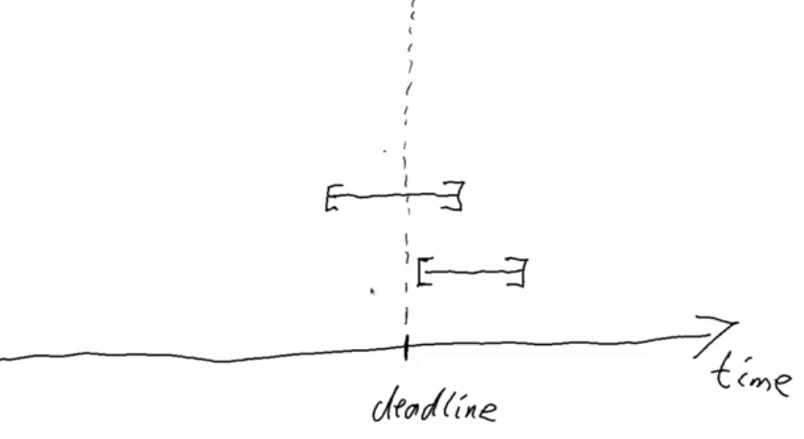

Let's consider a transaction with a validity that crosses the deadline, which is shown as the uppermost range in the above diagram.

Recall that before the validator script is run, other checks are made, including the time check. The node checks that the current time falls into the valid range of
the transaction and only then is the validator run. So we know that, if we are in the validator, the current time lies somewhere within the validity interval.

In the case of the range that crosses the deadline, the validator code cannot know whether the current time is before or after the deadline. In this case, the
validator must declare that the transaction is invalid.

The second example in the diagram, however, is fine. We still don't know what the current time is exactly, but we know that whatever the time is, it will be after the
deadline.

So, what we are checking for is that the whole validity interval is to the right of the deadline. One way to do this is to use the ``contains`` function to check
whether the validity interval is fully contained within the interval that starts from the deadline and extends until the end of time.

.. code:: haskell
      
      deadlineReached :: Bool
      deadlineReached = contains (from $ deadline dat) $ txInfoValidRange info

That completes the validation logic. Let's take care of some boilerplate.

.. code:: haskell

      data Vesting
      instance Scripts.ValidatorTypes Vesting where
          type instance DatumType Vesting = VestingDatum
          type instance RedeemerType Vesting = ()
      
      typedValidator :: Scripts.TypedValidator Vesting
      typedValidator = Scripts.mkTypedValidator @Vesting
          $$(PlutusTx.compile [|| mkValidator ||])
          $$(PlutusTx.compile [|| wrap ||])
        where
          wrap = Scripts.wrapValidator @VestingDatum @()

We will focus more on the wallet part of the script later, but here are the changes.

In addition to some new ``LANGUAGE`` pragmas and some extra imports, we have created a ``GiveParams`` type, and modified the ``grab`` endpoint to
require no parameters.

The ``VestingSchema`` type defines the endpoints that we want to expose to the user. As in our last example, ``give`` will be used by the user who puts funds into the
contract, then ``grab`` will be used by the user wanting to claim the funds.

.. code:: haskell

      type VestingSchema =
         .\/ Endpoint "give" GiveParams
         .\/ Endpoint "grab" ()

So what parameters do we need for ``give``? The endpoint will create a UTxO at the vesting script address with an amount and a datum. If you recall, our datum
contains the beneficiary and the deadline. So, there are three pieces of information that we must pass to the ``give`` endpoint.

.. code:: haskell

      data GiveParams = GiveParams
         { gpBeneficiary :: !PubKeyHash
         , gpDeadline    :: !POSIXTime
         , gpAmount      :: !Integer
         } deriving (Generic, ToJSON, FromJSON, ToSchema)

The ``grab`` endpoint doesn't require any parameters because the beneficiary will just look for UTxOs sitting at the script address and can then check whether they
are the beneficiary and whether the deadline has passed. If so, they can consume them.

Let's quickly look at the ``give`` endpoint.

.. code:: haskell

      give :: AsContractError e => GiveParams -> Contract w s e ()
      give gp = do
          let dat = VestingDatum
                      { beneficiary = gpBeneficiary gp
                      , deadline    = gpDeadline gp
                      }
              tx  = mustPayToTheScript dat $ Ada.lovelaceValueOf $ gpAmount gp
          ledgerTx <- submitTxConstraints typedValidator tx
          void $ awaitTxConfirmed $ txId ledgerTx
          logInfo @String $ printf "made a gift of %d lovelace to %s with deadline %s"
              (gpAmount gp)
              (show $ gpBeneficiary gp)
              (show $ gpDeadline gp)

First we compute the datum we want to use, and we can get both pieces of information from the ``GiveParams`` which is passed into the function.

Then, for the transaction, we add a constraint that there must be an output at this script address with the datum that we just defined and a certain number of
lovelace, which we also get from the ``GiveParams``.

The rest of the function is as before, just with a different log message.

The ``grab`` endpoint is a bit more involved. 

There can be many UTxOs at this script address and some of them might not be suitable for us, either because we are not the beneficiary, or because the deadline has
not yet passed. If we try to submit a transaction when there are no suitable UTxOs, we will pay fees, but get nothing in return.

.. code:: haskell

      grab :: forall w s e. AsContractError e => Contract w s e ()
      grab = do
          now   <- currentTime
          pkh   <- pubKeyHash <$> ownPubKey
          utxos <- Map.filter (isSuitable pkh now) <$> utxoAt scrAddress
          if Map.null utxos
              then logInfo @String $ "no gifts available"
              else do
                  let orefs   = fst <$> Map.toList utxos
                      lookups = Constraints.unspentOutputs utxos  <>
                                Constraints.otherScript validator
                      tx :: TxConstraints Void Void
                      tx      = mconcat [mustSpendScriptOutput oref $ Redeemer $ PlutusTx.toData () | oref <- orefs] <>
                                mustValidateIn (from now)
                  ledgerTx <- submitTxConstraintsWith @Void lookups tx
                  void $ awaitTxConfirmed $ txId ledgerTx
                  logInfo @String $ "collected gifts"
        where
          isSuitable :: PubKeyHash -> POSIXTime -> TxOutTx -> Bool
          isSuitable pkh now o = case txOutDatumHash $ txOutTxOut o of
              Nothing -> False
              Just h  -> case Map.lookup h $ txData $ txOutTxTx o of
                  Nothing        -> False
                  Just (Datum e) -> case PlutusTx.fromData e of
                      Nothing -> False
                      Just d  -> beneficiary d == pkh && deadline d <= now

First, we get the current time and calculate our public key hash. We then look up all the UTxOs at this address and filter them using the ``isSuitable`` helper function,
which is defined in the ``where`` clause. 

It first checks the datum hash, and, if it finds it, it attempts to look up the corresponding datum. Recall that the producing transaction, in this case ``give`` doesn't
have to supply the datum, it need only supply the datum hash. However, in our case we need to have the datum available to the ``grab`` endpoint, so the ``give`` endpoint 
does provide the datum.

If the ``grab`` endpoint finds the datum, it must deserialise it to the ``Vesting`` type.

If all of this succeeds we can check whether we are the beneficiary and whether the deadline has passed.

At this point, ``utxos`` contains all the UTxOs that we can consume. If we find none, then we just log a message to that effect. If there is at least one, then we
construct one transaction that consumes all of them as inputs and pays the funds to our wallet.

As ``lookups``, we provide the list of UTxOs as well as the validator script. Recall that, in order to consume UTxOs at this address, the spending transaction must
provide the validation script.

We then create a transaction that spends all the suitable UTxOs along with a constraint that it must validate in the ``Interval`` which stretches from now until the end of time.
If we don't provide the interval here, then validation will fail, because the default interval is from genesis until the end of time. The on-chain validation
would reject this as it needs an interval that is fully contained in the interval stretching from the deadline until the end of time.

We could use the singleton ``Interval`` ``now``, but, if there were any issues, for example network delays, and the transaction arrived at a node a slot or
two later, then validation would no longer work.

The, we just bundle up the endpoints.

.. code:: haskell

      endpoints :: Contract () VestingSchema Text ()
      endpoints = (give' `select` grab') >> endpoints
        where
          give' = endpoint @"give" >>= give
          grab' = endpoint @"grab" >>  grab

Then there is some boilerplate which is just used in the playground.

.. code:: haskell

      mkSchemaDefinitions ''VestingSchema

      mkKnownCurrencies []

In the playground
~~~~~~~~~~~~~~~~~

First, let's add a third wallet. We are going to create a scenario where Wallet 1 makes two gifts to Wallet 2 with different deadlines and also makes one gift to Wallet 3.

.. figure:: img/iteration2/pic__00043.png

Normally it would be possible to submit both ``give`` transactions in the same slot, but the way our code is implemented, we wait for confirmation, which means
we need to add a wait action. This is maybe not the best way to do it, but that's how it is for the time being.

.. figure:: img/iteration2/pic__00044.png

Here we run into our first problem. We need to supply the beneficiary address, but there is no way in the playground to get the public key
hash of a wallet.

But we can get it from the REPL.

.. code:: haskell

      Prelude Week03.Homework1> :l src/Week03/Vesting.hs 
      Ok, one module loaded.
      Prelude Week03.Vesting> import Ledger
      Prelude Ledger Week03.Vesting> import Wallet.Emulator
      Prelude Ledger Wallet.Emulator Week03.Vesting> pubKeyHash $ walletPubKey $ Wallet 2
      39f713d0a644253f04529421b9f51b9b08979d08295959c4f3990ee617f5139f
      Prelude Ledger Wallet.Emulator Week03.Vesting> pubKeyHash $ walletPubKey $ Wallet 3
      dac073e0123bdea59dd9b3bda9cf6037f63aca82627d7abcd5c4ac29dd74003e
            
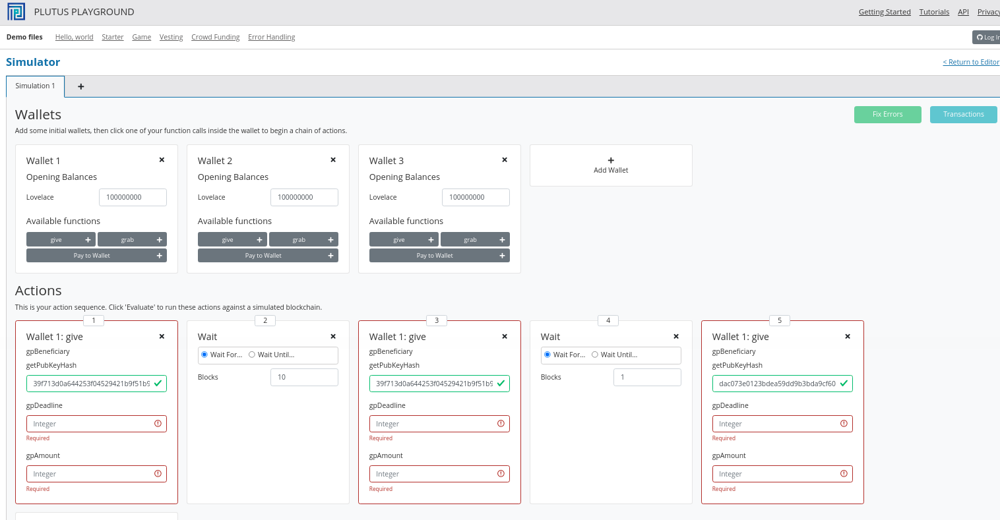

The next problem is the deadline. In the last lecture we saw how to convert between slots and POSIX times. This has changed. Previously you just needed a slot and out came
a POSIX time. Now there is a second argument.

.. code:: haskell

      Prelude Ledger Wallet.Emulator Week03.Vesting> import Ledger.TimeSlot 
      Prelude Ledger Wallet.Emulator Ledger.TimeSlot Week03.Vesting> :t slotToBeginPOSIXTime
      slotToBeginPOSIXTime :: SlotConfig -> Slot -> POSIXTime
      
There are also versions of ``slotToBeginPOSIXTime`` that have a begin and an end time. This is because a slot is not just a point in time, it's a duration in time.

So what is this ``SlotConfig``?

.. code:: haskell

      Prelude Ledger Wallet.Emulator Ledger.TimeSlot Week03.Vesting> :i SlotConfig 
      type SlotConfig :: *
      data SlotConfig
        = SlotConfig {scSlotLength :: Integer, scZeroSlotTime :: POSIXTime}
              -- Defined in ‘Ledger.TimeSlot’
      instance Eq SlotConfig -- Defined in ‘Ledger.TimeSlot’
      instance Show SlotConfig -- Defined in ‘Ledger.TimeSlot’
      
It takes the slot length and the time at which slot zero starts.

So now we have to find out what ``SlotConfig`` to use for the playground. Luckily, it's the default. For that we need to use the ``Data.Default`` module.

.. code:: haskell

      Prelude Ledger Wallet.Emulator Ledger.TimeSlot Week03.Vesting> import Data.Default
      Prelude Ledger Wallet.Emulator Ledger.TimeSlot Data.Default Week03.Vesting> def :: SlotConfig
      SlotConfig {scSlotLength = 1000, scZeroSlotTime = POSIXTime {getPOSIXTime = 1596059091000}}
      

Now we can use ``slotToBeginPOSIXTime`` with the default config to get the POSIX time for slot 10 and slot 20.

.. code:: haskell

      Prelude Ledger Wallet.Emulator Ledger.TimeSlot Data.Default Week03.Vesting> slotToBeginPOSIXTime def 10
      POSIXTime {getPOSIXTime = 1596059101000}
      
      Prelude Ledger Wallet.Emulator Ledger.TimeSlot Data.Default Week03.Vesting> slotToBeginPOSIXTime def 20
      POSIXTime {getPOSIXTime = 1596059111000}

And we can use these in the playground. We'll use slot 10 as the deadline for the first and third ``give``s and slot 20 for the second ``give``. We'll also give 10 Ada
in each case.

.. figure:: img/iteration2/pic__00048.png

Let's create a scenario where everything works. Wallet 3 grabs at slot 10 when the deadline for Wallet 3 has passed, and Wallet 2 grabs at slot 20, when both
the Wallet 2 deadlines have passed. We will use the ``Wait Until..`` option for this.

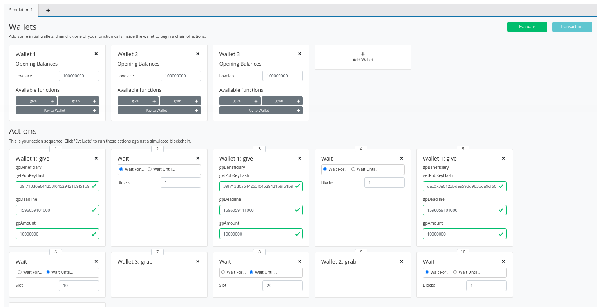

After evaluation, we first see the Genesis transaction.

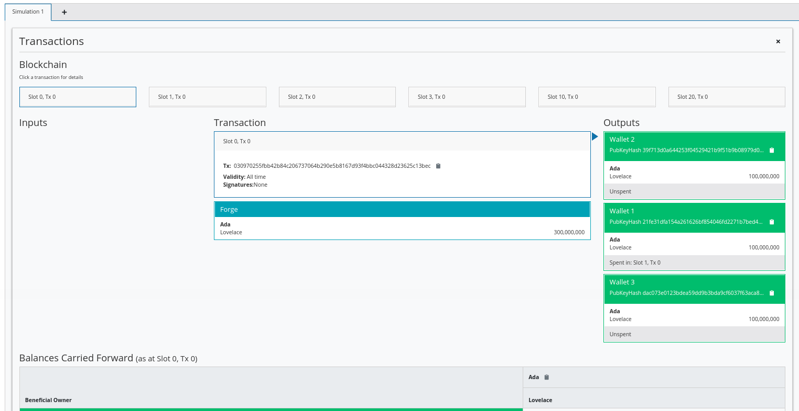

If we look at the next transaction, we see the gift from Wallet 1 to Wallet 2 with the deadline of 10. Here, ten Ada get locked in the script address.

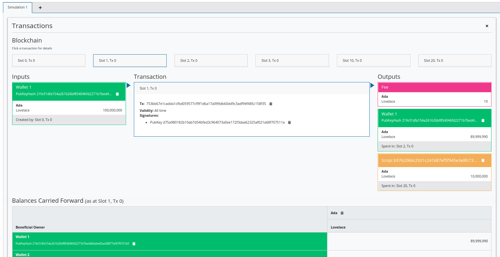

The next transaction is the gift from Wallet 1 to Wallet 2 with the deadline of 20. A new UTxO is now created at the script address with ten Ada.

.. figure:: img/iteration2/pic__00052.png

And the third gift, this time to Wallet 3, with a deadline of 10. Wallet 1 now has about 70 Ada, and another UTxO is created with 10 Ada locked at the script address.

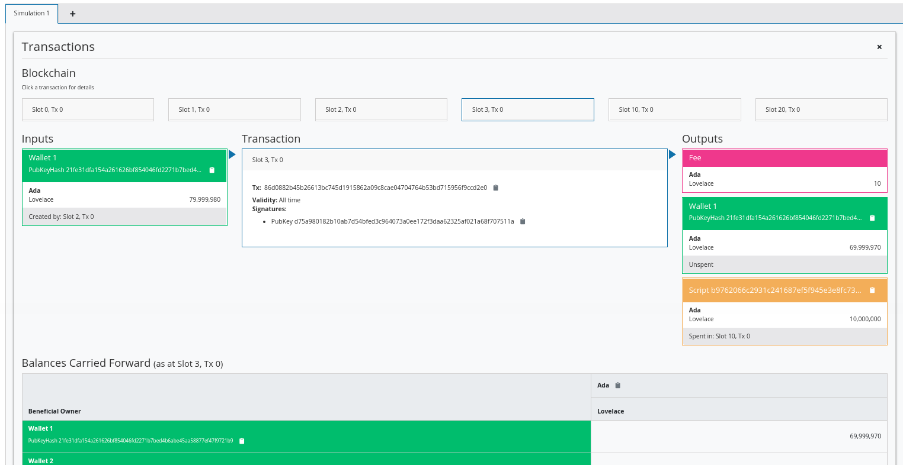

At slot 10, Wallet 3 grabs successfully. The third UTxO is the input, some fees are paid, and then the remainder of the lovelace is sent to Wallet 3.

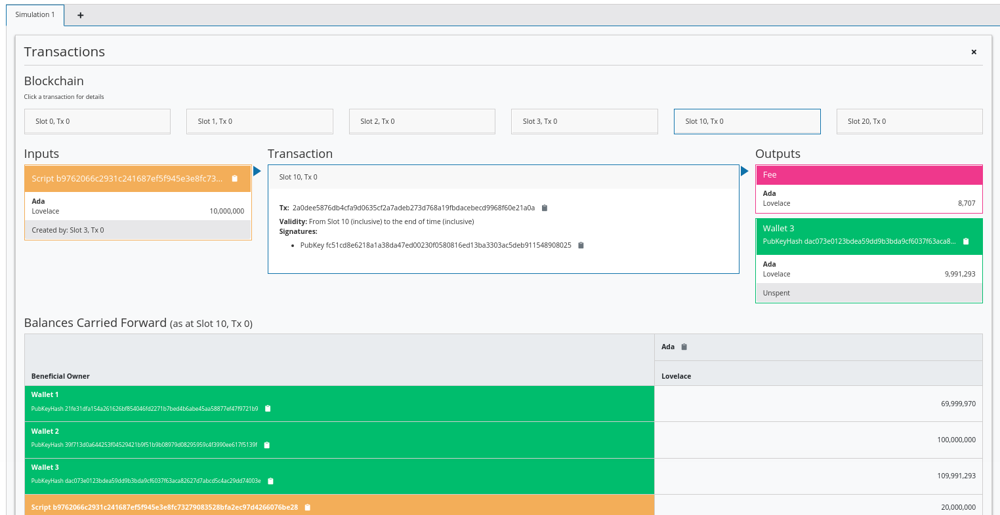

Then at slot 20, Wallet 2 successfully grabs both the UTxOs for which they are the beneficiary. This time the fee is higher because two validators have to run.

.. figure:: img/iteration2/pic__00055.png

The final balances reflect the changes.

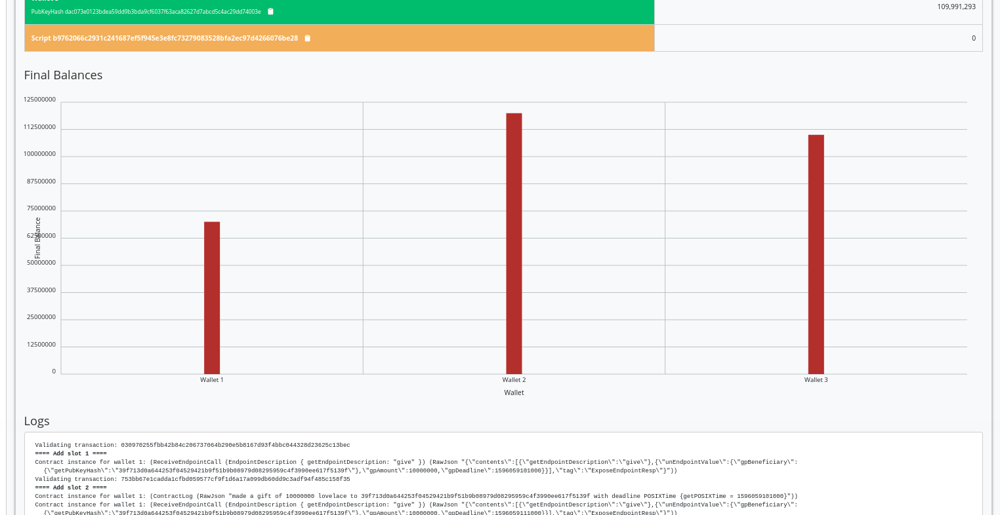

Now let's look at the case where the grab happens too early. We'll make Wallet 2 grab at slot 15 instead of slot 20.

.. figure:: img/iteration2/pic__00010.png
   :alt: 

Now we see that the first transactions are the same, but that the final transaction at slot 15 has only one input, because the second UTxO is not yet available.

.. figure:: img/iteration2/pic__00057.png

And we can see that there are 10 Ada still locked at the script address.

.. figure:: img/iteration2/pic__00057.png

Our off-chain code was written in such a way that it will only submit a transaction if there is a suitable UTxO that can be grabbed. This means that we don't really
exercise the validator because we are only sending transactions to the blockchain that will pass validation. 

If you want to test the validator, you could modify the wallet code so that the grab endpoint attempts to grab everything and then validation will fail if you are not
the beneficiary or the deadline has not been reached.

You need to keep in mind that anybody can write off-chain code. So, even though it works now as long as you use the ``grab`` endpoint that we wrote ourselves, somebody
could write a different piece of off-chain code that doesn't filter the UTxOs as we did. In this case, if the validator is not correct something could be horribly wrong.

Example 2 - Parameterized Contract
----------------------------------

We'll start the next example by copying the code from the vesting example into a new module called ``Week03.Parameterized``.

On-Chain
~~~~~~~~

Note that in the vesting example we used the ``Vesting`` type as the datum, but it was just fixed, it didn't change. Alternatively, we could have baked it into the contract, so to speak,
so that we have a contract where the script itself already contains the beneficiary and deadline information.

All the examples of contracts we have seen so far were fixed. We used a ``TypedValidator`` as a compile-time constant. The idea of parameterized scripts is that you can
have a parameter and, depending on the value of the parameter, you get different values of ``TypedValidator``.

So, instead of defining one script, with a single script address, with all UTxOs sitting at the same address, you can define a family of 
scripts that are parameterized by a given parameter. In our case, this will mean that UTxOs for different beneficiaries and/or deadlines will be a different script addresses, as
they will have parameterized validators specific to their parameters rather than specific to the datum of the UTxO.

We are going to demonstrate how to do this by, instead of using datum for the beneficiary and deadline values, using a parameter.

Let's start by renaming ``VestingDatum`` to something more suitable.

.. code:: haskell

      data VestingParam = VestingParam
            { beneficiary :: PubKeyHash
            , deadline    :: POSIXTime
            } deriving Show

We will also remove the ``unstableMakeIsData`` call as we don't need this anymore.

The reason we don't need it, is because we are just going to use ``()`` for the datum in the ``mkValidator`` function. All the information we require will be in a new argument
to ``mkValidator``, of type ``VestingParam``, which we add at the beginning of the list of arguments.

.. code:: haskell

      {-# INLINABLE mkValidator #-}
      mkValidator :: VestingParam -> () -> () -> ScriptContext -> Bool
      mkValidator p () () ctx = traceIfFalse "beneficiary's signature missing" signedByBeneficiary &&
                                traceIfFalse "deadline not reached" deadlineReached
        where
          info :: TxInfo
          info = scriptContextTxInfo ctx
      
          signedByBeneficiary :: Bool
          signedByBeneficiary = txSignedBy info $ beneficiary p
      
          deadlineReached :: Bool
          deadlineReached = contains (from $ deadline p) $ txInfoValidRange info
          
We also change the ``Vesting`` type to reflect the change to the datum.

.. code:: haskell

      data Vesting
      instance Scripts.ValidatorTypes Vesting where
          type instance DatumType Vesting = ()
          type instance RedeemerType Vesting = ()     

Now, the ``TypedValidator`` will no longer be a constant value. Instead it will take a parameter.

Recall that the function ``mkTypedValidator`` requires as its first argument the compiled code of a function that takes three arguments and returns a ``Bool``. But now, it has four arguments,
so we need to account for that.

.. code:: haskell

      typedValidator :: VestingParam -> Scripts.TypedValidator Vesting
      typedValidator p = Scripts.mkTypedValidator @Vesting      

Now, what we would like to do is something like this, passing in the new parameter ``p`` to ``mkValidator`` so that the compiled code within the Oxford brackets would have the correct type.

.. code:: haskell

      -- this won't work
      $$(PlutusTx.compile [|| mkValidator p ||])
      $$(PlutusTx.compile [|| wrap ||])
    where
      wrap = Scripts.wrapValidator @() @()

This code will not work, but before we investigate, let's leave the code as it is for now and make some more changes to the rest of the code.

``validator`` now will take a ``VestingParam`` and will return a composed function. The returned function has the effect that any paramater passed to ``validator`` would now effectively
get passed to the ``typedValidator`` function, whose return value would in turned get passed to the ``validatorScript`` function.

.. code:: haskell

      validator :: VestingParam -> Validator
      validator = Scripts.validatorScript . typedValidator

And the same for ``valHash`` and ``scrAddress``.

.. code:: haskell

      valHash :: VestingParam -> Ledger.ValidatorHash
      valHash = Scripts.validatorHash . typedValidator

      scrAddress :: VestingParam -> Ledger.Address
      scrAddress = scriptAddress . validator
          
Now, let's find out what's wrong with out ``typedValidator`` function.

If we try to launch the REPL, we get a compile error.

.. code:: haskell

      GHC Core to PLC plugin: E043:Error: Reference to a name which is not a local, a builtin, or an external INLINABLE function: Variable p
      No unfolding
      Context: Compiling expr: p
      Context: Compiling expr: Week03.Parameterized.mkValidator p
      Context: Compiling expr at "plutus-pioneer-program-week03-0.1.0.0-inplace:Week03.Parameterized:(67,10)-(67,48)"

The problem is this line.

.. code:: haskell

      -- this won't work
      $$(PlutusTx.compile [|| mkValidator p ||])

Recall that everything inside the Oxford brackets must be explicitly known at compile time. Normally it would even need all the code to be written explicitly, but
by using the ``INLINABLE`` pragma on the ``mkValidator`` function we can reference the function instead. However, it must still be known at compile time, because that's
how Template Haskell works - it is executed before the main compiler.

The ``p`` is not known at compile time, because we intend to supply it at runtime. Luckily there is a way around this.

On the Haskell side, we have our ``mkValidator`` function and we have ``p`` of type ``VestingParam``. We can compile ``mkValidator`` to Plutus, but we can't compile ``p`` to Plutus
because we don't know what it is. But, if we could get our hands on the compiled version of ``p``, we could apply this compiled version to the compiled ``mkValidator``, and this
would give us what we want.

This seems to solve nothing, because we still need a compiled version of ``p`` and we have the same problem that ``p`` is not known at compile time.

However, ``p`` is not some arbitrary Haskell code, it's data, so it doesn't contain any function types. If we make the type of ``p`` an instance of a type class called ``Lift``.
We can use ``liftCode`` to compile ``p`` at runtime to Plutus Core and then, using ``applyCode`` we can apply the Plutus Core ``p`` to the Plutus Core ``mkValidator``.

The Lift Class
______________

Let's briefly look at the ``Lift`` class. It is defined in package ``plutus-tx``.

.. code:: haskell

      module PlutusTx.Lift.Class

It only has one function, ``Lift``. However, we won't use this function directly.

The importance of the class is that it allows us to, at runtime, lift Haskell values into corresponding Plutus script values. And this is
exactly what we need to convert our parameter ``p`` into code.

We will use a different function, defined in the same package but in a different module.

.. code:: haskell

      module PlutusTx.Lift

The function we will use is called ``liftCode``.

.. code:: haskell

      -- | Get a Plutus Core program corresponding to the given value as a 'CompiledCodeIn', throwing any errors that occur as exceptions and ignoring fresh names.
      liftCode
         :: (Lift.Lift uni a, Throwable uni fun, PLC.ToBuiltinMeaning uni fun)
         => a -> CompiledCodeIn uni fun a
      liftCode x = unsafely $ safeLiftCode x

It takes a Haskell value of type ``a``, provided ``a`` is an instance of the ``Lift`` class, and turns it into a piece of Plutus script code corresponding to the same type.

Now we can fix our validator.

.. code:: haskell

      typedValidator :: VestingParam -> Scripts.TypedValidator Vesting
      typedValidator p = Scripts.mkTypedValidator @Vesting
          ($$(PlutusTx.compile [|| mkValidator ||]) `PlutusTx.applyCode` PlutusTx.liftCode p)
          $$(PlutusTx.compile [|| wrap ||])
        where
          wrap = Scripts.wrapValidator @() @()

This code is fine, but it won't yet compile, because ``VestingParam`` is not an instance of ``Lift``. To fix this, we can use ``makeLift``.

.. code:: haskell

      PlutusTx.makeLift ''VestingParam

And, we need to enable a GHC extension.

.. code:: haskell

      {-# LANGUAGE MultiParamTypeClasses #-}

Now it will compile.      

Off-Chain
~~~~~~~~~

The off-chain code hasn't changed much.

The ``GiveParams`` are still the same.

.. code:: haskell

      data GiveParams = GiveParams
            { gpBeneficiary :: !PubKeyHash
            , gpDeadline    :: !POSIXTime
            , gpAmount      :: !Integer
            } deriving (Generic, ToJSON, FromJSON, ToSchema)      

``VestingSchema`` has slightly changed because the ``grab`` endpoint now relies on knowing the beneficiary and deadline in order to know 
determine the script address. We know the beneficiary because it will be the public key hash of the wallet that calls ``grab``, but we don't know the deadline, so we must
pass it to ``grab``.

.. code:: haskell

      type VestingSchema =
                Endpoint "give" GiveParams
            .\/ Endpoint "grab" POSIXTime

The ``give`` endpoint is similar to the vesting example, but there are some differences.

Instead of computing the datum, we will construct something of type ``VestingParam``. We also change the reference to the datum in ``mustPayToTheScript`` to become ``()``, and
we provide the type ``p`` to ``typedValidator`` as it is no longer a constant.

.. code:: haskell

      give :: AsContractError e => GiveParams -> Contract w s e ()
      give gp = do
          let p  = VestingParam
                      { beneficiary = gpBeneficiary gp
                      , deadline    = gpDeadline gp
                      }
              tx = mustPayToTheScript () $ Ada.lovelaceValueOf $ gpAmount gp
          ledgerTx <- submitTxConstraints (typedValidator p) tx
          void $ awaitTxConfirmed $ txId ledgerTx
          logInfo @String $ printf "made a gift of %d lovelace to %s with deadline %s"
              (gpAmount gp)
              (show $ gpBeneficiary gp)
              (show $ gpDeadline gp)      

In the ``grab`` endpoint, there are also some changes.

Recall that earlier we got all the UTxOs sitting at this one script address and that they could be for arbitrary beneficiaries and for arbitrary deadlines. For this reason, we
had to filter those UTxOs which were for us and where the deadline had been reached.

We now have the additional parameter, which we'll call ``d``, which represents the deadline. So we can immediately see if the deadline has been reached or not.

If it has not been reached, we write a log message and stop, otherwise we continue and construct the ``VestingParam``.

Then, we look up the UTxOs that are sitting at this address. Address is not a constant anymore, it takes a parameter. So, now, we will only get UTxOs which are for us and that
have a deadline that has been reached. We don't need to filter anything.

If there are none, we log a message to that effect and stop, otherwise we do more or less what we did before.

.. code:: haskell

      grab d = do
      now   <- currentTime
      pkh   <- pubKeyHash <$> ownPubKey
      if now < d
          then logInfo @String $ "too early"
          else do
              let p = VestingParam
                          { beneficiary = pkh
                          , deadline    = d
                          }
                          utxos <- utxoAt $ scrAddress p
                          if Map.null utxos
                              then logInfo @String $ "no gifts available"
                              else do
                                  let orefs   = fst <$> Map.toList utxos
                                      lookups = Constraints.unspentOutputs utxos      <>
                                                Constraints.otherScript (validator p)
                                      tx :: TxConstraints Void Void
                                      tx      = mconcat [mustSpendScriptOutput oref $ Redeemer $ PlutusTx.toData () | oref <- orefs] <>
                                                mustValidateIn (from now)
                                  ledgerTx <- submitTxConstraintsWith @Void lookups tx
                                  void $ awaitTxConfirmed $ txId ledgerTx
                                  logInfo @String $ "collected gifts"                          

The ``endpoints`` function is slightly different due to the new parameter for ``grab``.

.. code:: haskell

      endpoints :: Contract () VestingSchema Text ()
      endpoints = (give' `select` grab') >> endpoints
        where
          give' = endpoint @"give" >>= give
          grab' = endpoint @"grab" >>= grab

Back to the playground
~~~~~~~~~~~~~~~~~~~~~~

We will now copy and paste this new contract into the playground and setup a new scenario.

The ``give`` transactions are the same.

.. figure:: img/iteration2/pic__00059.png

The ``grab`` is slightly different. In our earlier implementation, one wallet could grab UTxOs with different deadlines provided that the deadlines had passed. Now the deadline
is part of the script parameter, so we need to specify it in order to get the script address. This means that Wallet 2 cannot grab the gifts for slots 10 and 20 at the same time,
at least not in the way that we have implemented it.

First we can wait until slot 10 and then Wallet 2 should be able to grab its first gift and Wallet 3 should be able to claim its single gift.

We'll add a ``grab`` for Wallets 2 and 3. Here, we don't need to wain in between each transaction because it is two different wallets.

We then wait until slot 20 and perform Wallet 2's second ``grab`` and then wait for 1 block, as usual.

.. figure:: img/iteration2/pic__00060.png

So let's see if it works by clicking ``Evaluate``.

.. figure:: img/iteration2/pic__00061.png

Take note of the script address for that transaction out at slot 1.

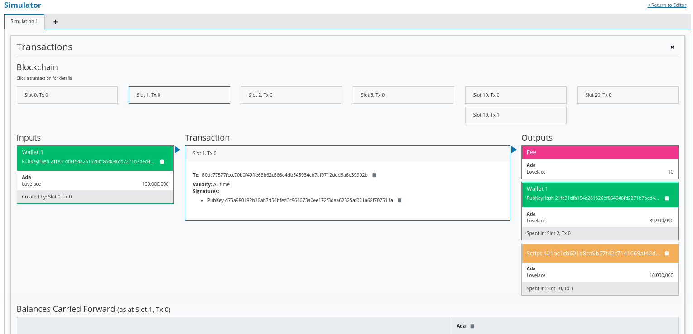

And compare this with the script address for the transaction output at slot 2.

.. figure:: img/iteration2/pic__00063.png

Notice that the script address for the UTxOs is different. In our first version of the vesting contract, the script address was a constant. This meant that all our gifts ended up
at the same script address and only the datum in each UTxO was different.

Now, the datum is just ``()`` and the beneficiary and the deadline are included as part of the script itself, so the addresses are now different depending on the beneficiary and
deadline parameters.

For the gift to Wallet 3 we see yet another address.

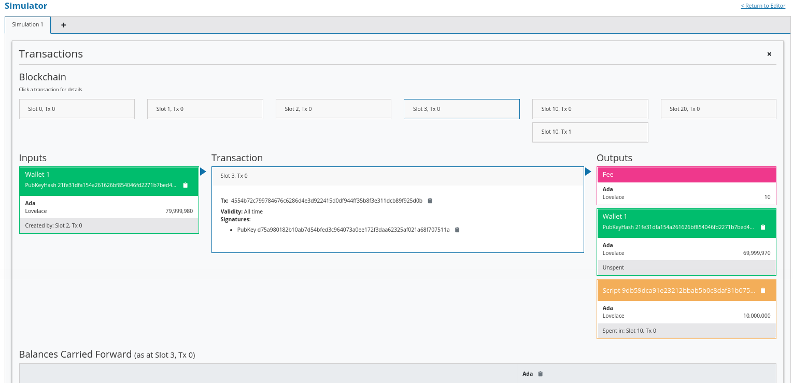

We see two grabs in slot 10, one by Wallets 2 and one by Wallet 3. The order in which they are processed is not deterministic.

Then, finally in slot 20, Wallet 2 grabs its remaining gift.

And the final balances reflect the transactions that have occurred.

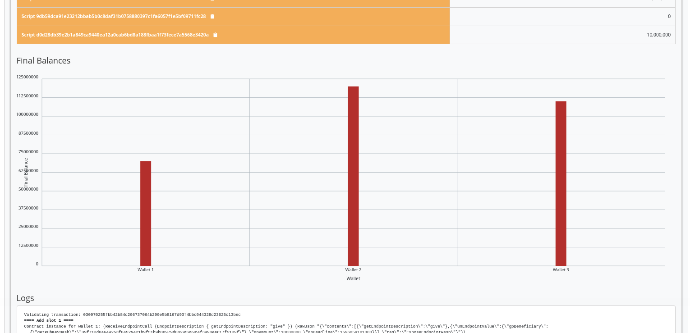

