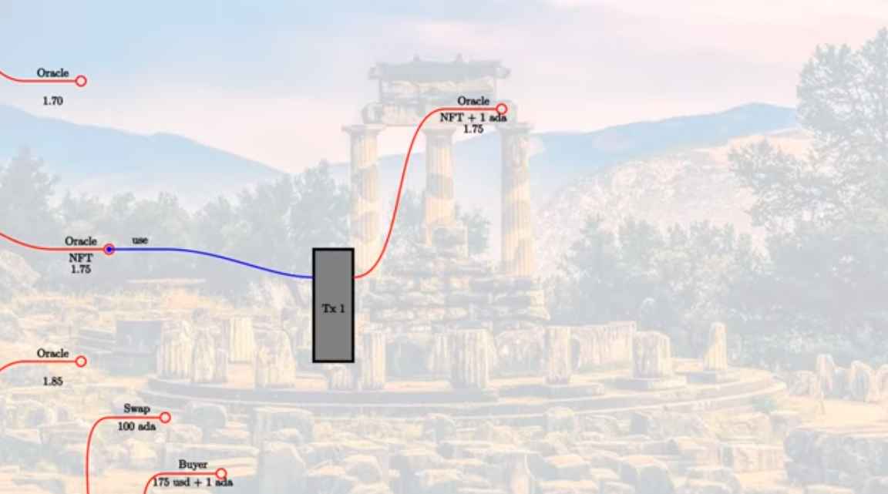

Week 06 - Oracles
=================

.. note::
      These is a written version of `Lecture
      #6 <https://www.youtube.com/watch?v=Tr2VBm8vOhw>`__.

      In this lecture we learn about oracles and using the PAB (Plutus Application Backend).

      These notes use Plutus commit 476409eaee94141e2fe076a7821fc2fcdec5dfcb

      
Overview
--------

In this lecture we are going to look at a case study, to see how what we have learned so far can be turned into an actual application. A collection of executables that even come with a little front end.

It will be a real dApp, apart from the fact that we don't have a real blockchain available yet. This will run on a
simulated blockchain - a mockchain.

The example we are going to use for this is to implement a very simple oracle.

.. note::
    In the blockchain world, an oracle is a way to get real-world information onto the blockchain, in order to
    make it usable in smart contracts.

There are numerous examples of use cases for oracles. We can think of external data sources such as weather data, election
results, stock exchange data or randomness. You may have a betting contract that depends on the outcome of a specific
sports game, for example.

There are various ways to implement oracles, of varying sophistication.

We are going to use a very simple approach, where we have one trusted data provider. And, as an example of data, we
are going to use the ADA/USD exchange rate.

There are lots of problems with this approach, as we have to trust the data source. There are ways to mitigate the risk
that the data source is either untrustworthy or unreliable. For example, we could ask the provider to put down some
collateral that is lost if data is not provided or is inaccurate. Or, you could combine several oracles into one
and only accept the result if they all agree, or take the median, or average value of various sources. You could also
come up with more sophisticated mechanisms.

As we know, for anything to happen on the blockchain, there must be a UTxO, so the obvious thing to do is to represent
the data feed as a UTxO. The UTxO sits at the script address of the oracle, and its datum field it carries the current 
value of the oracle data.

.. figure:: img/week06__00000.png

And this is where we find our first problem. As we have noted before, validation only happens when you want to consume
something from a script address, not when you produce an output at a script address. This means that we can't prevent
anybody producing arbitrary outputs at the script address.

Somehow we need to distinguish the true oracle output from other outputs that may be sitting at the same script address.
And the way we do this is to put an NFT on the output. Because an NFT can only exist once, there can only be one UTxO
at the script address that holds the NFT.

How can such an oracle be used?

Here we come to something we haven't seen before. In all our code writing validators and contracts, we always knew the
full API up front. In the case of an oracle, this is different. At the point that an oracle is created, you don't know how
people may want to use it. It must be like an open API, able to work with smart contracts that have not yet been
designed.

As an example of a use-case that might make use of this specific oracle, let's consider a swap contract where, at the swap
address, somebody can deposit ADA, and then somebody else can take those ADA in exchange for USD.

Of course, we don't have USD directly on the blockchain, but we can imagine that they are represented by some native token.

In this example, as the value at the oracle is 1.75, then if someone offers 100 ADA, the price for that should be
175 USD.

In addition to this, we need an incentive for the oracle to provide the data, because in additional to other costs for
providing the data, at a minimum they would have to pay fees to create the UTxO.

So, let's say that the oracle provider determines a fee of 1 ADA that has to be paid each time the oracle is used.

In this example, that would mean that the person wanting to by the ADA would have to pay 175 USD to the seller of the ADA,
and 1 ADA to the oracle.

What will the transaction look like?

First of all, the swap validation logic will need access to the current oracle value, which means that the oracle UTxO must be an input to the transaction.

Then we have the oracle validation logic. In this case we want to use the oracle. So, let's say we have a redeemer called *use*. Now, the oracle validator has
to check several things.

1. Is the NFT present in the consumed input?
2. Is there an output from the transaction at the same address containing the same NFT?
3. Is the value in the output UTxO the same as the input value?
4. Is the fee present?

Now we can complete the transaction.

We consume two additional inputs - the fee paid by the buyer and the 100 ADA deposited by the seller. Then we have two additional outputs - the 175 USD to the seller, and the 100 ADA to the buyer. And for these new inputs and
outputs, it is the responsibility of the swap validator to make sure that it is correct. Whereas, the oracle validator is only interested with making sure that everything concerning the oracle is correct.

.. figure:: img/week06__00005.png

Just to emphasize, this swap contract is just an example. The oracle should be capable of working with many different smart contracts that want to make use of its data.

If this was all, then we wouldn't need an oracle. If the value was fixed, so that it was always 1.75 then we could simply hard-code this into our contract. So, the value must be able to change. At least, in an example such
as this one where we have an exchange rate that can, of course, change over time. There may be other examples such as the result of a sports match, where it is a singular event in history, but in this case, it is important 
that it be able to change.

This means that the oracle validator, in addition to the *use* redeemer, must be able to support another operation where the provider of the oracle can actually change the data.

So let's say the the value changes from 1.75 to 1.77.

We know that on a (E)UTxO blockchain, nothing ever changes, so you can't change the datum of an existing UTxO. All you can do is consume UTxOs and produce new ones.

We would have a transaction that uses an *update* redeemer. The validation logic is somewhat different. It is the same as before in that the NFT needs to be present in the consumed oracle input, and also needs to be
present in the new output. In addition to that, the transaction must be signed by the oracle provider. And, we can use this update transaction as an opportunity for the oracle provider to collect the fees.

We insist that the NFT be present in the output, but we don't say anything about other values. All the fees that got there by other transactions using this oracle data can be collected during the *update* transaction.

.. figure:: img/week06__00006.png

Summary
~~~~~~~

To sum up, we represent the oracle by a UTxO and identify the correct UTxO with an NFT. The oracle value is the datum of the UTxO. We support two operations. 

One is *use* which uses the oracle in some arbitrary 
transaction. The *use* validator will make sure that the consumed oracle input carries the NFT, that there is an output that again carries the NFT, doesn't change the datum, and carries additional fees.

The second operation is *update* which can only be done by the oracle provider. For an *update* transaction, the oracle input must again carry the NFT, there must be an oracle output, also carrying the NFT. There are no 
further restrictions. The datum can change, and the accumulated fees can be taken out.

Oracle Core
-----------

Now that we know how it is supposed to work, let's look at some code.

On-chain
~~~~~~~~

First, let's look at the Plutus code that implements the oracle itself.

.. code:: haskell

    module Week06.Oracle.Core

The oracle will be a parameterized contract, and it will depend on four fields.

.. code:: haskell

    data Oracle = Oracle
        { oSymbol   :: !CurrencySymbol
        , oOperator :: !PubKeyHash
        , oFee      :: !Integer
        , oAsset    :: !AssetClass
        } deriving (Show, Generic, FromJSON, ToJSON, Prelude.Eq, Prelude.Ord)    

- *oSymbol* is the currencySymbol of the NFT that is used to identify the transaction. We don't need the token name as we will just use the empty string as the token name.
- *oOperator* is the owner of the oracle - the hash of the public key owner which can make updates
- *oFee* is the fee in lovelace that is due every time the oracle is used
- *oAsset* represents the asset class that we want to exchange rate for against Ada, which in our case will be some kind of USD token

The redeemer will support two operations.

.. code:: haskell

    data OracleRedeemer = Update | Use
        deriving Show

    PlutusTx.unstableMakeIsData ''OracleRedeemer

We need to define the NFT asset class. As mentioned, we are going to use the empty string for the token name.

.. code:: haskell

    {-# INLINABLE oracleTokenName #-}
    oracleTokenName :: TokenName
    oracleTokenName = TokenName emptyByteString
    
The *oracleAsset* will be used to identify the NFT - this is not to be confused with *oAsset*, defined above.

.. code:: haskell

    {-# INLINABLE oracleAsset #-}
    oracleAsset :: Oracle -> AssetClass
    oracleAsset oracle = AssetClass (oSymbol oracle, oracleTokenName)

We create a little helper function called *oracleValue*. This takes an output transaction and a function which looks up the datum, and then returns an *Integer*. The *Integer* represents the exchange rate (e.g. 1.75) multiplied
by a million. This avoids potential complications when using real numbers.

.. code:: haskell

    {-# INLINABLE oracleValue #-}
    oracleValue :: TxOut -> (DatumHash -> Maybe Datum) -> Maybe Integer
    oracleValue o f = do
        dh      <- txOutDatum o
        Datum d <- f dh
        PlutusTx.fromData d
        
This function is an example of monadic computation in monad that is not *IO* or the *Contract* monad. First we call *txOutDatum*, which can fail if because not every output has a datum. If it succeeds, we get a datum hash
which we can reference in *dh*. Next we used the function *f* which is provided as the second argument to maybe turn this datum hash into a datum. This too can fail. If it succeeds we can reference the result in *d*. *Datum*
is just a newtype wrapper around *Data*, so we can then use *PlutusTx.fromData* to maybe turn *d* into an *Integer*. Again, this can fail, because even if the datum is there, it may not be convertible to an integer value.

We will see in a moment where we use the *oracleValue* function.

The most important function is *mkOracleValidator*.

.. code:: haskell

    {-# INLINABLE mkOracleValidator #-}
    mkOracleValidator :: Oracle -> Integer -> OracleRedeemer -> ScriptContext -> Bool
    mkOracleValidator oracle x r ctx =
        traceIfFalse "token missing from input"  inputHasToken  &&
        traceIfFalse "token missing from output" outputHasToken &&
        case r of
            Update -> traceIfFalse "operator signature missing" (txSignedBy info $ oOperator oracle) &&
                      traceIfFalse "invalid output datum"       validOutputDatum
            Use    -> traceIfFalse "oracle value changed"       (outputDatum == Just x)              &&
                      traceIfFalse "fees not paid"              feesPaid
      where
        info :: TxInfo
        info = scriptContextTxInfo ctx
    
        ownInput :: TxOut
        ownInput = case findOwnInput ctx of
            Nothing -> traceError "oracle input missing"
            Just i  -> txInInfoResolved i
    
        inputHasToken :: Bool
        inputHasToken = assetClassValueOf (txOutValue ownInput) (oracleAsset oracle) == 1
    
        ownOutput :: TxOut
        ownOutput = case getContinuingOutputs ctx of
            [o] -> o
            _   -> traceError "expected exactly one oracle output"
    
        outputHasToken :: Bool
        outputHasToken = assetClassValueOf (txOutValue ownOutput) (oracleAsset oracle) == 1
    
        outputDatum :: Maybe Integer
        outputDatum = oracleValue ownOutput (`findDatum` info)
    
        validOutputDatum :: Bool
        validOutputDatum = isJust outputDatum
    
        feesPaid :: Bool
        feesPaid =
          let
            inVal  = txOutValue ownInput
            outVal = txOutValue ownOutput
          in
            outVal `geq` (inVal <> Ada.lovelaceValueOf (oFee oracle))
            
            
The function *mkOracleValidator* takes our parameter *Oracle*, the datum, which, in this example is an *Integer*, the redeemer type *OracleRedeemer* and finally the *ScriptContext*.

There are two cases for this validator - *use* and *update* - but there are similarities. In both cases we want to check that we have the input that holds the NFT and that there is an output that holds the NFT.

As both these checks need to be done regardless of the use case, they are done upfront.

.. code:: haskell

    ...
    traceIfFalse "token missing from input"  inputHasToken  &&
    traceIfFalse "token missing from output" outputHasToken &&
    ...    
    
After this, we consider which use case we are dealing with.

.. code:: haskell

    case r of
        Update -> traceIfFalse "operator signature missing" (txSignedBy info $ oOperator oracle) &&
                  traceIfFalse "invalid output datum"       validOutputDatum
        Use    -> traceIfFalse "oracle value changed"       (outputDatum == Just x)              &&
                  traceIfFalse "fees not paid"              feesPaid    

Before looking at the *inputHasToken* function there is another help function to look at.

.. code:: haskell

    ownInput :: TxOut
    ownInput = case findOwnInput ctx of
        Nothing -> traceError "oracle input missing"
        Just i  -> txInInfoResolved i
        
The *ownInput* function returns the *TxOut* that the script is trying to consume, which in this case is the oracle output. The *Nothing* case here can happen if we are in a 
different context, such as a minting context, so this eventuality will not occur for us. The *findOwnInput* function is provided by Plutus and will, given the context, 
find the relevant input. The *txInInfoResolved* function gets the *TxOut* from the *TxInInfo*.

The *inputHashToken* function checks that the token is present. It uses the *assetClassValueOf* function to look for the NFT within the *ownInput* response.

.. code:: haskell

    inputHasToken :: Bool
    inputHasToken = assetClassValueOf (txOutValue ownInput) (oracleAsset oracle) == 1

The next helper function, *ownOutput* checks that we have exactly one output and returns that output to us.

.. code:: haskell

    ownOutput :: TxOut
    ownOutput = case getContinuingOutputs ctx of
        [o] -> o
        _   -> traceError "expected exactly one oracle output"    

We can use this for the *outputHasToken* helper function in the same way as we did for the *inputHashToken* function.

.. code:: haskell

    outputHasToken :: Bool
    outputHasToken = assetClassValueOf (txOutValue ownOutput) (oracleAsset oracle) == 1

That covers the code for the common cases. Now, let's let at the code specific to the *update* case.

There are two conditions to check. The first is that the operator actually signed the transaction. This is so simple that we can do it inline without
a helper function.

.. code:: haskell

    traceIfFalse "operator signature missing" (txSignedBy info $ oOperator oracle)

The next thing to check is that the output datum. We know that the value can change, but we need to check that it is at least of the correct type.

.. code:: haskell

    traceIfFalse "invalid output datum" validOutputDatum
    
And for this we have referenced a new helper function *validOutputDatum*, which itself makes use of a helper function *outputDatum*.

.. code:: haskell

    outputDatum :: Maybe Integer
    outputDatum = oracleValue ownOutput (`findDatum` info)    

    validOutputDatum :: Bool
    validOutputDatum = isJust outputDatum

.. note::
    If you look up *findDatum* in the REPL, you will see it has a type of *DatumHash -> TxInfo -> Maybe Datum*. As we are using its infix notation here, we
    can pass in *info* as the only parameter, and this will result in the whole expression having the type *DatumHash -> Maybe Datum*, which is the type we
    need to pass into *oracleValue*.
    
This works by trying to get the datum value from the datum hash and then trying to create the oracle value from it. If it succeeds it will return a *Just Integer*,
otherwise it will return *Nothing*, so the *validOutputDatum* function just needs to check that the return value is not *Nothing*, in other words, that it 
is a *Just*.

Note that we are not checking anything about the value of the *Integer*. This could even remain the same as the input value, if the transaction is used 
just to collect the fees that have accumulated from the use the oracle.

The second case for *mkOracleValidator* is the *use* case. This case can be used by anyone, but it is much more restrictive.

First, we don't allow the value to change. So this is the first condition.

.. code:: haskell

    traceIfFalse "oracle value changed" (outputDatum == Just x)

We have already written the *outputDatum* helper function. Instead of checking only that it is an *Integer*, here we also check that its output value is the same
as the input value.

And finally, we must check that the fees have been paid. And for this we use a new helper function called *feesPaid*.

.. code:: haskell

    feesPaid :: Bool
    feesPaid =
      let
        inVal  = txOutValue ownInput
        outVal = txOutValue ownOutput
      in
        outVal `geq` (inVal <> Ada.lovelaceValueOf (oFee oracle))    

This *feesPaid* function checks that the output value is at least as much as the input value plus the required fee. We again use the semigroup operator 
*<>* to add the fee value to the input value. We could have used equal (eq) instead of greater than or equal (geq). Using *geq* allows the user of the 
oracle to give the oracle provider a tip, if they so wish.

So this now is basically the core business logic of the oracle as shown in the diagrams.

.. figure:: img/week06__00006.png

Now we have our usual boilerplate. In particular notice that we use the pattern that we need for a parameterized validator.

.. code:: haskell

    data Oracling
    instance Scripts.ScriptType Oracling where
        type instance DatumType Oracling = Integer
        type instance RedeemerType Oracling = OracleRedeemer

    oracleInst :: Oracle -> Scripts.ScriptInstance Oracling
    oracleInst oracle = Scripts.validator @Oracling
        ($$(PlutusTx.compile [|| mkOracleValidator ||]) `PlutusTx.applyCode` PlutusTx.liftCode oracle)
        $$(PlutusTx.compile [|| wrap ||])
    where
        wrap = Scripts.wrapValidator @Integer @OracleRedeemer

    oracleValidator :: Oracle -> Validator
    oracleValidator = Scripts.validatorScript . oracleInst

    oracleAddress :: Oracle -> Ledger.Address
    oracleAddress = scriptAddress . oracleValidator

And this concludes the on-chain part of the oracle code.
    
Off-chain
~~~~~~~~~

We also create some off-chain code, namely to start the oracle, and to update it. However, we don't write off-chain code to *use* the oracle. That is not the 
responsibility of the author of this contract. That will be the responsibility of the person that wants to use the oracle - they will write the code to create the
transaction with the *use* redeemer. This is the first time that we have seen the situation where we have some on-chain code that is not paired with some off-chain code.

Starting the Oracle
+++++++++++++++++++

To start the oracle, we need some parameters.

.. code:: haskell

    data OracleParams = OracleParams
        { opFees   :: !Integer
        , opSymbol :: !CurrencySymbol
        , opToken  :: !TokenName
        } deriving (Show, Generic, FromJSON, ToJSON)    

The *opFees* parameter represents the number of lovelace that will be charged to use the oracle.

The *opSymbol* and *opToken* parameters represent the token against which we are providing the Ada exchange rate, in this case a USD token.

First we create a *startOracle* function, whose responsibility is to mint the NFT that will be used to identify the oracle UTxO. The *startOracle* function will
not provide an initial value for the oracle, this will be handled by the *updateOracle* function. The reason for this is that, if we provided an initial value, it may
be outdated by the time the NFT is minted.

We could have used the same code for minting the NFT as we used in lecture 5. This would have worked perfectly well.

However, this is a currency module provided in *plutus-use-cases* that provides a *forgeContract* function that allows us to mint NFTs.

Here is the type of the *forgeContract* function shown in the REPL.

.. code::

    Prelude Week06.Oracle.Core> :t Plutus.Contracts.Currency.forgeContract
    Plutus.Contracts.Currency.forgeContract
      :: (row-types-1.0.1.0:Data.Row.Internal.AllUniqueLabels
            (Plutus.Contract.Schema.Input s),
          row-types-1.0.1.0:Data.Row.Internal.AllUniqueLabels
            (Plutus.Contract.Schema.Output s),
          Plutus.Contracts.Currency.AsCurrencyError e,
          (Plutus.Contract.Schema.Input s
           row-types-1.0.1.0:Data.Row.Internal..! "tx-confirmation")
          ~ Plutus.Contract.Effects.AwaitTxConfirmed.TxConfirmed,
          (Plutus.Contract.Schema.Input s
           row-types-1.0.1.0:Data.Row.Internal..! "tx")
          ~ Plutus.Contract.Effects.WriteTx.WriteTxResponse,
          (Plutus.Contract.Schema.Output s
           row-types-1.0.1.0:Data.Row.Internal..! "tx")
          ~ Ledger.Constraints.OffChain.UnbalancedTx,
          (Plutus.Contract.Schema.Output s
           row-types-1.0.1.0:Data.Row.Internal..! "tx-confirmation")
          ~ Plutus.V1.Ledger.TxId.TxId) =>
         Plutus.V1.Ledger.Crypto.PubKeyHash
         -> [(Plutus.V1.Ledger.Value.TokenName, Integer)]
         -> Plutus.Contract.Types.Contract
              w s e Plutus.Contracts.Currency.OneShotCurrency
    
The important part starts towards the end, where the first parameter - of type *PubKeyHash* - is defined. This is the hash of the public key of the recipient of the NFT.

The *forgeContract* function provides more general functionality than our previous NFT contract. It allows is to generate multiple NFTs in one go. It will create a currency symbol that can only be used one, similar 
to our NFT from last time, so there can only be one minting transaction. But for the one currency symbol, you can mint various tokens in the same transaction, with 
various token names and in various quantities. The second parameter allows us to define these token names and quantities.

And it gives us a *Contract* that returns a value of the *OneShotCurrency* type. This type is specific to the currency and it doesn't really matter to us what it is. All that matters 
for us is that we can get the currency symbol out of it again.

There is one slight problem. This is not compatible with what we want. We want this types

.. code:: haskell

    Contract w s Text Oracle

An arbitrary writer type (because we don't make use of it), an arbitrary schema (as long as we have *BlockChainActions* available), *Text* error messages and a return 
type of *Oracle*.

The problem is that the *Contract* returned by *forgeContract* doesn't allow *Text* error messages. You can see this in the verbose output from the REPL - there is 
a constraint on the *e* parameter.

.. code:: haskell

    Plutus.Contracts.Currency.AsCurrencyError e,

Unfortunately *Text* doesn't implement *AsCurrencyError*.

Luckily there is a function that can helper

.. code:: haskell

    Plutus.Contract.mapError
    :: (e -> e')
       -> Plutus.Contract.Types.Contract w s e a
       -> Plutus.Contract.Types.Contract w s e' a

Given a *Contract*, it allows us to create a new *Contract* with a new type of error message. That is provided we give a function that converts from the first error 
type to the second error type.

So, let's look at the *startOracle* function.

.. code:: haskell

    startOracle :: forall w s. HasBlockchainActions s => OracleParams -> Contract w s Text Oracle
    startOracle op = do
        pkh <- pubKeyHash <$> Contract.ownPubKey
        osc <- mapError (pack . show) (forgeContract pkh [(oracleTokenName, 1)] :: Contract w s CurrencyError OneShotCurrency)
        let cs     = Currency.currencySymbol osc
            oracle = Oracle
                { oSymbol   = cs
                , oOperator = pkh
                , oFee      = opFees op
                , oAsset    = AssetClass (opSymbol op, opToken op)
                }
        logInfo @String $ "started oracle " ++ show oracle
        return oracle
        
Here we see the error conversion function is provided as *pack . show*. The *show* function converts the error to a *String* and the *pack* function converts a *String*
to a *Data.Text* type.

At this point, *osc* holds the *OneShotCurrency*, and we can then use the *currencySymbol* function to get the currency symbol as *cs*.

The *currencySymbol* function has type

.. code:: haskell
    
    currencySymbol
          :: OneShotCurrency -> Plutus.V1.Ledger.Value.CurrencySymbol

And is used accordingly

.. code:: haskell

    let cs = Currency.currencySymbol osc
    
Now we have minted our NFT and it has currency symbol *cs*. And now we can construct our *Oracle* parameter value.

.. code:: haskell

    oracle = Oracle
        { oSymbol   = cs
        , oOperator = pkh
        , oFee      = opFees op
        , oAsset    = AssetClass (opSymbol op, opToken op)
        }

The reason that *opSymbol* and *opToken* are defined separately in the *OracleParams* type *op* is just that this makes is easier when we are using the playground.

Updating the Oracle
+++++++++++++++++++

The *updateOracle* function is more complicated.

This function has to deal with two cases. Namely, the case where we have a value that we wish to update, and the case where we have just started the oracle and we want
to create a value for the very first time.

It takes our oracle parameters and also the *Integer* value that we wish to have the oracle hold.

First we create a helper function *findOracle*.

.. code:: haskell

    findOracle :: forall w s. HasBlockchainActions s => Oracle -> Contract w s Text (Maybe (TxOutRef, TxOutTx, Integer))
    findOracle oracle = do
        utxos <- Map.filter f <$> utxoAt (oracleAddress oracle)
        return $ case Map.toList utxos of
            [(oref, o)] -> do
                x <- oracleValue (txOutTxOut o) $ \dh -> Map.lookup dh $ txData $ txOutTxTx o
                return (oref, o, x)
            _           -> Nothing
      where
        f :: TxOutTx -> Bool
        f o = assetClassValueOf (txOutValue $ txOutTxOut o) (oracleAsset oracle) == 1
        
The purpose of *findOracle* is to look up the existing oracle UTxO. This can fail because the oracle might not be there. This will happen if we have just started the
oracles and have not yet created a UTxO with the oracle value. But, if we find it, we return a triple containing the UTxO identifer (TxOutRef), the UTxO itself, which 
contains all the data (TxOutTx) and the oracle value (the current exchange rate held by the oracle). The *Integer* containing the oracle value is encoded also in the
TxOutTx value, but we add it to the triple to make it easier to work with.

The first thing we do is to get all the UTxOs sitting at this address. But only one of these will be the one we are looking for - the one that contains the NFT.

We do this by using the *Map.filter* function which takes a function as a parameter which, in this case, returns True for the UTxO where the NFT is present.

.. code:: haskell

    utxos <- Map.filter f <$> utxoAt (oracleAddress oracle)
    ...
    where
      f :: TxOutTx -> Bool
      f o = assetClassValueOf (txOutValue $ txOutTxOut o) (oracleAsset oracle) == 1    

We will end up with a map in *utxos* which is either empty or contains one item. Now, we distinguish between these two cases.

.. code:: haskell

    return $ case Map.toList utxos of
        [(oref, o)] -> do
            x <- oracleValue (txOutTxOut o) $ \dh -> Map.lookup dh $ txData $ txOutTxTx o
            return (oref, o, x)
        _           -> Nothing
        
We convert the map to a list of tuples representing key value pairs of transaction ids and the transactions themselves.

For the case where there is no element, we use the _ case to represent all other cases. This could only ever be the empty list, but the compiler doesn't know that.

If, however, we have found the UTxO, then, as we already have its id and transaction, we just need to find its *Integer* value. This part could still go wrong. Even 
though we have found the correct UTxO, there could be some corrupt data in it for whatever reason.

We use the *oracleValue* function that we used also in validation. This function takes a *TxOut* parameter followed by a second parameter is a function, which, given a datum hash will return the associated datum.

In the off-chain code, we can use the following function parameter

.. code:: haskell

    \dh -> Map.lookup dh $ txData $ txOutTxTx o

Here, *txData* is a field of the transaction and it is a map from datum hashes to datums. We get the transaction from *txOutTxTx o*.

If this all succeeds, when will return the triple (oref, o, x), where x is the *Integer* value of the oracle.

Now that we have written the *findOracle* function we can look at the *updateOracle* function.

.. code:: haskell

    updateOracle :: forall w s. HasBlockchainActions s => Oracle -> Integer -> Contract w s Text ()
    updateOracle oracle x = do
        m <- findOracle oracle
        let c = Constraints.mustPayToTheScript x $ assetClassValue (oracleAsset oracle) 1
        case m of
            Nothing -> do
                ledgerTx <- submitTxConstraints (oracleInst oracle) c
                awaitTxConfirmed $ txId ledgerTx
                logInfo @String $ "set initial oracle value to " ++ show x
            Just (oref, o,  _) -> do
                let lookups = Constraints.unspentOutputs (Map.singleton oref o)     <>
                              Constraints.scriptInstanceLookups (oracleInst oracle) <>
                              Constraints.otherScript (oracleValidator oracle)
                    tx      = c <> Constraints.mustSpendScriptOutput oref (Redeemer $ PlutusTx.toData Update)
                ledgerTx <- submitTxConstraintsWith @Oracling lookups tx
                awaitTxConfirmed $ txId ledgerTx
                logInfo @String $ "updated oracle value to " ++ show x
                
                
After the *findOracle* line there is a helper function definition, as we will need this constraint twice.

.. code:: haskell

    let c = Constraints.mustPayToTheScript x $ assetClassValue (oracleAsset oracle) 1

After looking for the oracle, there are wo possibilities - either we found it or we did not.

If we didn't find it, then we have started the oracle but we have not yet provided an initial value. This is the first case. And in this case, all we have to 
do is to submit a transaction that produces the first value for the oracle.

.. code:: haskell

    ledgerTx <- submitTxConstraints (oracleInst oracle) c
    awaitTxConfirmed $ txId ledgerTx
    logInfo @String $ "set initial oracle value to " ++ show x
    
Here is the first usage of the *c* helper function. It provides the constraint *mustPayToTheScript* which ensures that the transaction will have an output 
that pays to a script address. As arguments it takes the datum *x* and the NFT. The script that it must pay to is always the script that is in focus - here it is
the first parameter to *submitTxConstraints* - *(oracleInst oracle)*.

We then wait for confirmation and write a log message. And this is all we need to do for this case.

In the other case, where we already have a value, we need to reference the UTxO parts, but we don't care about the current datum, as we are going to update it anyway.

.. code:: haskell

    Just (oref, o,  _) -> do

Now it gets a bit more complicated, because now we need two conditions.

The first constraint is the same as in the other case - the constraint referenced by the helper function *c*. But there is now an extra constraint that we must also 
consume the existing UTxO.

.. code:: haskell

    tx = c <> Constraints.mustSpendScriptOutput oref (Redeemer $ PlutusTx.toData Update)

The *mustSpendScriptOutput* function is basically the opposite of *mustPayToTheScript*. It creates an input to this script address. As parameters it takes the reference 
to the UTxO we want to consume, and it takes a *Redeemer*. In this case the *Redeemer* is *Update* and it is converted to the Plutus *Data* type.

In order for this to work we need to provide some lookups.

In order to find the output *oref* that it wants to spend, we must use the *unspentOutputs* lookup, and in this case, we just provide the lookup with one UTxO.

.. code:: haskell

    Constraints.unspentOutputs (Map.singleton oref o)

Then we must provide the script instances. We need to do this twice, once for the input side, and once for the output side. For this, we provide the oracle instance and 
the oracle validator.

.. code:: haskell

    Constraints.scriptInstanceLookups (oracleInst oracle) <>
    Constraints.otherScript (oracleValidator oracle)

We didn't need to provide the *scriptInstanceLookups* lookup in the first case, as we were able to pass *oracleInst oracle* to the *submitTxConstraints* function. However,
with the *submitTxConstraintsWith* function, we don't have that option.

When submitting the transaction, we need to give the compiler a little nudge to let it know the script we are talking about - so that it knows, for example, what The Script is in *mustPayToTheScript*. For 
this we reference the *Oracling* type.

.. code:: haskell

    ledgerTx <- submitTxConstraintsWith @Oracling lookups tx

Hopefully now we have a valid transaction that gets submitted, and then we wait for it to be confirmed, and write some logging information.

.. code:: haskell

    awaitTxConfirmed $ txId ledgerTx
    logInfo @String $ "updated oracle value to " ++ show x
    
Remember, we talked about fee collecting earlier. This will happen automatically. The function *submitTxConstraintsWith* will send the fees to our own wallet. It does 
this because there is an imbalance between the value attached to the input, which includes the fees and the NFT, and the value we have said must be paid to the script,
which is just the NFT.

This process will also automatically create an extra input from our own input to pay the transaction fees for executing the transaction.

Lastly, we provide a function that combines these two operations, *startOracle* and *updateOracle* into one contract. This will make it possible to use in the playground 
and the *EmulatorTrace* monad, as well as in the PAB.

.. code:: haskell

    type OracleSchema = BlockchainActions .\/ Endpoint "update" Integer

    runOracle :: OracleParams -> Contract (Last Oracle) OracleSchema Text ()
    runOracle op = do
        oracle <- startOracle op
        tell $ Last $ Just oracle
        go oracle
      where
        go :: Oracle -> Contract (Last Oracle) OracleSchema Text a
        go oracle = do
            x <- endpoint @"update"
            updateOracle oracle x
            go oracle
    
The function *runOracle* first starts the oracle. Then, for reasons that will become clear later, we use *tell* to write the oracle parameter. We need to be able to
communicate the parameter value of the oracle to the outside world, so that people can use the oracle. We will not know until runtime the currency symbol that will be used
for the NFT, so we don't know the value of the oracle parameter yet.

Remember that *tell* expects a *Monoid* type. The typical example is a list of strings that get concatenated to one list of all log messages.

But it doesn't have to be lists. In *Data.Monoid* we have this *Last* Monoid.

.. code:: haskell

    Prelude Week06.Oracle.Core> import Data.Monoid (Last (..))
    Prelude Data.Monoid Week06.Oracle.Core> :i Last
    type Last :: * -> *
    newtype Last a = Last {getLast :: Maybe a}
          -- Defined in ‘Data.Monoid’
    instance Applicative Last -- Defined in ‘Data.Monoid’
    instance Eq a => Eq (Last a) -- Defined in ‘Data.Monoid’
    instance Functor Last -- Defined in ‘Data.Monoid’
    instance Monad Last -- Defined in ‘Data.Monoid’
    instance Monoid (Last a) -- Defined in ‘Data.Monoid’
    instance Ord a => Ord (Last a) -- Defined in ‘Data.Monoid’
    instance Semigroup (Last a) -- Defined in ‘Data.Monoid’
    instance Show a => Show (Last a) -- Defined in ‘Data.Monoid’
    instance Read a => Read (Last a) -- Defined in ‘Data.Monoid’
    instance Traversable Last -- Defined in ‘Data.Traversable’
    instance Foldable Last -- Defined in ‘Data.Foldable’

We see that it is just a *newtype* wrapper around *Maybe*. The point is to provide a specific *Monoid* instance. The idea, as the name suggests, is that it is
a monoid operation that always remembers the last Just value. For example:

.. code:: haskell

    Prelude Data.Monoid Week06.Oracle.Core> Last (Just 'x') <> Last (Just 'y')
    Last {getLast = Just 'y'}
    
However, if the second *Last* is a nothing, it will return the first one.

.. code:: haskell

    Prelude Data.Monoid Week06.Oracle.Core> Last (Just 'x') <> Last Nothing
    Last {getLast = Just 'x'}

If both are *Nothing*, it will be *Nothing*.

*Last* is very useful because it allows us to keep the current state. The value of the log will basically be the last *Just* we told.

In this contract we will only do that once. In the beginning it will be *Last Nothing*. Then we mint the NFT, and then, when we get the oracle value in 
*runOracle*, and then *tell* it, it will always have that value. If other contracts from the outside query the state, they will always get the *Just oracle*, so 
they will be able to discover the value of the oracle.

So, next in *runOracle*, we call the helper function *go*. What this does is to block at the update endpoint. As soon as someone provides an *Integer* as the new value,
it will call the *updateOracle* function with the new value, and then just loop to go again.

In summary, *runOracle* starts the oracle, *tell*\s the oracle, then loops to allow others to update the oracle.

And that concludes the code for the oracle itself. What is now missing is an example, a contract that actually uses the oracle - a swap contract. And also using the
Plutus Application Backend to run this code in the real world or, in our case, in a simulated blockchain.

Swap Validation
---------------
    
Our example swap contract can be found in

.. code:: haskell

    module Week06.Oracle.swap

The purpose of this contract is for someone to be able to deposit ADA and exchange it for a token, in our case a token that we will call USDT for US Dollar Token.

The idea is that the price, the amount of USDT that will be required to be paid for the ADA, will be determined by the value of the oracle. Remember that we are using
an *Integer* to reflect the exchange rate, with a value of one million being equal to one USDT.

We'll start with a helper function called *price*, which, given a number of lovelace and the exchange rate, returns the USDT price.

.. code:: haskell

    price :: Integer -> Integer -> Integer
    price lovelace exchangeRate = (lovelace * exchangeRate) `divide` 1000000
    
The next helper function, *lovelaces*, combines to functions from the Plutus libraries to extract a number of lovelace from a *Value* type.

.. code:: haskell

    lovelaces :: Value -> Integer
    lovelaces = Ada.getLovelace . Ada.fromValue    

Now we will write *mkSwapValidator*. This is a parameterized validator with two parameters. 

The first parameter is the oracle that we are using. To use this, we import the oracle module.

.. code:: haskell

    import Week06.Oracle.core

The second parameter is the address of the oracle. Normally, given the oracle, we would be able to compute the address from it. In the core module we saw a function
*oracleAddress* which does this for us. But this is a function that we can't use in the validator, because it can't be compiled to Plutus script. So, here, we explicitly 
hand the address to the validator.

For the datum, we use the public key hash of the seller. We don't use a redeemer, so we give it a type of Unit.

We recall from the diagram, the swap transaction should have three inputs and three outputs.

.. figure:: img/week06__00006.png

.. list-table:: Swap Transaction Inputs and Outputs
   :widths: 75 75
   :header-rows: 1

   * - Inputs
     - Outputs
   * - The oracle, to check the current exchange rate
     - The oracle, which we don't need to look at in the swap validation
   * - The swap UTxO that holds the lovelace
     - The tokens for the seller
   * - The source of the buyer's funds
     - The lovelace for the buyer
 
Note that we don't need to worry about the oracle as an output. The oracle validator takes care of ensuring that the value is not changed and that the fees are added.

We also want to support the second use case, the case where the seller can retrieve the ADA tokens in the case that they no longer want to do the swap. If we don't
support this case, the ADA could be locked there forever, if nobody ever decides to make the swap.

This second case is the condition we check in the validator. If the seller themselves signs the transaction, there are no further constraints - we don't need to check 
the oracle or anything else - the seller can just get back their lovelace.

.. code:: haskell

    mkSwapValidator :: Oracle -> Address -> PubKeyHash -> () -> ScriptContext -> Bool
    mkSwapValidator oracle addr pkh () ctx =
        txSignedBy info pkh ||
    ...            

The more interesting case is the second one, where we check two conditions. 

Firstly, there must be two inputs - the oracle and the swap UTxO. All additional inputs (the buyer's funds) must be public key inputs. This is because we don't want to worry about interference with other smart contracts.

Secondly, we want to check that the seller gets paid.

.. code:: haskell

    (traceIfFalse "expected exactly two script inputs" hasTwoScriptInputs &&
     traceIfFalse "price not paid"                     sellerPaid)    

Now, we have our helper function definitions.

First, the usual.

.. code:: haskell

    info :: TxInfo
    info = scriptContextTxInfo ctx
    
Then, we have *oracleInput* to get the UTxO from the oracle.

.. code:: haskell

    oracleInput :: TxOut
    oracleInput =
      let
        ins = [ o
              | i <- txInfoInputs info
              , let o = txInInfoResolved i
              , txOutAddress o == addr
              ]
      in
        case ins of
            [o] -> o
            _   -> traceError "expected exactly one oracle input"
            
We do this by getting a list of all the inputs. For this we use list comprehension, which allows us to draw from other lists using a filter. In this case we draw
from the list from *txInfoInputs info*, which is a list of *TxInfo*. We use the *txInInfoResolved* function to look at each element as a *TxOut* type, which we then compare with the
*addr* parameter. The resulting list will either by empty, or will have the *TxOut* that matches the oracle UTxO.

We then check that there is exactly one element in the resulting list, and, if there is, we return it. We don't return the list, just the *TxOut*.

This has now given us the oracle output that we are consuming as an input.

Now, we want to check the actual exchange rate. For that, we use the *oracleValue* function that we defined in the core module. Here again, it may succeed, or it may 
fail. If it succeeds we return the value.

.. code:: haskell

    oracleValue' = case oracleValue oracleInput (`findDatum` info) of
        Nothing -> traceError "oracle value not found"
        Just x  -> x    

We do not need to check whether the oracle contains the NFT. Due to the way validation works for the oracle, we know that it is present.

Now, let's look at the *hasTwoScriptInputs* helper function.

.. code:: haskell

    hasTwoScriptInputs :: Bool
    hasTwoScriptInputs =
      let
        xs = filter (isJust . toValidatorHash . txOutAddress . txInInfoResolved) $ txInfoInputs info
      in
        length xs == 2

First, we filter, using the composite function

.. code:: haskell

    (isJust . toValidatorHash . txOutAddress . txInInfoResolved)

Reading right to left, we get the UTxO from the input, then we get the address for this UTxO, then we get the validator hash for that address. Then, finally, we check
if it is a script output, by seeing if it is a *Just*. If it is a *Nothing*, then this would show that it is a public key, not a script address.

We then use this composite function as a filter against the list of *TxInInfo*\s. And then we check that the length of the resulting list is exactly two.

Going back to our validation conditions, we now have to deal with checking that the seller is getting paid. So let's write the *sellerPaid* helper function that
we referenced.

For this we will use another helper function to determine the required price.

.. code:: haskell

    minPrice :: Integer
    minPrice =
      let
        lovelaceIn = case findOwnInput ctx of
            Nothing -> traceError "own input not found"
            Just i  -> lovelaces $ txOutValue $ txInInfoResolved i
      in
        price lovelaceIn oracleValue'    

First we check that we have an input, and if so, we extract the number of lovelaces and assign that number to *lovelaceIn*. Then, we use the *price* helper function
to determine the price in USD tokens.

Now, we can define the *sellerPaid* helper function.

.. code:: haskell

    sellerPaid :: Bool
    sellerPaid =
      let
        pricePaid :: Integer
        pricePaid =  assetClassValueOf (valuePaidTo info pkh) (oAsset oracle)
      in
        pricePaid >= minPrice

The function *valuePaidTo* is from the Plutus libraries. Given *info* and a public key hash, it will add up all the values of all the public key outputs that go
to this address. We then use the *assetClassValueOf* function to check the component of the value that is in USD token, and the check that we have at least as many
as we require.

That's the end of the main part of the code for the swap validator. We just have our normal boiler plate to write.

.. code:: haskell

    data Swapping
    instance Scripts.ScriptType Swapping where
        type instance DatumType Swapping = PubKeyHash
        type instance RedeemerType Swapping = ()
    
    swapInst :: Oracle -> Scripts.ScriptInstance Swapping
    swapInst oracle = Scripts.validator @Swapping
        ($$(PlutusTx.compile [|| mkSwapValidator ||])
            `PlutusTx.applyCode` PlutusTx.liftCode oracle
            `PlutusTx.applyCode` PlutusTx.liftCode (oracleAddress oracle))
        $$(PlutusTx.compile [|| wrap ||])
      where
        wrap = Scripts.wrapValidator @PubKeyHash @()
    
    swapValidator :: Oracle -> Validator
    swapValidator = Scripts.validatorScript . swapInst
    
    swapAddress :: Oracle -> Ledger.Address
    swapAddress = scriptAddress . swapValidator
    
Note that in the *swapInst* function, where we use template haskell to generate the Plutus validator from the *mkSwapValidator* function, we do not need to pass in the 
oracle address as a parameter. This is because we will compute this inside the function. Remember that we can't use the *oracleAddress* function inside the Plutus validator.

Now to define some contracts.

offerSwap
~~~~~~~~~

First *offerSwap*. This is for a seller who wants to offer a certain number of lovelace for exchange.

.. code:: haskell

    offerSwap :: forall w s. HasBlockchainActions s => Oracle -> Integer -> Contract w s Text ()
    offerSwap oracle amt = do
        pkh <- pubKeyHash <$> Contract.ownPubKey
        let tx = Constraints.mustPayToTheScript pkh $ Ada.lovelaceValueOf amt
        ledgerTx <- submitTxConstraints (swapInst oracle) tx
        awaitTxConfirmed $ txId ledgerTx
        logInfo @String $ "offered " ++ show amt ++ " lovelace for swap"    

findSwaps
~~~~~~~~~

Next, a helper function that will find all swaps that satisfy a given predicate. It takes an oracle plus a predicate based on public key hashes, and returns a list 
of triples of the UTxOs that satisfy the predicate.

.. code:: haskell

    findSwaps :: HasBlockchainActions s => Oracle -> (PubKeyHash -> Bool) -> Contract w s Text [(TxOutRef, TxOutTx, PubKeyHash)]
    findSwaps oracle p = do
        utxos <- utxoAt $ swapAddress oracle
        return $ mapMaybe g $ Map.toList utxos
      where
        f :: TxOutTx -> Maybe PubKeyHash
        f o = do
            dh        <- txOutDatumHash $ txOutTxOut o
            (Datum d) <- Map.lookup dh $ txData $ txOutTxTx o
            PlutusTx.fromData d
    
        g :: (TxOutRef, TxOutTx) -> Maybe (TxOutRef, TxOutTx, PubKeyHash)
        g (oref, o) = do
            pkh <- f o
            guard $ p pkh
            return (oref, o, pkh)
            
First, we get a list of all the UTxOs sitting at the swap contract address. We then apply *mapMaybe* to this list.

.. code:: haskell

    mapMaybe :: (a -> Maybe b) -> [a] -> [b]
    
This function will apply the *(a -> Maybe b)* function to each element in a list of *a*\s and creates a list of *Maybe b*\s, which could contain a mixture of *Just*\s
and *Nothing*\s. It then throws away the *Nothing*\s and returns the values contained in the *Just*\s.

To clarify this, imagine we have a function that returns as *Just* for even numbers and a *Nothing* for odd numbers.

.. code:: haskell

    f (n :: Int) = if even n then Just (div n 2) else Nothing

We can use this as the first parameter to map Maybe

.. code:: haskell

    Prelude Week06.Oracle.Core> import Data.Maybe
    Prelude Data.Maybe Week06.Oracle.Core> mapMaybe f [2, 4, 10, 11, 13, 100]
    [1,2,5,50]
    
We use the *mapMaybe* and the function *g* to filter the list of UTxOs.

.. code:: haskell

    g :: (TxOutRef, TxOutTx) -> Maybe (TxOutRef, TxOutTx, PubKeyHash)
    g (oref, o) = do
        pkh <- f o
        guard $ p pkh
        return (oref, o, pkh)
        
This function takes a key value pair representing the UTxO and returns a *Maybe* triple containing the items from the pair alongside a *PubKeyHash*.     

Function *g* is inside the *Maybe* monad and makes use of function *f*, which is also inside the *Maybe* monad. Function *f* gets the public key hash from a UTxO,
if it exists. After this, function *g* uses the *guard* function with the predicate function *p* that we passed in as an argument.

The *guard* function is available in some monads, and the *Maybe* monad is one of them. It takes a boolean as a parameter, and, if the boolean is false, the computation 
fails. In this case, failure means returning *Nothing*. If it is true, it just continues. In this case, that means returning the *Just* of the triple containing the 
public key hash.

We will see how we use the *findSwaps* function in a moment.

retrieveSwaps
~~~~~~~~~~~~~

The *retrieveSwaps* contract is for the seller if they want to change their mind and get their Ada back.

Here is where we use the *findSwaps* function. We use it with *(== pkh)* as the predicate, meaning that we want only those UTxOs sitting at the swap address that
belong to the operator.

.. code:: haskell

    retrieveSwaps :: HasBlockchainActions s => Oracle -> Contract w s Text ()
    retrieveSwaps oracle = do
        pkh <- pubKeyHash <$> ownPubKey
        xs <- findSwaps oracle (== pkh)
        case xs of
            [] -> logInfo @String "no swaps found"
            _  -> do
                let lookups = Constraints.unspentOutputs (Map.fromList [(oref, o) | (oref, o, _) <- xs]) <>
                              Constraints.otherScript (swapValidator oracle)
                    tx      = mconcat [Constraints.mustSpendScriptOutput oref $ Redeemer $ PlutusTx.toData () | (oref, _, _) <- xs]
                ledgerTx <- submitTxConstraintsWith @Swapping lookups tx
                awaitTxConfirmed $ txId ledgerTx
                logInfo @String $ "retrieved " ++ show (length xs) ++ " swap(s)"
                
If there are none, then there is nothing to do. If there are some, we construct a transaction that retrieves all of them.

To do that, we create a list of *mustSpendScriptOutput* constraints.

.. code:: haskell

    tx = mconcat [Constraints.mustSpendScriptOutput oref $ Redeemer $ PlutusTx.toData () | (oref, _, _) <- xs]

The line looks intimidating, but it is just extracting a list of *oref*\s from the *xs* list and using it to construct a constraint for each of them, using *Unit* as
the *Redeemer* type. The function *mconcat* applies the *Semigroup* operator *<>* throughout the list in order to combine them.

As lookups, we must provide all the UTxOs and the swap validator.

We have the list of UTxOs in *xs* and we use list comprehension to turn this list into a list of pairs, and we then use *Map.fromList* to turn those pairs into a 
map, to which we then apply the *unspentOutputs* constraint.

useSwaps
~~~~~~~~

And now the most interesting one, *useSwaps*. This is where we actually use the oracle.

.. code:: haskell

    useSwap :: forall w s. HasBlockchainActions s => Oracle -> Contract w s Text ()
    useSwap oracle = do
        funds <- ownFunds
        let amt = assetClassValueOf funds $ oAsset oracle
        logInfo @String $ "available assets: " ++ show amt
    
        m <- findOracle oracle
        case m of
            Nothing           -> logInfo @String "oracle not found"
            Just (oref, o, x) -> do
                logInfo @String $ "found oracle, exchange rate " ++ show x
                pkh   <- pubKeyHash <$> Contract.ownPubKey
                swaps <- findSwaps oracle (/= pkh)
                case find (f amt x) swaps of
                    Nothing                -> logInfo @String "no suitable swap found"
                    Just (oref', o', pkh') -> do
                        let v       = txOutValue (txOutTxOut o) <> lovelaceValueOf (oFee oracle)
                            p       = assetClassValue (oAsset oracle) $ price (lovelaces $ txOutValue $ txOutTxOut o') x
                            lookups = Constraints.otherScript (swapValidator oracle)                     <>
                                      Constraints.otherScript (oracleValidator oracle)                   <>
                                      Constraints.unspentOutputs (Map.fromList [(oref, o), (oref', o')])
                            tx      = Constraints.mustSpendScriptOutput oref  (Redeemer $ PlutusTx.toData Use) <>
                                      Constraints.mustSpendScriptOutput oref' (Redeemer $ PlutusTx.toData ())  <>
                                      Constraints.mustPayToOtherScript
                                        (validatorHash $ oracleValidator oracle)
                                        (Datum $ PlutusTx.toData x)
                                        v                                                                      <>
                                      Constraints.mustPayToPubKey pkh' p
                        ledgerTx <- submitTxConstraintsWith @Swapping lookups tx
                        awaitTxConfirmed $ txId ledgerTx
                        logInfo @String $ "made swap with price " ++ show (Value.flattenValue p)
      where
        getPrice :: Integer -> TxOutTx -> Integer
        getPrice x o = price (lovelaces $ txOutValue $ txOutTxOut o) x
    
        f :: Integer -> Integer -> (TxOutRef, TxOutTx, PubKeyHash) -> Bool
        f amt x (_, o, _) = getPrice x o <= amt
        
First, we use the *ownFunds* function. This is defined in a separate module that we will get to in a bit. All it does is to add up all the money in our own
wallet and returns a *Value*. We then find out how many USD Tokens we have.

.. code:: haskell

    funds <- ownFunds
    let amt = assetClassValueOf funds $ oAsset oracle
    logInfo @String $ "available assets: " ++ show amt
    
The *findOracle* function is defined in the Oracle.Core module from earlier. You will recall that it finds us the oracle UTxO that contains the oracle value.

.. code:: haskell

    m <- findOracle oracle

If we don't find the oracle, we will just log a message to that effect.

.. code:: haskell

    case m of
        Nothing           -> logInfo @String "oracle not found"
        
If we do find it, we will log a message with the current exchange rate.

.. code:: haskell

    Just (oref, o, x) -> do
        logInfo @String $ "found oracle, exchange rate " ++ show x    

Next, we check our own public key and check for all available swaps where we are *not* the owner.

.. code:: haskell

    pkh   <- pubKeyHash <$> Contract.ownPubKey
    swaps <- findSwaps oracle (/= pkh)    

Then, we use a function *find* which is from the Haskell prelude, in module *Data.List*. The *find* function takes a predicate and a list and *Maybe* returns one 
element of that list that satisfies the predicate.

The function used in the predicate is defined as the helper function *f*.

.. code:: haskell

    where
        getPrice :: Integer -> TxOutTx -> Integer
        getPrice x o = price (lovelaces $ txOutValue $ txOutTxOut o) x    

        f :: Integer -> Integer -> (TxOutRef, TxOutTx, PubKeyHash) -> Bool
        f amt x (_, o, _) = getPrice x o <= amt    

We give it an amount, the current exchange rate, and a UTxO triple. The function determines if there is a swap that is cheaper to or equal to the amount parameter.

Now, we have searched for a swap that we can afford. If we don't find one, we log a message saying so.

.. code:: haskell

    case find (f amt x) swaps of
        Nothing                -> logInfo @String "no suitable swap found"

If we *do* find one, we just take the first one. This isn't very realistic, of course. In a real-world example we would probably specify the exact amount we want to swap. Here,
we are just keeping it simple as we are focussed on oracles rather than swapping.

So, now we construct a transaction.

.. code:: haskell

    let v = txOutValue (txOutTxOut o) <> lovelaceValueOf (oFee oracle)                

This is the output for the oracle. It is the same as the input, including any fees that have accumulated there, plus the fee in lovelace that we need to pay.

We then create a *Value* representing the USD Tokens that we need to pay.

.. code:: haskell

    p = assetClassValue (oAsset oracle) $ price (lovelaces $ txOutValue $ txOutTxOut o') x

Now, let's look at the constraints.

The first constraint is that we must consume the oracle as an input. And here we see the first use of the *Use* redeemer. We never used this redeemer in the oracle 
core itself, as the oracle provider is only responsible for updating values, which uses the *Update* redeemer.

.. code:: haskell

    Constraints.mustSpendScriptOutput oref (Redeemer $ PlutusTx.toData Use)

The second constraint is to consume the swap input, which just uses a *Unit* redeeemer.

.. code:: haskell

    Constraints.mustSpendScriptOutput oref' (Redeemer $ PlutusTx.toData ())

The third constraint is to pay the oracle.

.. code:: haskell

    Constraints.mustPayToOtherScript
        (validatorHash $ oracleValidator oracle)
        (Datum $ PlutusTx.toData x)
        v

Here we use *mustPayToOtherScript*, specifying the oracle script, because now we have two scripts in play - the oracle script and the swap script. As *Datum* we use 
the exist datum - we mustn't change it - and as *Value* we use the value *v* that we computed earlier.

The final constraint is that we must pay the seller of the lovelace - and the payment is the price *p* that we calculated before.

.. code:: haskell

    Constraints.mustPayToPubKey pkh' p

For lookups, we must provide the validators of the oracle and swap contracts, and we must provide the two UTxOs that we want to consume.

.. code:: haskell

    lookups = Constraints.otherScript (swapValidator oracle)               <>
        Constraints.otherScript (oracleValidator oracle)                   <>
        Constraints.unspentOutputs (Map.fromList [(oref, o), (oref', o')])

Now, the usual - we submit it, wait for confirmation, then log a message.

.. code:: haskell

    ledgerTx <- submitTxConstraintsWith @Swapping lookups tx
    awaitTxConfirmed $ txId ledgerTx
    logInfo @String $ "made swap with price " ++ show (Value.flattenValue p)    

Contract bundle
~~~~~~~~~~~~~~~

That defines the raw contracts. Now, we provide a bundle that contains all of them.

First, we define, as always, a schema, which defines the endpoints.

.. code:: haskell

    type SwapSchema =
        BlockchainActions
            .\/ Endpoint "offer"    Integer
            .\/ Endpoint "retrieve" ()
            .\/ Endpoint "use"      ()
            .\/ Endpoint "funds"    ()    

Next, we see the *select* operator. This use of this operator will cause our code to wait until one of the endpoints is picked, and then executes the 
associated code. 

The *swap* function recursively calls itself, offering again and again the same choice of endpoints.

.. code:: haskell

    swap :: Oracle -> Contract (Last Value) SwapSchema Text ()
    swap oracle = (offer `select` retrieve `select` use `select` funds) >> swap oracle
        where
            offer :: Contract (Last Value) SwapSchema Text ()
            offer = h $ do
                amt <- endpoint @"offer"
                offerSwap oracle amt

            retrieve :: Contract (Last Value) SwapSchema Text ()
            retrieve = h $ do
                endpoint @"retrieve"
                retrieveSwaps oracle

            use :: Contract (Last Value) SwapSchema Text ()
            use = h $ do
                endpoint @"use"
                useSwap oracle

            funds :: Contract (Last Value) SwapSchema Text ()
            funds = h $ do
                endpoint @"funds"
                v <- ownFunds
                tell $ Last $ Just v

            h :: Contract (Last Value) SwapSchema Text () -> Contract (Last Value) SwapSchema Text ()
            h = handleError logError    

The code for the four endpoints are wrappers for the code we have already written. 

For *offer*, for example, we block until we are provided with an *amt* and then we call the *offerSwap* contract.

It is the same for the *retrieve* and *use* endpoints, except that they require no parameters.

For the *funds* endpoint it is a little different. The *ownFunds* function comes from the *Funds* module, which, as we noted earlier, we have not yet looked at. It gives us the *Value* that we own. We
then *tell* this value as a way of reporting to the outside world how much we have.

The *h* in each of the endpoints is an error handler. Each of the endpoints is wrapped inside the error handler, which just logs the error, but does not halt execution.

And that concludes the swap example.

Funds Module
------------

Now let's quickly look at the *Funds* module. It's a short module that provides two contracts.

The *ownFunds* function is tasked with summing up all the *Value* in our own UTxOs.

.. code:: haskell

    ownFunds :: HasBlockchainActions s => Contract w s Text Value
    ownFunds = do
        pk    <- ownPubKey
        utxos <- utxoAt $ pubKeyAddress pk
        let v = mconcat $ Map.elems $ txOutValue . txOutTxOut <$> utxos
        logInfo @String $ "own funds: " ++ show (Value.flattenValue v)
        return v
        
It does this by looking up our public key, then getting all the UTxOs at that public key address. The *utxos* are then a map from UTxO references to UTxOs. 

As *map* implements *Functor* we can map over the map to change the elements to something else. In this case, we change them to *Value*\s by applying the composite
function *txOutValue* . *txOutTxOut*.

The *Map.elems* function ignores the keys and just gives us the values. And, as we saw before, *mconcat*, when given a *Semigroup* or *Monoid* type, will combine the 
list of values into one value.

So *v* is not the sum of all the values of all the UTxOs that we own. Our *ownFunds* function is a contract that has a return type of *Value*, we return *v*.

The function *ownFunds'* is a variation that, instead of returning the value, permanently tells it.

.. code:: haskell
    
    ownFunds' :: Contract (Last Value) BlockchainActions Text ()
    ownFunds' = do
        handleError logError $ ownFunds >>= tell . Last . Just
        void $ Contract.waitNSlots 1
        ownFunds'

This calls the *ownFunds* function, performs a monadic bind to the composite function *tell . Last . Just* which tells the value, then it waits for a slot, and then
calls itself. So, every block, it writes the value into the log.

Testing
-------

We will now write code, using the *EmulatorTrace* monad, that tests the contracts we have written.

This code can be found in the following module

.. code:: haskell

    module Week06.Oracle.Test

First, we need to define a token that we can test with. The *assetSymbol* is an arbitrary hash, which is fine for test purposes.

.. code:: haskell

    assetSymbol :: CurrencySymbol
    assetSymbol = "ff"
    
    assetToken :: TokenName
    assetToken = "USDT"

This time we are going to use the primed version of *runEmulatorTraceIO*, which takes two more arguments and gives more fine-grained over the emulation environment.

.. code:: haskell

    test :: IO ()
    test = runEmulatorTraceIO' def emCfg myTrace
      where
        emCfg :: EmulatorConfig
        emCfg = EmulatorConfig $ Left $ Map.fromList [(Wallet i, v) | i <- [1 .. 10]]
    
        v :: Value
        v = Ada.lovelaceValueOf                    100_000_000 <>
            Value.singleton assetSymbol assetToken 100_000_000    
    
The first argument to *runEmulatorTraceIO'* determines how the various log messages are displayed. Using *def*, we have selected the default, which is the same as
in the unprimed version.

The reason we are using the primed version is that we want to configure the initial distribution, and we can do that with the second argument, which here we have
labelled *emCfg*.

.. code:: haskell

    emCfg :: EmulatorConfig
    emCfg = EmulatorConfig $ Left $ Map.fromList [(Wallet i, v) | i <- [1 .. 10]]

We use this with the helper function *v* to give everyone 100 million lovelace (100 Ada) and 100 million USD Tokens to begin with.

.. code:: haskell

    v :: Value
    v = Ada.lovelaceValueOf                    100_000_000 <>
        Value.singleton assetSymbol assetToken 100_000_000

We define a helper contract, *checkOracle*, that will continually check the oracle value and log it.

.. code:: haskell

    checkOracle :: Oracle -> Contract () BlockchainActions Text a
    checkOracle oracle = do
        m <- findOracle oracle
        case m of
            Nothing        -> return ()
            Just (_, _, x) -> Contract.logInfo $ "Oracle value: " ++ show x
        Contract.waitNSlots 1 >> checkOracle oracle
        
And now we can define our trace.

.. code:: haskell

    myTrace :: EmulatorTrace ()
    myTrace = do
        let op = OracleParams
                    { opFees = 1_000_000
                    , opSymbol = assetSymbol
                    , opToken  = assetToken
                    }
    
        h1 <- activateContractWallet (Wallet 1) $ runOracle op
        void $ Emulator.waitNSlots 1
        oracle <- getOracle h1
    
        void $ activateContractWallet (Wallet 2) $ checkOracle oracle
    
        callEndpoint @"update" h1 1_500_000
        void $ Emulator.waitNSlots 3
    
        void $ activateContractWallet (Wallet 1) ownFunds'
        void $ activateContractWallet (Wallet 3) ownFunds'
        void $ activateContractWallet (Wallet 4) ownFunds'
        void $ activateContractWallet (Wallet 5) ownFunds'
    
        h3 <- activateContractWallet (Wallet 3) $ swap oracle
        h4 <- activateContractWallet (Wallet 4) $ swap oracle
        h5 <- activateContractWallet (Wallet 5) $ swap oracle
    
        callEndpoint @"offer" h3 10_000_000
        callEndpoint @"offer" h4 20_000_000
        void $ Emulator.waitNSlots 3
    
        callEndpoint @"use" h5 ()
        void $ Emulator.waitNSlots 3
    
        callEndpoint @"update" h1 1_700_000
        void $ Emulator.waitNSlots 3
    
        callEndpoint @"use" h5 ()
        void $ Emulator.waitNSlots 3
    
        callEndpoint @"update" h1 1_800_000
        void $ Emulator.waitNSlots 3
    
        callEndpoint @"retrieve" h3 ()
        callEndpoint @"retrieve" h4 ()
        void $ Emulator.waitNSlots 3
      where
        getOracle :: ContractHandle (Last Oracle) OracleSchema Text -> EmulatorTrace Oracle
        getOracle h = do
            l <- observableState h
            case l of
                Last Nothing       -> Emulator.waitNSlots 1 >> getOracle h
                Last (Just oracle) -> Extras.logInfo (show oracle) >> return oracle

This is all stuff that we have already seen. We define our oracle parameters, setting the oracle fee at 1 million lovelace, and our arbitrary asset class defined earlier.

.. code:: haskell

    let op = OracleParams
        { opFees = 1_000_000
        , opSymbol = assetSymbol
        , opToken  = assetToken
        }    

Then, we start the oracle and wait for one slot.

.. code:: haskell

    h1 <- activateContractWallet (Wallet 1) $ runOracle op
    void $ Emulator.waitNSlots 1
    oracle <- getOracle h1
    
We have grabbed a handle to the oracle using the helper function defined in the *where* clause.

.. code:: haskell

    getOracle :: ContractHandle (Last Oracle) OracleSchema Text -> EmulatorTrace Oracle
    getOracle h = do
        l <- observableState h
        case l of
            Last Nothing       -> Emulator.waitNSlots 1 >> getOracle h
            Last (Just oracle) -> Extras.logInfo (show oracle) >> return oracle

We need this because the swap contract is parameterized with the oracle value. And this is why we used *tell* in the *runOracle* function.

We use the *observableState* function to get hold of this information. If it does not exist, we wait for a slot, and try again. Otherwise, we log it for debugging 
purposes, and the return it.

Next, we use Wallet 2 to execute the *checkOracle* function which we saw earlier.

.. code:: haskell

    void $ activateContractWallet (Wallet 2) $ checkOracle oracle

We then initialize the oracle to an exchange rate of 1.5 Ada, and wait for 3 slots.

.. code:: haskell

    callEndpoint @"update" h1 1_500_000
    void $ Emulator.waitNSlots 3
    
We now call the *ownFunds'* function on Wallets 1, 3, 4 and 5 to check the initial balances.

.. code:: haskell

    void $ activateContractWallet (Wallet 1) ownFunds'
    void $ activateContractWallet (Wallet 3) ownFunds'
    void $ activateContractWallet (Wallet 4) ownFunds'
    void $ activateContractWallet (Wallet 5) ownFunds'    
        
Then we start the swap contract on Wallets 3, 4, and 5.

.. code:: haskell

    h3 <- activateContractWallet (Wallet 3) $ swap oracle
    h4 <- activateContractWallet (Wallet 4) $ swap oracle
    h5 <- activateContractWallet (Wallet 5) $ swap oracle

Then we try some scenarios. First, Wallets 3 and 4 offer 10 and 20 Ada for swap respectively.

.. code:: haskell

    callEndpoint @"offer" h3 10_000_000
    callEndpoint @"offer" h4 20_000_000
    void $ Emulator.waitNSlots 3
    
And now Wallet 5 uses the swap. It will pick one of the two. It is not obvious which one, whichever it finds first. Remember that we only wrote code that would find 
the first affordable slot. It will then pay USD Token for it. The amount paid will depend on the current value of the oracle.

.. code:: haskell

    callEndpoint @"use" h5 ()
    void $ Emulator.waitNSlots 3    

Now, Wallet 1 updates the oracle value to 1.7. This also results in the accumulated fees (1 Ada) being paid to Wallet 1.

    callEndpoint @"update" h1 1_700_000
    void $ Emulator.waitNSlots 3

Then, Wallet 5 tries again, grabbing the remaining swap, but now paying a different USD Token price.

.. code:: haskell

    callEndpoint @"use" h5 ()
    void $ Emulator.waitNSlots 3
    
We then set the oracle value to 1.8.    

.. code:: haskell

    callEndpoint @"update" h1 1_800_000
    void $ Emulator.waitNSlots 3
    
This will allow Wallet 1 to collect the fees. The oracle value didn't actually need to change for this to happen.

Wallets 3 and 4 now issues *retrieve* requests to get back any funds that have not been bought. This will result in no funds being returned because all the swaps 
have been used.

.. code:: haskell

    callEndpoint @"retrieve" h3 ()
    callEndpoint @"retrieve" h4 ()
    void $ Emulator.waitNSlots 3

And that's it. So let's run it in the REPL.

Test in the REPL
~~~~~~~~~~~~~~~~

.. code:: haskell

    Prelude Week06.Oracle.Core> import Week06.Oracle.Test
    Prelude Week06.Oracle.Test Week06.Oracle.Core> test

There will be a lot of output.

Let's look at some key parts. First, slot 3, where the oracle is created. Here we get the *oSymbol* value that we can use for everything else.

We also see in slot 3 that *getOracle* is started which will log the value of the oracle, for our information, every slot from now on.

.. code::

    Slot 00003: *** CONTRACT LOG: "started oracle Oracle {oSymbol = 6122edd57c938cda24066f434da9aee55120b4eb362d4a1bd37547ef6e4a6cbb, oOperator = 21fe31dfa154a261626bf854046fd2271b7bed4b6abe45aa58877ef47f9721b9, oFee = 1000000, oAsset = (ff,\"USDT\")}"
    Slot 00003: 00000000-0000-4000-8000-000000000000 {Contract instance for wallet 1}:
      Sending contract state to Thread 0
    Slot 00003: *** USER LOG: Oracle {oSymbol = 6122edd57c938cda24066f434da9aee55120b4eb362d4a1bd37547ef6e4a6cbb, oOperator = 21fe31dfa154a261626bf854046fd2271b7bed4b6abe45aa58877ef47f9721b9, oFee = 1000000, oAsset = (ff,"USDT")}
    Slot 00003: 00000000-0000-4000-8000-000000000001 {Contract instance for wallet 2}:
      Contract instance started
    Slot 00003: 00000000-0000-4000-8000-000000000000 {Contract instance for wallet 1}:
      Receive endpoint call: Object (fromList [("tag",String "update"),("value",Object (fromList [("unEndpointValue",Number 1500000.0)]))])
    Slot 00003: W1: TxSubmit: 93fab1c0845a5b96863a50d248fa2de68bd6702185e3de92ae0c58b869569909
    Slot 00003: TxnValidate 93fab1c0845a5b96863a50d248fa2de68bd6702185e3de92ae0c58b869569909

And, in slot 4, we see the first value that *getOracle* finds is 1,500,000.

.. code::

    Slot 00004: *** CONTRACT LOG: "Oracle value: 1500000"
    Slot 00004: *** CONTRACT LOG: "set initial oracle value to 1500000"

Slot 6 is the result of all the *activateContractWallet* calls. These do not necessarily appear in the same order as in the code. Notice that Wallet 1 has slightly
fewer Ada than the other wallets. This is because Wallet 1 started the oracle and needed to pay transaction fees for that.

.. code::

    Slot 00006: 00000000-0000-4000-8000-000000000002 {Contract instance for wallet 1}:
      Contract instance started
    Slot 00006: 00000000-0000-4000-8000-000000000003 {Contract instance for wallet 3}:
      Contract instance started
    Slot 00006: 00000000-0000-4000-8000-000000000004 {Contract instance for wallet 4}:
      Contract instance started
    Slot 00006: *** CONTRACT LOG: "own funds: [(,\"\",99999970),(ff,\"USDT\",100000000)]"
    Slot 00006: 00000000-0000-4000-8000-000000000005 {Contract instance for wallet 5}:
      Contract instance started
    Slot 00006: *** CONTRACT LOG: "own funds: [(,\"\",100000000),(ff,\"USDT\",100000000)]"
    Slot 00006: 00000000-0000-4000-8000-000000000006 {Contract instance for wallet 3}:
      Contract instance started
    Slot 00006: *** CONTRACT LOG: "own funds: [(,\"\",100000000),(ff,\"USDT\",100000000)]"
    Slot 00006: 00000000-0000-4000-8000-000000000007 {Contract instance for wallet 4}:
      Contract instance started
    Slot 00006: *** CONTRACT LOG: "own funds: [(,\"\",100000000),(ff,\"USDT\",100000000)]"
    Slot 00006: 00000000-0000-4000-8000-000000000008 {Contract instance for wallet 5}:
      Contract instance started
    Slot 00006: *** CONTRACT LOG: "Oracle value: 1500000"
    Slot 00006: 00000000-0000-4000-8000-000000000006 {Contract instance for wallet 3}:
      Receive endpoint call: Object (fromList [("tag",String "offer"),("value",Object (fromList [("unEndpointValue",Number 1.0e7)]))])
    Slot 00006: W3: TxSubmit: 8274315b83fb8b4d721146a75772cf39be3f96730557bd6021235864f0f37bc6
    Slot 00006: 00000000-0000-4000-8000-000000000007 {Contract instance for wallet 4}:
      Receive endpoint call: Object (fromList [("tag",String "offer"),("value",Object (fromList [("unEndpointValue",Number 2.0e7)]))])
    Slot 00006: W4: TxSubmit: 221f86cc1d6087a5967793aaf9eb078d8ec0677b2d6aca586f985f6f2c57a100
    Slot 00006: TxnValidate 221f86cc1d6087a5967793aaf9eb078d8ec0677b2d6aca586f985f6f2c57a100
    Slot 00006: TxnValidate 8274315b83fb8b4d721146a75772cf39be3f96730557bd6021235864f0f37bc6
    
In slot 7, the offers of 10 Ada and 20 Ada are made.

.. code::
    
    Slot 00007: *** CONTRACT LOG: "own funds: [(,\"\",99999970),(ff,\"USDT\",100000000)]"
    Slot 00007: *** CONTRACT LOG: "offered 10000000 lovelace for swap"
    Slot 00007: *** CONTRACT LOG: "own funds: [(,\"\",89999990),(ff,\"USDT\",100000000)]"
    Slot 00007: *** CONTRACT LOG: "offered 20000000 lovelace for swap"
    Slot 00007: *** CONTRACT LOG: "own funds: [(,\"\",79999990),(ff,\"USDT\",100000000)]"
    Slot 00007: *** CONTRACT LOG: "own funds: [(,\"\",100000000),(ff,\"USDT\",100000000)]"
    Slot 00007: *** CONTRACT LOG: "Oracle value: 1500000"

In slot 9, the first *use* is requested.

.. code::
    Slot 00009: 00000000-0000-4000-8000-000000000008 {Contract instance for wallet 5}:
      Receive endpoint call: Object (fromList [("tag",String "use"),("value",Object (fromList [("unEndpointValue",Array [])]))])
    Slot 00009: *** CONTRACT LOG: "own funds: [(,\"\",100000000),(ff,\"USDT\",100000000)]"
    Slot 00009: *** CONTRACT LOG: "available assets: 100000000"
    Slot 00009: *** CONTRACT LOG: "found oracle, exchange rate 1500000"
    Slot 00009: W5: TxSubmit: 35d38def28dd6f5d016bee056e227501b97b2bb3ed2192e364242f01319e5e56
    Slot 00009: TxnValidate 35d38def28dd6f5d016bee056e227501b97b2bb3ed2192e364242f01319e5e56

And in slot 10, we see the swap happen.

.. code::

    Slot 00010: *** CONTRACT LOG: "own funds: [(,\"\",99999970),(ff,\"USDT\",100000000)]"
    Slot 00010: *** CONTRACT LOG: "own funds: [(,\"\",89999990),(ff,\"USDT\",100000000)]"
    Slot 00010: *** CONTRACT LOG: "own funds: [(,\"\",79999990),(ff,\"USDT\",130000000)]"
    Slot 00010: *** CONTRACT LOG: "made swap with price [(ff,\"USDT\",30000000)]"
    Slot 00010: *** CONTRACT LOG: "own funds: [(,\"\",118999990),(ff,\"USDT\",70000000)]"

The oracle gets and update request in slot 12.

.. code::

    Slot 00012: 00000000-0000-4000-8000-000000000000 {Contract instance for wallet 1}:
      Receive endpoint call: Object (fromList [("tag",String "update"),("value",Object (fromList [("unEndpointValue",Number 1700000.0)]))])
    Slot 00012: W1: TxSubmit: ff7e1fbfb51897b100dcfdf551ad9a03886432af0a9fa92ff8dd986a0f7c90fe
    Slot 00012: TxnValidate ff7e1fbfb51897b100dcfdf551ad9a03886432af0a9fa92ff8dd986a0f7c90fe

And we see it happen in slot 13.

.. code::

    Slot 00013: *** CONTRACT LOG: "updated oracle value to 1700000"

The second *use* request arrives at slot 15.

.. code::

    Slot 00015: 00000000-0000-4000-8000-000000000008 {Contract instance for wallet 5}:
      Receive endpoint call: Object (fromList [("tag",String "use"),("value",Object (fromList [("unEndpointValue",Array [])]))])
    Slot 00015: *** CONTRACT LOG: "own funds: [(,\"\",118999990),(ff,\"USDT\",70000000)]"
    Slot 00015: *** CONTRACT LOG: "available assets: 70000000"
    Slot 00015: *** CONTRACT LOG: "found oracle, exchange rate 1700000"
    Slot 00015: W5: TxSubmit: 84bec9a9044eee9c5b40029dca5bbc8346214504e5adb4745bbe6e5d7d96078e
    Slot 00015: TxnValidate 84bec9a9044eee9c5b40029dca5bbc8346214504e5adb4745bbe6e5d7d96078e

And the swap happens at slot 16.

.. code::

    Slot 00016: *** CONTRACT LOG: "made swap with price [(ff,\"USDT\",17000000)]"

And at the bottom, we see the final balances.

Wallet 2 still has all its funds. All Wallet 2 has done is the oracle checking, which doesn't cost anything, as it is purely an off-chain matter.

Wallet 1 paid some transaction fees but ends up with roughly 2 Ada more than it started with. This is because it collected the 2 Ada in fees for the use of the oracle.

Wallets 3 and 4 both made offers, and their balances reflect the exchange rates at which their offers were accepted.

Wallet 5 was the one accepting the offers, and so has the additional Ada, but a reduced USD Token balance. Note that Wallet 5 has also had some fees deducted from its
Ada balance.

.. code::

    Final balances
    Wallet 1: 
        {, ""}: 101999950
        {ff, "USDT"}: 100000000
    Wallet 2: 
        {, ""}: 100000000
        {ff, "USDT"}: 100000000
    Wallet 3: 
        {ff, "USDT"}: 117000000
        {, ""}: 89999990
    Wallet 4: 
        {ff, "USDT"}: 130000000
        {, ""}: 79999990
    Wallet 5: 
        {, ""}: 127999980
        {ff, "USDT"}: 53000000
    Wallet 6: 
        {, ""}: 100000000
        {ff, "USDT"}: 100000000
    Wallet 7: 
        {, ""}: 100000000
        {ff, "USDT"}: 100000000
    Wallet 8: 
        {, ""}: 100000000
        {ff, "USDT"}: 100000000
    Wallet 9: 
        {, ""}: 100000000
        {ff, "USDT"}: 100000000
    Wallet 10: 
        {, ""}: 100000000
        {ff, "USDT"}: 100000000

And finally, as well as the wallets, we see that the oracle is still going, and still owns the NFT. Note that, in this log, we don't see the datum value.

.. code::

    Script cc6a43073dce46eebc7b309223904c7a8033ffab7d9b239cf013342d4c69a5d6: 
        {6122edd57c938cda24066f434da9aee55120b4eb362d4a1bd37547ef6e4a6cbb, ""}: 1
    
Plutus Application Backend
--------------------------

Apart from the idea of how to implement an oracle in Plutus, nothing we have done in this lecture so far is new, except for a few library functions and Haskell
techniques. In principle, we are familiar with the way validators are written for off-chain code and how contracts are written for on-chain code, and how we 
can test our code with the *EmulatorTrace* monad.

But now we will talk about something new - the Plutus Application Backend (PAB), which allows us to take all the stuff we have done and turn it into an executable that 
runs the contracts.

If the testnet or the mainnet were available with Plutus support, we could deploy such an application, but for now we will need to be happy with a simulated blockchain. 
But, the process of turning the code into a dApp is practically the same as it would be on a real blockchain.

We need one more tiny module, which is basically just a type definition. It is so small, we can include the entire file contents here.

.. code:: haskell

    {-# LANGUAGE DeriveAnyClass     #-}
    {-# LANGUAGE DeriveGeneric      #-}
    
    module Week06.Oracle.PAB
        ( OracleContracts (..)
        ) where
    
    import           Data.Aeson                (FromJSON, ToJSON)
    import           Data.Text.Prettyprint.Doc (Pretty (..), viaShow)
    import           GHC.Generics              (Generic)
    import           Ledger
    
    import qualified Week06.Oracle.Core        as Oracle
    
    data OracleContracts = Init | Oracle CurrencySymbol | Swap Oracle.Oracle
        deriving (Eq, Ord, Show, Generic, FromJSON, ToJSON)
    
    instance Pretty OracleContracts where
        pretty = viaShow
    
The idea is that it reifies the contract instances that we want to run. We have various contracts, and we want to have a data type where each value of the data type 
corresponds to a contact that we eventually want to run.

The *Init* constructor will be used to setup an environment where there is a USD Token available and where the wallets have an initial supply of those.

The *Oracle* constructor corresponds to the *runOracle* contract that will start the oracle and provide the *update* endpoint, and the *CurrencySymbol* parameter is
going to be used for the USD Token.

Finally, the *Swap*, parameterized by *Oracle* will be used to run the swap contract, which provides various endpoints like *offer*, *retrieve*, *use* and *funds*.

We need to put the *OracleContracts* definition in a separate module because we will use it both from the PAB and also from the front end.

We are going to look at the Cabal file.

.. code::

    plutus-pioneer-program-week06.cabal

In it we have definitions for various executables.

The *oracle-pab* executable will set up a simulated wallet, initialize all the contracts and setup a web server that allows the outside world 
to interact with these contracts.

.. code::

    executable oracle-pab
    main-is: oracle-pab.hs
    hs-source-dirs:      app
    ghc-options:         -Wall -threaded
    build-depends:       aeson
                       , base ^>= 4.14.1.0
                       , freer-extras
                       , freer-simple
                       , plutus-contract
                       , plutus-ledger
                       , plutus-pab
                       , plutus-pioneer-program-week06
                       , plutus-use-cases
                       , text
                       
The *oracle-client* executable will be run by the oracle provider, so that will interact with the *runOracle* contract. It will also fetch exchange rates from the 
internet and feed them into the system.

.. code::

    executable oracle-client
    main-is: oracle-client.hs
    hs-source-dirs:      app
    ghc-options:         -Wall
    build-depends:       base ^>= 4.14.1.0
                       , bytestring
                       , regex-tdfa ^>= 1.3.1.0
                       , req ^>= 3.9.0
                       , text
                       , uuid
                       
Then there is the *swap-client* executable that will be run by the clients who want to make use of the swap contract.

.. code::

    executable swap-client
    main-is: swap-client.hs
    hs-source-dirs:      app
    ghc-options:         -Wall
    build-depends:       aeson
                       , base ^>= 4.14.1.0
                       , plutus-ledger
                       , plutus-pab
                       , plutus-pioneer-program-week06
                       , req ^>= 3.9.0
                       , text
                       , uuid
                       
We will look at each of these in turn.

The code for each of these apps can be found in the *app* directory.

.. code::

    app/oracle-client.hs
    app/oracle-pab.hs
    app/swap-client.hs

Oracle PAB
~~~~~~~~~~

First some boilerplate to hook up the data type we just defined - the reified contract instances - with the schemas and contracts that we defined earlier.

.. code:: haskell

    handleOracleContracts ::
        ( Member (Error PABError) effs
        , Member (LogMsg (PABMultiAgentMsg (Builtin OracleContracts))) effs
        )
        => ContractEffect (Builtin OracleContracts)
        ~> Eff effs
    handleOracleContracts = handleBuiltin getSchema getContract where
        getSchema = \case
            Init     -> endpointsToSchemas @Empty
            Oracle _ -> endpointsToSchemas @(Oracle.OracleSchema .\\ BlockchainActions)
            Swap _   -> endpointsToSchemas @(Oracle.SwapSchema   .\\ BlockchainActions)
        getContract = \case
            Init        -> SomeBuiltin   initContract
            Oracle cs   -> SomeBuiltin $ Oracle.runOracle $ oracleParams cs
            Swap oracle -> SomeBuiltin $ Oracle.swap oracle

*Init* won't have any schema, so it just has *BlockChainActions*. *Oracle* uses the *OracleSchema* and *Swap* uses the *SwapSchema*. No surprise there.

*Init* will run the *initContract*, which we will see in a moment. 

*Oracle* will run the *runOracle* contract with *oracleParams* which takes the currency symbol of the USD Token and defines example oracle params.

.. code:: haskell

    oracleParams :: CurrencySymbol -> Oracle.OracleParams
    oracleParams cs = Oracle.OracleParams
        { Oracle.opFees   = 1_000_000
        , Oracle.opSymbol = cs
        , Oracle.opToken  = usdt
        }
        
And finally *Swap* will run our swap contract with an oracle value.

Here is some more copy/paste boilerplate.

.. code:: haskell

    handlers :: SimulatorEffectHandlers (Builtin OracleContracts)
    handlers =
        Simulator.mkSimulatorHandlers @(Builtin OracleContracts) []
        $ interpret handleOracleContracts        

And here is the *initContract* function we mentioned just a moment ago.

.. code:: haskell

    initContract :: Contract (Last CurrencySymbol) BlockchainActions Text ()
    initContract = do
        ownPK <- pubKeyHash <$> ownPubKey
        cur   <-
            mapError (pack . show)
            (Currency.forgeContract ownPK [(usdt, fromIntegral (length wallets) * amount)]
            :: Contract (Last CurrencySymbol) BlockchainActions Currency.CurrencyError Currency.OneShotCurrency)
        let cs = Currency.currencySymbol cur
            v  = Value.singleton cs usdt amount
        forM_ wallets $ \w -> do
            let pkh = pubKeyHash $ walletPubKey w
            when (pkh /= ownPK) $ do
                tx <- submitTx $ mustPayToPubKey pkh v
                awaitTxConfirmed $ txId tx
        tell $ Last $ Just cs
      where
        amount :: Integer
        amount = 100_000_000
      
The *initContract* function mints USD Tokens and distributes them to the wallets, then it *tell*\s the currency symbol for the USD Token.

The wallets are hardcoded earlier in the code. The number of wallets and the tokens given to them are completely arbitrary.

.. code:: haskell

    wallets :: [Wallet]
    wallets = [Wallet i | i <- [1 .. 5]]

Now we can look at the actual PAB code.

For the first time, we see a *main* function, which is the entry point for the executable.

.. code:: haskell

    main :: IO ()
    main = void $ Simulator.runSimulationWith handlers $ do
        Simulator.logString @(Builtin OracleContracts) "Starting Oracle PAB webserver. Press enter to exit."
        shutdown <- PAB.Server.startServerDebug
    
        cidInit <- Simulator.activateContract (Wallet 1) Init
        cs      <- waitForLast cidInit
        _       <- Simulator.waitUntilFinished cidInit
    
        cidOracle <- Simulator.activateContract (Wallet 1) $ Oracle cs
        liftIO $ writeFile "oracle.cid" $ show $ unContractInstanceId cidOracle
        oracle <- waitForLast cidOracle
    
        forM_ wallets $ \w ->
            when (w /= Wallet 1) $ do
                cid <- Simulator.activateContract w $ Swap oracle
                liftIO $ writeFile ('W' : show (getWallet w) ++ ".cid") $ show $ unContractInstanceId cid
    
        void $ liftIO getLine
        shutdown
        
The *main* function makes use of another monad that we haven't seen before and is specific to the PAB - the *Simulator* monad. 

The *Simulator* monad is very similar to the *EmulatorTrace* monad. In principle it has the same capabilities. You can start contracts on wallets, you can inspect 
the state using the log, you can call endpoints, and so on.

It is a bit unfortunate that there are two monads for this as they are so similar. The Plutus team plan to align them and maybe turn them into one. So it may not be
worth learning the intricacies of the *Simulator* monad as it will probably change soon.

Similar to the *runEmulatorTraceIO*, we have *runSimulationWith* to which we pass the *handlers* boilerplate.

One significant difference to the *EmulatorTrace* monad though is that the *EmulatorTrace* monad was pure code - there were no real world side-effects, no IO involved. In particular there is a pure interpreter *runEmulatorTrace* that is a pure Haskell function with no side-effects.

*Simulator* s different - you can do IO. The way it works is using *MonadIO*, which has one method, *liftIO*, which takes an *IO* action and *lifts* it into the monad
in question. So, if you have some arbitrary IO action that you can do in Haskell, then by applying *liftIO* to it, you can move it into this *Simulator* monad.

Apart from that, if you squint, it looks very similar to an *EmulatorTrace*.

The first thing we do is use *logString* to log that we are starting the PAB server. We then call the *startServerDebug* function, and the return value of that 
function which gets bound to *shutdown* can be used later to shut down the server.

Now we use something called *activateContract* which is the equivalent of *activateContractWallet* from the *EmulatorTrace* monad.

.. code:: haskell

    cidInit <- Simulator.activateContract (Wallet 1) Init

It takes a wallet where we want to start that instance, and then a value of the reified contract type. Remember that we associated the *Init* constructor with the
*initContract* function.

Now we need the currency symbol. This is an example of how we get information out of a contract using *tell*.

.. code:: haskell

    cs <- waitForLast cidInit

The function *cidInit* uses a function from the *Simulator* monad called *waitForState*, which takes a contract instance and a predicate. The predicate gets a 
JSON expression and returns a *Maybe a*.

.. code:: haskell

    waitForLast :: FromJSON a => ContractInstanceId -> Simulator.Simulation t a
    waitForLast cid =
        flip Simulator.waitForState cid $ \json -> case fromJSON json of
            Success (Last (Just x)) -> Just x
            _                       -> Nothing
            
The idea is that it will read the state of the contract which we wrote using *tell*. This is serialized as a JSON value, and it applies this JSON value to the 
provided predicate. If the result is *Nothing*, it simply waits until the state changes again. But, if it is *Just x*, it will return the *x*.

There are two ways it could be *Nothing* - either the JSON parsing could fail, or we could get a *Last Nothing*. So, the end result is that the function waits until 
the state of the contract has told a *Just* value.

At this point we have the currency symbol bound to *cs*. And then we wait until *initContract* has finished.

.. code:: haskell

    _ <- Simulator.waitUntilFinished cidInit

The next step is to start the oracle on Wallet 1, using the *cs* value we have recently obtained.

.. code:: haskell

    cidOracle <- Simulator.activateContract (Wallet 1) $ Oracle cs

In order to interact with the oracle contract from the outside world, e.g. from the web interface, we need to get our hands on the *cidOracle* handle.

So what we do is write this into a file called *oracle.cid*.

.. code:: haskell

    liftIO $ writeFile "oracle.cid" $ show $ unContractInstanceId cidOracle

This is just quick and dirty for the demonstration. In production code you would use a safer mechanism.

Now we use *waitForLast* again to get the oracle value, which we have provided from the *runOracle* contract via a *tell*. We need this because the swap contract 
is parameterized by this value.

At this stage the NFT is minted and we know what the oracle value is.

Next, we loop over all the wallets, except wallet 1 which runs the oracle, and we activate the swap contract on each of them. Here we use a similar file-writing method 
to get hold of the contract handles.

.. code:: haskell

    forM_ wallets $ \w ->
        when (w /= Wallet 1) $ do
            cid <- Simulator.activateContract w $ Swap oracle
            liftIO $ writeFile ('W' : show (getWallet w) ++ ".cid") $ show $ unContractInstanceId cid
            
Now we just block until the user presses enter, and then we shutdown the server.

.. code:: haskell

    void $ liftIO getLine
    shutdown

It is not actually necessary to do all of this, because you can also start and stop contract instances from the web interface. It was easier for us here to do it in a 
scripted way for the demo, but in principle you could just start the simulator and then wait until you shutdown.

If you are curious about the API provided by the PAB, you can check that in the *plutus-pab* package, in the module *Plutus.PAB.Webserver.API*. There are several, but
the one that we are using here is:

.. code:: haskell

    -- | PAB client API for contracts of type @t@. Examples of @t@ are
    --   * Contract executables that reside in the user's file system
    --   * "Builtin" contracts that run in the same process as the PAB (ie. the PAB is compiled & distributed with these contracts)
    type NewAPI t walletId -- see note [WalletID type in wallet API]
        = "api" :> "new" :> "contract" :>
            ("activate" :> ReqBody '[ JSON] (ContractActivationArgs t) :> Post '[JSON] ContractInstanceId -- start a new instance
                :<|> "instance" :>
                        (Capture "contract-instance-id" Text :>
                            ( "status" :> Get '[JSON] (ContractInstanceClientState t) -- Current status of contract instance
                            :<|> "endpoint" :> Capture "endpoint-name" String :> ReqBody '[JSON] JSON.Value :> Post '[JSON] () -- Call an endpoint. Make
                            :<|> "stop" :> Put '[JSON] () -- Terminate the instance.
                            )
                        )
                :<|> "instances" :> "wallet" :> Capture "wallet-id" walletId :> Get '[JSON] [ContractInstanceClientState t]
                :<|> "instances" :> Get '[ JSON] [ContractInstanceClientState t] -- list of all active contract instances
                :<|> "definitions" :> Get '[JSON] [ContractSignatureResponse t] -- list of available contracts
            )

This makes use of the popular Haskell library *Servant* to write type safe web applications, but it should be readable more or less without knowledge of the *Servant* 
library. For example, you can see the */api/new/contract/activate* endpoint declared to which you can POST a *ContractActivationArgs* as its body and returns a *ContractInstanceId*.

There is also a web socket API, but we have not used that in this example.

So let's try our executable.

.. code::

    cabal run oracle-pab

We get log output similar to what we see with *EmulatorTrace*, but this is now a live server.

The output below is reduced to avoid the full verbosity.

.. code::

    [INFO] Slot 0: TxnValidate af5e6d25b5ecb26185289a03d50786b7ac4425b21849143ed7e18bcd70dc4db8
    [INFO] Starting Oracle PAB webserver. Press enter to exit.
    [INFO] Starting PAB backend server on port: 8080
    [INFO] Activated instance dda39c83-5a0f-484f-b49a-9943b1ff5526 on W1
    [INFO] Slot 1: W1: Balancing an unbalanced transaction:
                         Tx:
                           Tx da767478580878690990b3a22387be9c5b27fabed2c0ca7b9991eb682a6781f8:
                             {inputs:
                             outputs:
                               - Value (Map [(,Map [("",1)])]) addressed to
                                 addressed to ScriptCredential: e9827f1a9e43109d1c8d4555913734b8c48a467a31061b312959f270850fc8a0 (no staking credential)
                             forge: Value (Map [])
                             fee: Value (Map [(,Map [("",10)])])
                             mps:
                             signatures:
                             validity range: Interval {ivFrom = LowerBound NegInf True, ivTo = UpperBound PosInf True}
                             data:
                               <>}
                         Requires signatures:
    [INFO] Slot 1: TxnValidate b7d6ba18d02898aa5d0814a306e4a05cf153c199aabb175ef9b00328105ab98f
    [INFO] Slot 2: W1: Balancing an unbalanced transaction:
     ...
    [INFO] Slot 6: TxnValidate d690122263521c37f308a0d5ae858aa4807cb1e493c2a3374bf65b934c74782a
    [INFO] Activated instance deceaa52-f117-46bc-b0f1-eb1f2f529b5a on W1
    [INFO] Slot 7: W1: Balancing an unbalanced transaction:
    ...
    [INFO] Slot 7: TxnValidate a679948d128735ec1f380e9f733d7f4a5e54c81f39c73a656d61b077111840e1
    [INFO] Slot 8: W1: Balancing an unbalanced transaction:
    ...
    [INFO] Slot 8: TxnValidate f0125e685edd6de2d09f9547f53b18d1bad11bd7fad570a057ba74737ab3053e
    [INFO] deceaa52-f117-46bc-b0f1-eb1f2f529b5a: "started oracle Oracle {oSymbol = b8a1d67cd94acf75d7e00f27015ec5e31242adad0967eee473f49c5d1d686169, oOperator = 21fe31dfa154a261626bf854046fd2271b7bed4b6abe45aa58877ef47f9721b9, oFee = 1000000, oAsset = (9a91216e55e5369b926acc07c70a11d9ae7fef454e43e3e5c0aa1733f48c798a,\"USDT\")}"
    [INFO] Activated instance 5bac6e67-f956-45ef-b386-f1d045cf5e37 on W2
    [INFO] Activated instance 2c3a2794-2592-4c2b-9a7d-9c810cedf886 on W3
    [INFO] Activated instance 6f8d611d-a3f6-4794-9048-8ea3201e3c56 on W4
    [INFO] Activated instance 387d9651-6024-48c1-a72d-5b3c6d3a6b53 on W5
    
We can see, for example, where we can find instance IDs of contracts if we want to interact with them via the API.

.. code::

    [INFO] Activated instance deceaa52-f117-46bc-b0f1-eb1f2f529b5a on W1

If we now stop the server and look in the directory, we will see the files where we stored the instance IDs.

.. code::

    [nix-shell:~/git/ada/pioneer-fork/code/week06]$ ls
    app            dist-newstyle  LICENSE     plutus-pioneer-program-week06.cabal  W2.cid  W4.cid
    cabal.project  hie.yaml       oracle.cid  src                                  W3.cid  W5.cid
    
    [nix-shell:~/git/ada/pioneer-fork/code/week06]$ cat W5.cid 
    387d9651-6024-48c1-a72d-5b3c6d3a6b53
    
With this information - either obtained from the web server log, or from the files we have created, we could use any HTTP tool such as Curl or Postman to interact 
with the contracts when the web server is running. By default it runs on port 8080. We could also write code in any programming language we like to interact with the 
web server using the HTTP endpoints.

We will now briefly look at the *oracle-client* and the *swap-client*. We won't go into too much detail because we are not so interested in how to write a front end 
here.

Oracle Client
~~~~~~~~~~~~~

We use the Haskell library *Req* to interact with the web server.

We first read the *oracle.cid* file to get the oracle instance ID. Then we have a recursive function *go*.

The function *go* looks up the current exchange rate on CoinMarketCap, checks whether that has changed, and, if it has change, it calls *updateOracle* which calls the 
update oracle endpoint on our contract. And, whether or not a change is detected, it waits for an arbitrary five seconds, and then goes again. 

The length of the delay would depend on things such as that rate cap imposed by CoinMarketCap. In reality, as blocks on Cardano only appear every twenty seconds, five
seconds is probably too short.

.. code:: haskell

    main :: IO ()
    main = do
        uuid <- read <$> readFile "oracle.cid"
        putStrLn $ "oracle contract instance id: " ++ show uuid
        go uuid Nothing
      where
        go :: UUID -> Maybe Integer -> IO a
        go uuid m = do
            x <- getExchangeRate
            let y = Just x
            when (m /= y) $
                updateOracle uuid x
            threadDelay 5_000_000
            go uuid y
    
Now, the *updateOracle* function prepares an POST request using the oracle instance ID and a JSON body containing the exchange rate.

.. code:: haskell
    
    updateOracle :: UUID -> Integer -> IO ()
    updateOracle uuid x = runReq defaultHttpConfig $ do
        v <- req
            POST
            (http "127.0.0.1" /: "api"  /: "new" /: "contract" /: "instance" /: pack (show uuid) /: "endpoint" /: "update")
            (ReqBodyJson x)
            (Proxy :: Proxy (JsonResponse ()))
            (port 8080)
        liftIO $ putStrLn $ if responseStatusCode v == 200
            then "updated oracle to " ++ show x
            else "error updating oracle"
    
And here is the *getExchangeRate* function which is a quick and dirty way of getting the exchange rate from CoinMarketCap. They provide a proper API, but here we 
are just doing some screen scraping from the web page and using a regex to extract the value we are interested in. This is, of course, very fragile, and could never
be used as production code.

.. code:: haskell

    getExchangeRate :: IO Integer
    getExchangeRate = runReq defaultHttpConfig $ do
        v <- req
            GET
            (https "coinmarketcap.com" /: "currencies" /: "cardano")
            NoReqBody
            bsResponse
            mempty
        let priceRegex      = "priceValue___11gHJ\">\\$([\\.0-9]*)" :: ByteString
            (_, _, _, [bs]) = responseBody v =~ priceRegex :: (ByteString, ByteString, ByteString, [ByteString])
            d               = read $ unpack bs :: Double
            x               = round $ 1_000_000 * d
        liftIO $ putStrLn $ "queried exchange rate: " ++ show d
        return x    

Let us run it.

First we need to make sure the PAB is running.

.. code::

    cabal run oracle-pab 

Then, in another terminal

.. code::

    cabal run oracle-client
    ...
    queried exchange rate: 1.54
    updated oracle to 1540000
    queried exchange rate: 1.54
    
We can see the exchange rate that it has obtained from CoinMarketCap, and its request to update the oracle.

And if we wait long enough, we see 

.. code::

    queried exchange rate: 1.55
    updated oracle to 1550000
    queried exchange rate: 1.55

And we see that we are mooning.

If you switch back to the PAB, you will also see additional log messages.

.. code::

    [INFO] Slot 16: W1: Balancing an unbalanced transaction:
        Tx:
        Tx c5b384f75f93ebc8f1e6b514237aa70d0d982e9b035eececa27af0b3e72568e4:
            {inputs:
            outputs:
            - Value (Map [(b8a1d67cd94acf75d7e00f27015ec5e31242adad0967eee473f49c5d1d686169,Map [("",1)])]) addressed to
                addressed to ScriptCredential: 04a718132f7ca493a011c40926e191a76bd84cbf8e7c14b6c99bbea8b8bc0bba (no staking credential)
            forge: Value (Map [])
            fee: Value (Map [(,Map [("",10)])])
            mps:
            signatures:
            validity range: Interval {ivFrom = LowerBound NegInf True, ivTo = UpperBound PosInf True}
            data:
            1540000}
        Requires signatures:
    [INFO] Slot 16: TxnValidate 40c5dbb5e7c8de390a6943d8f0a84d218cf86dd81af1fd7cfc62612e6b616c2c
    [INFO] 5d9d778e-55f9-45ab-89a6-2ba9aa18045e: "set initial oracle value to 1540000"

Swap Client
~~~~~~~~~~~

The swap client is very similar.

Here, we are just giving a simple console interface, so we didn't bother with graphics or a nice web UI.

.. code:: haskell

    main :: IO ()
    main = do
        [i :: Int] <- map read <$> getArgs
        uuid       <- read <$> readFile ('W' : show i ++ ".cid")
        hSetBuffering stdout NoBuffering
        putStrLn $ "swap contract instance id for Wallet " ++ show i ++ ": " ++ show uuid
        go uuid
      where
        go :: UUID -> IO a
        go uuid = do
            cmd <- readCommand
            case cmd of
                Offer amt -> offer uuid amt
                Retrieve  -> retrieve uuid
                Use       -> use uuid
                Funds     -> getFunds uuid
            go uuid
    
        readCommand :: IO Command
        readCommand = do
            putStr "enter command (Offer amt, Retrieve, Use or Funds): "
            s <- getLine
            maybe readCommand return $ readMaybe s

The idea is to take a command from the console and the call the appropriate endpoint.

.. code:: haskell

    case cmd of
        Offer amt -> offer uuid amt
        Retrieve  -> retrieve uuid
        Use       -> use uuid
        Funds     -> getFunds uuid

The endpoint calling uses the same method for each endpoint, creating an HTTP call in the same way that we did for the oracle client.

The *getFunds* function is slightly more complicated than the other three as it needs to get information out of the server. For this it needs to make
two requests. The second request is to read the state that was *told* by the first call.

.. code:: haskell

    getFunds :: UUID -> IO ()
    getFunds uuid = handle h $ runReq defaultHttpConfig $ do
        v <- req
            POST
            (http "127.0.0.1" /: "api"  /: "new" /: "contract" /: "instance" /: pack (show uuid) /: "endpoint" /: "funds")
            (ReqBodyJson ())
            (Proxy :: Proxy (JsonResponse ()))
            (port 8080)
        if responseStatusCode v /= 200
            then liftIO $ putStrLn "error getting funds"
            else do
                w <- req
                    GET
                    (http "127.0.0.1" /: "api"  /: "new" /: "contract" /: "instance" /: pack (show uuid) /: "status")
                    NoReqBody
                    (Proxy :: Proxy (JsonResponse (ContractInstanceClientState OracleContracts)))
                    (port 8080)
                liftIO $ putStrLn $ case fromJSON $ observableState $ cicCurrentState $ responseBody w of
                    Success (Last (Just f)) -> "funds: " ++ show (flattenValue f)
                    _                       -> "error decoding state"
      where
        h :: HttpException -> IO ()
        h _ = threadDelay 1_000_000 >> getFunds uuid

Let's run the swap client. We will leave the web server and the oracle client running.

When using cabal, we pass parameters in following a *--*. For the swap client we pass the wallet number in as a parameter.

We will launch the swap client for wallets 2 and 3, each in a separate window, and query their respective funds.

.. code::

    cabal run swap-client -- 2

    swap contract instance id for Wallet 2: ab65f248-450d-4988-ab2a-651ad5697596
    enter command (Offer amt, Retrieve, Use or Funds): Funds
    funds: [(9a91216e55e5369b926acc07c70a11d9ae7fef454e43e3e5c0aa1733f48c798a,"USDT",100000000),(,"",100000000)]
    enter command (Offer amt, Retrieve, Use or Funds): 
    
.. code::

    cabal run swap-client -- 3

    swap contract instance id for Wallet 3: 2dc4f6f2-142e-40a2-a1b8-c431eb29a3a2
    enter command (Offer amt, Retrieve, Use or Funds): Funds
    funds: [(9a91216e55e5369b926acc07c70a11d9ae7fef454e43e3e5c0aa1733f48c798a,"USDT",100000000),(,"",100000000)]
    enter command (Offer amt, Retrieve, Use or Funds): 

Wallet 2 now offers 10 Ada as a swap, and we check the funds, and we see that the Ada balance has gone down (by the 10 Ada plus the transaction fee), 
but the USD Token balance remains the same.

.. code::

    enter command (Offer amt, Retrieve, Use or Funds): Offer 10000000
    offered swap of 10000000 lovelace
    enter command (Offer amt, Retrieve, Use or Funds): Funds
    funds: [(9a91216e55e5369b926acc07c70a11d9ae7fef454e43e3e5c0aa1733f48c798a,"USDT",100000000),(,"",89999990)]

While these commands are running, you can also see the calls being made in the PAB output.

.. code::

    INFO] Slot 1662: TxnValidate 17f640f03e4dc7d0a4c246129454aa19daa8d9d674bfebeeee486d6143c6648e
    [INFO] ab65f248-450d-4988-ab2a-651ad5697596: "offered 10000000 lovelace for swap"
    [INFO] ab65f248-450d-4988-ab2a-651ad5697596: "own funds: [(9a91216e55e5369b926acc07c70a11d9ae7fef454e43e3e5c0aa1733f48c798a,\"USDT\",100000000),(,\"\",89999990)]"    

Now, Wallet 3 is going to take up the offer of the swap.

.. code::

    enter command (Offer amt, Retrieve, Use or Funds): Use
    used swap
    enter command (Offer amt, Retrieve, Use or Funds): Funds
    funds: [(9a91216e55e5369b926acc07c70a11d9ae7fef454e43e3e5c0aa1733f48c798a,"USDT",100000000),(,"",100000000)]

It takes a little while for the funds to update, so let's try the *Funds* command again.

.. code::

    enter command (Offer amt, Retrieve, Use or Funds): Funds
    funds: [(9a91216e55e5369b926acc07c70a11d9ae7fef454e43e3e5c0aa1733f48c798a,"USDT",84400000),(,"",108999990)]
    
That's better. And we can see that wallet 3 has received the 10 Ada, minus the oracle fee of 1 Ada and minus the transaction fees.

In the PAB output, we see something like 

.. code::

    [INFO] Slot 1868: TxnValidate 00afd25af063d58b4f290e43057f4738483098f26ff0134bc14c9d54b9b94090
    [INFO] 2dc4f6f2-142e-40a2-a1b8-c431eb29a3a2: "made swap with price [(9a91216e55e5369b926acc07c70a11d9ae7fef454e43e3e5c0aa1733f48c798a,\"USDT\",15600000)]"
    [INFO] 2dc4f6f2-142e-40a2-a1b8-c431eb29a3a2: "own funds: [(9a91216e55e5369b926acc07c70a11d9ae7fef454e43e3e5c0aa1733f48c798a,\"USDT\",84400000),(,\"\",108999990)]"
    
Let's look at wallet 2's funds.

.. code::

    enter command (Offer amt, Retrieve, Use or Funds): Funds
    funds: [(9a91216e55e5369b926acc07c70a11d9ae7fef454e43e3e5c0aa1733f48c798a,"USDT",115600000),(,"",89999990)]
    
And we see that wallet 2 has lost some Ada, but gained some USD Tokens. The swap is complete, using the exchange rate as it is live, right now, which was injected 
into the mock blockchain via the oracle.

So now we have seen an end-to-end example of a Plutus dApp. It has a front end, it talks to the outside world, goes on the internet, gets information and interacts with Plutus smart contracts.
The smart contracts submit transactions to the blockchain where the validation logic kicks in and makes sure that everything follows the business rules.

In this example, as we have no real blockchain to play with, all wallets use the same PAB server, which, of course, in real life would be silly. Obviously, different
wallets will have different instances of PAB running.

But, apart from that, it is almost exactly, end-to-end, how such a system would work.
