Week 09 - Marlowe
=================

.. note::
    This is a written version of `Lecture
    #9 <https://youtu.be/-RpCqHuxfQQ>`__.

    In this lecture we cover Marlowe - a special-purpose language for financial contracts on Cardano.

Overview
--------

In the previous lectures we have learnt about all the important ingredients for writing a Plutus application.

We have first looked at the extended UTxO model - the accounting model that Cardano uses - and the additions that Plutus brings to it.

Then we have talked about on-chain validation, minting policies, writing off-chain code, we have seen how to deploy smart contracts and also how to test them.

Plutus is a very powerful language. So powerful, in fact, that you can implement other languages on top of it - you can write an interpreter in Plutus for other languages.

One such language is Marlowe. Marlowe is a Domain Specific Language (DSL) for smart contracts.

For this lecture, Professor Simon Thompson, a very prominent figure in the Haskell community who leads the Marlowe team, and his colleague Alex Nemish will give guest lectures to tell us a bit about Marlowe.

Afterwards we will look at the `Marlowe playground <https://play.marlowe-finance.io/>`_ and play with a simple smart contract.

Lecture by Prof. Simon Thompson
-------------------------------

Marlowe is a special-purpose language for writing financial contracts on Cardano.

.. figure:: img/pic__00005.png

Why do we build DSLs? 
~~~~~~~~~~~~~~~~~~~~~

One reason is that we want to build languages that are closer to the language of the user and not so much the language of the system. They are 
designed to be in the specific domain of the application. A financial language will talk about payments, for example.

When we write a DSL, we get some advantages. We can write down things in that domain, but we can't perhaps write as much as we could in a general purpose language. And,
if we do work in this more specialised context, we have the advantage of being able to give people better feedback and better error messages. We can also give more
guarantees on program behaviour. That's one of the things that will be stressed in this lecture.

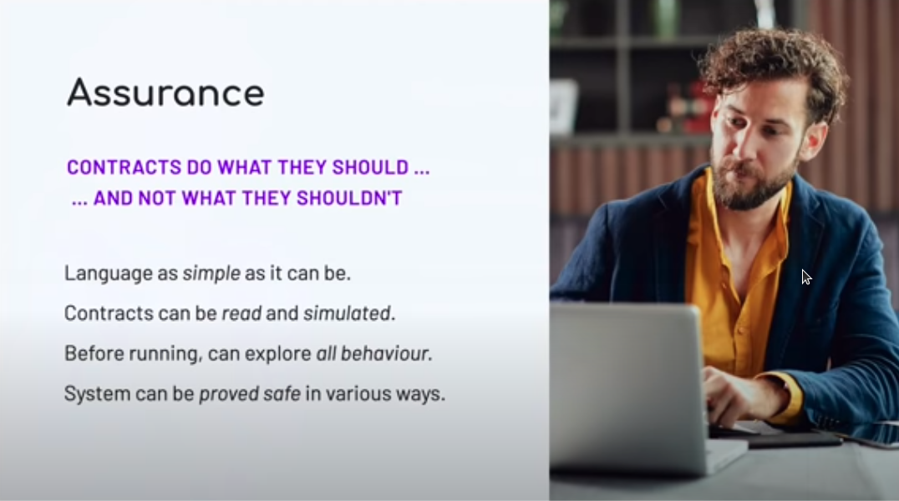

What kind of assurance can we give?
~~~~~~~~~~~~~~~~~~~~~~~~~~~~~~~~~~~

We can give two kinds of assurance. We can make sure that contracts do what they are supposed to do, but we can also make sure that they don't do what they shouldn't. We 
will see both aspects of that as we go along.

We've designed the language to be a simple as possible and the implementation reflects that, and we'll talk a bit about that later on. Contracts are nice and readable, and also
we can easily simulate them, so we can present to users a very clear picture of how their contract in Marlowe will behave.

In fact, we can do more than that. Because they are particularly restricted, we can explore every possible behavior path that a contract can take, before it is executed. So, we 
can give complete guarantees about how a contract will behave, not just on one or two tests, but on every possibly execution sequence.

It's also more straightforward to write mathematical proofs of various kinds of safety, so that is the strongest criteria that we can hit in this kind of world; a mathematical 
proof that the system will do certain things and won't do others.

What does a financial contract do?
~~~~~~~~~~~~~~~~~~~~~~~~~~~~~~~~~~

Let's start by looking at what a financial contract can do. 

A contract can accept payments from participants in the contract.

Depending on choices made by one the participants, it can evolve in different directions. 

.. figure:: img/pic__00011.png

It can make decisions based on external information such as the information coming from a stock exchange. So, information coming from an oracle can determine the future behaviour
of a contract.
 
A contract can also make payments out. If money has been deposited in the contract, that money can be deposited out to participants.

So we have flows of money and choices according to external factors.

One final thing that we have is that the roles in a contract are things that themselves can be owned. We represent that in Marlowe by minting tokens that 
represent those roles. That means that we can use those tokens as evidence that somebody is meant to be playing a role. They are a form of security that a person 
submitting a transaction is allowed to submit that transaction, but also it means that these roles are tradable. A role could be traded by another person or another contract.

Language design
~~~~~~~~~~~~~~~

Now let's think about how to design a language based on these ingredients.

.. figure:: img/pic__00012.png

When we design a language of contracts, what we are really doing is designing a programming language. A smart contract is just a program running on a blockchain.

A contract could, in principle, run forever. And also, more subtly, it could get stuck waiting for an input forever.

It could terminate while holding assets, locking them up forever.

So there's a whole lot of security issues that a program might have.

Designed for safety
+++++++++++++++++++

What we chose to do was to design for safety.

Contracts are finite
____________________

Firstly, contracts are designed to be finite. Their life will be finite, there is no recursion or looping in Marlowe. We will come back to that a bit later on when 
we talk about Marlowe being embedded in other languages.

Contracts will terminate
________________________

We can be sure that contracts will terminate. We do that by putting timeouts on every external action. Every choice, every deposit of money into the contract comes with
a deadline. Marlowe contracts cannot wait forever for somebody to make a choice or for an action to happen. If you hit the timeout then an alternative course is taken.

No assets retained on close
___________________________

We've designed the semantics of the language so that when a contract reaches its close, at the end of its lifetime, any money left in the contract will be 
refunded to participants.

Conservation of value
_____________________

Conservation of value is something that we get for free from the underlying blockchain. The blockchain guarantees that we can't double spend and because we are using 
the transaction mechanisms of the underlying blockchain, we can be sure that we are getting conservation of value.

So this is giving us a lot of guarantees out of the box. These are not guarantees that you get from Plutus contracts in general. A Plutus contract could go on forever, 
it need not terminate and it could terminate while holding a whole collection of assets which then become unreachable.

The Marlowe Language
~~~~~~~~~~~~~~~~~~~~

So what does the language look like? Let's cut to the chase.

.. figure:: img/pic__00013.png

Marlowe, at heart, is represented as a Haskell datatype.

.. code:: haskell

    data Contract = Close
    | Pay Party Payee Value Contract
    | If Observation Contract Contract
    | When [Case Action Contract] Timeout Contract
    | Let ValueId Value Contract
    | Assert Observation Contract
    deriving (Eq,Ord,Show,Read,Generic,Pretty)

We have a *Pay* construct. In that a *Party* in the contract makes a payment to a *Payee* of a particular *Value*, and then the contract continues with what we call the 
continuation contract.

.. code:: haskell

    Pay Party Payee Value Contract
    
We can go in two separate directions. We can observe *If* a particular *Observation* is true or not. If the observation is true we follow the first *Contract*, if it is 
false we follow the second *Contract*.

.. code:: haskell

    If Observation Contract Contract

The most complex construct in Marlowe is the *When* construct. It takes three arguments. The first of those is a list of *Contract*/*Action* pairs - a list of *Case*\s.

.. code:: haskell

    When [Case Action Contract] Timeout Contract

What the *When* construct does is wait for one of a number of *Action*\s. When one of those *Action*\s happens, it performs the corresponding *Contract*. For example, it
could be waiting for a deposit. If we have a case where the first part of the pair is a deposit, then we execute the corresponding second part of the pair. Similarly with 
making a choice or with getting a value from an oracle.

Here we are waiting for external actions and, of course, the contract can't make those actions happen. A contract can't force somebody to make a choice. It can't force
somebody to make a deposit. But what we can do is say that if none of these actions takes place then we will hit the *Timeout*, and when we hit the *Timeout*, we will perform 
the *Contract* represented by the final argument to the *When* construct.

So, we can guarantee that something will happen in the *When* construct, either by one of the actions triggering a successive contract, or we hit the timeout and go to that 
continuation.

Finally we have the *Close* construct which has the semantics defined so that nothing is retained when we close.

That is the Marlowe language, and we will see that we can use these to construct Marlowe contracts in a variety of ways.

The Marlowe Product
~~~~~~~~~~~~~~~~~~~

So that is the language. What is the Marlowe product itself?

We have a suite of things. First we'll look at the overall vision for Marlowe and then look at where we are in terms of fulfilling that vision.

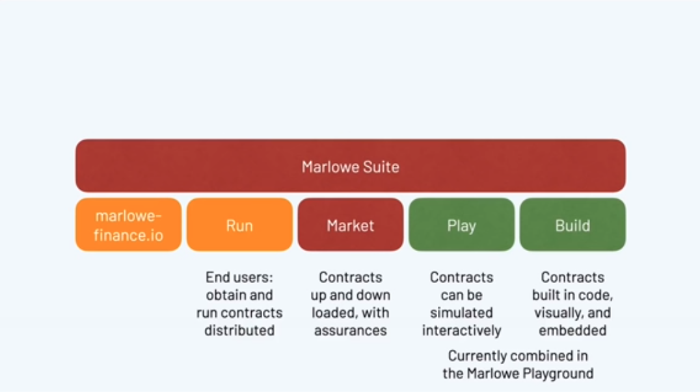

We have a prototype for Marlowe Run. That is the system through which an end user will interact with contracts running on the Cardano blockchain. You can think of Marlowe 
Run as the Marlowe dApp. It's the things that allows Marlowe contracts to be executed.

We're also building a market where contracts can be uploaded, downloaded, and where we can provide various kinds of assurance about those contracts.

We allow contracts to be simulated interactively and we call that Marlowe Play. We allow contracts to be built in various different ways and we call that Marlowe Build. In 
fact fact what we've done at the moment is bundle those two - Marlowe Play and Build - into what we call the Marlowe Playground.

So as things stand at the moment you can use the Marlowe Playground to simulate and construct Marlowe contracts we're in the process of redesigning the user experience
based on what we've done with Marlowe Run.

What we're releasing very shortly is the prototype of Marlowe Run and this is the prototype of how end users will interact with Marlowe on the blockchain. Our 
intention is that we'll have all these products available running on the Cardano blockchain when we have the full support for this which will involve having the
Plutus Application Backend and the wallet back end and so on working as they should.

Demonstration
~~~~~~~~~~~~~

We'll now look at a demo of what we have in Marlowe Run to give you a sense of what we can do at the moment in terms of giving users the 
experience that they will have when Marlowe is running on blockchain. This will be the app that is going to provide that experience.

At the moment it's running locally but in a few weeks' time we will be releasing a version that runs in a distributed fashion on the simulated blockchain.
Then, as we go into the end of the year we expect to have it running for real on the Cardano blockchain itself.

You can find the Marlowe Playground at

.. code::

    https://staging.marlowe-dash.iohkdev.io/

.. figure:: img/pic__00023.png

Marlowe run runs in the browser and what it does is provide the end user interaction with contracts running on the blockchain.

For the moment we're simulating that blockchain inside the browser but eventually this will be the tool you'll use to run contracts for real on Cardano.

To interact with the contract your wallet needs to be involved to control your your signature and to control your assets, so we link up Marlowe to run with
a wallet. Let's link it up with Shruti's wallet. You can do this by creating a demo wallet, or by selecting an existing wallet.

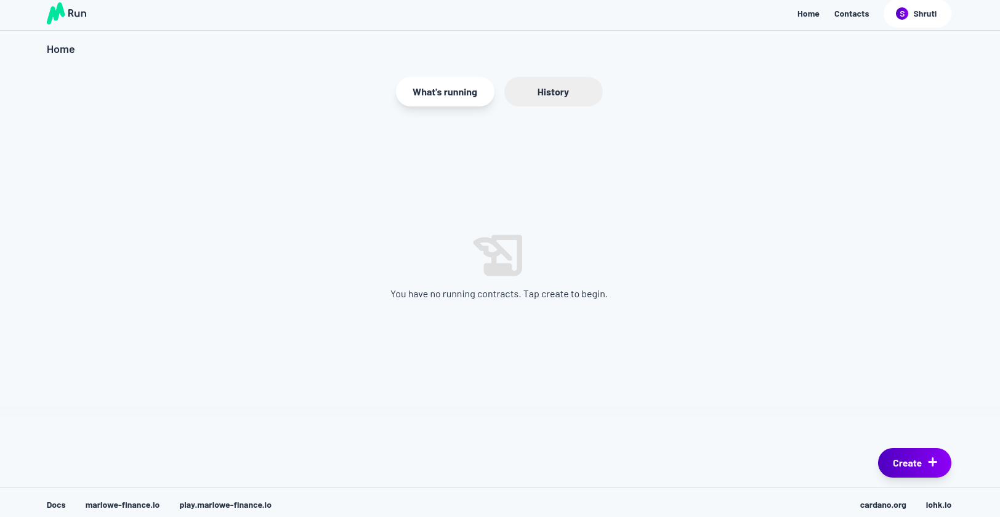

In this window we see the world from Shruti's perspective. Let's open up another window and link that window to the world from Charles's perspective.

.. figure:: img/pic__00028.png

At the moment neither of them has any contracts running. They have a blank space, but let's start a contract up. Let's set up a zero coupon bond which is a fancy name
for a loan. You can do this by clicking *Create* and selecting the *Zero Coupon Bond* option.

Let's suppose that Shruti is making a loan to Charles. She's the investor he's the issuer of the bond.

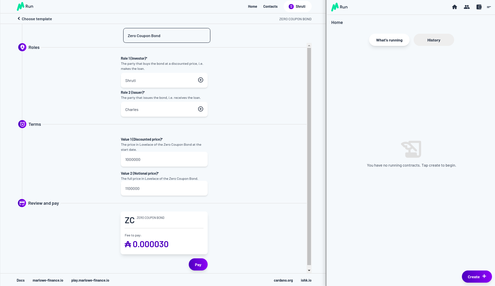

Charles wants to borrow one Ada from Shruti and he's promised to pay back 1.1 Ada. So we've said who the issuer and investor are we said what the price and
the eventual value will be and we're now going to create the contract. In order to do that we have to make a payment of 30 lovelace to get the contract started.

.. figure:: img/pic__00035.png

So let's pay. We are asked to approve and the payment goes through. You can see now in Shruti's Marlowe Run we've got the Zero Coupon Bond running, but also,
if you look at Charles's view of the world, it's running there too for him.

.. figure:: img/pic__00037.png

We're at the first step. If we click through on Charles's contract, it's saying that it's waiting for something from the investor, who is Shruti. 

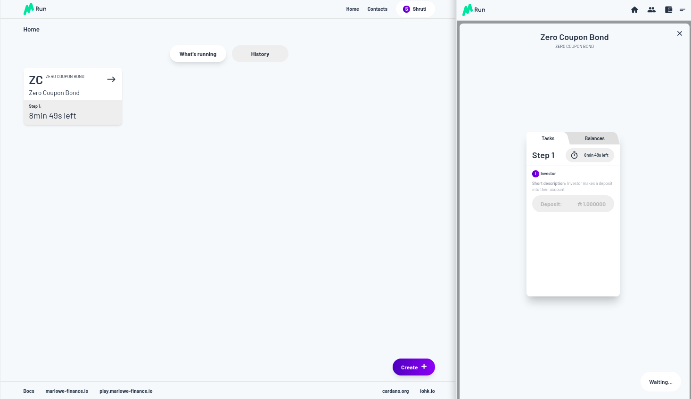

So let's see what's happening in her view.

.. figure:: img/pic__00039.png

She's being asked to make a deposit so let's click on that to make the deposit.

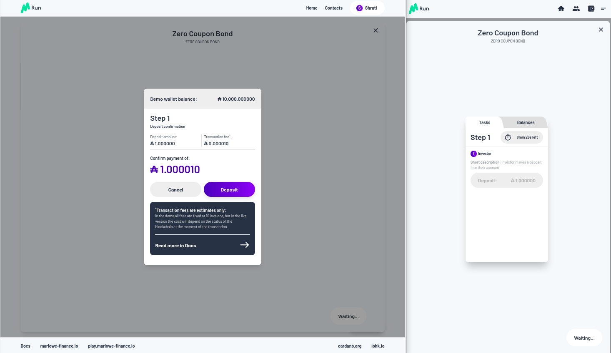

And click to confirm with a fee of 10 lovelace.

Then you can see her view has changed now she's waiting for the issuer to pay her back.

We look in Charles's view, which is incidentally the mobile view, of Marlowe Run, and he's asked to pay his 1 Ada.

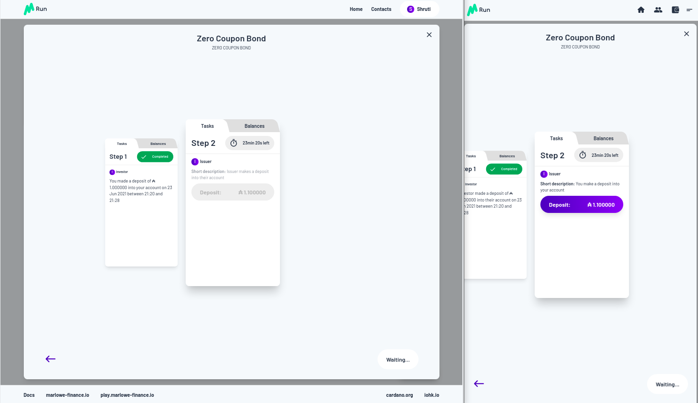

Let's make him do that now. He'll also have to pay a 10 lovelace transaction fee. 

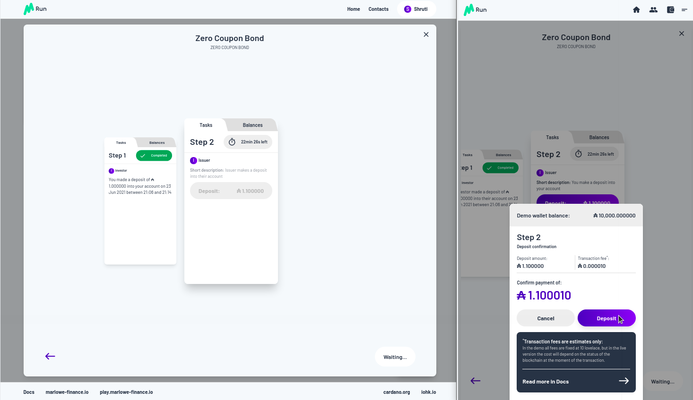

Let's make that deposit.

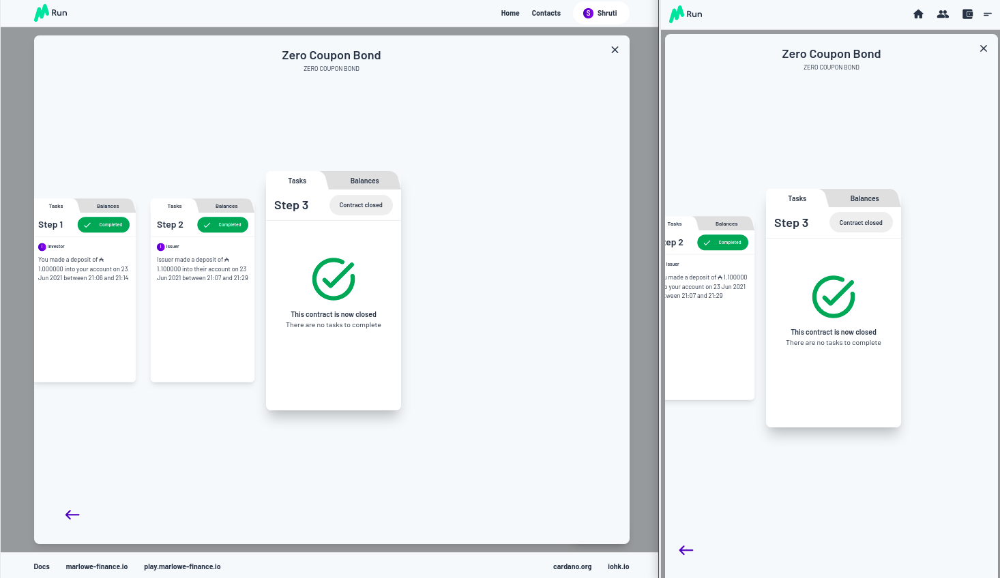

And you see now from both their perspectives that loan is completed you can see the history of what's gone on. You can see, at particular points, the
balances that the contract holds.

If we close that and select *History*, we can see the history of all the contracts that Shruti has taken part in.

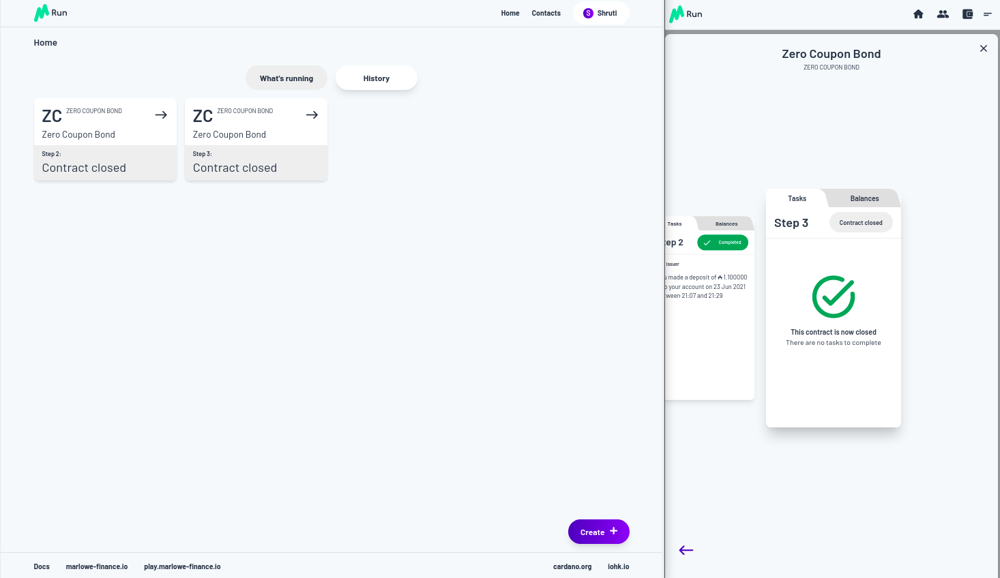

That pretty much covers the basics of what you get from Marlowe Run. It's an intuitive interface to a contract running on the blockchain.
You see that each participant in the contract gets their view of the contract in real time, updated from what is, in this case in the browser, but
eventually what's on the blockchain.

Engineering
~~~~~~~~~~~

Let's now take a look under the hood and see how Marlowe will be executed on Cardano.

Here's a diagram just to give you the context. You'll understand most parts of this diagram already. We a Cardano root node on which Plutus is running, and as you
know, Plutus is a dialect of haskell, more or less.

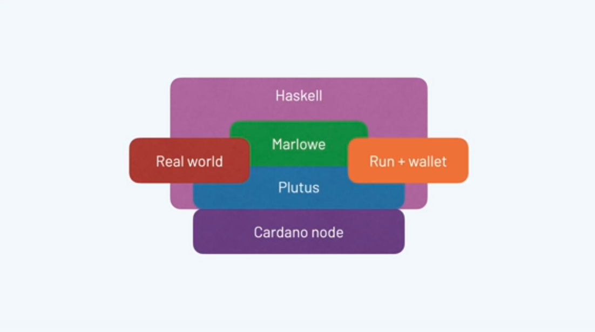

Marlowe is embedded in Haskell and Marlowe is executed using Plutus. So Marlowe sits on top of Plutus, but it's also linked to Marlowe Run and has
an attachment to a wallet you'll be able to interact with as an end user with a running Marlowe contract.

Also it gets linked to Oracles and so on sitting out there in the real world.

Now, what does it mean to to execute a Marlowe contract?

.. figure:: img/pic__00044.png

Again this will be familiar to you from Plutus but let's just talk through precisely how it works.

Executing a Marlowe contract will produce a series of transactions on the blockchain. Obviously Plutus running on Cardano
checks the validity of transactions. We have a validation function. 

The validation function for these Marlowe transactions is essentially a Marlowe interpreter. It checks that the transactions indeed conform
to the steps of the Marlowe contract. That's done using the (E)UTxO model, so we pass the current state of the contract and some other information through as 
datum.

The Marlowe interpreter uses that to ensure that the the transactions that are submitted meet the criteria for the particular Marlowe contract.

So that's the on chain part. 

.. figure:: img/pic__00047.png

Obviously off chain there's a component as well. So we have to have Marlowe Run and we'll have to build the transactions that meet the
the validation step on chain.

And, if and when the contract requires crypto assets it will have off chain code to ensure that transactions are appropriately signed so that we will have authorization
for spending crypto assets.

Using Marlowe run and an associated wallet, we construct the transactions.

We get a flow of information in both directions. Marlowe run will submit transactions to the blockchain that then can be validated by the Marlowe interpreter, which
is itself a Plutus contract. It's one of the largest Plutus contracts that exists.

But there's also information flow another way because suppose that the transaction I've submitted is a deposit of money into a running contract, and suppose the 
contract also involves Charles Hoskinson, so my instance of Marlowe Run has submitted that transaction, but Charles also has to be notified about that.

The information flows in the other direction using the companion contract to ensure that every instance of Marlowe Run gets informed about activity in that contract.

Alex will talk some more about the details of the implementation but here you're seeing an outline of how it all how it all works.

Transactions are validated on chain through the interpreter, but they have to be built off chain and in some cases have to be authorized. Essentially the blockchain is
the central synchronization point for the distributed system that is the collection of instances of Marlowe Run that are interacting to execute the contract/

You saw in the demo that, in two separate windows, we were sharing information. That was simulating it locally but in production this will be information that's stored
on the blockchain.

System Design 
~~~~~~~~~~~~~

Let's talk a little bit about how the system is designed in in a high-level way.

Here's a piece of the semantics of Marlowe, and as you can see it's a Haskell function.

.. figure:: img/pic__00047.png

We take an environment, the current state and a contract we executed, and based on what contract that is - a *close* perhaps, or a *pay*, we can reduce we can take 
some steps of computing the results of that contract.

We do that in a way that uses uses Haskell in a quite straightforward way to advance the contract. This specification in Haskell is
an executable specification of the semantics and this gives us some very nice consequences.

.. figure:: img/pic__00048.png

We've got al we've got a high level description of what the semantics are, and we're doing that through something that is effectively an interpreter. So
we're defining at a high level this interpreter in Haskell for Marlowe contracts.

One really nice thing about writing it in this sort of way is that we can be sure we cover all cases because it's a it will be obvious if we're missing some
cases. Writing it as an interpreter ensures that we will hit cases we need to in describing the semantics.

Also it really helps us to understand the semantics. When you're designing a language you have an abstract idea about what it's going to mean, but there's
nothing like having a an implementation of it so you can actually run the semantics.

What would it mean if we were to add this construct? What would it mean if we were to modify the semantics in this way?

If we'd written it in a purely purely logical format, it's difficult to unscramble just from the rules as they're laid out what, precisely, a change in rule
might mean.

.. figure:: img/pic__00049.png

What's even nicer is that we can reuse the semantics in a number of different ways.

In the theorem prover Isabelle, we can use the semantics for reasoning and proof and we use pretty much the same semantics because Isabelle uses a functional
language as is as its subject.

.. figure:: img/pic__00050.png

We can run the semantics in Plutus. Plutus is more or less Haskell, perhaps not with all the libraries, but we can, in principle at least, build our 
implementation on blockchain from our semantics, and also we can translate the semantics into PureScript for simulation in the browser.

.. figure:: img/pic__00051.png

Now pure script is not the same exactly the same as Haskell. Isabelle's language is not exactly the same as Haskell. How can we be sure that all these
versions are the same?

One way of doing it is to extract Haskell code from Isabelle and test the original against um this extracted code. We do that on random contracts and that gives 
us a pretty high level of assurance that the two are the same.

Down down the line in our road map we certainly expect to be using a Haskell and Javascript implementation at some point to replace PureScript in the front end 
so we don't have to write a PureScript version of the semantics when we're doing the off chain interpretation building the transactions to be submitted. We can 
use the real haskell implementation by compiling it into Javascript and running that in Marlowe Run in the client code.

So, building the language in Haskell means that though we use various different versions of the semantics, we can get a high level of
assurance that these are the same and indeed we can in some situations replace things like the PureScript by Javascript.

Usability
~~~~~~~~~

That gives us a picture about how how the system is put together. Let's go to another aspect of Marlowe. We we talked about it being a special purpose
language, and that being a DSL promoted usability.

Let's say a bit more about that.

.. figure:: img/pic__00053.png

One way we we promote usability is that we provide different ways of writing contracts. Another way we promote usability is to allow people to explore interactively
how contracts behave before they're actually run in the simulation.

So let's talk about those now.

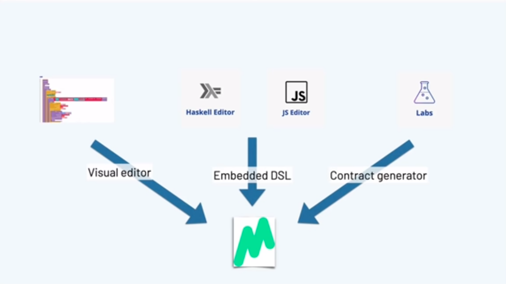

We want to write a Marlowe contract, how can we do it? Well, we can write Haskell using the Marlowe data type as text. That's one way we can do it and
that's fine. We have an editor for that inside the playground that supports code completion and will make suggestions and and so on.

So we can build the contracts as pure Marlowe, but there are other routes as well.

We have a visual editor for Marlowe so that you can produce Marlowe contracts visually, putting together blocks in a way that doesn't require you
to be a confident programmer. You can start off by using the visual version as a way of learning to engage with Marlowe if you are a coder. 

Marlowe is embedded in Haskell and in Javascript so we can use facilities like recursion to describe Marlowe contracts. We can say, in Haskell, let's do this particular pattern of
behavior a certain number of times. We can write that in Haskell and then for a particular contract we convert the Haskell into Marlowe, and we can also do that for
Javascript.

Finally, something we're not going to talk about anymore in this talk is that we can generate contracts from initial conditions. We've been
looking at that for the actor standard of financial contracts. On the basis of the contract terms we generate code in Marlowe. We write functions 
whose output is Marlowe code. 

We provide users with a variety of different approaches, leveraging knowledge of Javascript, for example, or leveraging a non-code-based approach for 
describing the contracts

We also allow people to simulate the behavior of contracts. This is something that you can see in the current version of the Marlowe Playground.

.. figure:: img/pic__00055.png

That's something you can play with yourselves. We are looking at different ways of describing the results of a simulation. So at the moment we have a transaction
log. We are allowed to choose an next action to perform, you can undo the last step to take you back and then try another path so you can step interactively 
backwards and forwards through the source code through the application of the contract.

What we're looking at is changing the user interface Marlowe Playground so that we'll use something rather more like the Marlowe Run run description of a running contract.

.. figure:: img/pic__00056.png

Assurance 
~~~~~~~~~

We've talked about usability. What about the sort of assurance that Marlowe can give users?

.. figure:: img/pic__00057.png

We've seen we've seen that making the system transparent, that making code readable is itself an advantage. We've seen that there's simulation to
give people to validate their intuition about a contract.

But rather more formally we can use the power of logic to do two things for us. We can do what's called *static analysis* so we can automatically verify
properties of individual contracts. That means we can guarantee this contract will behave as it should, checking every route through the contract.

Also we can do machine-supported proof so, not automatic any longer, written by a user, but we can prove properties of the overall system.

Static Analysis 
+++++++++++++++

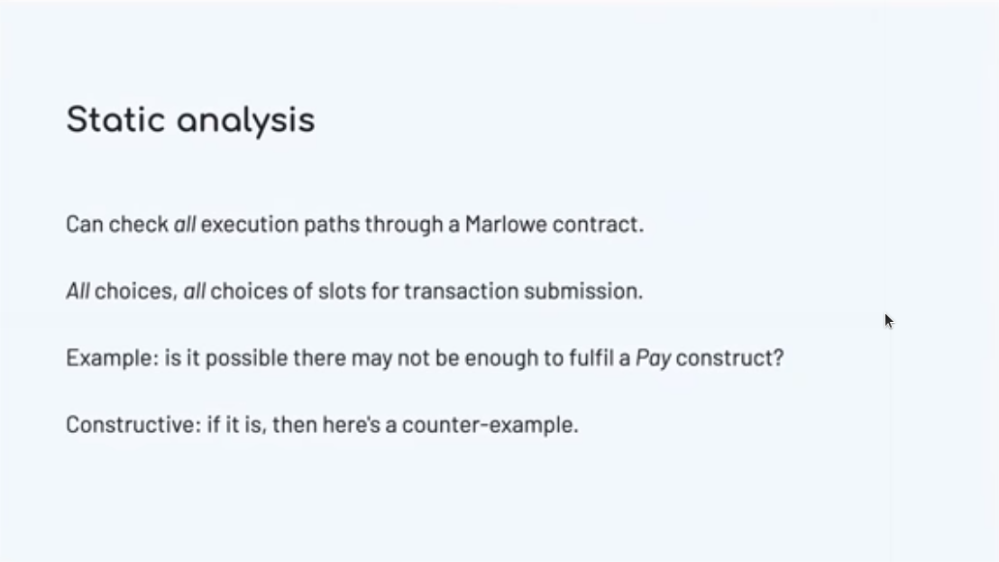

What static analysis allows us to do is check all execution paths through a Marlowe contract. All choices, all choices of slots for a submission of a transaction so
we examine every possible way in which the contract might be executed.

The canonical example here is the example of whether a pay construct might fail. Is it possible a pay construct could fail? The answer is that we
will use what's called an SMT solver An SMT is an automatic logic tool - the one we use is called Z3, although others are available. The SMT solver effectively 
checks all execution parts.

If a property is is satisfied that's fine, we get get the result. If it's not satisfied, we get a counter example. We get told that there's a way 
through this contract that leads to a failed payment - a payment that can't be fulfilled. So it gives an example of how it can go wrong, and that's really 
helpful. It means that if you really want to make sure that a failed payment can't happen, then this gives you a mechanism to understand
and to debug how that eventuality can happen, and so gives you a chance to think about how to avoid it.

So, very powerful and entirely push button. You push a button and you get the results.

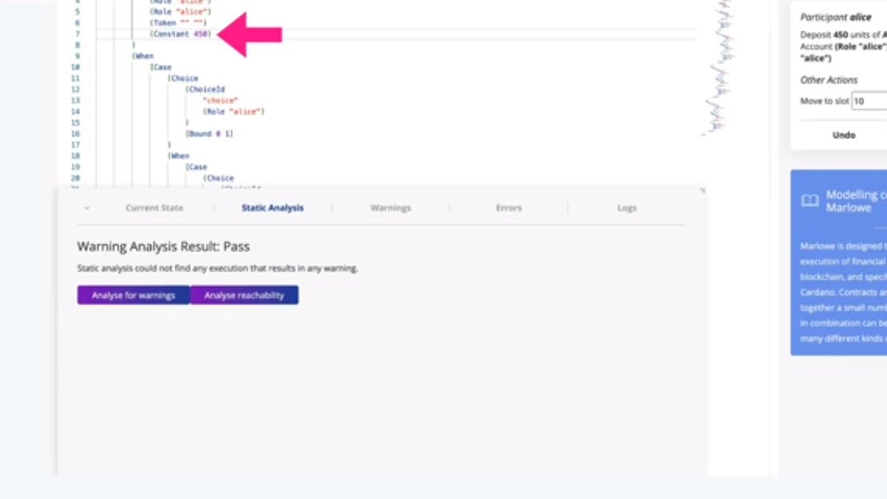

Here you see a fragment of a Marlowe contract. It's an escrow contract where the contract starts with a deposit of 450 lovelace.

Checking the analysis in the playground, we've got the results. Static analysis could not find any any execution that results in any warning, so that's saying
that you're okay - it's not going to give you a warning whatever you do.

But if we change that deposit of 450 lovelace to a deposit of 40 and analyze we then get this warning.

.. figure:: img/pic__00060.png

We get a transaction partial payment. We're told that we get to a payment where we're meant to pay 450 units of lovelace but there are only 40 available, and we
get given a list of transactions that take us there.

So we're able to see from that how we got to that point, and the problem is that we didn't put enough money in and then we reached a place where we needed to make a
payment of 450 lovelace.

So it's easy for us to see that we need to either make the payment smaller or make the initial deposit bigger. As it's entirely push button, we get that sort of assurance for free, as it were.

.. figure:: img/pic__00061.png

But thinking about verification, we can do rather more than that. We can prove properties of the system once and for all.

So, for example, we can prove from the semantics that accounts inside a Marlowe contract never go negative. You can't ever overdraw an account in a Marlowe contract.

We can also prove this theorem of money preservation. We can prove that if we look at all the money that's gone into the contract so far, that's equal to the sum of 
two things - the amount of money that's held inside the contract plus the amount of money that has been paid out. That gives a clear picture of money preservation.

We're also able to to prove other more technical things about the system. For example, that a *Close* construct will never produce any warnings. So, if we're 
analyzing for warnings, we don't need to worry about *Close* constructs. That allows us to optimize the static analysis.

We're also able to prove that the static analysis, which makes a number of simplifications to speed
things up, is sound and complete. That means the static analysis will give us an error warning when the real contract can generate an error warning and 
it won't give us an error warning if the real contract can't do that.

One thing that we haven't done but is on our road map is to do these sorts of proofs for individual contracts or individual contract templates. Things that we 
can't necessarily prove with static analysis, we can prove by proving them by hand.

The system is amenable to having these proofs written about it, and they give us the highest level of assurance about how it works.

We've said enough for the moment about Marlowe. Where can you go to find out more?

.. figure:: img/pic__00062.png

There's a Marlowe GitHub repository that has the semantics and the basics about Marlowe. 

.. code::

    https://github.com/input-output-hk/marlowe

Quite a lot of the implementation of the tools from Marlowe is in the Plutus repository because it has that repository as a dependency.

If you look in the `IOHK online research library <https://iohk.io/en/research/library/>`_ and search for Marlowe you'll find a number of research papers we've written about how the system works.

You'll also find an online tutorial in the Marlowe Playground.

Finally, Alex is going to give some more information in his presentation coming up next.

Summary
~~~~~~~

.. figure:: img/pic__00063.png

Just to summarize, what we have in Marlowe is a DSL, a special-purpose language for financial contracts, running on top of Plutus. Because it's a
DSL it allows us to give assurance that is harder to give for a general purpose language. And we get assurance of they way contracts should and shouldn't behave.

It also allows us to to orient its design around users as well as developers. The language is simple and therefore we get readability. 

We also get simulatability and we get these stronger assurances of static analysis and verification.

Lecture by Alex Nemish
----------------------

Alex Nemish is one of the Marlowe developers and in this presentation, he shows us a bit of Marlowe semantics and Marlowe PAB (Plutus Application Backend) contracts.

We'll start with a brief description of Marlowe Semantics that's implemented in the `Semantics.hs <https://github.com/input-output-hk/marlowe/blob/master/semantics-2.0/Semantics.hs>`_ file.
Then we'll look at the PAB contracts.

Here are the main data types for Marlowe.

.. figure:: img/pic__00065.png

It's a contract. Essentially those are six constructors that you can start to model a contract with and here's the state that is going to be stored on a blockchain.

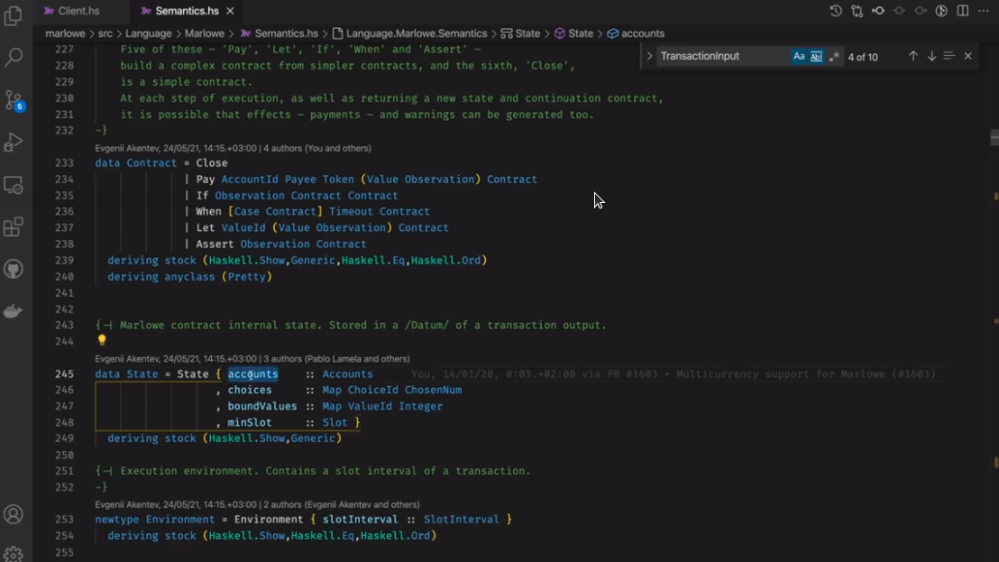

So we have a state of balances of accounts by party, we have a map of choices, we have bound values which come from the *Let* constructor, and a *minSlot* which is
the first slot that the contract sees.

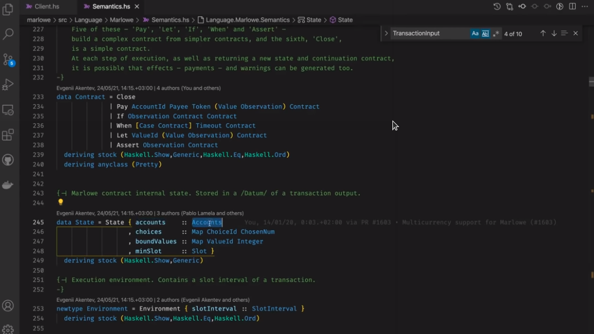

The *Input* data type essentially contains actions for a Marlowe contract. It is either a deposit, a choice, or a notification.

.. figure:: img/pic__00068.png

Here is the *TransactionInput* datatype. This is what we give as an input. Every transaction has a defined slot interval and a list of inputs.

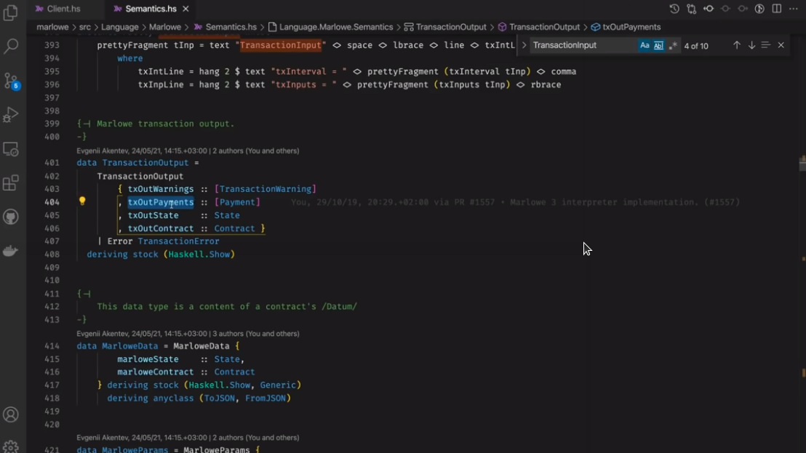

And we have *TransactionOutput* which contains the payments that we expect to happen, the output state and the output contract.

We also see *MarloweData* which is essentially what is going to be stored on the blockchain. It's the current state of a contract as well as the actual contract.

.. figure:: img/pic__00073.png

The entrance to the semantics is the *computeTransaction* function. It gets the transaction input, the current state and the current contract and returns the 
transaction output.

First of all we check the slot interval for errors. For example, we do not allow the slot interval to contain any timeouts. If you have a contract with a *When* construct
of 10, you cannot produce a contract with a slot interval of 5..15 because it will contain a timeout.

Then we apply all inputs and if this is successful we return the transaction output with any warnings we have found, the payments we expect, the new state and the continuation 
contract.

.. figure:: img/pic__00073.png

So what happens in *applyAllInputs*?

First of all, it's a loop. It uses the *reduceContractUntilQuiescent* function which reduces the contract until it reaches a quiescent state. Once we reach a quiescent state, we take the first input and try to apply it, and then 
continue with the loop, until we get an empty input list. Then we return the current state and the continuation contract.

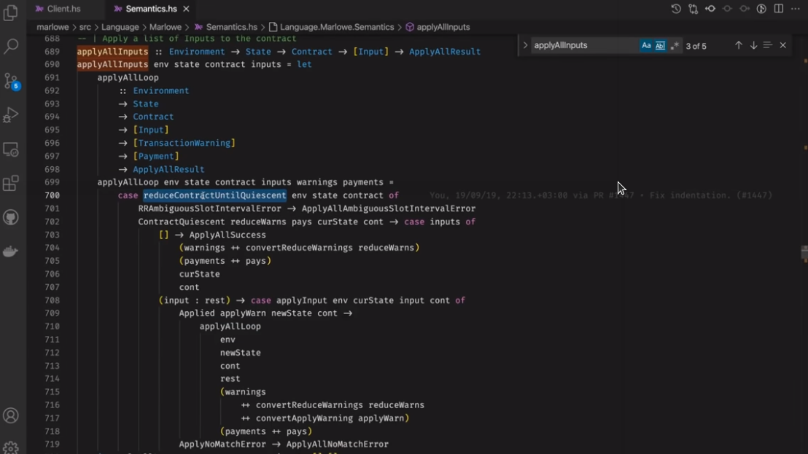

The *reduceContractUntilQuiescent* function goes through a loop and tries to apply *reduceContractStep* which essentially evaluates a contract.

.. figure:: img/pic__00075.png

If we get a *Close* then we are in a quiescent state. If we get a payment, then we evaluate it, update the balances and then return the reduced contract.

.. figure:: img/pic__00076.png

We do the same for *If*, *Let* and *Assert*. But for *When*, we only evaluate it if it's timed out, otherwise we say that it's not reduced, and that the contract is
quiescent.

In a nutshell, Marlowe contract evaluation consists of two steps.

* We reduce the contract until it is quiescent - it's either closed or we get to a *When* that's not timed out yet.
* We try to apply inputs and evaluate the contract further.

Let's see how it works from the client side.

As you may have noticed, the Marlowe semantics code is quite abstract and it doesn't depend on the Cardano system's actions. So let's take a look at the actual Marlowe
validator that's being executed on-chain.

.. figure:: img/pic__00078.png

Here's the *scriptInstance* which calls the *mkMarloweValidator* code, which in turn calls *mkValidator*, which uses a state machine library function *mkStateMachine* to
which is provides two functions - a transition function and a finality check.

The finality check is very simple - we just check the the contract contract is constructed with *Close*.

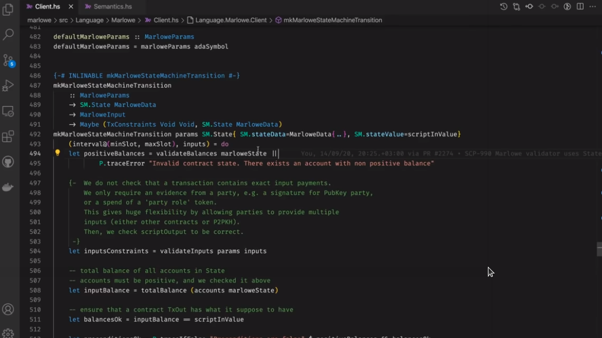

The transition function is the meat of the validator.

It takes *MarloweParams* - which we'll talk about later, it takes the state of the state machine *MarloweData*, it takes *MarloweInput* which is essentially transaction 
input expressed in Cardano types. It will then return either *Nothing* in the case of error, or a new state along with zero or more constraints.

We check that the balances are valid - we require balances to be positive.

Then we create input constraints based on the inputs. So, in the case of deposits we expect that money will go into a contract. In the case of choices, we expect witnesses
of the respective parties. We calculate that the contract contains the correct balance.

.. figure:: img/pic__00081.png

We construct a *TransactionInput* given the slot interval and list of inputs, and we call the *computeTransaction* function that we saw in *semantics.hs*.

.. figure:: img/pic__00082.png

With the computed result we construct a *MarloweData* with a new contract continuation and updated state. We produce output constraints that produce payouts to the 
respective parties, and we calculate the new balance. Then we combine all the constraints with range validation.

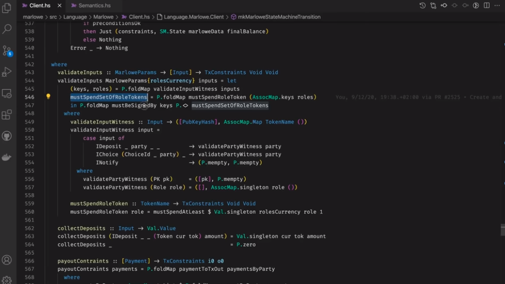

To validate inputs, we check that the required signatures and role tokens are present.

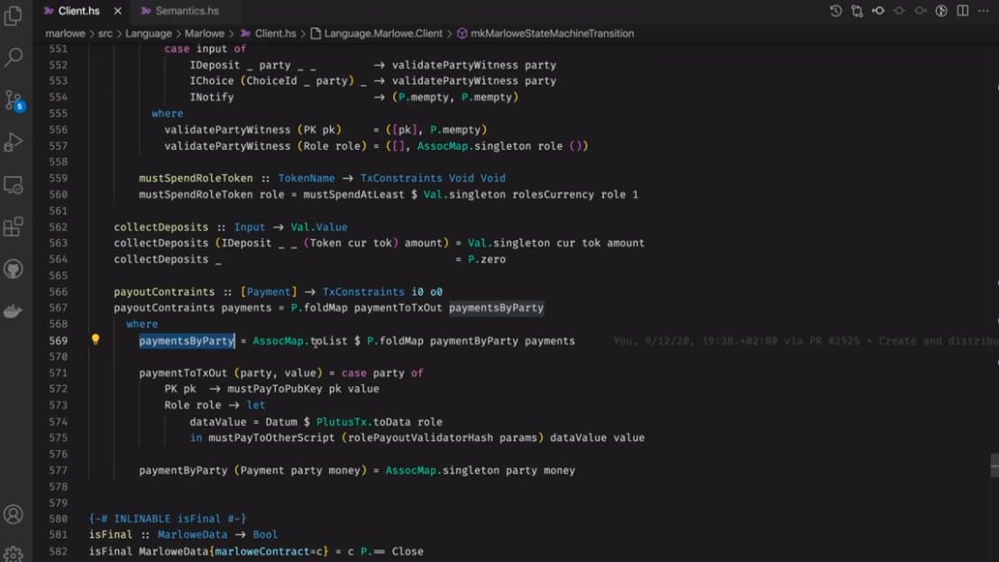

Payments to parties go either to a public key, or go to the validator *rolePayoutValidatorHash*, which simply checks, given a currency, that a transaction spends a role token.

For off-chain execution, we provide three Marlowe PAB contracts.

* Marlowe Follower Contract
* Marlowe Control Contract
* Marlowe Companion Contract

Follower Contract
~~~~~~~~~~~~~~~~~

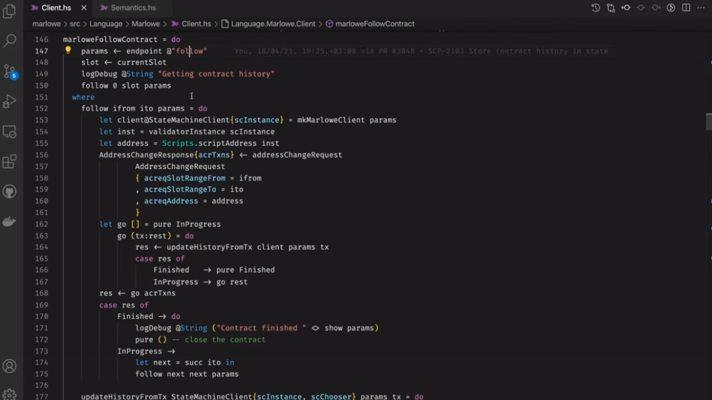

This is a very simple one - it contains only one endpoint called *follow*. It subscribes to all changes to a Marlowe contract validator address, so that we can store 
all the inputs that are applied to a Marlowe contract.

It uses the *updateHistoryFromTx* function which, in a nutshell, finds a Marlowe input and constructs a *TransactionInput* data type, and uses *tell* to update the PAB
contract state.

If you were connected to a web socket for this contract, you would be notified about transition changes.

.. figure:: img/pic__00087.png

The state of the contract is stored in *ContractHistory*, which stores an initial *MarloweParams*, an initial *MarloweData* and a list of all *TransactionInput*\s that 
were applied to this contract. You can always restore the current state by applying a list of inputs to an initial state.

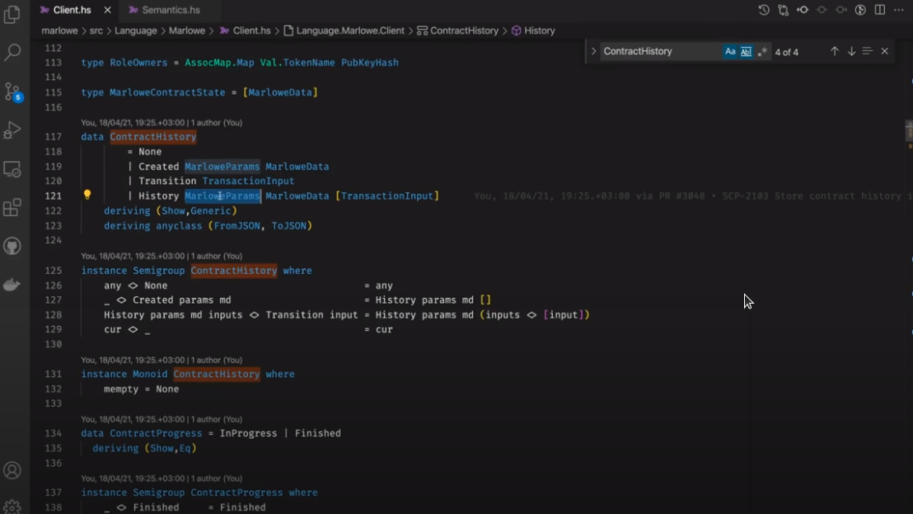

Control Contract
~~~~~~~~~~~~~~~~~

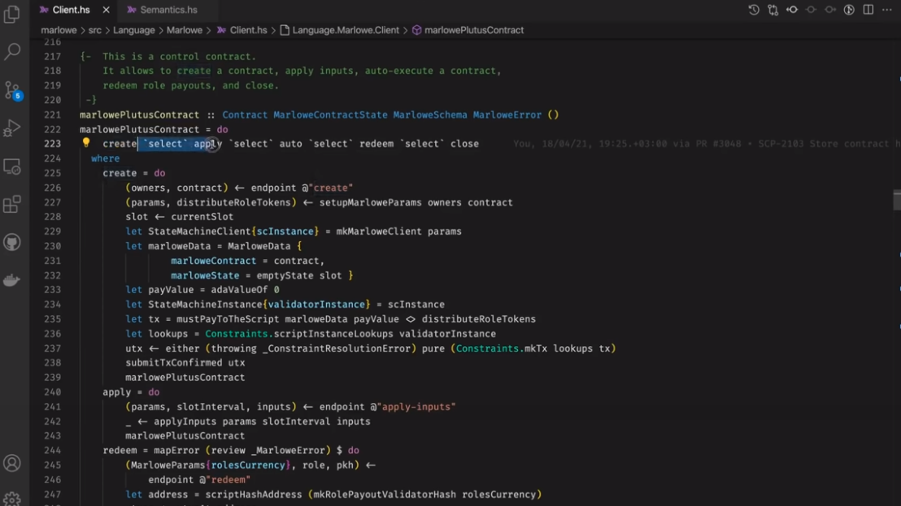

The *marlowePlutusContract* is a control contract. It allows you to create an instance of a Marlowe contract, apply inputs to the instance, to auto-execute the contract, 
if possible, to redeem tokens from payments to roles, and to close the contract.

Let's go through Marlowe contract creation.

Create Endpoint
+++++++++++++++

When you call the *create* endpoint, you provide a contract and a map of roles to public keys. We then setup a *MarloweParams*.

.. figure:: img/pic__00090.png

*MarloweParams* is a way to parameterise a Marlowe contract. You can specify your own role payout validator by providing its hash. There is a default one that checks that 
the role token is spent within the transaction but you can do whatever you like.

When your contract uses roles, we need to know the currency symbol for the role. When the contract uses roles, we need to create role tokens and distribute them to their
owners.

In the *setupMarloweParams* function we get the roles that are used within the contract. If we have owners for these roles, we create tokens with role names. By default we
create one token per role. We use the *Contract.forgeContract* function to create the tokens and then assign them to the creator. Then, in the same transaction, we
distribute the role tokens to their owners.

Next in the control contract, we use the state machine library to create a state machine client and submit the transaction.

Apply Endpoint
++++++++++++++

The *apply* endpoint is very simple. We call the *applyInputs* function.

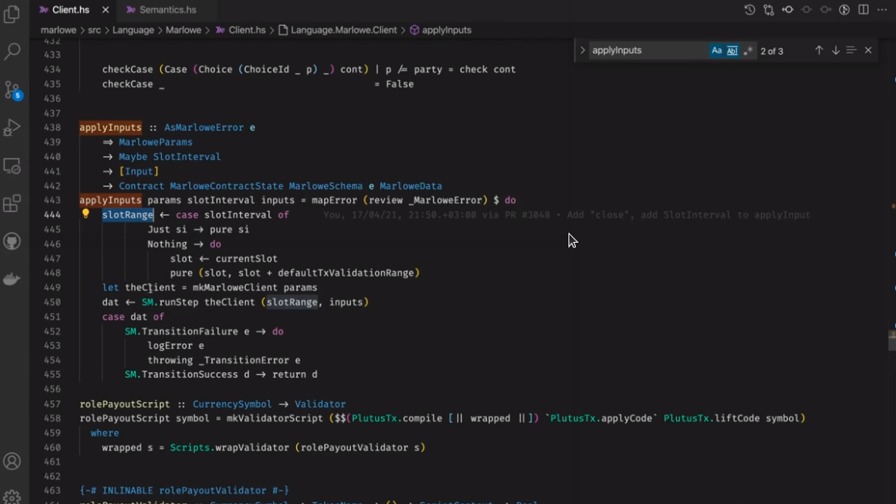

We construct a slot range and we use the *runStep* function which takes a slot range and a list of inputs.

Redeem Endpoint
+++++++++++++++

The *redeem* endpoint allows you to get money that has been paid to a role payout script. 

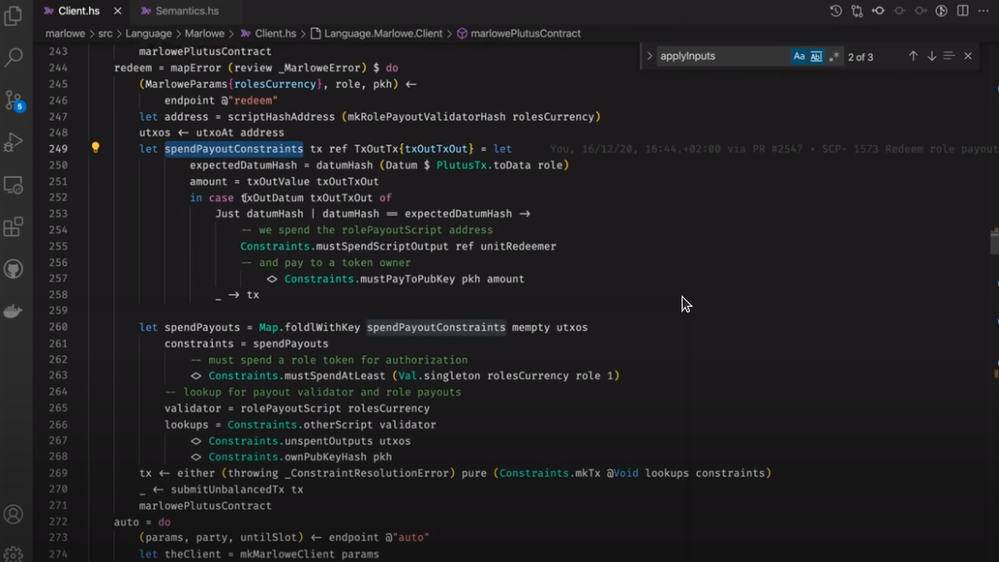

We get the address of the script and then send all the outputs to the token owner.

Auto Endpoint
+++++++++++++

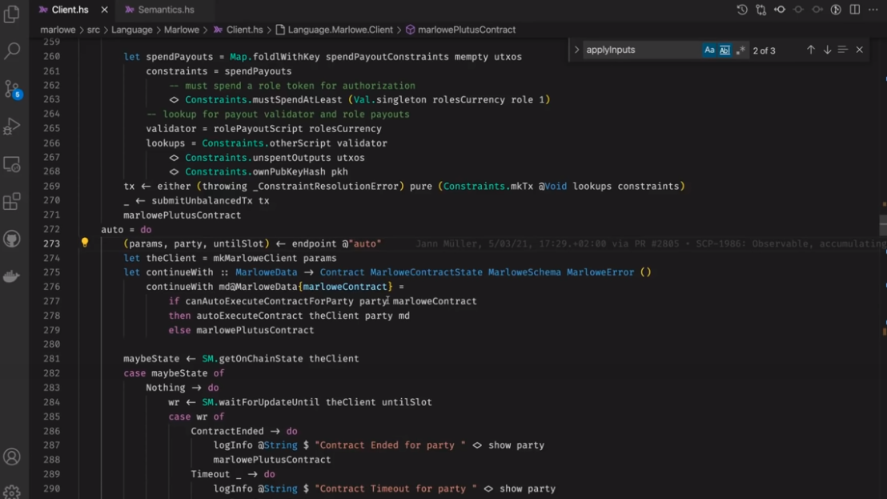

The *auto* endpoint is quite interesting and quite complicated. There is a set of contracts that can be executed automatically.

Imagine a contract that contains only deposits and payouts. No participant needs to provide choices or any interactive stuff. There are only scheduled payments. Such a 
contract can be executed automatically, and the *auto* endpoint allows exactly that.

So, if a contract can be executed automatically, it calls *autoExecuteContract*.

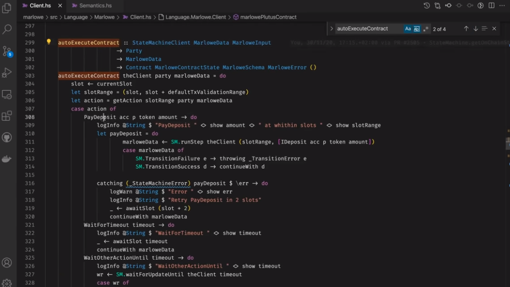

This is a state machine that pays a deposit or waits for other parties to do their part.

Companion Contract
~~~~~~~~~~~~~~~~~~

The last interesting contract is the Marlowe Companion Contract.

.. figure:: img/pic__00097.png

This is a contract that monitors a participant wallet and notifies when a role token arrives.

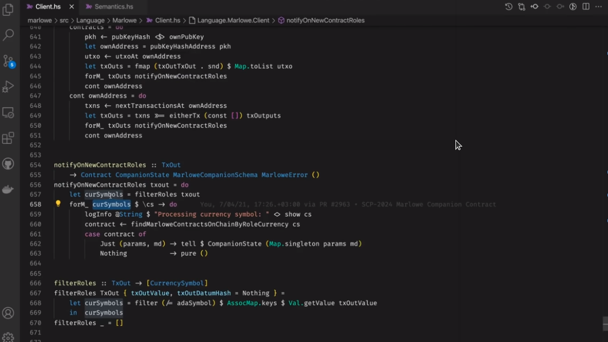

It listens to transactions that go to your own address and if there is a token and this token is generated by Marlowe contract creation, it tries to find the Marlowe
contract and, if it succeeds, it updates the state of the contract. If you are subscribed to the contract's web socket, you will get a notification about a role
token, and you'll get a map of *MarloweParams* to *MarloweData*.

.. figure:: img/pic__00099.png

Playing in the Playground
-------------------------

Let's play around a little with Marlowe in the playground.

When you go to the playground, you first get presented with three options for you to choose in which language you want to write your Marlowe contracts.

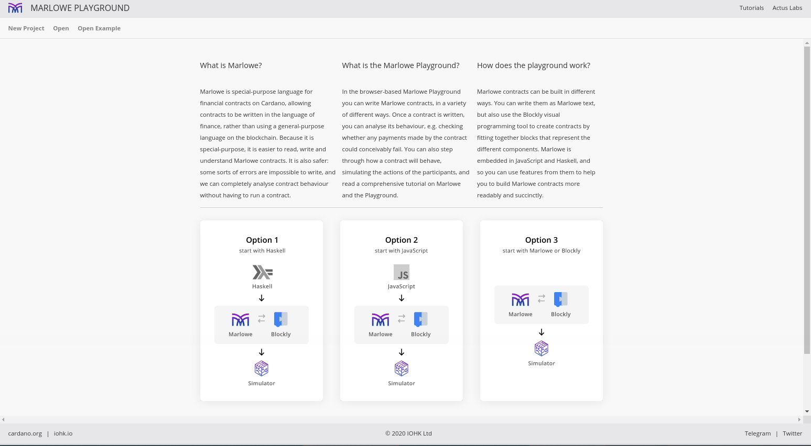

You can do it in Haskell, you can do it in Javascript, or you can do it in Blockly or directly in Marlowe.

Blockly is very nice and you don't need any programming experience to do this.

Blockly
~~~~~~~

Let's start a new project and select *Blockly*.

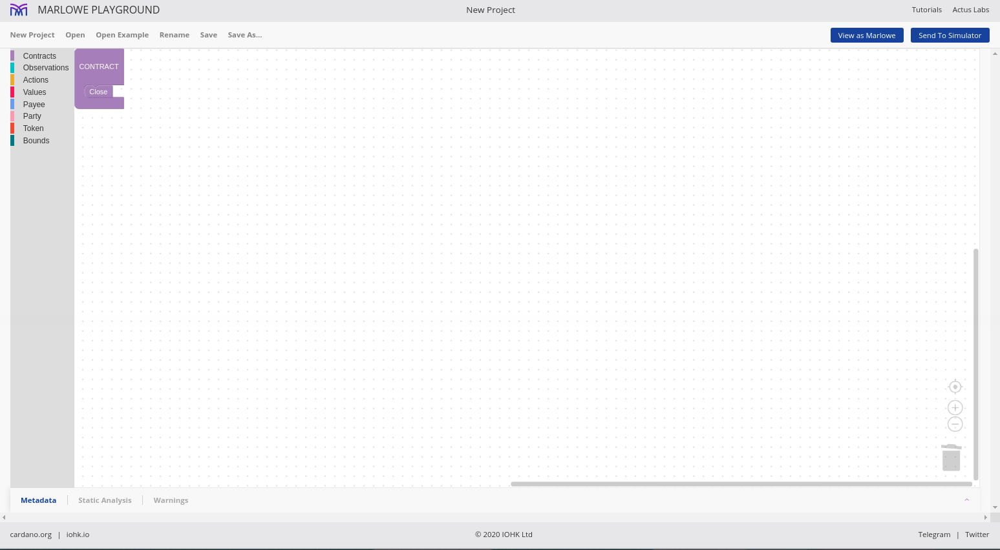

This is a graphical editor. We can just click and drop a Marlowe contract together.

As an example let's write a contract where there are three parties - Alice, Bob and Charlie.

The idea is that Alice and Bob deposit an amount of Ada into the contract, let's say 10 Ada, and then Charlie decides whether Alice or Bob
gets the total amount. Depending on Charlie's decision either Alice gets 20 or Bob gets 20.

There's always the possibility that one of the three doesn't play along; Alice doesn't make her deposit, Bob doesn't make his deposit, or Charlie doesn't make his
choice. In this case everybody should just get reimbursed.

When we start with Blockly, there is a contract and it's just a *Close* contract, which in this case doesn't do anything. If there was money in internal accounts 
it would pay back the money to the owners of the accounts.

We want to do something else, so let's first wait for a deposit by Alice.

Because that's an external action that's triggered by one of the parties, in this case Alice, we need the *When* construct that Simon mentioned.

.. figure:: img/pic__00103.png

We can remove the *Close* contract, slide the *When* one into its place.

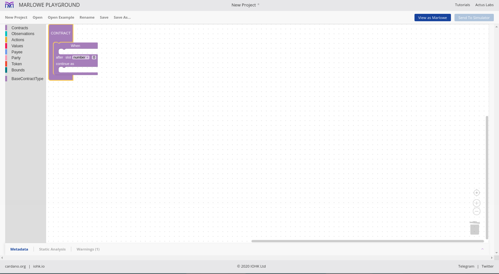

Here we see all the slots where other things need to go. We see some fields that we have to set.

We can set a timeout so let's say this deposit by Alice has to happen by slot 10.

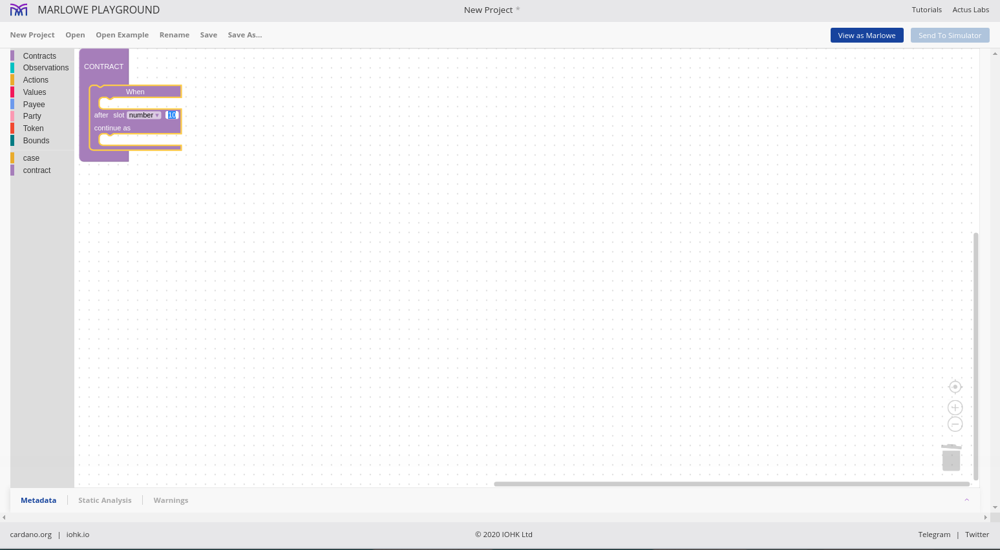

If it doesn't happen, we can say what should happen afterwards, and there is not really a good choice to do anything except close in that case, so in that case
nothing will happen.

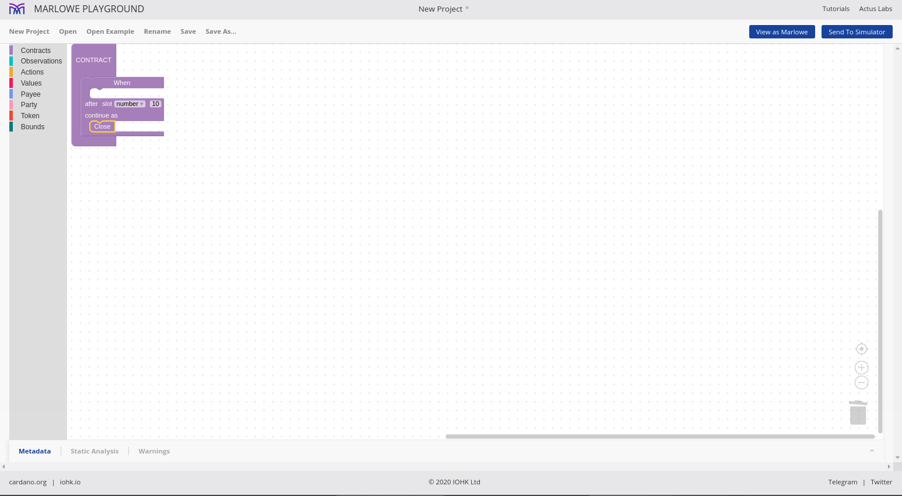

Here we say what external actions we wait for. Let's say we only wait for one action, namely that Alice makes a deposit.

So we can check for actions and pick the deposit one and slide it in.

.. figure:: img/pic__00107.png

We see some slots that we have to fill. First of all, a party who has to make the deposit, and there are two choices - a public key or role.

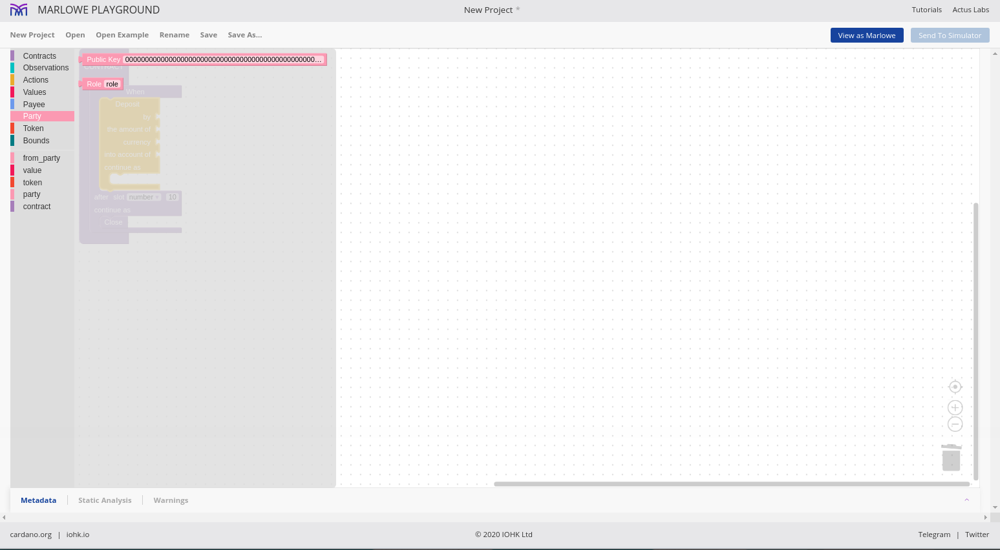

Let's take role because then we can just say Alice. Normally this would be the name of the role token, so whoever owns that token can incorporate that role.

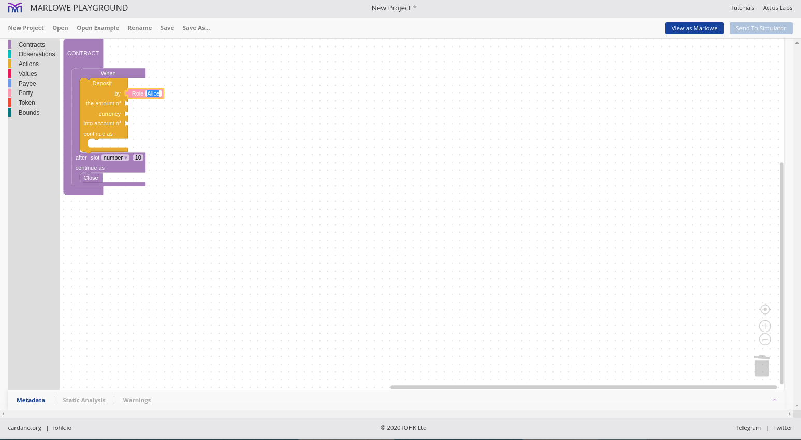

So Alice makes a deposit. Now the amount. That's a *Value* and let's say we just pick a constant amount of 10 Ada.

.. figure:: img/pic__00110.png

The amount is 10, and the fact that it is Ada must be specified in the currency slot.

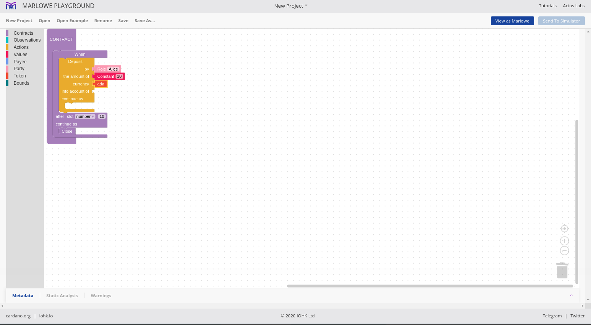

There's also the option to use tokens than Ada, but let's stick with Ada.

Now there are these internal accounts that also belong to one of the parties, so let's say Alice pays it into her own internal account.

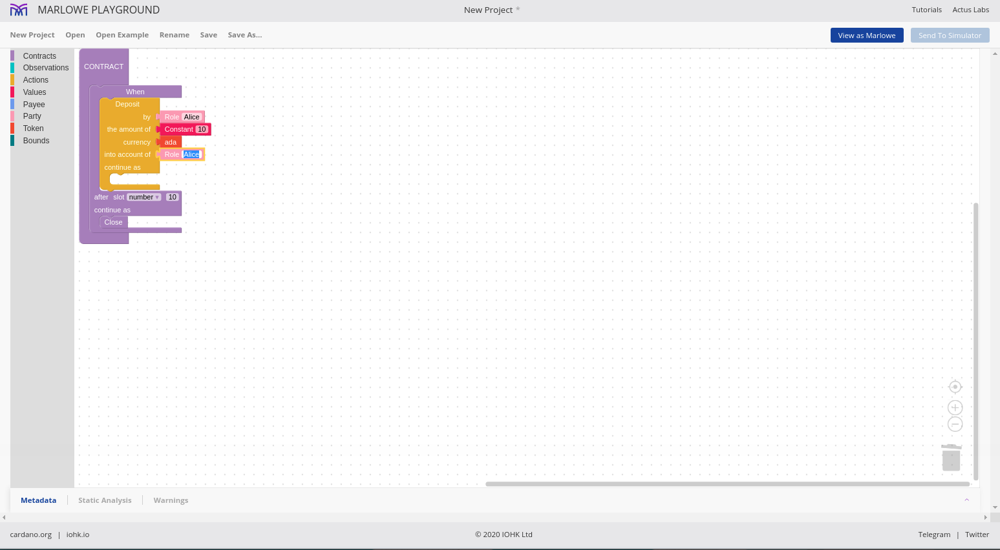

That can be copy/pasted rather than getting it from the *Party* menu again.

Now we must say what happens next, if Alice makes this deposit. Afterwards we want Bob to make a deposit, so we can start by just copying the whole *When* block.

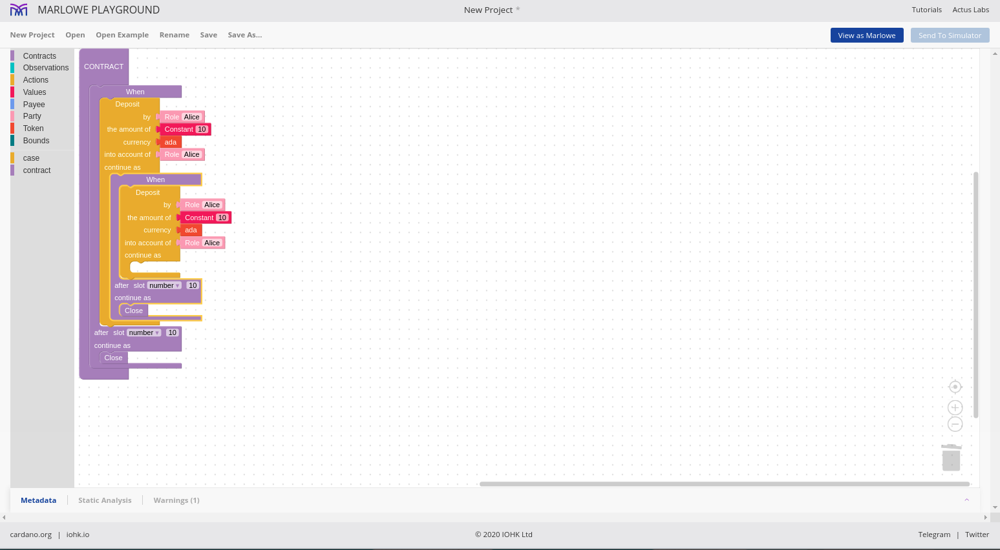

First of all we change the timeout to 20 so as to give Bob also 10 slots to do something, and then wherever we have Alice, we now put Bob.

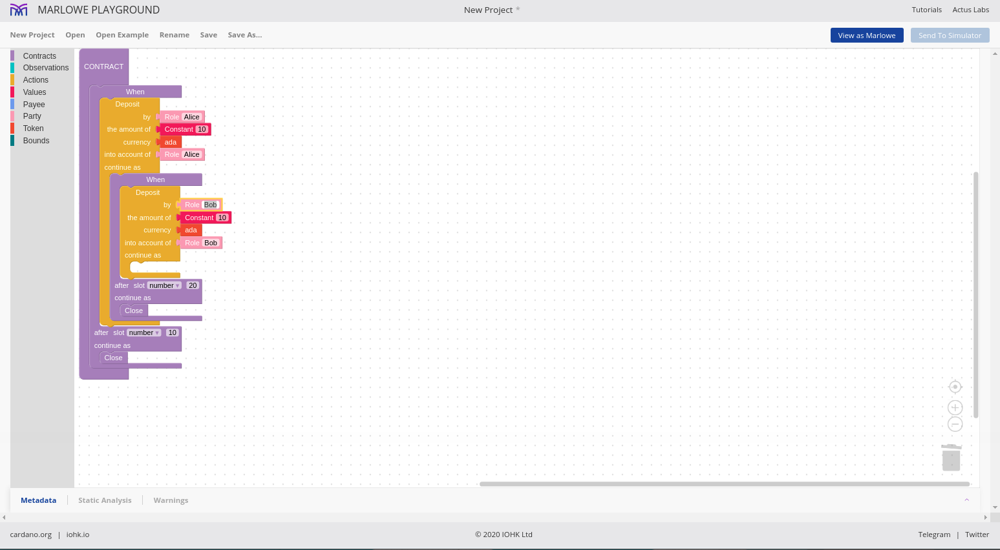

So at this point, if both these actions happen, Alice has deposited 10 into her internal account and Bob has deposited 10 into his external account.

Now we want Charlie to make a choice, and this is again an external action, so again we need a *When*, but this time it's not a deposit so let's delete 
the deposit. Then let's change the timeout to 30 to give Charlie 10 slots to make his choice.

.. figure:: img/pic__00115.png

Now we need a different action. Where earlier we had *Deposit*, now we pick the *Choice* action. We can give it a name, let's say *Winner*. We must say who 
makes the choice, so that's will be Charlie, and now we must specify what values this choice can have.

.. figure:: img/pic__00116.png

That's numeric so because Charlie is supposed to choose between Alice and Bobs, which is two choices, I can pick arbitrary values like one and two. One for Alice,
two for Bob. That's already the default so that's fine. 

This allows Charlie to choose one or two.

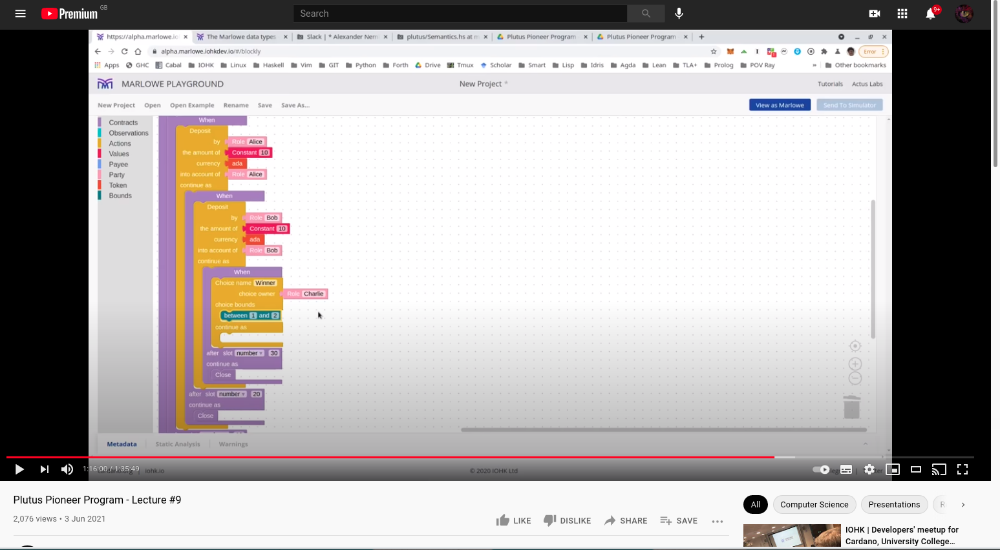

Then if and when Charlie makes a choice, we continue, and it now depends on the choice that he has made. If he chose Alice then Alice must get all the money, if he 
chose Bob then Bob must get all the money.

So we will add an *If* conditional.

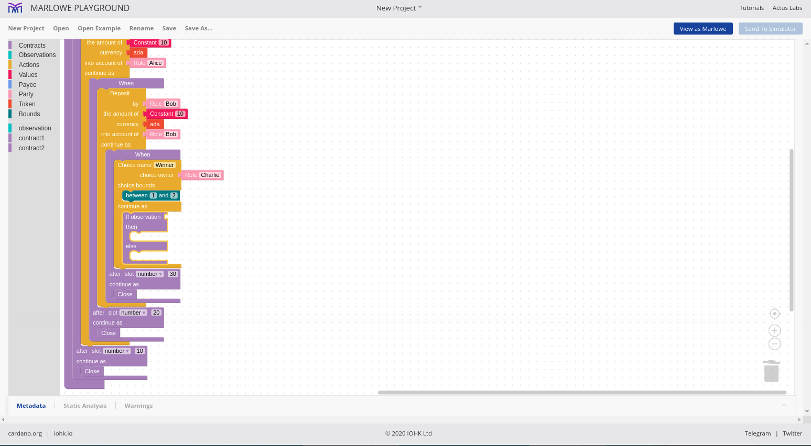

Then we will add an observation to check if Alice is the winner. The observation we add is the *value is equal to* observation.

.. figure:: img/pic__00119.png

To see if it is Alice, we will use the *Choice by* option to ask if Charlie's *Winner* name is equal to Alice.

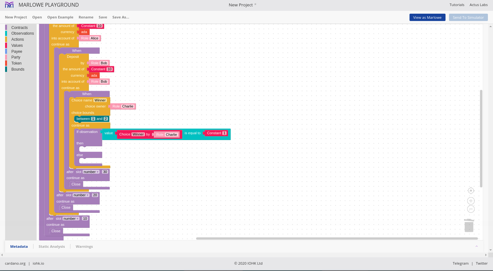

In the *then* branch we now take a pay contract. The payee is who gets the money - it can be an internal account or it can be an external party. In this case it doesn't
matter, because when we close, all the parties get the money from the internal accounts as well.

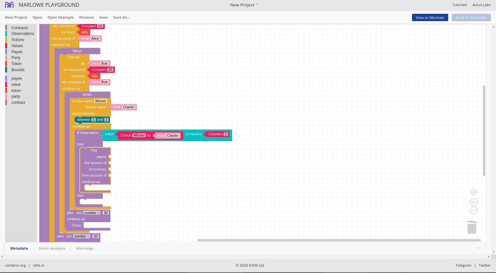

So, we'll just pick Alice's internal account.

.. figure:: img/pic__00122.png

We will pay 10 Ada.

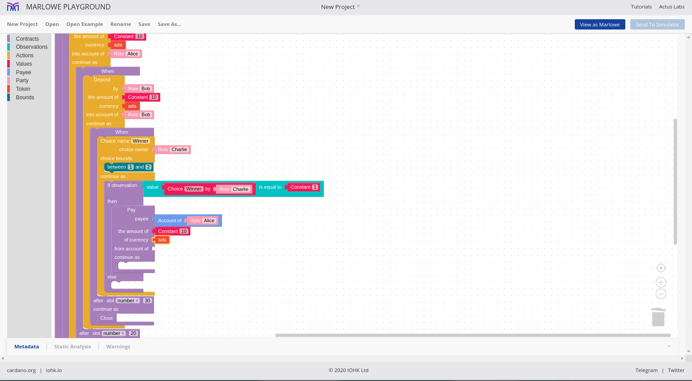

So who pays? It must be an internal account because this pay contract is something that the contract has control over, so it is not an external action. So, payments are
triggered from internal accounts and in this case, it is Bob's account.

So this now says: If Charlie picked 1, then pay from Bob's internal account 10 Ada to Alice's internal account.

After this we can just close. And when we close, all the internal accounts will be paid to the external owners. At this point, Alices internal account will have 20 Ada, 
and when we close, she will get the 20 Ada paid to her.

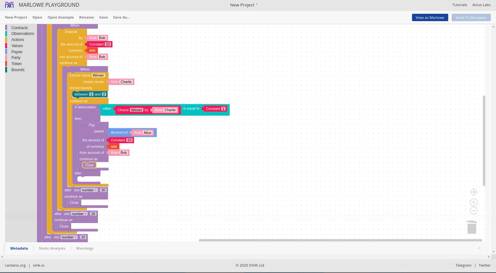

And, if Charlie did not choose Alice, then we must pay to Bob. We can copy paste the previous Pay contract for this and make the necessary modifications.

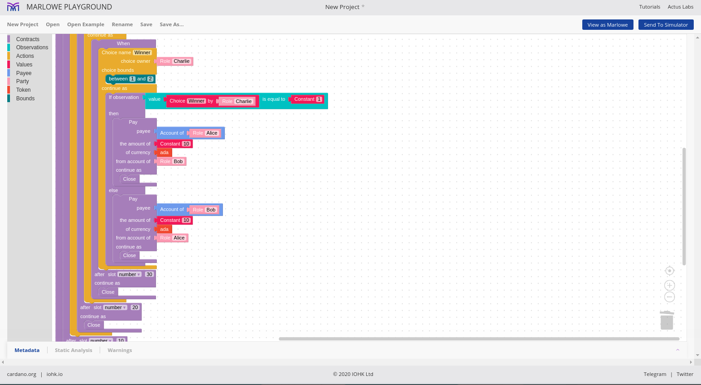

And this should be enough for our contract.

Now we can, for example, look at the pure Marlowe. This is the value of the Marlowe data type called *Contract*.

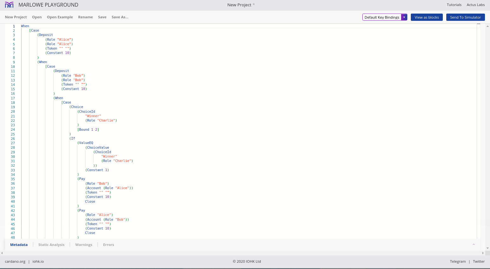

And we can send it to the simulator.

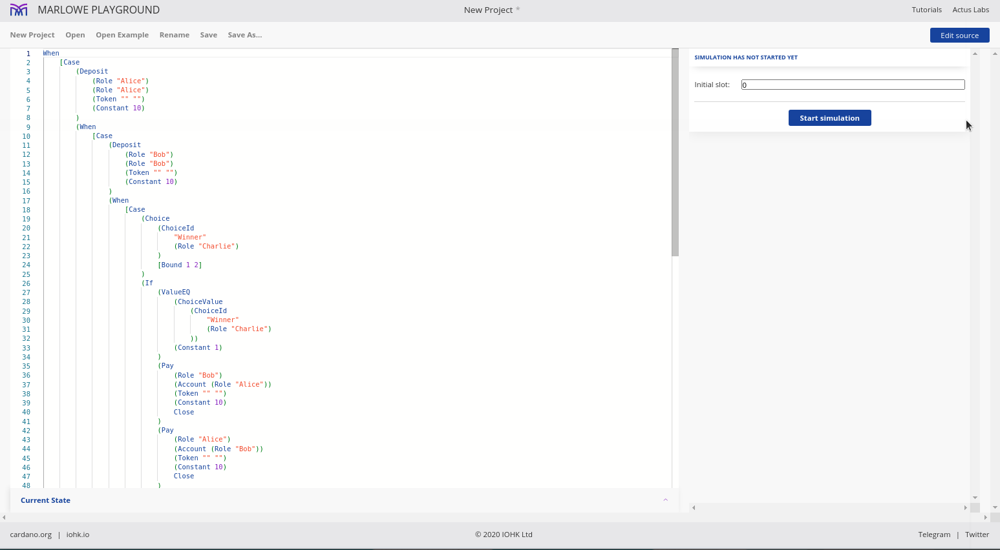

We can start the simulation.

.. figure:: img/pic__00129.png

Now, whenever there is a *When*, we get prompted for which of the available actions to take. In our case we only ever have one available action at each point.

So in the first *When*, either Alice makes her deposit, or the timeout is reached.

If we wait for the timeout it is very boring. The contract is reduced to *Close*, and nothing happened.

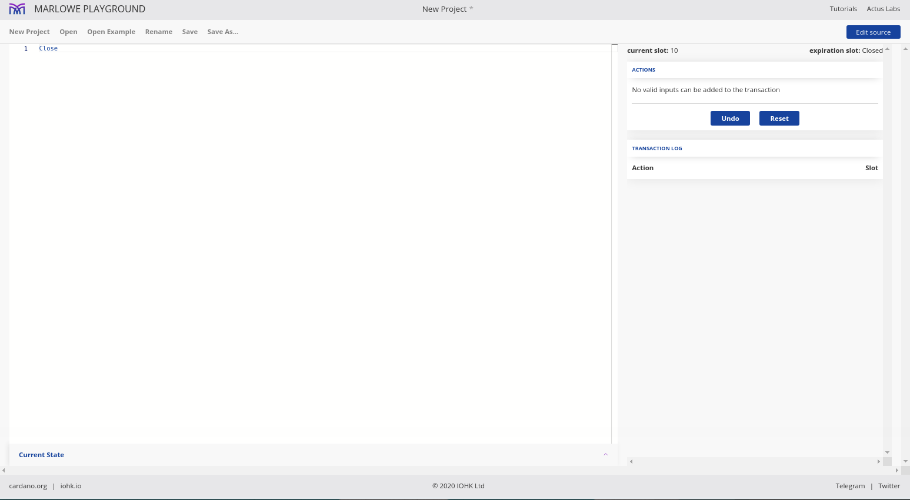

If, however, she makes the deposit, then this contract simplifies - it reduces to what happens after she makes the deposit.

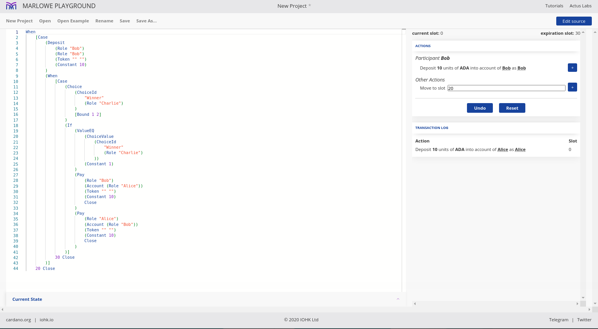

And now we can see we are in the second *When*, where we are waiting for Bob's deposit. Again, he can choose not to deposit. If he does that, then we can see the
actions in the transaction log that Alice deposited 10 Ada and the contract pays this back to Alice upon close.

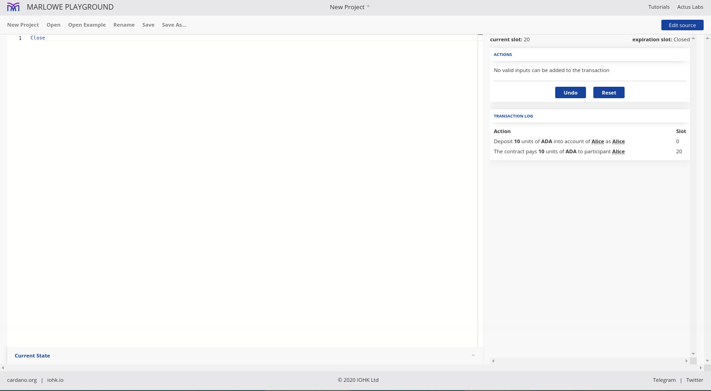

It is more interesting though if Bob also makes his deposit.

.. figure:: img/pic__00133.png

Now the contract has simplified again. Now we are in the *When* where the only available action is that Charlie chooses a winner.

If Charlie doesn't do anything and the contract times out, Bob and Alice both get their money back.

.. figure:: img/pic__00134.png

If Charlie picks Alice (choice 1), then we see that the contract pays 20 Ada to Alice.

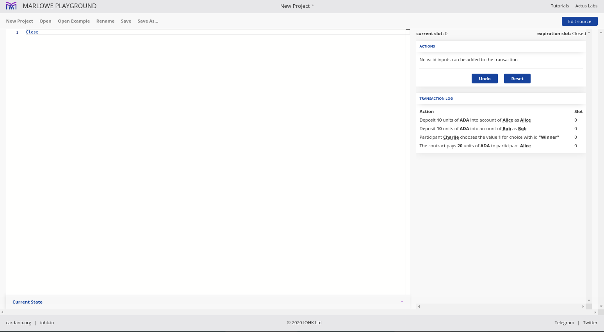

If instead he picks choice 2, then the contract pays 20 Ada to Bob.

.. figure:: img/pic__00136.png

Let's now reset the contract.

We will copy the Marlowe code to the clipboard, then create a new Haskell project.

.. figure:: img/pic__00137.png

In the Haskell editor there is a template.

.. figure:: img/pic__00138.png

All this program does is to take a Marlowe contract, and then pretty prints it. This is then used to, for example, run in the simulator.

Instead of Close, we can paste what we just copied to the clipboard.

.. figure:: img/pic__00139.png

We can then compile this, and send it to the simulator and it should behave exactly as before.

There we don't really see the benefit of doing it in Haskell, we could just as well do it in Blockly, although you may find that Blockly is really only useful for
learning and writing extremely simple contracts. We have just written a simple contract and already it was starting to get quite unwieldy in the Blockly editor. If you 
do something more complicated it can start to get very confusing in the editor.

But, we can do other things in this Haskell program. We don't have to literally define a contract. We can use the whole power of Haskell to help us to write the contract.

For example, we can see a lot of repetition because we always have the Alice, Bob and Charlie roles. We could define these separately.

Note that we can use overloaded string literals here because the *fromString* function uses the *Role* constructor for *Party*.

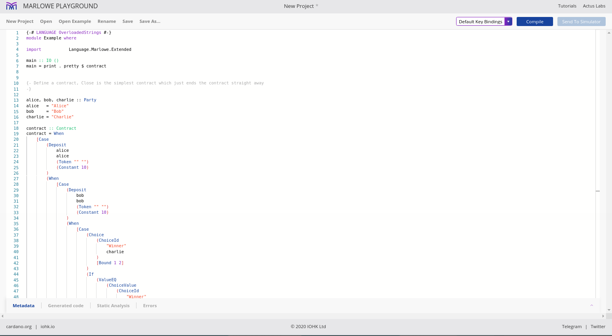

We can also define a constant for the deposit of 10 Ada.

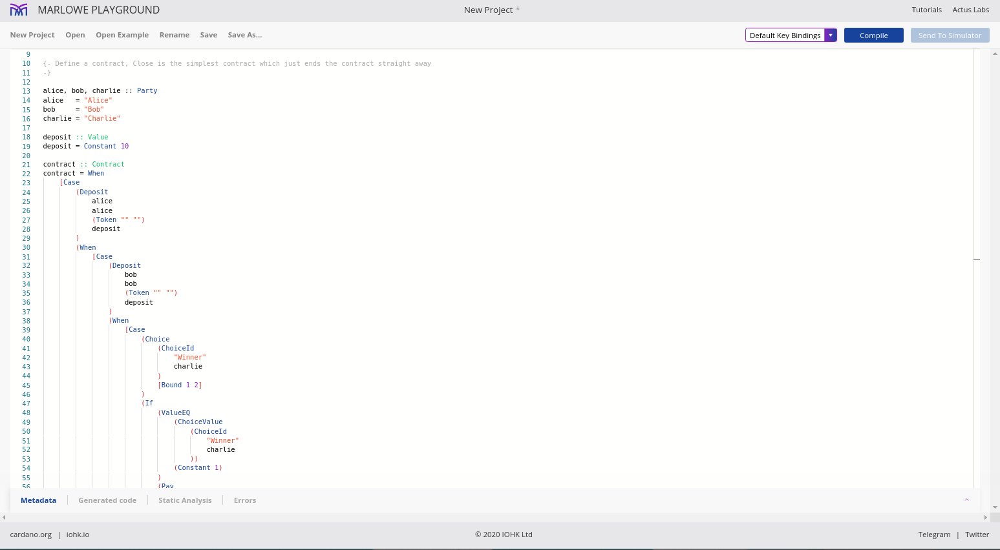

For (Token "" ""), we can replace this with the *ada* abbreviation.

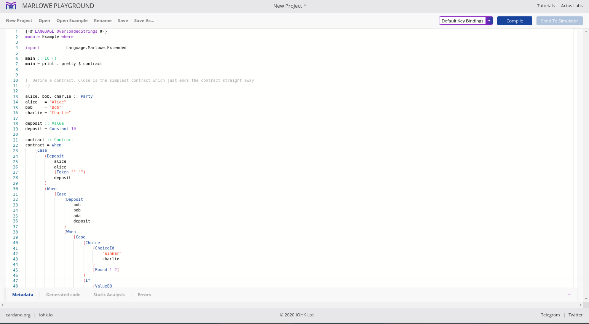

We can also simplify Charlie's *ChoiceId*.

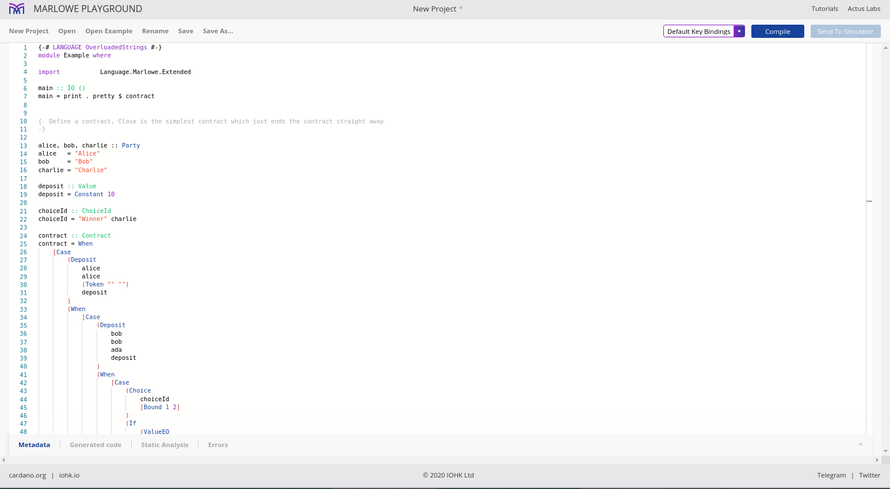

Now it is already cleaned up quite a bit.

It's possible to do more sophisticated things. Our contract is slightly asymmetric even though it sounds like a symmetric situation. Alice and Bob are completely
symmetric, but in our contract, Alice has to deposit first.

What we could do is to allow Bob to deposit first as well. In the outermost *When* we would have two deposits - one where Alice deposits, and one where Bob 
deposits.

Let's make a little helper function. It takes two *Party*\s - the party that deposits first and the party that deposits second and then it returns a *Case*. We can
use this to parameterise Alice and Bob as *x* and *y* in the *Case*. Note that we only need to do this for the deposits, the part where Charlie makes his choice can
remain the same, with Alice and Bob continuing to be represented by 1 and 2 respectively.

.. figure:: img/pic__00144.png

Now we can replace the originally-pasted code with our helper function, and we can create the symmetric case where Bob deposits first as an option to the outermost
*When*.

.. figure:: img/pic__00146.png

This should compile and we can now send to the simulator.

.. figure:: img/pic__00147.png

Now we have two possible actions that can happen in the first step. Alice can deposit 10, or Bob can deposit 10.

If Bob starts...

.. figure:: img/pic__00147.png

Then now it is Alice's turn.

So, basically, to use the Haskell editor, we write a program that produces something of type *Contract* and you can use all the features of Haskell like local
functions or whatever to make your life easier.

When using Blockly, if we had wanted to give Bob the option of being the first to deposit, we would have had no choice but to have copy and pasted the whole *When*
construct.

Of course, there are other options when using Haskell. We could also paramterise the contract, for example, we could pass in the deposit value as an argument.

We could also parameterise the parties and even generalise it so that the number of parties could be variable. This would be very inconvenient if we were to have to 
do this by hand using Blockly, but in Haskell it is quite straightforward.

What is noteworthy here is that Marlowe, in contrast to Plutus, is very simply Haskell. The Marlowe team made a point of using only basic Haskell features. You
don't need lenses, you don't need Template Haskell, you don't even need monads or type-level programming.

Marlowe is not always appropriate because it is specifically for financial contracts, but if it is appropriate then it is a very nice option due to all the safety
assurances that Simon mentioned and because it is much simpler and easy to get right than Plutus.

