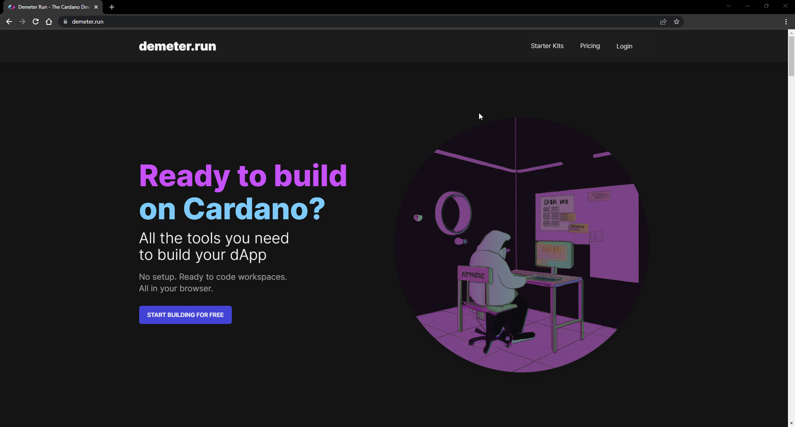
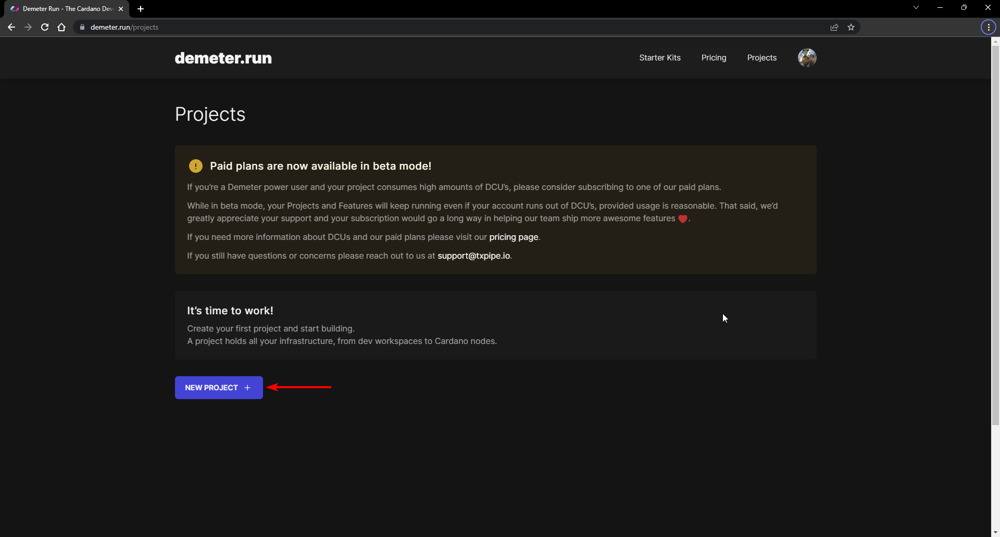
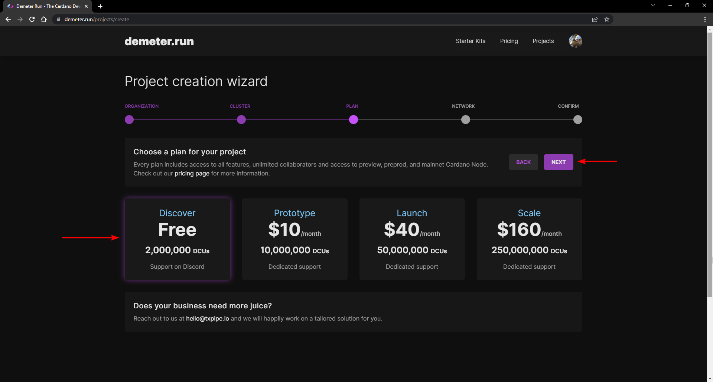
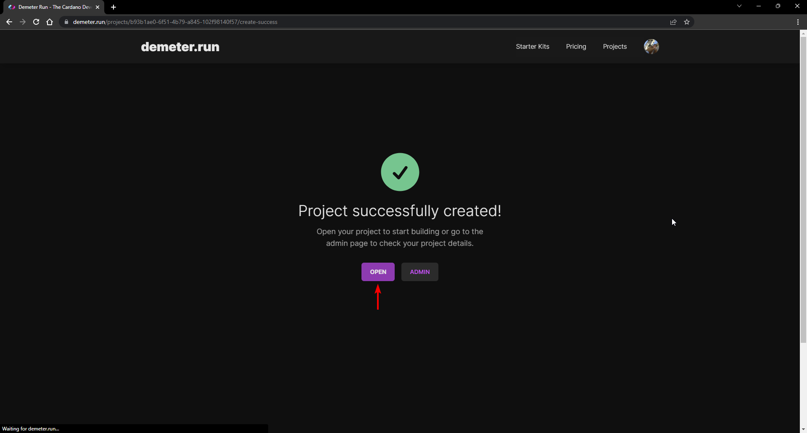

# Using Demeter

[Demeter.run](https://demeter.run/) is a cloud environment that provides all the tools required for building and deploying Cardano applications. Follow the steps below to set up an account and use this development environment.


Demeter.run is a third party service that provides a cloud-based development environment. If you prefer using a local environment, review the [Using Docker guide](docker.md). 


## Prerequisites

To use demeter.run, you need a web browser on any operating system and internet access. This guide provides screenshots of using Google Chrome.

## Setup a demeter.run account

Please go through the following instructions to set up an account and start using demeter.run.

1. Open your browser and navigate to <https://demeter.run/>. You'll see the home page of demeter.run as the image below shows.

    

2. On the demeter.run home page, click on the "Login" option on the top navigation menu, as seen in the image below.

    

3. Next, you need to set up an account to sign in demeter.run. As it's shown in the image below, you can choose to set a username and password, or you can sign in by using your Google or GitHub account. Select the method that best fits your preferences to continue.

    

4. After signing in, you're ready to use demeter.run. As the image below shows, you'll see the "Projects" page.

    

### Create a demeter.run project

After setting up your account, you are ready to start building a Cardano application on demeter.run. To do so, follow the instructions below to create a new project.

1. On the "Project" page, click on the "NEW PROJECT" button, as seen in the image below.

    

2. Next, you'll need to follow the required steps to set up a new project. First, you need to choose an organization where your project will reside. By default, an organization with your username exists. We'll select the default organization for this demo, as shown in the image below, where the username is `jarturomora`. After choosing the organization, click on the "NEXT" button.

    

3. In the second step, you need to choose the location of the cluster that you'll use. As for now, only a US-based cluster exists. So, select the "US Central" cluster and click the "NEXT" button to continue, as the image below shows.

    

4. After choosing a cluster, the next step is to select a plan. For the purpose of the program, we will use the "Discover" plan that is available free of charge. So, select the "Discover" plan and click on the "NEXT" button to continue, as the image below shows.

    

5. Next, you need to choose a network for your project. For testing purposes, we'll typically use the "Preview" networks. Select the "Preview" network and click the "NEXT" button to continue, as the image below shows.

    

6. The last step is to provide a name for your project. Also, in this step, you can review the project's details; be aware that you can have only one project in the Discover plan. In this demo, the project was named "PPP Demo." So, set a name for your project and click on the "CREATE PROJECT" button to finish, as the image below shows.

    

7. Once your project is created, it's ready to start building applications. You'll see a confirmation message, as the image below shows. Next, you can click the "OPEN" button to navigate the project's "Development Console."

    

That's it! In the forthcoming lessons of the program, you'll learn how to start using your brand new demeter.run project to begin building Cardano applications.

If you have any questions, recall that you can reach the PPP community on the [IOG's technical community on Discord](https://discord.gg/inputoutput) by checking out the `#pioneers-questions` channel.

---

This work is licensed under a [Creative Commons Attribution 4.0 International License](http://creativecommons.org/licenses/by/4.0/).

<figure></figure>