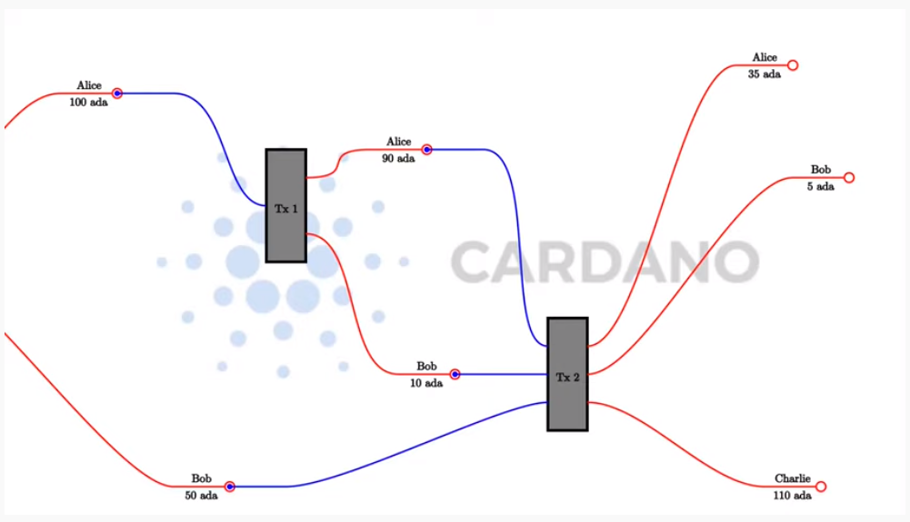
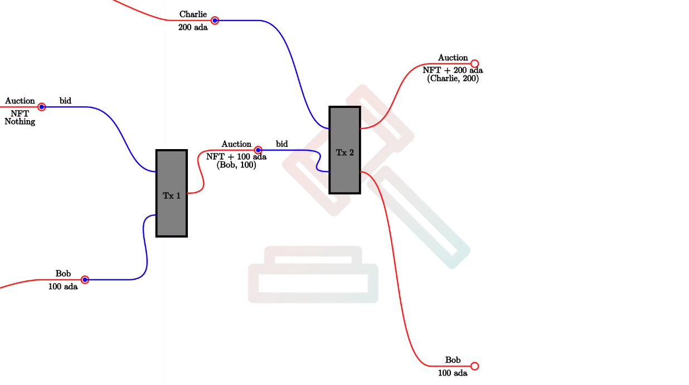
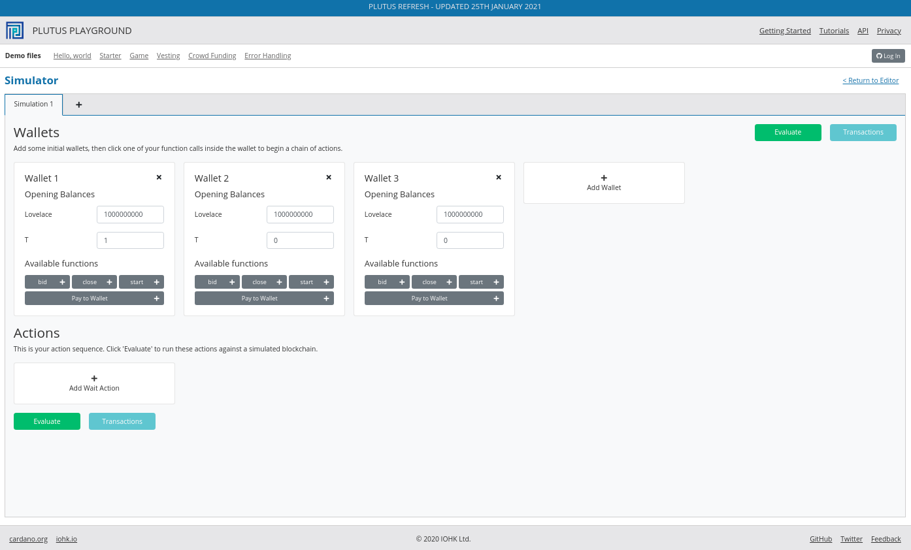
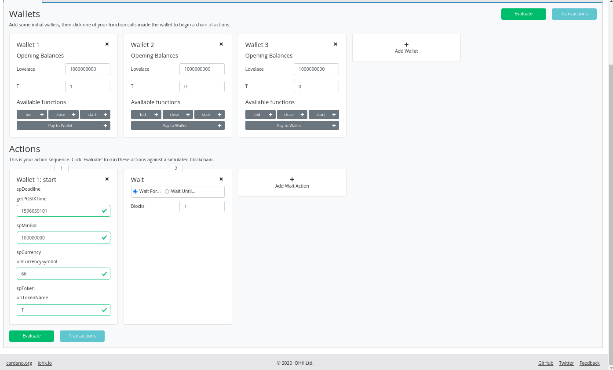
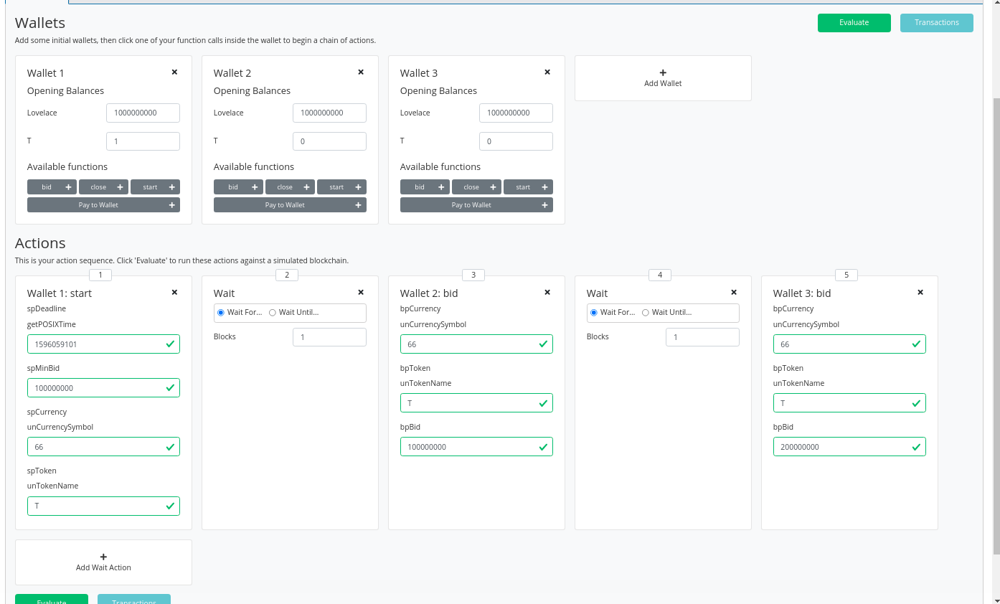
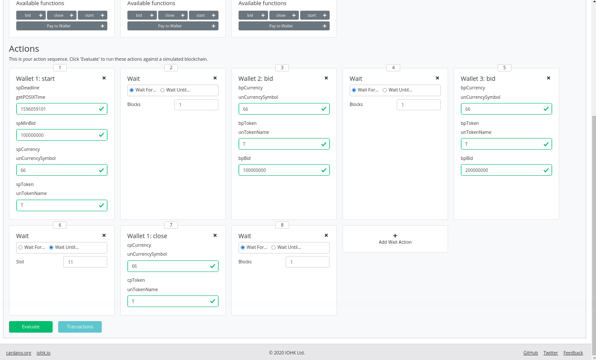
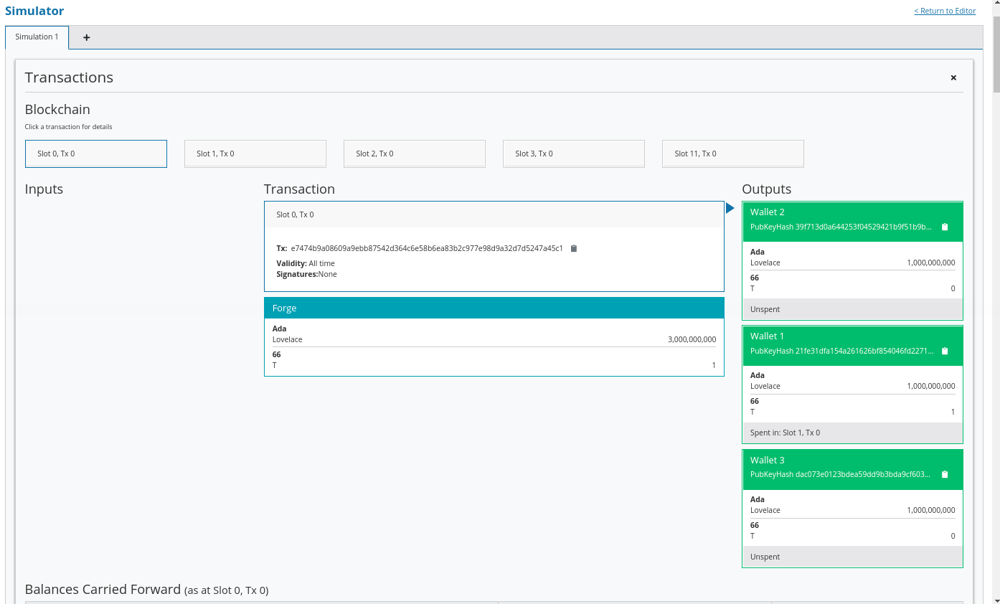
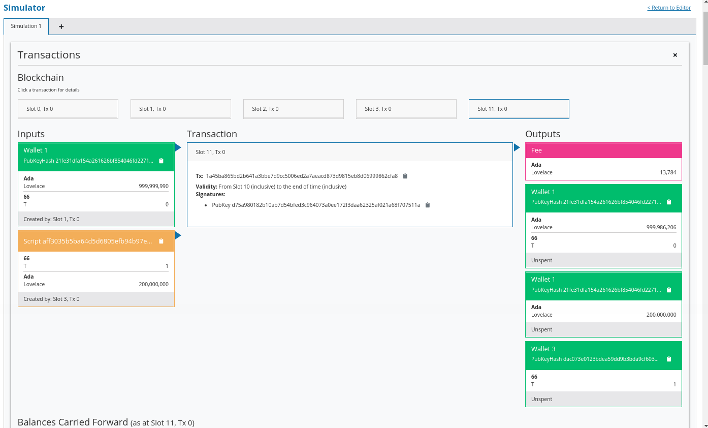

Week 01 - English Auction
=========================

.. note::
   This is a written version of `Lecture
   #1 - Iteration #2 <https://www.youtube.com/watch?v=_zr3W8cgzIQ&t=2394s>`__.

   It covers an introduction to Plutus, the (E)UTxO model (and how it
   compares to other models), and concludes with an example English Auction
   managed with a Plutus smart contract running on the Plutus Playground.

   These notes have been updated to reflect the changes in iteration two of the
   program.

   The Plutus commit used in these notes is ea0ca4e9f9821a9dbfc5255fa0f42b6f2b3887c4.

Welcome
-------

Learning Plutus isn't easy, and there are a number of reasons for that.

1. Plutus uses the (E)UTxO model. This is different and less intuitive
   than the Ethereum method for creating smart contracts. It has a lot
   of advantages, but it requires a new way of thinking about smart
   contracts. And that's before we even start with the language itself.
2. Plutus is new and still under rapid development.
3. Tooling is not ideal, yet. So, experienced Haskell developers will
   notice that the experience with Plutus is not as pleasant, for
   example, when trying to access documentation or get syntax hints from
   the REPL. It can also be a challenge to build Plutus in the first
   place. The easiest way currently is to use Nix. The Plutus team is
   working on providing a Docker image, which will help.
4. Plutus is Haskell, more or less, which can have a tough learning
   curve for those coming from an imperative programming background.
5. Plutus is brand new and this means that there are not many help
   resources available, such as StackOverflow posts.

The (E)UTxO Model
-----------------

Overview
~~~~~~~~

One of the most important things you need to understand in order to
write Plutus smart contracts is the accounting model that Cardano uses,
the Extended Unspent Transaction Output model.

The UTxO model, without the (E) is the one that was introduced by
Bitcoin, but there are other models. Ethereum for example, uses the
so-called account-based model, which is what you are used to from normal
banking, where everybody has an account, each account has a balance
and if you transfer money from one account to another then the balances
get updated accordingly.

That is not how the UTxO model works.

Unspent transaction outputs are exactly what the name says. They are
transaction outputs from previous transactions that have happened on the
blockchain that have not yet been spent. 

Let's look at an example where we have two such UTxOs. One belonging to Alice of 100 Ada, and another belonging to Bob of 50 Ada.

.. figure:: img/pic__00000.png
   :alt: Alice and Bob's UTxOs

Alice wants to send 10 ADA to Bob, so she needs to create a transaction. 

.. note::
    A transaction is something that contains an arbitrary number of inputs and
    an arbitrary number of outputs. The effect of a transaction is to consume 
    inputs and produce new outputs.

The important thing is that you can only ever use complete UTxOs as
input. Alice cannot simply split her existing 100 ADA into a 90 and a
10, she has to use the full 100 ADA as the input to a transaction.

.. figure:: img/2.png
   :alt: Alice Creates a Transaction

Once consumed by the transaction, Alice's input is no longer a UTxO (an unspent transaction). It will
have been spent as an input to Tx 1. So, she needs to create outputs for her transaction.

She wants to pay 10 ADA to Bob, so one output will be 10 ADA (to Bob).
She then wants her change back, so she creates a second output of 90
ADA (to herself). The full UTxO of 100 ADA has been spent, with Bob
receiving a new transaction of 10 ADA, and Alice receiving the change
of 90 ADA.

.. figure:: img/3.png
   :alt: Alice's Transaction Generates Two New UTxOs

In any transaction, the sum of the output values must match the sum of
the input values. Although, strictly speaking, this is not true. There
are two exceptions.

1. Transaction fees. In a real blockchain, you have to pay fees for each
   transactions.
2. Native Tokens. It's possible for transactions to create new tokens,
   or to burn tokens, in which case the inputs will be lower or higher
   than the outputs, depending on the scenario.

Let's take a look at a slightly more complicated example.

Alice and Bob want to transfer 55 ADA each to Charlie. Alice has no
choice, as she only has one UTxO. Bob also has no choice as neither of
his two UTxOs is large enough to cover the 55 ADA he wishes to send to
Charlie. Bob will have to use both his UTxOs as input.

When Is Spending Allowed?
~~~~~~~~~~~~~~~~~~~~~~~~~

Obviously it wouldn't be a good idea if any transaction could spend
arbitrary UTxOs. If that was the case then Bob could spend Alice's money
without her consent.

The way it works is by adding signatures to transactions.

In transaction 1, Alice's signature has to be added to the transaction.
In transaction 2, both Alice and Bob need to sign the transaction. Incidentally, this second, more complex, transaction cannot be done in Daedalus, so you would need
to use the CLI for this.

Everything explained so far is just about the UTxO model, not the
(E)UTxO model.

The extended part comes in when we talk about smart contracts, so in
order to understand that, let's concentrate on the consumption of
Alice's UTxO of 100 ADA.

.. figure:: img/5.png
   :alt: Alice's UTxO as an Input (Blue Line)

In the UTxO model, the validation that decides whether the transaction
that this input belongs to is allowed to consume the UTxO, relies on
digital signatures. In this case, that means that Alice has to sign the
transaction in order for the consumption of the UTxO to be valid.

The idea of the (E)UTxO model is to make this more general.

Instead of having just one condition, namely that the appropriate
signature is present in the transaction, we replace this with arbitrary
logic. 

This is where Plutus comes in.

Instead of just having an address that corresponds to a public key that
can be verified by a signature that is added to the transaction, we have
more general addresses, not based on public keys or the hashes of public
keys, but instead contain arbitrary logic which decides under which conditions a
particular UTxO can be spent by a particular transaction.

So, instead of an input being validated simply by its public key, the input will 
justify that it is allowed to consume this output with some arbitrary piece of data 
that we call the *Redeemer*.

.. figure:: img/6.png
   :alt: The Redeemer Is Used To Validate Spending of the UTxO

We replace the public key address (Alice's in our example), with a script, and we replace the digital signature with a *Redeemer*.

What exactly does that mean? What do we mean by *arbitrary logic*?

It is important to consider the context that the script has. There are several options.

Script Context
~~~~~~~~~~~~~~

The Bitcoin approach
^^^^^^^^^^^^^^^^^^^^

One option is that all the script sees is the Redeemer. In this case,
the Redeemer contains all the logic necessary to verify the transaction.
This is, incidentally, what Bitcoin does. In Bitcoin, there are smart
contracts, but they are just not very smart. They are called Bitcoin
Script, which works exactly like this. There is a script on the UTxO
side and a redeemer on the input side, and the script gets the redeemer
and uses it to determine if it is ok to consume the UTxO or not.

But this is not the only option. We can decide to give more information
to the script.

The Ethereum approach
^^^^^^^^^^^^^^^^^^^^^

Ethereum uses a different concept. In Ethereum, the script can see
everything - the whole blockchain - the opposite extreme of Bitcoin. In
Bitcoin, the script has very little context, all it can see is the
redeemer. In Ethereum, the Solidity scripts can see the complete state
of the blockchain.

This makes Ethereum scripts more powerful, but it also comes with
problems. Because the scripts are so powerful it is difficult to predict
what a given script will do and that opens the door to all sorts of
security issues and dangers. It is very hard for the developers of an
Ethereum smart contract to predict everything that can happen.

The Cardano approach
^^^^^^^^^^^^^^^^^^^^

What Cardano does is something in the middle.

In Plutus, the script cannot see the whole blockchain, but it can see
the whole transaction that is being validated. In contrast to Bitcoin,
it can't see only the redeemer of the one input, but it can also see all
the inputs and outputs of the transaction, and the transaction itself.
The Plutus script can use this information to decide whether it is ok to
consume the output.

There is one last ingredient that Plutus scripts need in order to be as
powerful and expressive as Ethereum scripts. That is the so-called
Datum. That is a piece of data that can be associated with a UTxO along
with the UTxO value.

.. figure:: img/7.png
   :alt: Datum

With this it is possible to prove mathematically that Plutus is at least
as powerful as the Ethereum model - any logic you can express in
Ethereum you can also it can express using the (E)UTxO model.

But it also has a lot of advantages compared to the Ethereum model. For
example, in Plutus, it is possible to check whether a transaction will
validate in your wallet, before you ever send it to the chain.

Things can still go wrong with off-chain validation, however. For
example in the situation where you submit a transaction that has been
validated in the wallet but gets rejected when it attempts to consume an
output on-chain that has already been consumed by another transaction.

In this case, your transaction will fail without you having to pay any
fees.

But if all the inputs are still there that your transaction expects,
then you can be sure that the transaction will validate and will have
the predicted effect.

This is not the case with Ethereum. In Ethereum, the time between you
constructing a transaction and it being incorporated into the
blockchain, a lot of stuff can happen concurrently, and that is
unpredictable and can have unpredictable effects on what will happen
when your script finally executes.

In Ethereum it is always possible that you have to pay gas fees for a
transaction even if the transaction eventually fails with an error. And
that is guaranteed to never happen with Cardano.

In addition to that, it is also easier to analyse a Plutus script and to
check, or even prove, that it is secure, because you don't have to
consider the whole state of the blockchain, which is unknowable. You can
concentrate on this context that just consists of the spending
transaction. So you have a much more limited scope and that makes it
much easier to understand what a script is actually doing and what can
possibly go wrong.

Who is responsible for providing the datum, redeemer and the validator? The rule in Plutus is that the spending transaction has to do that whereas the producing transaction only has to provide hashes. 

That means that if I produce an output that sits at a script address then this producing transaction only has to include the hash of the script
and the hash of the datum that belongs to the output. Optionally it can include the datum and the script as well.

If a transaction wants to consume such an output then *that* transaction has to provide the datum, the redeemer and the script. Which means that in order to spend a 
given input, you need to know the datum, because only the hash is publicly visible on the blockchain.

This is sometimes a problem and not what you want and that's why you have the option to include the datum in the producing transaction. If this were not possible, only
people that knew the datum by some means other than looking at the blockchain would ever be able to spend such an output.

The (E)UTxO model is not tied to a particular programming language. What
we have is Plutus, which is Haskell, but in principal you could use the
same model with a completely different programming language, and we
intend to write compilers for other programming languages to Plutus
Script which is the "assembly" language underlying Plutus.

Running an example auction contract on a local Playground
---------------------------------------------------------

Rather than start the traditional way, i.e. starting very simple and
doing a crash course on Haskell, followed by some simple Plutus
contracts and slowly add more complicated stuff, it will be more
interesting, especially for the first lecture, to showcase a more
interesting contract and demonstrate what Plutus can do. We can then use
that to look at certain concepts in more detail.

The English Auction contract
~~~~~~~~~~~~~~~~~~~~~~~~~~~~

As our introductory example we are going to look at an English Auction. Somebody wants to auction an NFT (Non-fungible token) - a native token on Cardano that
exists only once. An NFT can represent some digital art or maybe some real-world asset.

The auction is parameterised by the owner of the token, the token itself, a minimal bid and a deadline.

So let's say that Alice has an NFT and wants to auction it.

.. figure:: img/iteration2/pic__00000.png
   :alt: Alice Creates an English Auction

She creates a UTxO at the script output. We will look at the code later, but first we will just examine the ideas of the UTxO model.

The value of the UTxO is the NFT, and the datum is *Nothing*. Later on it will be the highest bidder and the highest bid. But right now, there hasn't yet been a bid.

In the real blockchain you can't have a UTxO that just contains native tokens, they always have to be accompanied by some Ada, but for simplicity we will ignore that here.

Not let's say that Bob wants to bid 100 Ada.

.. figure:: img/iteration2/pic__00001.png
   :alt: Bob Makes a Bid

In order to do this, Bob creates a transaction with two inputs and one output. The first input is the auction UTxO and the second input is Bob's bid of 100 Ada. The output
is, again, at the output script, but now the value and the datum has changed. Previously the datum was *Nothing* but now it is (Bob, 100).

The value has changed because now there is not only the NFT in the UTxO, but also the 100 Ada bid.

As a redeemer, in order to unlock the original auction UTxO, we use something called *Bid*. This is just an algebraic data type. There will be other values as well but one
of those is *Bid*. And the auction script will check that all the conditions are satisfied. So, in this case the script has to check that the bid happens before the deadline,
that the bid is high enough.

It also has to check that the correct inputs and outputs are present. In this case that means checking that the auction is an output containing the NFT and has the correct datum.

Next, let's assume that Charlie wants to outbid Bob and bid 200 Ada.

Charlie will create another transaction, this time one with two inputs and two outputs. As in the first case, the two inputs are the bid (this time Charlie's bid of 200 Ada),
and the auction UTxO. One of the outputs is the updated auction UTxO. There will also be a second output, which will be a UTxO which returns Bob's bid of 100 Ada.

.. note::

   In reality the auction UTxO is not updated because nothing ever changes. 
   
   What really happens is that the old auction UTxO is spent and a new one is created, but it has the feel of updating the state of the auction UTxO

This time we again use the *Bid* redeemer. This time the script has to check that the deadline has been reached, that the bid is higher than the previous bid, it has to 
check that the auction UTxO is correctly created and it has to check that the previous highest bidder gets their bid back.

Finally, let's assume that there won't be another bid, so once the deadline has been reached, the auction can be closed.

In order to do that, somebody has to create yet another transaction. That could be Alice who wants to collect the bid or it could be Charlie who wants to collect the NFT. It
can be anybody, but Alice and Charlie have an incentive to do so.

This transaction will have one input - the auction UTxO, this time with the *Close* redeemer - and it will have two outputs. One of the outputs is for highest bidder,
Charlie, and he gets the NFT and the second output goes to Alice who gets the highest bid.

In the *Close* case, the script has to check that the deadline has been reached and that the winner gets the NFT and the auction owner gets the highest bid.

There is one more scenario for us to consider, namely that nobody makes any bid.

Alice creates the auction, but receives no bids. In this case, there must be a mechanism for Alice to retrieve her NFT.

For that she creates a transaction with the *Close* redeemer, but now because there is no bidder, the NFT doesn't go to the highest bidder but simply goes back to Alice.

The logic in this case is slightly different. It will check that the NFT goes back to Alice, however, it doesn't really need to check the recipient because the transaction
will be triggered by Alice and she can send the NFT wherever she wants.

On-chain and Off-chain code
^^^^^^^^^^^^^^^^^^^^^^^^^^^

The important thing to realise about Plutus is that there is on-chain and off-chain code.

On-chain
++++++++

On-chain code is the scripts we were discussing - the scripts from the UTxO model. In addition to public key addresses we have script address and outputs can sit at
such an address, and if a transaction tries to consume such an output, the script is executed, and the transaction is only valid if the script succeeds.

If a node receives a new transaction, it validates it before accepting it into its mempool and eventually into a block. For each input of the transaction, if that input
happens to be a script address, the corresponding script is executed. If the script does not succeed, the transaction is invalid.

The programming language this script is expressed in is called Plutus Core, but you never write Plutus Core by hand. Instead, you write Haskell and that gets compiled
down to Plutus Core. EVentually there may be other high-level languages such as Solidity, C or Python that can compile down to Plutus Core.

The task of a script is to say yes or no to whether a transaction can consume an output. 

Off-chain
+++++++++

In order to unlock a UTxO, you must be able to construct a transaction that will pass validation and that is the responsibility of the off-chain part of Plutus. This 
is the part that runs on the wallet and not on the blockchain and will construct suitable transactions.

One of the nice things about Plutus is that both the on-chain parts and the off-chain parts are written in Haskell. One obvious advantage of that is that you don't
have to learn two programming languages. The other advantage is that you can share code between the on-chain and off-chain parts.

Later in this course we talk about state machines and then this sharing between on-chain and off-chain code becomes even more direct, but even without state machines
there is still a lot of opportunities to share code.

We will have a brief look at the code but don't worry, you are not expected to understand it at this point.

The code for the English Auction contract is at

::

      /path/to/plutus-pioneer-program/repo/code/week01/src/Week01/EnglishAuction.hs

We see a data type *Auction* which represents the parameters for the contract that, in our example, Alice starts. The *aCurrency* and *aToken* parameters represent the
NFT.

.. code:: haskell

   data Auction = Auction
      { aSeller   :: !PubKeyHash
      , aDeadline :: !POSIXTime
      , aMinBid   :: !Integer
      , aCurrency :: !CurrencySymbol
      , aToken    :: !TokenName
      } deriving (Show, Generic, ToJSON, FromJSON, ToSchema)
    
You also see other data types, but the heart of the code is the *mkAuctionValidator* function. This is the function that determines whether a given transaction is allowed
to spend a UTxO sitting at this script address.

.. code:: haskell

   {-# INLINABLE mkAuctionValidator #-}
   mkAuctionValidator :: AuctionDatum -> AuctionAction -> ScriptContext -> Bool
   mkAuctionValidator ad redeemer ctx =
       traceIfFalse "wrong input value" correctInputValue &&
       case redeemer of
           MkBid b@Bid{..} ->
               traceIfFalse "bid too low" (sufficientBid bBid)                &&
               traceIfFalse "wrong output datum" (correctBidOutputDatum b)    &&
               traceIfFalse "wrong output value" (correctBidOutputValue bBid) &&
               traceIfFalse "wrong refund"       correctBidRefund             &&
               traceIfFalse "too late"           correctBidSlotRange
           Close           ->
               traceIfFalse "too early" correctCloseSlotRange &&
               case adHighestBid ad of
                   Nothing      ->
                       traceIfFalse "expected seller to get token" (getsValue (aSeller auction) tokenValue)
                   Just Bid{..} ->
                       traceIfFalse "expected highest bidder to get token" (getsValue bBidder tokenValue) &&
                       traceIfFalse "expected seller to get highest bid" (getsValue (aSeller auction) $ Ada.lovelaceValueOf bBid)
   
     where
         ...
   
And then here is where the compilation to Plutus Core happens. It uses something called Template Haskell to take the Haskell function above and compile it to Plutus Core.

.. code:: haskell

   auctionTypedValidator :: Scripts.TypedValidator Auctioning
   auctionTypedValidator = Scripts.mkTypedValidator @Auctioning
       $$(PlutusTx.compile [|| mkAuctionValidator ||])
       $$(PlutusTx.compile [|| wrap ||])
     where
       wrap = Scripts.wrapValidator

The off-chain part of the code defines the endpoints that can be invoked.

We have three endpoints for this example, and each has a datatype defined to represent their parameters.

.. code:: haskell

   data StartParams = StartParams
      { spDeadline :: !POSIXTime
      , spMinBid   :: !Integer
      , spCurrency :: !CurrencySymbol
      , spToken    :: !TokenName
      } deriving (Generic, ToJSON, FromJSON, ToSchema)

   data BidParams = BidParams
      { bpCurrency :: !CurrencySymbol
      , bpToken    :: !TokenName
      , bpBid      :: !Integer
      } deriving (Generic, ToJSON, FromJSON, ToSchema)

   data CloseParams = CloseParams
      { cpCurrency :: !CurrencySymbol
      , cpToken    :: !TokenName
      } deriving (Generic, ToJSON, FromJSON, ToSchema)
   
Then the off-chain operations are defined.

First the *start* logic.

.. code:: haskell

   start :: AsContractError e => StartParams -> Contract w s e ()
   start StartParams{..} = do
       pkh <- pubKeyHash <$> ownPubKey
       let a = Auction
                   { aSeller   = pkh
                   , aDeadline = spDeadline
                   , aMinBid   = spMinBid
                   , aCurrency = spCurrency
                   , aToken    = spToken
                   }
           d = AuctionDatum
                   { adAuction    = a
                   , adHighestBid = Nothing
                   }
           v = Value.singleton spCurrency spToken 1
           tx = mustPayToTheScript d v
       ledgerTx <- submitTxConstraints auctionTypedValidator tx
       void $ awaitTxConfirmed $ txId ledgerTx
       logInfo @String $ printf "started auction %s for token %s" (show a) (show v)

Then the *bid* logic.

.. code:: haskell

   bid :: forall w s. BidParams -> Contract w s Text ()
   bid BidParams{..} = do
       (oref, o, d@AuctionDatum{..}) <- findAuction bpCurrency bpToken
       logInfo @String $ printf "found auction utxo with datum %s" (show d)
   
       when (bpBid < minBid d) $
           throwError $ pack $ printf "bid lower than minimal bid %d" (minBid d)
       pkh <- pubKeyHash <$> ownPubKey
       let b  = Bid {bBidder = pkh, bBid = bpBid}
           d' = d {adHighestBid = Just b}
           v  = Value.singleton bpCurrency bpToken 1 <> Ada.lovelaceValueOf bpBid
           r  = Redeemer $ PlutusTx.toData $ MkBid b
   
           lookups = Constraints.typedValidatorLookups auctionTypedValidator <>
                     Constraints.otherScript auctionValidator                <>
                     Constraints.unspentOutputs (Map.singleton oref o)
           tx      = case adHighestBid of
                       Nothing      -> mustPayToTheScript d' v                            <>
                                       mustValidateIn (to $ aDeadline adAuction)          <>
                                       mustSpendScriptOutput oref r
                       Just Bid{..} -> mustPayToTheScript d' v                            <>
                                       mustPayToPubKey bBidder (Ada.lovelaceValueOf bBid) <>
                                       mustValidateIn (to $ aDeadline adAuction)          <>
                                       mustSpendScriptOutput oref r
       ledgerTx <- submitTxConstraintsWith lookups tx
       void $ awaitTxConfirmed $ txId ledgerTx
       logInfo @String $ printf "made bid of %d lovelace in auction %s for token (%s, %s)"
           bpBid
           (show adAuction)
           (show bpCurrency)
           (show bpToken)
           
And finally the *close* logic.

.. code:: haskell

   close :: forall w s. CloseParams -> Contract w s Text ()
   close CloseParams{..} = do
       (oref, o, d@AuctionDatum{..}) <- findAuction cpCurrency cpToken
       logInfo @String $ printf "found auction utxo with datum %s" (show d)
   
       let t      = Value.singleton cpCurrency cpToken 1
           r      = Redeemer $ PlutusTx.toData Close
           seller = aSeller adAuction
   
           lookups = Constraints.typedValidatorLookups auctionTypedValidator <>
                     Constraints.otherScript auctionValidator                <>
                     Constraints.unspentOutputs (Map.singleton oref o)
           tx      = case adHighestBid of
                       Nothing      -> mustPayToPubKey seller t                          <>
                                       mustValidateIn (from $ aDeadline adAuction)       <>
                                       mustSpendScriptOutput oref r
                       Just Bid{..} -> mustPayToPubKey bBidder t                         <>
                                       mustPayToPubKey seller (Ada.lovelaceValueOf bBid) <>
                                       mustValidateIn (from $ aDeadline adAuction)       <>
                                       mustSpendScriptOutput oref r
       ledgerTx <- submitTxConstraintsWith lookups tx
       void $ awaitTxConfirmed $ txId ledgerTx
       logInfo @String $ printf "closed auction %s for token (%s, %s)"
           (show adAuction)
           (show cpCurrency)
           (show cpToken)

There is some code to tie everything up.

.. code:: haskell

   endpoints :: Contract () AuctionSchema Text ()
   endpoints = (start' `select` bid' `select` close') >> endpoints
     where
       start' = endpoint @"start" >>= start
       bid'   = endpoint @"bid"   >>= bid
       close' = endpoint @"close" >>= close
       
And the last lines are just helpers to create a sample NFT to allow us to try the auctioning of this NFT in the playground.

.. code:: haskell

   mkSchemaDefinitions ''AuctionSchema

   myToken :: KnownCurrency
   myToken = KnownCurrency (ValidatorHash "f") "Token" (TokenName "T" :| [])
   
   mkKnownCurrencies ['myToken]
   
An example of code reuse is the *minBid* function.

.. code:: haskell

   minBid :: AuctionDatum -> Integer
   minBid AuctionDatum{..} = case adHighestBid of
       Nothing      -> aMinBid adAuction
       Just Bid{..} -> bBid + 1
       
This function gets used in the on-chain part for validation, but also in the off-chain code, in the wallet, before it even bothers to create the transaction, to check
whether it is worth doing so.

To the Playground
-----------------

We will run this contract in our local Plutus Playground.

Plutus Setup
~~~~~~~~~~~~

Before compiling the sample contract code, we need to setup Plutus. It
is advisable to set up a Nix shell from the main Plutus repository at
which can also be used to compile the example contracts.

`There are detailed notes on how to do this
here <https://www.evernote.com/shard/s426/client/snv?noteGuid=b34acc67-c94b-fc64-9350-398a8f6fc6ec&noteKey=7e6b84c9501e9949eef2cadf6e35eaff&sn=https%3A%2F%2Fwww.evernote.com%2Fshard%2Fs426%2Fsh%2Fb34acc67-c94b-fc64-9350-398a8f6fc6ec%2F7e6b84c9501e9949eef2cadf6e35eaff&title=Installation>`__.

This will setup your environment with the dependencies necessary to
compile the sample contracts.

Once you are inside the Nix shell, you can start the Plutus client and
server from the cloned Plutus repository.

The lecture videos were recorded at various times and the Plutus code
that goes along with them was compiled against specific commits of the
Plutus main branch. You can find the commit tag in the cabal.project
file.

Server
^^^^^^

.. code:: bash

      cd /path/to/plutus/repo/plutus-playground-client
      plutus-playground-server

Client
^^^^^^

.. code:: bash

      cd /path/to/plutus/repo/plutus-playground-client
      npm run start

To check that everything is in order, you can then compile the code for
Week 01. This is not necessary to run the code in the playground, as the
playground can compile the code itself.

.. code:: bash

      cd /path/to/plutus-pioneer-program/repo/code/week01
      cabal build all

If all went well in the setup above, you should be able to open the playground at
https://localhost:8009. You will likely receive a certificate error,
which can be bypassed.

.. figure:: img/plutus_playground.png
   :alt: Plutus Playground

Copy and paste the EnglishAuction.sh file contents into the playground,
replacing the existing demo contract.

.. figure:: img/playground_2.png
   :alt: Plutus Playground

Click the compile button. Once it has compiled, click the Simulate
button.

.. figure:: img/playground_3.png
   :alt: Plutus Playground

The default wallets are setup with 10 Lovelace and 10 T, where T is a
native token simulated by the script in the following lines:

.. code:: haskell

      myToken :: KnownCurrency
      myToken = KnownCurrency (ValidatorHash "f") "Token" (TokenName "T" :| [])

      mkKnownCurrencies ['myToken]

We are going to treat the token T as a non-fungible token (NFT), and
simulate this by changing the wallets such that Wallet 1 has 1 T and the
other wallets have 0 T.

Also, 10 lovelace is ridiculously low, so let's give each wallet 1000 Ada, which is 1,000,000,000 lovelace.

Click the "Add Wallet" option, then adjust the balances accordingly:

You can see in the playground that the contract has three endpoints:
start, bid, and close.

The "Pay to Wallet" endpoint is always there by default in the
playground. It allows a simple transfer of Lovelace from one wallet to
another.

Click "start" on wallet 1, to create an auction:

This is where the seller is going to set the rules for the auction.

The getSlot field specifies the deadline for the auction. Bidding after
this deadline will not be allowed by the contract.

Let's say that the deadline is Slot 10. 

Time is measured in POSIX time (seconds since 1st January 1970), so we need to calculate this value. Luckily in the *plutus-ledger* package in module *Ledger.Timeslot*,
there is a function *slotToPOSIXTime*. If we import this into the REPL, we can get the value we need. The simulation starts at the beginning of the Shelley era, so this
value - 1596059101 - reflects that and this will be on July 29th 2020 - the 10th slot of the Shelley era.

.. code:: haskell

   Prelude Week01.EnglishAuction> import Ledger.TimeSlot
   Prelude Ledger.TimeSlot Week01.EnglishAuction> slotToPOSIXTime 10
   POSIXTime {getPOSIXTime = 1596059101}

Add this value to the deadline field.

The spMinField specifies the minimum amount of ADA that must be bid. If
this minimum is not met by the deadline, no bid will succeed. Let's make this 100 Ada.

Enter 100000000 into the spMinBid field.

The last two fields - spCurrencySymbol and unTokenName specify the
currency of the NFT that is the subject of the auction. In Plutus a
native token is defined by a currency symbol and a name.

In this case, the symbol is 66 and the token name, as we have seen is T.

Enter these values into their respective fields.

.. figure:: img/iteration2/pic__00006.png
   :alt: Plutus Playground

We can also insert "wait" actions, to wait for a certain number of
slots. We will need to wait for at least one slot in order for the
transaction to start the auction to complete.

Now bidding can start.

Let's say that Wallets 2 and 3 want to bid for this token.

Wallet 2 is faster, and bids 100 Ada by invoking the bid endpoint
with the parameters as shown below. 

.. figure:: img/iteration2/pic__00008.png
   :alt: Plutus Playground

We now insert another wait action, and now we add a bid by Charlie (Wallet 3) for 200 Ada.

Let's say that these two bids are the only bids.

We now add a wait action that will wait until slot 11, which is the slot after the deadline of
the auction.

.. figure:: img/iteration2/pic__00010.png
   :alt: Plutus Playground

At this point, anybody can invoke the *close* endpoint. The auction will
not settle on its own, it needs to be triggered by an endpoint.

When the *close* endpoint is triggered, the auction will be settled
according to the rules.

-  If there was at least one bid, the highest bidder will receive the
   token. This will always be the last bidder as the script will not
   allow bids that are not higher than the existing highest bid or bids
   that are lower than the minimum bid level.
-  If there were no bidders, Wallet 1 will get the token back.

Let's say that Alice (Wallet 1) invokes the *close* endpoint. We will add this
and also add another wait action, which we need at the end in order to
see the final transaction when we run the simulation.

Now, click the "Evaluate" button - either the one at the bottom or the
one at the top of the page.

After a little while, you will see the simulator view.

Towards the top of the page you will see the slots that are relevant to
the simulation, that is, the slots where an action occurred. Here we see
that these are slots 1,2,3,4 and 20.

Slot zero is not caused by our contract, it is the Genesis transaction
that sets up the initial balances of the wallets. There are three
outputs for this transaction.

Now click on the Slot 1 transaction.

The transaction has one input and three outputs. The input is the
only UTxO that Wallet 1 has. Even though it is two tokens, 1000 Ada
and 1T, they sit in one UTxO. As mentioned earlier, UTxOs always need
to be consumed in their entirety, so the entire UTxO is sent as input.

The outputs are a 10 lovelace fee (this is a demo fee and does not reflect what a real fee would be), 999,999,990 lovelace back Wallet 1, and 1 T to the contract to hold
onto while the bidding takes place. Here you also see the script address.

As we know from the introduction to the UTxO model, there can also be a
datum, and there is a datum, but this is not visible in this display.

.. figure:: img/iteration2/pic__00013.png
   :alt: Plutus Playground

So now the auction is set up, let's look at the next transaction, where
Bob (Wallet 2) makes a bid of 100 Ada.

There are two inputs - the script UTxO and the UTxO that Bob owns.

There are also three outputs. The first is a fee of 14,129 lovelace. The second gives Bob his change - his original sum minus the fees and bid. The third
output locks the bid into the contract.

The script validator here must make sure that Wallet 2 can't just take
the token, so it will only validate in a scenario where there is an
output where the token ends up in the contract again. Remember that in
the (E)UTxO model, all inputs and outputs are visible to the script.

.. figure:: img/iteration2/pic__00014.png
   :alt: Plutus Playground

Now let's look at the next transaction. This is where Charlie bids 200 Ada
Lovelace (it is 5 Lovelace in Lars' videos, but I entered it as 4 and
I'd rather not take all those screenshots again).

The inputs here are Wallet 3's UTxO and the script address.

The outputs are the change of 6 Lovelace to Wallet 3, the updated script
with the new high bid of 4 Lovelace, and the return of Wallet 2's bid of
3 Lovelace to Wallet 2's address.

Again, the logic in the script must make sure that all of this is
handled correctly, i.e. that the new bid is higher than the previous bid
and that the token T continues to be locked in the contract along with
the new bid.

.. figure:: img/iteration2/pic__00015.png
   :alt: Plutus Playground

The last transaction is the *close* action. This two inputs - one from Alice
in order to pay for the fees, and the second is the script UTxO as input. There are four outputs - the fees from Alice and the change back to Alice, 
and then the successful bid of 200 Ada to Alice and the transfer of the NFT to Charlie.

If we scroll down, we can now see the final balances.

.. figure:: img/iteration2/pic__00017.png
   :alt: Plutus Playground

Let's check what happens when something goes wrong, for example, if Charlie makes a bid that is lower than Bob's bid. Let's say Charlie makes a mistake and bids
only 20 Ada.

Now we see that we have only four transactions, and Bob wins the auction.

.. figure:: img/iteration2/pic__00018.png
   :alt: Plutus Playground

Let's see what happens if there are no valid bids.

.. figure:: img/iteration2/pic__00019.png
   :alt: Plutus Playground

Now there are only three transactions, the last of which is the close transaction. As this is a failed auction, where there was no successful bid, this transaction returns the
NFT to Wallet 1.

.. figure:: img/iteration2/pic__00020.png
   :alt: Plutus Playground

