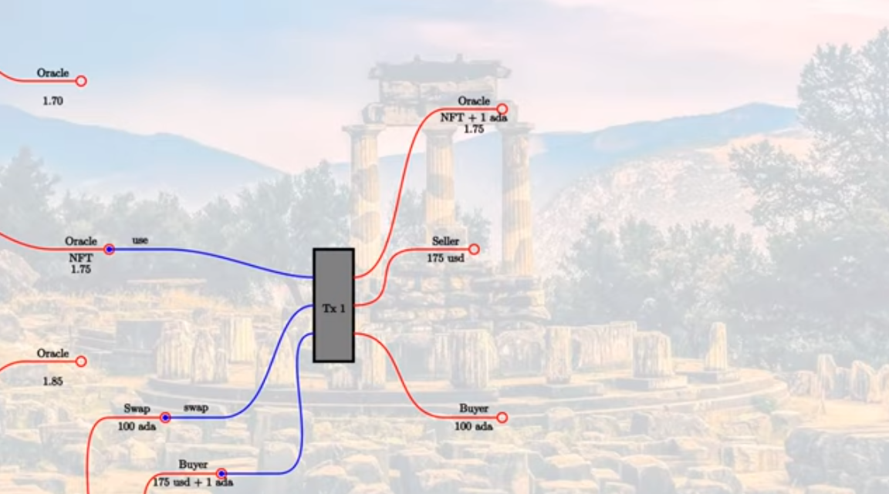

Week 06 - Oracles
=================

.. note::
      These is a written version of `Lecture
      #6 <https://www.youtube.com/watch?v=Tr2VBm8vOhw>`__.

      In this lecture we learn about oracles and using the PAB (Plutus Application Backend).

      These notes use Plutus commit 476409eaee94141e2fe076a7821fc2fcdec5dfcb

      
Overview
--------

In this lecture we are going to look at a case study, to see how what we have learned so far can be turned into an actual application. A collection of executables that even come with a little front end.

It will be a real dApp, apart from the fact that we don't have a real blockchain available yet. This will run on a
simulated blockchain - a mockchain.

The example we are going to use for this is to implement a very simple oracle.

.. note::
    In the blockchain world, an oracle is a way to get real-world information onto the blockchain, in order to
    make it usable in smart contracts.

There are numerous examples of use cases for oracles. We can think of external data sources such as weather data, election
results, stock exchange data or randomness. You may have a betting contract that depends on the outcome of a specific
sports game, for example.

There are various ways to implement oracles, of varying sophistication.

We are going to use a very simple approach, where we have one trusted data provider. And, as an example of data, we
are going to use the ADA/USD exchange rate.

There are lots of problems with this approach, as we have to trust the data source. There are ways to mitigate the risk
that the data source is either untrustworthy or unreliable. For example, we could ask the provider to put down some
collateral that is lost if data is not provided or is inaccurate. Or, you could combine several oracles into One
and only accept the result if they all agree, or take the median, or average value of various sources. You could also
come up with more sophisticated mechanisms.

As we know, for anything to happen on the blockchain, there must be a UTxO, so the obvious thing to do is to represent
the data feed as a UTxO. The UTxO sits at the script address of the oracle, and its datum field it carries the current 
value of the oracle data.

.. figure:: img/week06__00000.png

And this is where we find our first problem. As we have noted before, validation only happens when you want to consume
something from a script address, not when you produce an output at a script address. This means that we can't prevent
anybody producing arbitrary outputs at the script address.

.. figure:: img/week06__00001.png

Somehow we need to distinguish the true oracle output from other outputs that may be sitting at the same script address.
And the way we do this is to put an NFT on the output. Because an NFT can only exist once, there can only be one UTxO
at the script address that holds the NFT.

.. figure:: img/week06__00002.png

How can such an oracle be used?

Here we come to something we haven't seen before. In all our code writing validators and contracts, we always knew the
full API up front. In the case of an oracle, this is different. At the point that an oracle is created, you don't know how
people may want to use it. It must be like an open API, able to work with smart contracts that have not yet been
designed.

As an example of a use-case that might make use of this specific oracle, let's consider a swap contract where, at the swap
address, somebody can deposit ADA, and then somebody else can take those ADA in exchange for USD.

.. figure:: img/week06__00003.png

Of course, we don't have USD directly on the blockchain, but we can imagine that they are represented by some native token.

In this example, as the value at the oracle is 1.75, then if someone offers 100 ADA, the price for that should be
175 USD.

In addition to this, we need an incentive for the oracle to provide the data, because in additional to other costs for
providing the data, at a minimum they would have to pay fees to create the UTxO.

So, let's say that the oracle provider determines a fee of 1 ADA that has to be paid each time the oracle is used.

In this example, that would mean that the person wanting to by the ADA would have to pay 175 USD to the seller of the ADA,
and 1 ADA to the oracle.

What will the transaction look like?

.. figure:: img/week06__00004.png

First of all, the swap validation logic will need access to the current oracle value, which means that the oracle UTxO must be an input to the transaction.

Then we have the oracle validation logic. In this case we want to use the oracle. So, let's say we have a redeemer called *use*. Now, the oracle validator has
to check several things.

1. Is the NFT present in the consumed input?
2. Is there an output from the transaction at the same address containing the same NFT?
3. Is the value in the output UTxO the same as the input value?
4. Is the fee present?

Now we can complete the transaction.

We consume two additional inputs - the fee paid by the buyer and the 100 ADA deposited by the seller. Then we have two additional outputs - the 175 USD to the seller, and the 100 ADA to the buyer. And for these new inputs and
outputs, it is the responsibility of the swap validator to make sure that it is correct. Whereas, the oracle validator is only interested with making sure that everything concerning the oracle is correct.

Just to emphasize, this swap contract is just an example. The oracle should be capable of working with many different smart contracts that want to make use of its data.

If this was all, then we wouldn't need an oracle. If the value was fixed, so that it was always 1.75 then we could simply hard-code this into our contract. So, the value must be able to change. At least, in an example such
as this one where we have an exchange rate that can, of course, change over time. There may be other examples such as the result of a sports match, where it is a singular event in history, but in this case, it is important 
that it be able to change.

This means that the oracle validator, in addition to the *use* redeemer, must be able to support another operation where the provider of the oracle can actually change the data.

So let's say the the value changes from 1.75 to 1.77.

We know that on a (E)UTxO blockchain, nothing ever changes, so you can't change the datum of an existing UTxO. All you can do is consume UTxOs and produce new ones.

We would have a transaction that uses an *update* redeemer. The validation logic is somewhat different. It is the same as before in that the NFT needs to be present in the consumed oracle input, and also needs to be
present in the new output. In addition to that, the transaction must be signed by the oracle provider. And, we can use this update transaction as an opportunity for the oracle provider to collect the fees.

We insist that the NFT be present in the output, but we don't say anything about other values. All the fees that got there by other transactions using this oracle data can be collected during the *update* transaction.

.. figure:: img/week06__00006.png

Summary
~~~~~~~

To sum up, we represent the oracle by a UTxO and identify the correct UTxO with an NFT. The oracle value is the datum of the UTxO. We support two operations. 

One is *use* which uses the oracle in some arbitrary 
transaction. The *use* validator will make sure that the consumed oracle input carries the NFT, that there is an output that again carries the NFT, doesn't change the datum, and carries additional fees.

The second operation is *update* which can only be done by the oracle provider. For an *update* transaction, the oracle input must again carry the NFT, there must be an oracle output, also carrying the NFT. There are no 
further restrictions. The datum can change, and the accumulated fees can be taken out.

Writing the Oracle
------------------

Now that we know how it is supposed to work, let's look at some code.

Oracle Core
~~~~~~~~~~~

On-chain
++++++++

First, let's look at the Plutus code that implements the oracle itself.

.. code:: haskell

    module Week06.Oracle.Core

The oracle will be a parameterized contract, and it will depend on four fields.

.. code:: haskell

    data Oracle = Oracle
        { oSymbol   :: !CurrencySymbol
        , oOperator :: !PubKeyHash
        , oFee      :: !Integer
        , oAsset    :: !AssetClass
        } deriving (Show, Generic, FromJSON, ToJSON, Prelude.Eq, Prelude.Ord)    

- *oSymbol* is the currencySymbol of the NFT that is used to identify the transaction. We don't need the token name as we will just use the empty string as the token name.
- *oOperator* is the owner of the oracle - the hash of the public key owner which can make updates
- *oFee* is the fee in lovelace that is due every time the oracle is used
- *oAsset* represents the asset class that we want to exchange rate for against Ada, which in our case will be some kind of USD token

The redeemer will support two operations.

.. code:: haskell

    data OracleRedeemer = Update | Use
        deriving Show

    PlutusTx.unstableMakeIsData ''OracleRedeemer

We need to define the NFT asset class. As mentioned, we are going to use the empty string for the token name.

.. code:: haskell

    {-# INLINABLE oracleTokenName #-}
    oracleTokenName :: TokenName
    oracleTokenName = TokenName emptyByteString
    
The *oracleAsset* will be used to identify the NFT - this is not to be confused with *oAsset*, defined above.

.. code:: haskell

    {-# INLINABLE oracleAsset #-}
    oracleAsset :: Oracle -> AssetClass
    oracleAsset oracle = AssetClass (oSymbol oracle, oracleTokenName)

We create a little helper function called *oracleValue*. This takes an output transaction and a function which looks up the datum, and then returns an *Integer*. The *Integer* represents the exchange rate (e.g. 1.75) multiplied
by a million. This avoids potential complicates using real numbers.

.. code:: haskell

    {-# INLINABLE oracleValue #-}
    oracleValue :: TxOut -> (DatumHash -> Maybe Datum) -> Maybe Integer
    oracleValue o f = do
        dh      <- txOutDatum o
        Datum d <- f dh
        PlutusTx.fromData d
        
This function is an example of monadic computation in monad that is not *IO* or the *Contract* monad. First we call *txOutDatum*, which can fail if because not every output has a datum. If it succeeds, we get a datum hash
which we can reference in *dh*. Next we used the function *f* which is provided as the second argument to maybe turn this datum hash into a datum. This too can fail. If it succeeds we can reference the result in *d*. *Datum*
is just a newtype wrapper around *Data*, so we can then use *PlutusTx.fromData* to maybe turn *d* into an *Integer*. Again, this can fail, because even if the datum is there, it may not be convertible to an integer value.

We will see in a moment where we use the *oracleValue* function.

The most important function is *mkOracleValidator*.

.. code:: haskell

    {-# INLINABLE mkOracleValidator #-}
    mkOracleValidator :: Oracle -> Integer -> OracleRedeemer -> ScriptContext -> Bool
    mkOracleValidator oracle x r ctx =
        traceIfFalse "token missing from input"  inputHasToken  &&
        traceIfFalse "token missing from output" outputHasToken &&
        case r of
            Update -> traceIfFalse "operator signature missing" (txSignedBy info $ oOperator oracle) &&
                      traceIfFalse "invalid output datum"       validOutputDatum
            Use    -> traceIfFalse "oracle value changed"       (outputDatum == Just x)              &&
                      traceIfFalse "fees not paid"              feesPaid
      where
        info :: TxInfo
        info = scriptContextTxInfo ctx
    
        ownInput :: TxOut
        ownInput = case findOwnInput ctx of
            Nothing -> traceError "oracle input missing"
            Just i  -> txInInfoResolved i
    
        inputHasToken :: Bool
        inputHasToken = assetClassValueOf (txOutValue ownInput) (oracleAsset oracle) == 1
    
        ownOutput :: TxOut
        ownOutput = case getContinuingOutputs ctx of
            [o] -> o
            _   -> traceError "expected exactly one oracle output"
    
        outputHasToken :: Bool
        outputHasToken = assetClassValueOf (txOutValue ownOutput) (oracleAsset oracle) == 1
    
        outputDatum :: Maybe Integer
        outputDatum = oracleValue ownOutput (`findDatum` info)
    
        validOutputDatum :: Bool
        validOutputDatum = isJust outputDatum
    
        feesPaid :: Bool
        feesPaid =
          let
            inVal  = txOutValue ownInput
            outVal = txOutValue ownOutput
          in
            outVal `geq` (inVal <> Ada.lovelaceValueOf (oFee oracle))
            
            
The function *mkOracleValidator* takes our parameter *Oracle*, the datum, which, in this example is an *Integer*, the redeemer type *OracleRedeemer* and finally the *ScriptContext*.

There are two cases for this validator - *use* and *update* - but there are similarities. In both cases we want to check that we have the input that holds the NFT and that there is an output that holds the NFT.

As both these checks need to be done regardless of the use case, they are done upfront.

.. code:: haskell

    ...
    traceIfFalse "token missing from input"  inputHasToken  &&
    traceIfFalse "token missing from output" outputHasToken &&
    ...    
    
After this, we consider which use case we are dealing with.

.. code:: haskell

    case r of
        Update -> traceIfFalse "operator signature missing" (txSignedBy info $ oOperator oracle) &&
                  traceIfFalse "invalid output datum"       validOutputDatum
        Use    -> traceIfFalse "oracle value changed"       (outputDatum == Just x)              &&
                  traceIfFalse "fees not paid"              feesPaid    

Before looking at the *inputHasToken* function there is another help function to look at.

.. code:: haskell

    ownInput :: TxOut
    ownInput = case findOwnInput ctx of
        Nothing -> traceError "oracle input missing"
        Just i  -> txInInfoResolved i
        
The *ownInput* function returns the *TxOut* that the script is trying to consume, which in this case is the oracle output. The *Nothing* case here can happen if we are in a different context, such as a minting context, so
this eventuality will not occur for us. The *findOwnInput* function is provided by Plutus and will, given the context, find the relevant input.

The *inputHashToken* function checks that the token is present. It uses the *assetClassValueOf* function to look for the NFT within the *ownInput* response.

.. code:: haskell

    inputHasToken :: Bool
    inputHasToken = assetClassValueOf (txOutValue ownInput) (oracleAsset oracle) == 1

The next helper function, *ownOutput* checks that we have exactly one output and returns that output to us.

.. code:: haskell

    ownOutput :: TxOut
    ownOutput = case getContinuingOutputs ctx of
        [o] -> o
        _   -> traceError "expected exactly one oracle output"    

We can use this for the *outputHasToken* helper function in the same way as we did for the *inputHashToken* function.

.. code:: haskell

    outputHasToken :: Bool
    outputHasToken = assetClassValueOf (txOutValue ownOutput) (oracleAsset oracle) == 1

That covers the code for the common cases. Now, let's let at the code specific to the *update* case.

There are two conditions to check. The first is that the operator actually signed the transaction. This is so simple that we can do it inline without
a helper function.

.. code:: haskell

    traceIfFalse "operator signature missing" (txSignedBy info $ oOperator oracle)

The next thing to check is that the output datum. We know that the value can change, but we need to check that it is at least of the correct type.

.. code:: haskell

    traceIfFalse "invalid output datum" validOutputDatum
    
And for this we have referenced a new helper function *validOutputDatum*, which itself makes use of a helper function *outputDatum*.

.. code:: haskell

    outputDatum :: Maybe Integer
    outputDatum = oracleValue ownOutput (`findDatum` info)    

    validOutputDatum :: Bool
    validOutputDatum = isJust outputDatum

This works by trying to get the datum value from the datum hash and then trying to create the oracle value from it. If it succeeds it will return a *Just Integer*,
otherwise it will return *Nothing*, so the *validOutputDatum* function just needs to check that the return value is not *Nothing*, in other words, that it 
is a *Just*.

Note that we are not checking anything about the value of the *Integer*. This could even remain the same as the input value, if the transaction is used 
just to collect the fees that have accumulated from the use the oracle.

The second case for *mkOracleValidator* is the *use* case. This case can be used by anyone, but it is much more restrictive.

First, we don't allow the value to change. So this is the first condition.

.. code:: haskell

    traceIfFalse "oracle value changed" (outputDatum == Just x)

We have already written the *outputDatum* helper function. Instead of checking only that it is an *Integer*, here we also check that its output value is the same
as the input value.

And finally, we must check that the fees have been paid. And for this we use a new helper function called *feesPaid*.

.. code:: haskell

    feesPaid :: Bool
    feesPaid =
      let
        inVal  = txOutValue ownInput
        outVal = txOutValue ownOutput
      in
        outVal `geq` (inVal <> Ada.lovelaceValueOf (oFee oracle))    

This *feesPaid* function checks that the output value is at least as much as the input value plus the required fee. We again use the semigroup operator 
*<>* to add the fee value to the input value. We could have used equal (eq) instead of greater than or equal (geq). Using *geq* allows the user of the 
oracle to give the oracle provider a tip, if they so wish.

So this now is basically the core business logic of the oracle as shown in the diagrams.

.. figure:: img/week06__00006.png

Now we have our usual boilerplate. In particular notice that we use the pattern that we need for a parameterized validator.

.. code:: haskell

    data Oracling
    instance Scripts.ScriptType Oracling where
        type instance DatumType Oracling = Integer
        type instance RedeemerType Oracling = OracleRedeemer

    oracleInst :: Oracle -> Scripts.ScriptInstance Oracling
    oracleInst oracle = Scripts.validator @Oracling
        ($$(PlutusTx.compile [|| mkOracleValidator ||]) `PlutusTx.applyCode` PlutusTx.liftCode oracle)
        $$(PlutusTx.compile [|| wrap ||])
    where
        wrap = Scripts.wrapValidator @Integer @OracleRedeemer

    oracleValidator :: Oracle -> Validator
    oracleValidator = Scripts.validatorScript . oracleInst

    oracleAddress :: Oracle -> Ledger.Address
    oracleAddress = scriptAddress . oracleValidator

And this concludes the on-chain part of the oracle code.
    
Off-chain
+++++++++

We also create some off-chain code, namely to start the oracle, and to update it. However, we don't write off-chain code to *use* the oracle. That is not the 
responsibility of the author of this contract. That will be the responsibility of the person that wants to use the oracle - they will write the code to create the
transaction with the *use* redeemer.

This is the first time that we have seen the situation where we have some on-chain code that is not paired with some off-chain code.

