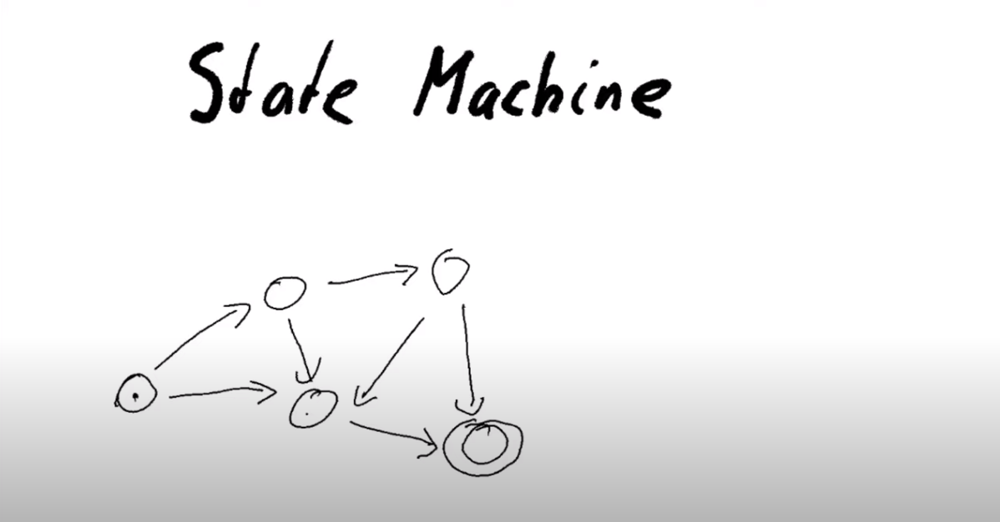

Week 07 - State Machines
========================

.. note::
    This is a written version of `Lecture
    #7 <https://www.youtube.com/watch?v=oJupInqvJUI>`__.

    It covers commit schemes and state machines.

    This week we were using Plutus commit 530cc134364ae186f39fb2b54239fb7c5e2986e9

Introduction
------------

In this lecture we will look at state machines. State machines can be very useful to shorter and more concise contracts, both on-chain and off-chain. There is higher level support for state machines in the Plutus libraries that builds on top of the lower level mechanisms we have seen so far.

As a running example, we are going to implement a little game, played between Alice and Bob. It's a bit like Rock, Paper, Scissors, but even simpler, because there are 
only two options.

Alice and Bob both have two options, they can either play 0 or 1.

.. figure:: img/week07__00000.png

If there were to play this game while being physically in the same room, they would make their moves at the same time. There would be one gesture for 0 and one
gesture for 1, they would raise their hands simultaneously, and, depending on what they play, one of them wins.

If they both play the same number, Alice wins. If they play different numbers, Bob wins.

.. figure:: img/week07__00001.png

Now let's imagine that Alice and Bob can't meet in person but that they still want to play the game. So, they decide to play it via mail - email or snail mail, it doesn't
matter. How would that work?

Alice could send her move to Bob.

.. figure:: img/week07__00004.png

This, however, gives a very unfair advantage to Bob, because now he opens Alice's mail, see that she has played 0, and he can simply reply with 1, and he wins.

.. figure:: img/week07__00003.png

And, if Alice plays 1, Bob can simply respond with 1. So Bob always wins, at least if he is unfair.

.. figure:: img/week07__00005.png

What can we do about that? 

There's a very clever trick which is often used in cryptographic protocols, and that is commit schemes. The idea is that Alice doesn't reveal her choice to Bob, but she commits to it, so that she cannot later change her mind.

One way to make that work is using hash functions.

Hashes are all over the place in the blockchain world. We have seen that script addresses are just the hash of the Plutus code script, and we have seen lots of examples of
public key hashes.

A hash function is a one-way function. Given a hash, tt is difficult, or impossible, to reconstruct the original byte string that was hashed.

So, one way we could try to make this work is that, instead of Alice sending her choice to Bob, she instead sends the hash of her choice.

.. figure:: img/week07__00006.png

Bob then sees this cryptic byte string and he has no idea whether Alice picked 0 or 1.

Bob then replies with his move, picking, for example 0. There is no need for him to use a hash, he can just send his response in clear text. 

Now, Alice would have won. But perhaps Bob doesn't believe her. So there is one additional step that Alice has to take.

Alice has to send her actual choice to Bob in clear text. Bob then has to check that the hash of her choice is indeed the same as the hash Alice sent earlier.

.. figure:: img/week07__00007.png

If it is, then he knows sees that Alice is not lying and that indeed he lost. If it does not match, then he knows that Alice is cheating and he would win.

This all sounds promising, but there is one big problem with it.

In this game there are only two choices, 0 and 1. Which means that there are only two possible hashes. They may look very cryptic to Bob the first time they play, 
but before long he will notice that he always sees one of only two possible hashes, and then he can know which choice Alice made.

This is almost as bad as if Alice had just sent her choice in clear text.

What we can do about this is that, instead of sending the hash of her choice, she instead first selects an arbitrary byte string and then hashes the
concatenated of this byte string and her choice. The arbitrary byte string that Alice chooses is called a *nonce* - a number to be used just once.

.. figure:: img/week07__00008.png

So now, it is not always the same byte string if she picks 0, provided she chooses some random, unpredictable nonce.

Now, Bob receives this and we proceed as before - Bob sends his choice, and then, in the third message Alice needs to send not only her original choice, but she also 
has to send the nonce as well.

.. figure:: img/week07__00010.png

And then Bob checks that the hash of Alice's claimed nonce concatenated with her choice is indeed the hash that he originally received. If it is, he knows he lost, and 
if it is not, he knows that she tried to cheat him.

This works very nicely and this is what we will try to implement in Cardano. First we will do it using techniques we have already seen, and then we will see how, by using 
state machines, the code can be much clearer and much shorter.

Code Example 1
~~~~~~~~~~~~~~

We can imagine that, at the start of the game, Alice and Bob have put down the same amount of money each and that the winner will take it all.

The game starts with Alice posting her hash, as described above. Bob, if he plays along, will post his own choice. At this point, we have Alice's hash and Bob's choice.

.. figure:: img/week07__00011.png

If, at this point, Alice realizes that she has won, based on Bob's choice, she can reveal her secret, the game ends, and she has won.

.. figure:: img/week07__00012.png

If, however, after Bob makes his move, Alice sees that she has lost, there is no need for her to do anything. After a certain deadline has been reached, if Alice has
not responded, Bob will be able to claim the funds.

.. figure:: img/week07__00013.png

There is a another scenario. Perhaps, after Alice starts playing, Bob simply isn't interested. In this case, there must be a way for Alice to get her own money back.

.. figure:: img/week07__00016.png

As mentioned, our first attempt at coding this in Plutus will be using the techniques we have learned in previous lectures.

The code we are working with is in the following module

.. code:: haskell

    module Week07.EvenOdd

We call the game *EvenOdd* due to the fact that if the sum of the numbers is even, then the first player wins, and if the sum is odd, the second player wins.

In our code we will call the players *first* and *second* rather than Alice and Bob.

On chain
++++++++

We define a data type *Game* which will be used as a parameter for the contract.

.. code:: haskell

    data Game = Game
        { gFirst          :: !PubKeyHash
        , gSecond         :: !PubKeyHash
        , gStake          :: !Integer
        , gPlayDeadline   :: !Slot
        , gRevealDeadline :: !Slot
        , gToken          :: !AssetClass
        } deriving (Show, Generic, FromJSON, ToJSON, Prelude.Eq, Prelude.Ord)    

The players are identified by their public key hashes as *gFirst* and *gSecond*. 

The number of lovelace to be used as stake in the game is represented by *gStake* - This stake must be provided by each player.

There are two deadlines. The *gPlayDeadline* is the slot by which the second player must make their move. In the case where the second player has made a move,
the *gRevealDeadline* is the slot by which player 1 must claim victory by revealing his nonce.

Finally we have a token represented by *gToken*. This will be the same trick that we used for the oracle. It will be an arbitrary NFT, used to identify the right 
instance of the UTxO that we are using. The idea is to use the datum sitting at a UTxO in this contract's script address to keep track of where we are in the game.

Next, we define the two moves that the players can make.

.. code:: haskell

    data GameChoice = Zero | One
        deriving (Show, Generic, FromJSON, ToJSON, ToSchema, Prelude.Eq, Prelude.Ord)    

    instance Eq GameChoice where
        {-# INLINABLE (==) #-}
        Zero == Zero = True
        One  == One  = True
        _    == _    = False

We need Plutus *Eq* for the instance, but it is not possible to declare that in the deriving clause, which is why the *Eq* in the deriving clause is qualified as being
from the standard Haskell Prelude.

Note that we have used the *INLINABLE* pragma on the *Eq* instance for *GameChoice*. This is again to make it compatible with the Template Haskell we will need to
use.

For state, we will use a type called *GameDatum*.

.. code:: haskell

    data GameDatum = GameDatum ByteString (Maybe GameChoice)
    deriving Show

    instance Eq GameDatum where
        {-# INLINABLE (==) #-}
        GameDatum bs mc == GameDatum bs' mc' = (bs == bs') && (mc == mc')    

Here, the *ByteString* is the hash that the first player submits, and *Maybe GameChoice* is either *Just* the move of the second player, or *Nothing*, if they have not yet moved.

Now we come to the redeemer, and we will use a custom type for this as well.

.. code:: haskell

    data GameRedeemer = Play GameChoice | Reveal ByteString | ClaimFirst | ClaimSecond
        deriving Show

Here *Play* is where the second player moves and, as an argument, it has a *GameChoice*. *Reveal* is for the case where the first player has won and must prove that
by revealing their nonce, and the nonce is represented by the *ByteString* argument. We don't need to include the move for the *Reveal*, as they will only reveal if they
have won, and we know what move makes them win.

*ClaimFirst* is when the first player claims back the stake in the even that the second player does not make a move by the play deadline. *ClaimSecond* is for the 
case when the first player does not reveal by the reveal deadline.

We then have our *lovelaces* helper function which we have used in other scripts, which gets the number of lovelaces held in a *Value*.

.. code:: haskell

    lovelaces :: Value -> Integer
    lovelaces = Ada.getLovelace . Ada.fromValue

And we have a helper function *gameDatum* which behaves exactly the same way as the function *oracleValue*, which you can find in the notes from lecture 6.

.. code:: haskell

    gameDatum :: TxOut -> (DatumHash -> Maybe Datum) -> Maybe GameDatum
    gameDatum o f = do
        dh      <- txOutDatum o
        Datum d <- f dh
        PlutusTx.fromData d    

Now we come to the core business logic in the *mkGameValidator* function.

.. code:: haskell

    mkGameValidator :: Game -> ByteString -> ByteString -> GameDatum -> GameRedeemer -> ScriptContext -> Bool
    mkGameValidator game bsZero' bsOne' dat red ctx =
    ...
    
The first argument is the *Game* parameter discussed above. 

The second and the third arguments are somewhat of a nuisance. We just need them due to the fact that it is not possible to use string literals to 
get *ByteStrings* in Haskell that is compiled to Plutus core. And, we want string literals representing the 0 and 1 choices. So *bsZero'* will hold "0" and 
*beOne'* will hold "1". You will see how we pass these in as auxiliary arguments later.

Then we pass in the usual arguments for datum, redeemer and context.

Let's look at some helper functions first. There are three functions we have used before and discussed in lecture 6.

.. code:: haskell

    info :: TxInfo
    info = scriptContextTxInfo ctx

    ownInput :: TxOut
    ownInput = case findOwnInput ctx of
        Nothing -> traceError "game input missing"
        Just i  -> txInInfoResolved i

    ownOutput :: TxOut
    ownOutput = case getContinuingOutputs ctx of
        [o] -> o
        _   -> traceError "expected exactly one game output"
        
Note the *ownInput* should never fail as we are in the process of validating a UTxO.

The *outputDatum* helper makes use of the *GameDatum* type which we defined earlier. Given the case we have exactly one output (the return from *ownOutput*), it will
give us the datum.

.. code:: haskell

    outputDatum :: GameDatum
    outputDatum = case gameDatum ownOutput (`findDatum` info) of
        Nothing -> traceError "game output datum not found"
        Just d  -> d
        
The *checkNonce* function is for the case where the first player as won and wants to prove it by revealing their nonce. The first argument is hash that was original sent, 
the second argument is the nonce that is being revealed. 

For the *GameChoice*-typed parameter, we will be passing in the move made by player 2. This should be the same as the move made by player 1, and this is what this function will determine using the hash and the nonce.

In order to check the hash of the nonce concatenated with the *GameChoice*, we use a helper function to convert the *GameChoice* to a *ByteString*. Note that the use 
of the *cFirst* and *cSecond* in the *checkNonce* function could be swapped around, and the function would work just the same - the difference between the two is that
one is a *GameChoice* and one is a *ByteString*.

.. code:: haskell

    checkNonce :: ByteString -> ByteString -> GameChoice -> Bool
    checkNonce bs nonce cSecond = sha2_256 (nonce `concatenate` cFirst) == bs
      where
        cFirst :: ByteString
        cFirst = case cSecond of
            Zero -> bsZero'
            One  -> bsOne'    

Finally, there is the question of what happens to the NFT once the game is over and there is no game address anymore. The way we have implemented it here, is that the NFT goes back to the first player. The first player needs it in the beginning to kick off the game and put the NFT 
into the correct UTxO, so it is reasonable to give it back the player 1 in the end.

To verify that this condition is met, we have created a helper function called *nftToFirst*.

.. code:: haskell

    nftToFirst :: Bool
    nftToFirst = assetClassValueOf (valuePaidTo info $ gFirst game) (gToken game) == 1

Now that we have covered the helper functions, let's look at the conditions.

There is one condition that covers all the cases, and that is that the input we are validating must contain the NFT.

.. code:: haskell

    traceIfFalse "token missing from input" (assetClassValueOf (txOutValue ownInput) (gToken game) == 1) &&

After that, the rules depend on the situation.    

.. code:: haskell

    case (dat, red) of

The first situation is the one where the second player has not yet moved, and they are just now making their move.

.. code:: haskell

    (GameDatum bs Nothing, Play c) ->
        traceIfFalse "not signed by second player"   (txSignedBy info (gSecond game))                                   &&
        traceIfFalse "first player's stake missing"  (lovelaces (txOutValue ownInput) == gStake game)                   &&
        traceIfFalse "second player's stake missing" (lovelaces (txOutValue ownOutput) == (2 * gStake game))            &&
        traceIfFalse "wrong output datum"            (outputDatum == GameDatum bs (Just c))                             &&
        traceIfFalse "missed deadline"               (to (gPlayDeadline game) `contains` txInfoValidRange info)         &&
        traceIfFalse "token missing from output"     (assetClassValueOf (txOutValue ownOutput) (gToken game) == 1)    

Here, the first part is the *GameDatum* and it contains the first player's hash and a *Nothing* which shows that the second player has not yet moved. The second part is the *GameRedeemer* and has been determined
to be of type *Play GameChoice*. We assign the *GameChoice* part to *c* using pattern matching.

We check that the second player has signed the transaction. 

.. code:: haskell

    traceIfFalse "not signed by second player" (txSignedBy info (gSecond game))

Then, we check that the first player's stake is present in the input.

.. code:: haskell

    traceIfFalse "first player's stake missing" (lovelaces (txOutValue ownInput) == gStake game)

The output should have the second player's stake added to the total stake.

.. code:: haskell

    traceIfFalse "second player's stake missing" (lovelaces (txOutValue ownOutput) == (2 * gStake game))

We now exactly what the datum of the output must be. It must be the same hash, plus the move made by the second player.

.. code:: haskell
    
    traceIfFalse "wrong output datum" (outputDatum == GameDatum bs (Just c))

The, the move must happen before the play deadline.

.. code:: haskell

    traceIfFalse "missed deadline" (to (gPlayDeadline game) `contains` txInfoValidRange info)

And finally, the NFT must be passed on in the output UTxO.

.. code:: haskell

    traceIfFalse "token missing from output" (assetClassValueOf (txOutValue ownOutput) (gToken game) == 1)    

The second situation is where both players have moved, and the second player discovers that they have won. In order to prove that and get the winnings, they have 
to reveal their nonce.

So, the transaction must be signed by the first player, the nonce must indeed agree with the hash submitted earlier, it must be done before the reveal deadline,
the input must contain both players' stakes and, finally, the NFT must go back to the first player.

.. code:: haskell

    (GameDatum bs (Just c), Reveal nonce) ->
        traceIfFalse "not signed by first player"    (txSignedBy info (gFirst game))                                    &&
        traceIfFalse "commit mismatch"               (checkNonce bs nonce c)                                            &&
        traceIfFalse "missed deadline"               (to (gRevealDeadline game) `contains` txInfoValidRange info)       &&
        traceIfFalse "wrong stake"                   (lovelaces (txOutValue ownInput) == (2 * gStake game))             &&
        traceIfFalse "NFT must go to first player"   nftToFirst    

Next we have the case where the second player doesn't move within the deadline, and the first player is reclaiming their stake. Here, the first player must have signed 
the transaction, the play deadline must have passed, their stake must be present, and the NFT must go back to the first player.

.. code:: haskell

    (GameDatum _ Nothing, ClaimFirst) ->
        traceIfFalse "not signed by first player"    (txSignedBy info (gFirst game))                                    &&
        traceIfFalse "too early"                     (from (1 + gPlayDeadline game) `contains` txInfoValidRange info)   &&
        traceIfFalse "first player's stake missing"  (lovelaces (txOutValue ownInput) == gStake game)                   &&
        traceIfFalse "NFT must go to first player"   nftToFirst

Finally, the case where both players have moved and the first player has either lost or not revealed in time, so the second player is claiming the winnings. This time, the
transaction must be signed by the second player, the reveal deadline must have passed, both players' stakes must be present, and the NFT must, as usual, go back
to the first player.

.. code:: haskell

    (GameDatum _ (Just _), ClaimSecond) ->
        traceIfFalse "not signed by second player"   (txSignedBy info (gSecond game))                                   &&
        traceIfFalse "too early"                     (from (1 + gRevealDeadline game) `contains` txInfoValidRange info) &&
        traceIfFalse "wrong stake"                   (lovelaces (txOutValue ownInput) == (2 * gStake game))             &&
        traceIfFalse "NFT must go to first player"   nftToFirst

These four cases are all the legitimate cases that we can have, so in all other cases we fail validation.

.. code:: haskell

    _ -> False

So now let's look at the rest of the on-chain code.

As usual, we define a data type that holds the information about the types the datum and redeemer.

.. code:: haskell

    data Gaming
    instance Scripts.ScriptType Gaming where
        type instance DatumType Gaming = GameDatum
        type instance RedeemerType Gaming = GameRedeemer    

And we define the *ByteStrings* that will be used to represent the two choices. These values are completely arbitrary - they just can't be the same as each other.

.. code:: haskell

    bsZero, bsOne :: ByteString
    bsZero = "0"
    bsOne  = "1"

Boilerplate to compile our parameterized *mkGameValidator* to Plutus code. We apply the three parameters, *Game* and the two *ByteStrings*\s. Remember that, we need
to pass in these *ByteString* parameters because we can't refer to *ByteString*\s as string literals within Plutus.

.. code:: haskell

    gameInst :: Game -> Scripts.ScriptInstance Gaming
    gameInst game = Scripts.validator @Gaming
        ($$(PlutusTx.compile [|| mkGameValidator ||])
            `PlutusTx.applyCode` PlutusTx.liftCode game
            `PlutusTx.applyCode` PlutusTx.liftCode bsZero
            `PlutusTx.applyCode` PlutusTx.liftCode bsOne)
        $$(PlutusTx.compile [|| wrap ||])
      where
        wrap = Scripts.wrapValidator @GameDatum @GameRedeemer
        
The usual boilerplate for validator and address.

.. code:: haskell

    gameValidator :: Game -> Validator
    gameValidator = Scripts.validatorScript . gameInst
    
    gameAddress :: Game -> Ledger.Address
    gameAddress = scriptAddress . gameValidator

Now, as preparation for the off-chain code, we will need to be able to find the right UTxO - the one that carries the NFT. To do this we will write a helper function 
called *findGameOutput*.

.. code:: haskell

    findGameOutput :: HasBlockchainActions s => Game -> Contract w s Text (Maybe (TxOutRef, TxOutTx, GameDatum))
    findGameOutput game = do
        utxos <- utxoAt $ gameAddress game
        return $ do
            (oref, o) <- find f $ Map.toList utxos
            dat       <- gameDatum (txOutTxOut o) (`Map.lookup` txData (txOutTxTx o))
            return (oref, o, dat)
      where
        f :: (TxOutRef, TxOutTx) -> Bool
        f (_, o) = assetClassValueOf (txOutValue $ txOutTxOut o) (gToken game) == 1
        
The *findGameOutput* function takes the *Game*, then uses the *Contract* monad to try to find the UTxO with the NFT. It returns a *Maybe*, because it may not find one.
If we find it, we return a *Just* of a triple containing the transaction reference, the transaction itself, and the *GameDatum*.

First we get a list of all the UTxOs at the game address, then we use the *find* function, passing in a helper function *f*, which checks whether the output contains the
NFT.

The *find* function is found in module *Data.List* and is defined as

.. code:: haskell

    find :: Foldable t => (a -> Bool) -> t a -> Maybe a

This works for more general containers than just lists, but you can think of lists in this example. It gets a predicate for an element of the *Foldable* type - the list in 
this case, and also takes a container of *a*\s - again a list in this example, and returns a *Maybe a*.

The logic is that if it finds an element that satisfies the predicate, it will return it as a *Just*, otherwise it will return *Nothing*. For example

.. code:: haskell

    Prelude Data.List Week07.EvenOdd> find even [1 :: Int, 3, 5, 8, 11, 12]
    Just 8

    Prelude Data.List Week07.EvenOdd> find even [1 :: Int, 3, 5, 11]
    Nothing

The *firstGame* contract
________________________
    
We have two contracts, one for each of the players.

Each contract has its own params type. For the *firstGame* contract, we call this type *FirstParams*.

.. code:: haskell

    data FirstParams = FirstParams
        { fpSecond         :: !PubKeyHash
        , fpStake          :: !Integer
        , fpPlayDeadline   :: !Slot
        , fpRevealDeadline :: !Slot
        , fpNonce          :: !ByteString
        , fpCurrency       :: !CurrencySymbol
        , fpTokenName      :: !TokenName
        , fpChoice         :: !GameChoice
        } deriving (Show, Generic, FromJSON, ToJSON, ToSchema)

We don't need a *fpFirst* field here, as the first player is the owner of the wallet, so we know their public key hash. But we need *fpSecond* and also the familiar
fields for stake, play deadline and reveal deadline.

Then we need the nonce, the NFT (split into *fpCurrency* and *fpTokenName*), and finally the move that the player wants to make.

Now, for the contract

.. code:: haskell

    firstGame :: forall w s. HasBlockchainActions s => FirstParams -> Contract w s Text ()
    firstGame fp = do
    ...

The first thing we do is to get our own public key hash.

.. code:: haskell

        pkh <- pubKeyHash <$> Contract.ownPubKey

Then we populate the fields of the game.

.. code:: haskell

        let game = Game
                { gFirst          = pkh
                , gSecond         = fpSecond fp
                , gStake          = fpStake fp
                , gPlayDeadline   = fpPlayDeadline fp
                , gRevealDeadline = fpRevealDeadline fp
                , gToken          = AssetClass (fpCurrency fp, fpTokenName fp)
                }

The *v* value is our stake plus the NFT, which must both go into the UTxO.

.. code:: haskell

        let ...
            v    = lovelaceValueOf (fpStake fp) <> assetClassValue (gToken game) 1

We then calculate the hash that we need to send as our disguised move.

.. code:: haskell

        let ...
            c    = fpChoice fp
            bs   = sha2_256 $ fpNonce fp `concatenate` if c == Zero then bsZero else bsOne

We then submit the transaction and wait as usual. The constraints are very simple. We just need to create a UTxI with the datum of our move (nothing yet for the second player), and the value *v* we defined above.

.. code:: haskell

        let ...
            tx   = Constraints.mustPayToTheScript (GameDatum bs Nothing) v
        ledgerTx <- submitTxConstraints (gameInst game) tx
        void $ awaitTxConfirmed $ txId ledgerTx
        logInfo @String $ "made first move: " ++ show (fpChoice fp)

And we wait for the play deadline slot, at which point the winner can be determined.

.. code:: haskell
    
        void $ awaitSlot $ 1 + fpPlayDeadline fp

Once the deadline passed, we get hold of the UTxO. If, at this point, the UTxO is not found, something has gone very wrong. We know that we have produced the UTxO, and the 
only thing that the second player should be able to do is create a new one.
        
.. code:: haskell

        m <- findGameOutput game
        case m of
            Nothing             -> throwError "game output not found"

So, assuming we find it, the first case we define is the one where the second player hasn't moved. So we can use the *ClaimFirst* redeemer to get the stake back.

As lookups we need to provide the UTxO and the validator of the game.

.. code:: haskell

            Just (oref, o, dat) -> case dat of
                GameDatum _ Nothing -> do
                    logInfo @String "second player did not play"
                    let lookups = Constraints.unspentOutputs (Map.singleton oref o) <>
                                  Constraints.otherScript (gameValidator game)
                        tx'     = Constraints.mustSpendScriptOutput oref (Redeemer $ PlutusTx.toData ClaimFirst)
                    ledgerTx' <- submitTxConstraintsWith @Gaming lookups tx'
                    void $ awaitTxConfirmed $ txId ledgerTx'
                    logInfo @String "reclaimed stake"

The second case is that the second player did move, and they lost. In which case we must now reveal our nonce, which we do using the *Reveal* redeemer.

We must put an additional constraint that the transaction must be submitted before the reveal deadline has passed.

.. code:: haskell

                GameDatum _ (Just c') | c' == c -> do
                    logInfo @String "second player played and lost"
                    let lookups = Constraints.unspentOutputs (Map.singleton oref o)                                         <>
                                  Constraints.otherScript (gameValidator game)
                        tx'     = Constraints.mustSpendScriptOutput oref (Redeemer $ PlutusTx.toData $ Reveal $ fpNonce fp) <>
                                  Constraints.mustValidateIn (to $ fpRevealDeadline fp)
                    ledgerTx' <- submitTxConstraintsWith @Gaming lookups tx'
                    void $ awaitTxConfirmed $ txId ledgerTx'
                    logInfo @String "victory"

If the second player moved and won, there is nothing for use to do.

.. code:: haskell

                _ -> logInfo @String "second player played and won"

The *secondGame* contract
_________________________

The params for the second player are similar to those of the first player. This time we don't need the second player's public key hash, because that is ours, and we already 
know what it is. Instead we need the first player's public key hash. Also, we don't need the nonce.

.. code:: haskell

    data SecondParams = SecondParams
        { spFirst          :: !PubKeyHash
        , spStake          :: !Integer
        , spPlayDeadline   :: !Slot
        , spRevealDeadline :: !Slot
        , spCurrency       :: !CurrencySymbol
        , spTokenName      :: !TokenName
        , spChoice         :: !GameChoice
        } deriving (Show, Generic, FromJSON, ToJSON, ToSchema)    

First we get our own public key hash then we set up the game values, in a similar way as we did for the first player.

.. code:: haskell

    secondGame :: forall w s. HasBlockchainActions s => SecondParams -> Contract w s Text ()
    secondGame sp = do
        pkh <- pubKeyHash <$> Contract.ownPubKey
        let game = Game
                { gFirst          = spFirst sp
                , gSecond         = pkh
                , gStake          = spStake sp
                , gPlayDeadline   = spPlayDeadline sp
                , gRevealDeadline = spRevealDeadline sp
                , gToken          = AssetClass (spCurrency sp, spTokenName sp)
                }

Now, we try to find the UTxO that contains the NFT

.. code:: haskell

        m <- findGameOutput game

If we don't find it, then there is nothing to do, but if we do find it...

.. code:: haskell
    
        case m of
            Just (oref, o, GameDatum bs Nothing) -> do
                logInfo @String "running game found"

Then we want to call the script with the *Play* redeemer.

We assign the NFT to *token*.

.. code:: haskell
    
    let token   = assetClassValue (gToken game) 1

We now calculate the value that we must put in the new output. Remember, if we decide to play, we must consume the existing UTxO and create a new one at the same address. The 
first will contain the stake that the first player added, and now we must add our own stake, and we must keep the NFT in there.

.. code:: haskell

    let v = let x = lovelaceValueOf (spStake sp) in x <> x <> token

Next, our choice.

.. code:: haskell

    let c = spChoice sp

Then the constraints and their required lookups.

We must consume the existing UTxO using the Play redeemer with our choice

.. code:: haskell

    let tx = Constraints.mustSpendScriptOutput oref (Redeemer $ PlutusTx.toData $ Play c) <>

And create a new UTxO with the updated datum (the same *bs*, but with our choice), and with the *v* that we computed.

.. code:: haskell
    
    Constraints.mustPayToTheScript (GameDatum bs $ Just c) v <>

And it must be done before the deadline passes.

.. code:: haskell

    
    Constraints.mustValidateIn (to $ spPlayDeadline sp)

For lookups, we need the UTxO, the validator, and, because we are producing a UTxO for the script, we need the script instance.

.. code:: haskell

    let lookups = Constraints.unspentOutputs (Map.singleton oref o)                            <>
                  Constraints.otherScript (gameValidator game)                                 <>
                  Constraints.scriptInstanceLookups (gameInst game)

Then we do the usual thing, we submit, we wait for confirmation and we log.

.. code:: haskell

    ledgerTx <- submitTxConstraintsWith @Gaming lookups tx
    let tid = txId ledgerTx
    void $ awaitTxConfirmed tid
    logInfo @String $ "made second move: " ++ show (spChoice sp)
    
Then we wait until the reveal deadline has passed.

.. code:: haskell

    void $ awaitSlot $ 1 + spRevealDeadline sp
          
And we again try to find the UTxO, which could now be a different one.

.. code:: haskell

    m' <- findGameOutput game

If *m'* is *Nothing* - in other words, if we did not find a UTxO, then that means that while we were waiting, the first player revealed and won. So there is nothing 
for us to do.

.. code:: haskell

    case m' of
        Nothing             -> logInfo @String "first player won"

However, if we do find the UTxO, it means the first player didn't reveal, which means that either they decided not to play, probably because they lost. In any case, we 
can now claim the winnings.   

Our constraints are that we must spend the UTxO that we found after the deadline has passed, and we must hand back the NFT to the first player.

.. code:: haskell

        Just (oref', o', _) -> do
            logInfo @String "first player didn't reveal"
            let lookups' = Constraints.unspentOutputs (Map.singleton oref' o')                              <>
                           Constraints.otherScript (gameValidator game)
                tx'      = Constraints.mustSpendScriptOutput oref' (Redeemer $ PlutusTx.toData ClaimSecond) <>
                           Constraints.mustValidateIn (from $ 1 + spRevealDeadline sp)                      <>
                           Constraints.mustPayToPubKey (spFirst sp) token
            ledgerTx' <- submitTxConstraintsWith @Gaming lookups' tx'
            void $ awaitTxConfirmed $ txId ledgerTx'
            logInfo @String "second player won"

If we didn't find the NFT, then there is nothing for use to do.
                        
.. code:: haskell
    
            _ -> logInfo @String "no running game found"            

That is all the code we need for the two on-chain contracts.

To make them more accessible, we define two *Endpoint*\s, one for the first player, and one for the second. And then we define a contract 
called *endpoints* which offers a choice between these two *Endpoint*\s, and recursively calls itself.

.. code:: haskell

    type GameSchema = BlockchainActions .\/ Endpoint "first" FirstParams .\/ Endpoint "second" SecondParams

    endpoints :: Contract () GameSchema Text ()
    endpoints = (first `select` second) >> endpoints
      where
        first  = endpoint @"first"  >>= firstGame
        second = endpoint @"second" >>= secondGame

So this concludes the first version of the game - the version that does not use state machines.

Now, let's test it using the *EmulatorTrace* monad.

Testing
_______

The *test* function tests each of the four combinations by calling the *test'* function which takes the first and second players' choices respectively.        

The *test'* function uses the *runEmulatorTraceIO'* variant which allows us to set up the initial wallet distributions using an *EmulatorConfig*.

.. code:: haskell

    test :: IO ()
    test = do
        test' Zero Zero
        test' Zero One
        test' One Zero
        test' One One

    test' :: GameChoice -> GameChoice -> IO ()
    test' c1 c2 = runEmulatorTraceIO' def emCfg $ myTrace c1 c2
      where
        emCfg :: EmulatorConfig
        emCfg = EmulatorConfig $ Left $ Map.fromList
            [ (Wallet 1, v <> assetClassValue (AssetClass (gameTokenCurrency, gameTokenName)) 1)
            , (Wallet 2, v)
            ]
    
        v :: Value
        v = Ada.lovelaceValueOf 1000_000_000
        
As NFTs are not the focus of this lecture, we have conjured a test NFT out of thin air. In a real world scenario, we would need to mint a real NFT, using one of the methods we have seen before.

Now the trace. We pass the two game choices into the *myTrace* function.

.. code:: haskell

    myTrace :: GameChoice -> GameChoice -> EmulatorTrace ()
    myTrace c1 c2 = do
        Extras.logInfo $ "first move: " ++ show c1 ++ ", second move: " ++ show c2
    
Then we start two instances of the contract, one for wallet 1 and one for wallet 2.

.. code:: haskell

        h1 <- activateContractWallet (Wallet 1) endpoints
        h2 <- activateContractWallet (Wallet 2) endpoints

We look up the two public key hashes.

.. code:: haskell

        let pkh1 = pubKeyHash $ walletPubKey $ Wallet 1
            pkh2 = pubKeyHash $ walletPubKey $ Wallet 2
    
Then we define the parameters that we are going to use for the contracts. In reality *fpNonce* would be some random string, but here we just hardcode as "SECRETNONCE".

.. code:: haskell

            fp = FirstParams
                    { fpSecond         = pkh2
                    , fpStake          = 5000000
                    , fpPlayDeadline   = 5
                    , fpRevealDeadline = 10
                    , fpNonce          = "SECRETNONCE"
                    , fpCurrency       = gameTokenCurrency
                    , fpTokenName      = gameTokenName
                    , fpChoice         = c1
                    }
            sp = SecondParams
                    { spFirst          = pkh1
                    , spStake          = 5000000
                    , spPlayDeadline   = 5
                    , spRevealDeadline = 10
                    , spCurrency       = gameTokenCurrency
                    , spTokenName      = gameTokenName
                    , spChoice         = c2
                    }

And then we call the endpoints.

.. code:: haskell

        callEndpoint @"first" h1 fp
    
        void $ Emulator.waitNSlots 3
    
        callEndpoint @"second" h2 sp
    
        void $ Emulator.waitNSlots 10

Now, we can run this test from the REPL.

.. code:: haskell

    cabal repl
    Prelude Week07.StateMachine> :l Week07.Test
    Prelude Week07.Test> test

Test 1
......

The first scenario is that both play zero, so the first wallet should win.

.. code:: haskell

    Slot 00000: TxnValidate 9fbe753823edc9d69538ae9a03702708ccac2b9ae58b8426bcfcf99e274dd552
    Slot 00000: SlotAdd Slot 1
    Slot 00001: *** USER LOG: first move: Zero, second move: Zero
    Slot 00001: 00000000-0000-4000-8000-000000000000 {Contract instance for wallet 1}:
      Contract instance started
    Slot 00001: 00000000-0000-4000-8000-000000000001 {Contract instance for wallet 2}:
      Contract instance started

The first wallet creates the initial UTxO with its stake, and logs a message that it made the move.

.. code:: haskell

    Slot 00001: 00000000-0000-4000-8000-000000000000 {Contract instance for wallet 1}:
      Receive endpoint call: Object (fromList [("tag",String "first"),("value",Object (fromList [("unEndpointValue",Object (fromList [("fpChoice",String "Zero"),("fpCurrency",Object (fromList [("unCurrencySymbol",String "ff")])),("fpNonce",String "5345435245544e4f4e4345"),("fpPlayDeadline",Object (fromList [("getSlot",Number 5.0)])),("fpRevealDeadline",Object (fromList [("getSlot",Number 10.0)])),("fpSecond",Object (fromList [("getPubKeyHash",String "39f713d0a644253f04529421b9f51b9b08979d08295959c4f3990ee617f5139f")])),("fpStake",Number 5000000.0),("fpTokenName",Object (fromList [("unTokenName",String "STATE TOKEN")]))]))]))])
    Slot 00001: W1: TxSubmit: 6f41600a05f16728a64f9f227bd2e828a0ccbbf9b56f46503f06873d3e8906a6
    Slot 00001: TxnValidate 6f41600a05f16728a64f9f227bd2e828a0ccbbf9b56f46503f06873d3e8906a6
    Slot 00001: SlotAdd Slot 2
    Slot 00002: *** CONTRACT LOG: "made first move: Zero"
    Slot 00002: SlotAdd Slot 3
    Slot 00003: SlotAdd Slot 4

While the first wallet is waiting, the second wallet kicks in and finds the UTxO, sees that it can make a move, and does so.

.. code:: haskell

    Slot 00004: 00000000-0000-4000-8000-000000000001 {Contract instance for wallet 2}:
      Receive endpoint call: Object (fromList [("tag",String "second"),("value",Object (fromList [("unEndpointValue",Object (fromList [("spChoice",String "Zero"),("spCurrency",Object (fromList [("unCurrencySymbol",String "ff")])),("spFirst",Object (fromList [("getPubKeyHash",String "21fe31dfa154a261626bf854046fd2271b7bed4b6abe45aa58877ef47f9721b9")])),("spPlayDeadline",Object (fromList [("getSlot",Number 5.0)])),("spRevealDeadline",Object (fromList [("getSlot",Number 10.0)])),("spStake",Number 5000000.0),("spTokenName",Object (fromList [("unTokenName",String "STATE TOKEN")]))]))]))])
    Slot 00004: *** CONTRACT LOG: "running game found"
    Slot 00004: W2: TxSubmit: 9ff5cf1ce61c0395b653a57449c39ed14f06bb75600057ea0e32a8d1588d048e
    Slot 00004: TxnValidate 9ff5cf1ce61c0395b653a57449c39ed14f06bb75600057ea0e32a8d1588d048e
    Slot 00004: SlotAdd Slot 5
    Slot 00005: *** CONTRACT LOG: "made second move: Zero"

The first player realizes that they have won, and so must reveal. And we see in the final balances that Wallet 1 does indeed have the NFT back and it also has
almost 5 ada more than it started with. The difference is, of course, due to transaction fees. And the second wallet has a little more than 5 ada less.

.. code:: haskell
    
    Slot 00005: SlotAdd Slot 6
    Slot 00006: *** CONTRACT LOG: "second player played and lost"
    Slot 00006: W1: TxSubmit: ea946a524a7a3959743fc4c5dbc3982bf1510a84d973fecbb660a328bb58c0b5
    Slot 00006: TxnValidate ea946a524a7a3959743fc4c5dbc3982bf1510a84d973fecbb660a328bb58c0b5
    Slot 00006: SlotAdd Slot 7
    Slot 00007: *** CONTRACT LOG: "victory"
    Slot 00007: SlotAdd Slot 8
    Slot 00008: SlotAdd Slot 9
    Slot 00009: SlotAdd Slot 10
    Slot 00010: SlotAdd Slot 11
    Slot 00011: *** CONTRACT LOG: "first player won"
    Slot 00011: SlotAdd Slot 12
    Slot 00012: SlotAdd Slot 13
    Slot 00013: SlotAdd Slot 14
    Slot 00014: SlotAdd Slot 15
    Final balances
    Wallet 1: 
        {, ""}: 1004999980
        {ff, "STATE TOKEN"}: 1
    Wallet 2: 
        {, ""}: 994999990

Test 2
......

In the second case, Wallet 1 again plays Zero, but this time Wallet 2 plays One.

.. code:: haskell

    Slot 00000: TxnValidate 9fbe753823edc9d69538ae9a03702708ccac2b9ae58b8426bcfcf99e274dd552
    Slot 00000: SlotAdd Slot 1
    Slot 00001: *** USER LOG: first move: Zero, second move: One

The beginning is the same.

.. code:: haskell
    
    Slot 00001: 00000000-0000-4000-8000-000000000000 {Contract instance for wallet 1}:
      Contract instance started
    Slot 00001: 00000000-0000-4000-8000-000000000001 {Contract instance for wallet 2}:
      Contract instance started
    Slot 00001: 00000000-0000-4000-8000-000000000000 {Contract instance for wallet 1}:
      Receive endpoint call: Object (fromList [("tag",String "first"),("value",Object (fromList [("unEndpointValue",Object (fromList [("fpChoice",String "Zero"),("fpCurrency",Object (fromList [("unCurrencySymbol",String "ff")])),("fpNonce",String "5345435245544e4f4e4345"),("fpPlayDeadline",Object (fromList [("getSlot",Number 5.0)])),("fpRevealDeadline",Object (fromList [("getSlot",Number 10.0)])),("fpSecond",Object (fromList [("getPubKeyHash",String "39f713d0a644253f04529421b9f51b9b08979d08295959c4f3990ee617f5139f")])),("fpStake",Number 5000000.0),("fpTokenName",Object (fromList [("unTokenName",String "STATE TOKEN")]))]))]))])
    Slot 00001: W1: TxSubmit: 6f41600a05f16728a64f9f227bd2e828a0ccbbf9b56f46503f06873d3e8906a6
    Slot 00001: TxnValidate 6f41600a05f16728a64f9f227bd2e828a0ccbbf9b56f46503f06873d3e8906a6
    Slot 00001: SlotAdd Slot 2
    Slot 00002: *** CONTRACT LOG: "made first move: Zero"
    Slot 00002: SlotAdd Slot 3
    Slot 00003: SlotAdd Slot 4

Now the second wallet finds the game, and makes its move, but now the move is One.

.. code:: haskell

    Slot 00004: 00000000-0000-4000-8000-000000000001 {Contract instance for wallet 2}:
      Receive endpoint call: Object (fromList [("tag",String "second"),("value",Object (fromList [("unEndpointValue",Object (fromList [("spChoice",String "One"),("spCurrency",Object (fromList [("unCurrencySymbol",String "ff")])),("spFirst",Object (fromList [("getPubKeyHash",String "21fe31dfa154a261626bf854046fd2271b7bed4b6abe45aa58877ef47f9721b9")])),("spPlayDeadline",Object (fromList [("getSlot",Number 5.0)])),("spRevealDeadline",Object (fromList [("getSlot",Number 10.0)])),("spStake",Number 5000000.0),("spTokenName",Object (fromList [("unTokenName",String "STATE TOKEN")]))]))]))])
    Slot 00004: *** CONTRACT LOG: "running game found"
    Slot 00004: W2: TxSubmit: 3200aab18d986869a7e9aa65ff45a635e0bc2dff9b04df26a0864355990f9c10
    Slot 00004: TxnValidate 3200aab18d986869a7e9aa65ff45a635e0bc2dff9b04df26a0864355990f9c10
    Slot 00004: SlotAdd Slot 5
    Slot 00005: *** CONTRACT LOG: "made second move: One"

Now the first wallet realizes it has lost and does nothing.

.. code:: haskell

    Slot 00005: SlotAdd Slot 6
    Slot 00006: *** CONTRACT LOG: "second player played and won"
    Slot 00006: SlotAdd Slot 7
    Slot 00007: SlotAdd Slot 8
    Slot 00008: SlotAdd Slot 9
    Slot 00009: SlotAdd Slot 10
    Slot 00010: SlotAdd Slot 11

The second wallet detects that the deadline has passed without a reveal, and invokes the *ClaimSecond* endpoint to get the money. When we look at the final balances,
Wallet 1 again has the NFT back, but the Ada balance situation is reversed.

.. code:: haskell

    Slot 00011: *** CONTRACT LOG: "first player didn't reveal"
    Slot 00011: W2: TxSubmit: a66744d7b4692db9457d9c3a5d832db7d1471299bd36ffe27827f41ec3e999f1
    Slot 00011: TxnValidate a66744d7b4692db9457d9c3a5d832db7d1471299bd36ffe27827f41ec3e999f1
    Slot 00011: SlotAdd Slot 12
    Slot 00012: *** CONTRACT LOG: "second player won"
    Slot 00012: SlotAdd Slot 13
    Slot 00013: SlotAdd Slot 14
    Slot 00014: SlotAdd Slot 15
    Final balances
    Wallet 1: 
        {ff, "STATE TOKEN"}: 1
        {, ""}: 994999990
    Wallet 2: 
        {, ""}: 1004999980

The remaining two cases are very similar, so we won't post the logs here.

So, this all seems to work as expected.

Code Example 2
~~~~~~~~~~~~~~

Now we will rewrite this code using state machines.

What is a state machine?
++++++++++++++++++++++++

A state machine has nothing in particular to do with blockchain. It is a system that starts with some sort of state, there are one or more transitions to other states,
and from those states there are further transitions, and so on, like a directed graph. Some states can be *final* states, from which there can be no further
transitions.

If we look again at how our games works, then we can consider it to be a state machine.

.. figure:: img/week07__00016.png

The initial state would be [Hash], where the first player has made the move.

From the initial state, there are two possible transitions. One where Bob plays, and the other where Bob does not player and Alice can reclaim.

In the diagram, all the nodes correspond to states, and all the arrows correspond to transitions.

In the blockchain, the state machine will be represented by a UTxO sitting at the state machine address. The state of the machine will be the datum of that UTxO.
A transition will be a transaction that consumes the current state, using a redeemer that characterizes the transition, and then produces a new UTxO at the same 
address, where the datum now reflects the new state.

This pattern fits a lot of situations very nicely, and there is special support in the Plutus libraries to implement such state machines. We will see that when we use 
this approach, our code will be much shorter.

The support for state machines is in the package *plutus-contract*, in module `Language.Plutus.Contract.StateMachine <https://playground.plutus.iohkdev.io/tutorial/haddock/plutus-contract/html/Language-Plutus-Contract-StateMachine.html>`__

A StateMachine has two type parameters, *s* and *i*, which stand for state and input. These correspond to datum and redeemer, respectively.

.. figure:: img/week07__00017.png

It is a record type with four fields. Probably the most important one is *smTransition*, which defines which transitions can move which states which other states.

The *State s* type is basically the datum. It consists of the state itself and a value. Remember that the state of the state machine is represented by a UTxO, which has 
a datum and a value.

.. figure:: img/week07__00019.png

Given the state type *s*, and a transaction that tries to consume this UTxO with a redeemer *i*, we can indicate that this transition is not allowed by returning *Nothing*.
If it is allowed, we return a tuple. 

The second component of the tuple is the new state (the new datum and value), which is the new UTxO sitting at the same address, with the 
first UTxO having been consumed.

The first component of the tuple specifies additional constraints that the transaction that does this must satisfy. Until now, we have only seen constraints in off-chain 
code.

We then have a function *setFinal* which is predicated on the state which tells us whether it is a final state or not. Final states are special in that the resulting 
*State* from the *setTransition* function must have no value attached to it, and the output does not get produced. The machine ends there.

The function *smCheck* is very similar to the *setTransition* function. It gets the datum, the redeemer and the context and returns a bool. 
It provides additional checks that can't be expressed by the *TxConstraints* in *setTransition*.

Finally, *smThreadToken* allows us to identify the UTxO which represents the current state. This is in the even that there us more than one UTxO sitting at the address
of the state machine. It uses the same trick that we have seen before of using an NFT sitting in the value of the correct UTxO. You could, however, always return *Nothing* 
from *smThreadToken* and use some other mechanism to identify the correct UTxO.

The same game from example 1 has been implemented using a state machine, in the following module.

.. code:: haskell

    module Week07.StateMachine

The first parts of the code are the same - we have the same *Game* type and the same *GameChoice*. The first change we notice is with *GameDatum*.

We have added a second constructor to *GameDatum* called *Finished*. This will represent the final state of the state machine. It won't correspond to a UTxO, but we 
need it for the state machine mechanism to work.

.. code:: haskell

    data GameDatum = GameDatum ByteString (Maybe GameChoice) | Finished
    deriving Show

And this adds a little more complexity to the definition of equality.

.. code:: haskell

    instance Eq GameDatum where
    {-# INLINABLE (==) #-}
    GameDatum bs mc == GameDatum bs' mc' = (bs == bs') && (mc == mc')
    Finished        == Finished          = True
    _               == _                 = False

The redeemer is exactly the same as before. The *lovelaces* and *gameDatum* helper functions are also exactly the same as before.

Now we get to the *transition* function, which sort of corresponds to the *mkGameValidator* function that we used in the previous example. It is basically the core 
business logic.

.. code:: haskell

    transition :: Game -> State GameDatum -> GameRedeemer -> Maybe (TxConstraints Void Void, State GameDatum)

The *transition* function takes the *Game*, then a *State GameDatum*, which, as we saw in the definition of *StateMachine*, is a pair consisting of the datum and the value.
Thirdly, it takes the redeemer, and then returns a *Maybe* of the new state and constraints on the transaction.

