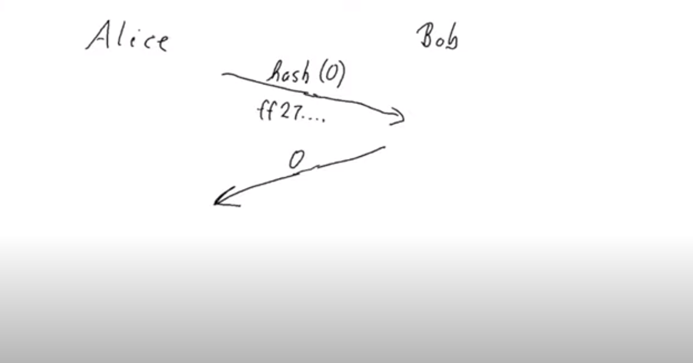
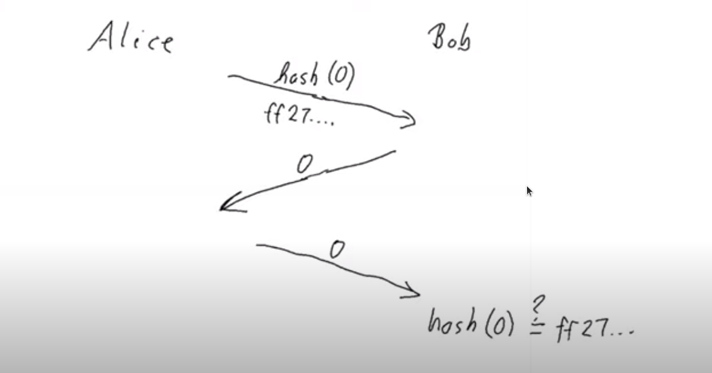
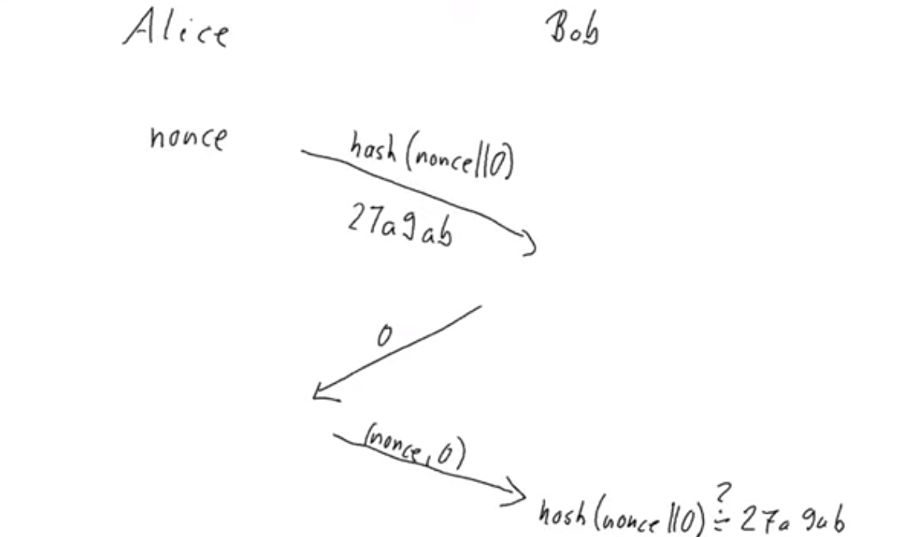
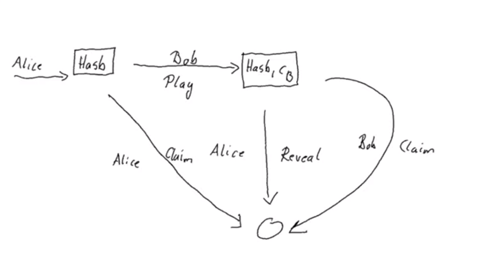

Week 07 - State Machines
========================

.. note::
    This is a written version of `Lecture
    #7 <https://www.youtube.com/watch?v=oJupInqvJUI>`__.

    It covers commit schemes and state machines.

    This week we were using Plutus commit 530cc134364ae186f39fb2b54239fb7c5e2986e9

Introduction
------------

In this lecture we will look at state machines. State machines can be very useful to shorter and more concise contracts, both on-chain and off-chain. There is higher level support for state machines in the Plutus libraries that builds on top of the lower level mechanisms we have seen so far.

As a running example, we are going to implement a little game, played between Alice and Bob. It's a bit like Rock, Paper, Scissors, but even simpler, because there are 
only two options.

Alice and Bob both have two options, they can either play 0 or 1.

.. figure:: img/week07__00000.png

If there were to play this game while being physically in the same room, they would make their moves at the same time. There would be one gesture for 0 and one
gesture for 1, they would raise their hands simultaneously, and, depending on what they play, one of them wins.

If they both play the same number, Alice wins. If they play different numbers, Bob wins.

.. figure:: img/week07__00001.png

Now let's imagine that Alice and Bob can't meet in person but that they still want to play the game. So, they decide to play it via mail - email or snail mail, it doesn't
matter. How would that work?

Alice could send her move to Bob.

.. figure:: img/week07__00004.png

This, however, gives a very unfair advantage to Bob, because now he opens Alice's mail, see that she has played 0, and he can simply reply with 1, and he wins.

.. figure:: img/week07__00003.png

And, if Alice plays 1, Bob can simply respond with 1. So Bob always wins, at least if he is unfair.

.. figure:: img/week07__00005.png

What can we do about that? 

There's a very clever trick which is often used in cryptographic protocols, and that is commit schemes. The idea is that Alice doesn't reveal her choice to Bob, but she commits to it, so that she cannot later change her mind.

One way to make that work is using hash functions.

Hashes are all over the place in the blockchain world. We have seen that script addresses are just the hash of the Plutus code script, and we have seen lots of examples of
public key hashes.

A hash function is a one-way function. Given a hash, tt is difficult, or impossible, to reconstruct the original byte string that was hashed.

So, one way we could try to make this work is that, instead of Alice sending her choice to Bob, she instead sends the hash of her choice.

Bob then sees this cryptic byte string and he has no idea whether Alice picked 0 or 1.

Bob then replies with his move, picking, for example 0. There is no need for him to use a hash, he can just send his response in clear text. 

Now, Alice would have won. But perhaps Bob doesn't believe her. So there is one additional step that Alice has to take.

Alice has to send her actual choice to Bob in clear text. Bob then has to check that the hash of her choice is indeed the same as the hash Alice sent earlier.

If it is, then he knows sees that Alice is not lying and that indeed he lost. If it does not match, then he knows that Alice is cheating and he would win.

This all sounds promising, but there is one big problem with it.

In this game there are only two choices, 0 and 1. Which means that there are only two possible hashes. They may look very cryptic to Bob the first time they play, 
but before long he will notice that he always sees one of only two possible hashes, and then he can know which choice Alice made.

This is almost as bad as if Alice had just sent her choice in clear text.

What we can do about this is that, instead of sending the hash of her choice, she instead first selects an arbitrary byte string and then hashes the
concatenated of this byte string and her choice. The arbitrary byte string that Alice chooses is called a *nonce* - a number to be used just once.

.. figure:: img/week07__00008.png

So now, it is not always the same byte string if she picks 0, provided she chooses some random, unpredictable nonce.

Now, Bob receives this and we proceed as before - Bob sends his choice, and then, in the third message Alice needs to send not only her original choice, but she also 
has to send the nonce as well.

And then Bob checks that the hash of Alice's claimed nonce concatenated with her choice is indeed the hash that he originally received. If it is, he knows he lost, and 
if it is not, he knows that she tried to cheat him.

This works very nicely and this is what we will try to implement in Cardano. First we will do it using techniques we have already seen, and then we will see how, by using 
state machines, the code can be much clearer and much shorter.

Code Example 1
~~~~~~~~~~~~~~

We can imagine that, at the start of the game, Alice and Bob have put down the same amount of money each and that the winner will take it all.

The game starts with Alice posting her hash, as described above. Bob, if he plays along, will post his own choice. At this point, we have Alice's hash and Bob's choice.

.. figure:: img/week07__00011.png

If, at this point, Alice realizes that she has won, based on Bob's choice, she can reveal her secret, the game ends, and she has won.

.. figure:: img/week07__00012.png

If, however, after Bob makes his move, Alice sees that she has lost, there is no need for her to do anything. After a certain deadline has been reached, if Alice has
not responded, Bob will be able to claim the funds.

.. figure:: img/week07__00013.png

There is a scenario. Perhaps, after Alice starts playing, Bob simply isn't interested. In this case, there must be a way for Alice to get her own money back.

As mentioned, our first attempt at coding this in Plutus will be using the techniques we have learned in previous lectures.

The code we are working with is in the following module

.. code:: haskell

    module Week07.EvenOdd

We call the game *EvenOdd* due to the fact that if the sum of the numbers is even, then the first player wins, and if the sum is odd, the second player wins.

In our code we will call the players *first* and *second* rather than Alice and Bob.

We define a data type *Game* which will be used as a parameter for the contract.

.. code:: haskell

    data Game = Game
        { gFirst          :: !PubKeyHash
        , gSecond         :: !PubKeyHash
        , gStake          :: !Integer
        , gPlayDeadline   :: !Slot
        , gRevealDeadline :: !Slot
        , gToken          :: !AssetClass
        } deriving (Show, Generic, FromJSON, ToJSON, Prelude.Eq, Prelude.Ord)    

The players are identified by their public key hashes as *gFirst* and *gSecond*. 

The number of lovelace to be used as stake in the game is represented by *gStake* - This stake must be provided by each player.

There are two deadlines. The *gPlayDeadline* is the slot by which the second player must make their move. In the case where the second player has made a move,
the *gRevealDeadline* is the slot by which player 1 must claim victory by revealing his nonce.

Finally we have a token represented by *gToken*. This will be the same trick that we used for the oracle. It will be an arbitrary NFT, used to identify the right 
instance of the UTxO that we are using. The idea is to use the datum sitting at a UTxO in this contract's script address to keep track of where we are in the game.

Next, we define the two moves that the players can make.

.. code:: haskell

    data GameChoice = Zero | One
        deriving (Show, Generic, FromJSON, ToJSON, ToSchema, Prelude.Eq, Prelude.Ord)    

    instance Eq GameChoice where
        {-# INLINABLE (==) #-}
        Zero == Zero = True
        One  == One  = True
        _    == _    = False

We need Plutus *Eq* for the instance, but it is not possible to declare that in the deriving clause, which is why the *Eq* in the deriving clause is qualified as being
from the standard Haskell Prelude.

Note that we have used the *INLINABLE* pragma on the *Eq* instance for *GameChoice*. This is again to make it compatible with the Template Haskell we will need to
use.

For state, we will use a type called *GameDatum*.

.. code:: haskell

    data GameDatum = GameDatum ByteString (Maybe GameChoice)
    deriving Show

    instance Eq GameDatum where
        {-# INLINABLE (==) #-}
        GameDatum bs mc == GameDatum bs' mc' = (bs == bs') && (mc == mc')    

Here, the *ByteString* is the hash that the first player submits, and *Maybe GameChoice* is either *Just* the move of the second player, or *Nothing*, if they have not yet moved.

Now we come to the redeemer, and we will use a custom type for this as well.

.. code:: haskell

    data GameRedeemer = Play GameChoice | Reveal ByteString | ClaimFirst | ClaimSecond
        deriving Show

Here *Play* is where the second player moves and, as an argument, it has a *GameChoice*. *Reveal* is for the case where the first player has won and must prove that
by revealing their nonce, and the nonce is represented by the *ByteString* argument. We don't need to include the move for the *Reveal*, as they will only reveal if they
have won, and we know what move makes them win.

*ClaimFirst* is when the first player claims back the stake in the even that the second player does not make a move by the play deadline. *ClaimSecond* is for the 
case when the first player does not reveal by the reveal deadline.

We then have our *lovelaces* helper function which we have used in other scripts, which gets the number of lovelaces held in a *Value*.

.. code:: haskell

    lovelaces :: Value -> Integer
    lovelaces = Ada.getLovelace . Ada.fromValue

And we have a helper function *gameDatum* which behaves exactly the same way as the function *oracleValue*, which you can find in the notes from lecture 6.

.. code:: haskell

    gameDatum :: TxOut -> (DatumHash -> Maybe Datum) -> Maybe GameDatum
    gameDatum o f = do
        dh      <- txOutDatum o
        Datum d <- f dh
        PlutusTx.fromData d    

Now we come to the core business logic in the *mkGameValidator* function.

.. code:: haskell

    mkGameValidator :: Game -> ByteString -> ByteString -> GameDatum -> GameRedeemer -> ScriptContext -> Bool
    mkGameValidator game bsZero' bsOne' dat red ctx =
    ...
    
The first argument is the *Game* parameter discussed above. 

The second and the third arguments are somewhat of a nuisance. We just need them due to the fact that it is not possible to use string literals to 
get *ByteStrings* in Haskell that is compiled to Plutus core. And, we want string literals representing the 0 and 1 choices. So *bsZero'* will hold "0" and 
*beOne'* will hold "1". You will see how we pass these in as auxiliary arguments later.

Then we pass in the usual arguments for datum, redeemer and context.

Let's look at some helper functions first. There are three functions we have used before and discussed in lecture 6.

.. code:: haskell

    info :: TxInfo
    info = scriptContextTxInfo ctx

    ownInput :: TxOut
    ownInput = case findOwnInput ctx of
        Nothing -> traceError "game input missing"
        Just i  -> txInInfoResolved i

    ownOutput :: TxOut
    ownOutput = case getContinuingOutputs ctx of
        [o] -> o
        _   -> traceError "expected exactly one game output"
        
Note the *ownInput* should never fail as we are in the process of validating a UTxO.

The *outputDatum* helper makes use of the *GameDatum* type which we defined earlier. Given the case we have exactly one output (the return from *ownOutput*), it will
give us the datum.

.. code:: haskell

    outputDatum :: GameDatum
    outputDatum = case gameDatum ownOutput (`findDatum` info) of
        Nothing -> traceError "game output datum not found"
        Just d  -> d
        
The *checkNonce* function is for the case where the first player as won and wants to prove it by revealing their nonce. The first argument is hash that was original sent, 
the second argument is the nonce that is being revealed. 

For the *GameChoice*-typed parameter, we will be passing in the move made by player 2. This should be the same as the move made by player 1, and this is what this function will determine using the hash and the nonce.

In order to check the hash of the nonce concatenated with the *GameChoice*, we use a helper function to convert the *GameChoice* to a *ByteString*. Note that the use 
of the *cFirst* and *cSecond* in the *checkNonce* function could be swapped around, and the function would work just the same - the difference between the two is that
one is a *GameChoice* and one is a *ByteString*.

.. code:: haskell

    checkNonce :: ByteString -> ByteString -> GameChoice -> Bool
    checkNonce bs nonce cSecond = sha2_256 (nonce `concatenate` cFirst) == bs
      where
        cFirst :: ByteString
        cFirst = case cSecond of
            Zero -> bsZero'
            One  -> bsOne'    

Finally, there is the question of what happens to the NFT once the game is over and there is no game address anymore. The way we have implemented it here, is that the NFT goes back to the first player. The first player needs it in the beginning to kick off the game and put the NFT 
into the correct UTxO, so it is reasonable to give it back the player 1 in the end.

To verify that this condition is met, we have created a helper function called *nftToFirst*.

.. code:: haskell

    nftToFirst :: Bool
    nftToFirst = assetClassValueOf (valuePaidTo info $ gFirst game) (gToken game) == 1

