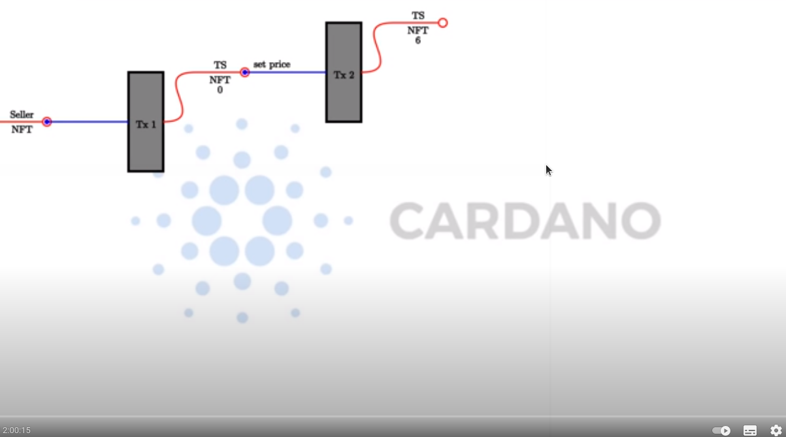
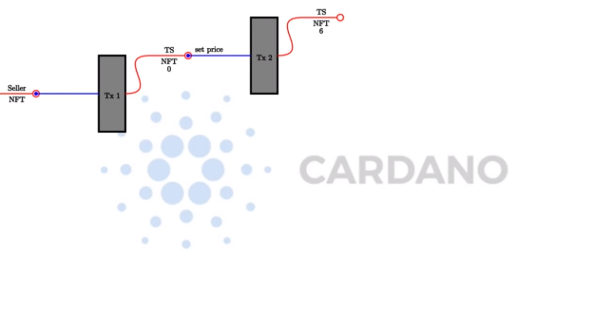
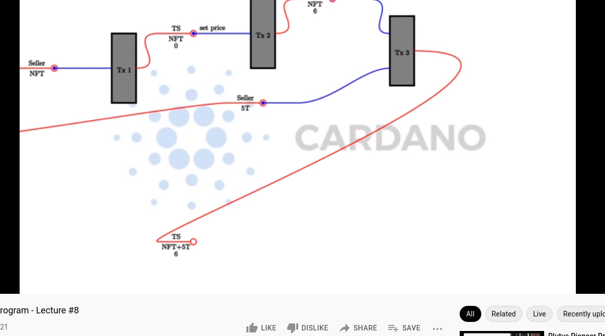

Week 08 - Property Based Testing
================================

.. note::
    This is a written version of `Lecture
    #8 <https://youtu.be/JMRwkMgaBOg>`__.

    In this lecture we cover another state machine example, automatic testing using emulator traces, optics, and property-based testing.

    This week we were using Plutus commit ae35c4b8fe66dd626679bd2951bd72190e09a123, the same commit as we used in the last lecture.

Token Sale
----------

In the last lecture we looked at state machines, and saw how they often allow us to write much less code to express the logic of a smart contract, partly because  
there is a lot of sharing between on-chain and off-chain code and partly because a lot of boilerplate is encapsulated in the state machine machinery.

In this lecture we will see another example using a state machine, because the concept is very important. We will also take a look at testing. 
First we will look at the code, then we will explore various ways to go about testing.

The example we will use is a contract that allows somebody to sell tokens. The idea is that someone call lock some tokens in a contract, set a price, and then 
other people can buy them.

To begin, the seller starts with an NFT. It can be an arbitrary NFT and it will just be used, as before, to identify the correct UTxO that contains the contract state.

The first step is to lock the NFT at the script address of the smart contract that we are about to write. We'll call that contract *TS* for Token Sale. As a datum, we will 
use a simple integer, which will represent the price of the token we are selling, and this will start off as zero.

.. figure:: img/week08__00001.png

There will be several operations that the seller can do. One of those will be setting the price to a different value. In order to do that the seller will submit
a transaction which has the current UTxO as input and the updated UTxO as output, where the datum has been changed to a different price per token.

Another thing that the seller can do is to lock some tokens in the contract. In order to do that they have to create another transaction which has as input the UTxO of
the contract and a UTxO containing some tokens and, as output, the updated UTxO at the contract address which now contains the provided tokens.

In this example, the seller provides five tokens to the contract.

In order to buy tokens, there needs to be a transaction created by the buyer. This transaction has as input the UTxO sitting at the TS script address, 
and the buying price in Ada.

So, if a buyer wants to buy two tokens, they will create a transaction that has, as input, 12 Ada, and the UTxO at the script address. Then, two outputs. One
the updated contract state where now the tokens are taken out and the Ada has been added, and one output going to the buyer with the tokens that they have just
bought.

Finally, there must be a way for the seller to retrieve tokens and Ada. In this example if, after the sale, the seller wants to retrieve all the Ada and one token, they 
would create a transaction that, again, has the script UTxO as input, and, as output, the updated script UTxO with the reduced balances, and one to themselves with the 
retrieved funds.

The diagram just shows one scenario, but these operations can be performed in any order - tokens can be added, the price can be changed, tokens can be bought, and so on,
in an arbitrary order.

On-chain code 
~~~~~~~~~~~~~

This week's first example is implemented in

.. code:: haskell

    module Week08.TokenSale

Let's first look at the type that we will use as the parameter that we will use for the contract.    

.. code:: haskell

    data TokenSale = TokenSale
        { tsSeller :: !PubKeyHash
        , tsToken  :: !AssetClass
        , tsNFT    :: !AssetClass
        } deriving (Show, Generic, FromJSON, ToJSON, Prelude.Eq, Prelude.Ord)    

This has three fields - the seller's public key has, the token being sold, and the NFT used to identify the UTxO.

For the redeemer, we provide exactly the operations we saw in the diagram

.. code:: haskell

    data TSRedeemer =
          SetPrice Integer         -- the price
        | AddTokens Integer        -- the number of tokens to add
        | BuyTokens Integer        -- the number of tokens to buy
        | Withdraw Integer Integer -- first argument is the number of tokens, the second is the number of lovelace
        deriving (Show, Prelude.Eq)    

Again we have the helper function that we have used in previous examples

.. code:: haskell

    lovelaces :: Value -> Integer
    lovelaces = Ada.getLovelace . Ada.fromValue
    
Now, we get to the *transition* function of the state machine. We see the *TokenSale* parameter which holds the state machines configuration values, the *State* 
object with an *Integer* value to represent the price of the token, then the redeemer *TsRedeemer*. Again, we return a *Maybe*, which will be *Nothing* if the 
corresponding transition is illegal, or, if it is legal, a *Just* containing constraints and the new state.

.. code:: haskell

    transition :: TokenSale -> State Integer -> TSRedeemer -> Maybe (TxConstraints Void Void, State Integer)
    transition ts s r = case (stateValue s, stateData s, r) of

If the *SetPrice* redeemer is provided, then we only consider it to be legal if the price is not negative. We then return a *Just* with the constraint that the 
transaction must be signed by the token seller, and with the new state. The new state will be the new price *p*, and the *Value* in the contract 
remains the same, except for one thing. 

It is a little unfortunate, but there is a discrepancy between the *v* on the left and the *v* on the right. On the left it does not contain the NFT, but 
on the right it does not. So, even though we want to say that we don't want the value changed, in fact we have to remove the NFT, because the Plutus libraries will
add it again. This is perhaps not an ideal design, but that is how it currently is.

.. code:: haskell

        (v, _, SetPrice p) | p >= 0 -> Just ( Constraints.mustBeSignedBy (tsSeller ts)
                                            , State p $
                                              v <>
                                              nft (negate 1)
                                            )

We use a helper function to reference the NFT.

.. code:: haskell

  nft :: Integer -> Value
  nft = assetClassValue (tsNFT ts)  
                                            
When adding tokens, we could check that the seller has signed the transaction, but this contract would be provided by the seller, and the seller doesn't mind if someone 
wants to give them a free gift! Therefore, once we have the *AddTokens* redeemer and *n* is greater than zero, we are happy to return the 
new state without constraints.

The state that we return is untouched, except for the unfortunate trick we need to do with the NFT, and the addition of the new tokens.

.. code:: haskell

        (v, p, AddTokens n) | n > 0 -> Just ( mempty
                                            , State p $
                                              v                                       <>
                                              nft (negate 1)                          <>
                                              assetClassValue (tsToken ts) n
                                            )

For the *BuyTokens* redeemer, again we check the number of tokens is positive, and again we don't need any constraints, because anybody can buy tokens.

For the new state, we don't touch the price. We again correct for the NFT. Then we subtract the tokens that were bought, and we add the lovelace that were paid for them.

.. code:: haskell
                                                                
        (v, p, BuyTokens n) | n > 0 -> Just ( mempty
                                            , State p $
                                              v                                       <>
                                              nft (negate 1)                          <>
                                              assetClassValue (tsToken ts) (negate n) <>
                                              lovelaceValueOf (n * p)
                                            )

Finally, for *WithDraw*, we insist that the token amount and the lovelace amount are both nonnegative. This time we again add a constraint that the seller must sign 
the transaction. We modify the state in a similar way to the way we did for the *BuyTokens* redeemer, but this time we adjust the token and lovelace amounts according 
to how much has been withdrawn.

.. code:: haskell
                                                           
        (v, p, Withdraw n l) | n >= 0 && l >= 0 -> Just ( Constraints.mustBeSignedBy (tsSeller ts)
                                                        , State p $
                                                          v                                       <>
                                                          nft (negate 1)                          <>
                                                          assetClassValue (tsToken ts) (negate n) <>
                                                          lovelaceValueOf (negate l)
                                                        )

All other state transitions are illegal.

.. code:: haskell
  
        _ -> Nothing

In this example we are able to construct our state machine more simply that we could in the previous lecture. This is because, in the previous lecture we had one 
condition that could not be expressed in the regular constraints.        

In these situations, there is a helper function called *mkStateMachine* that takes three arguments. The first one is the state token, the second is the transition 
function. The last one is to indicate which states are final. In this case, there is no final state. Once this token sale has been setup, it will always be there.

.. code:: haskell

  tsStateMachine :: TokenSale -> StateMachine Integer TSRedeemer
  tsStateMachine ts = mkStateMachine (Just $ tsNFT ts) (transition ts) (const False)

We can now use the usual boilerplate to turn it into a Plutus smart contract.

.. code:: haskell

  type TS = StateMachine Integer TSRedeemer

  tsInst :: TokenSale -> Scripts.ScriptInstance TS
  tsInst ts = Scripts.validator @TS
      ($$(PlutusTx.compile [|| mkTSValidator ||]) `PlutusTx.applyCode` PlutusTx.liftCode ts)
      $$(PlutusTx.compile [|| wrap ||])
    where
      wrap = Scripts.wrapValidator @Integer @TSRedeemer
  
  tsValidator :: TokenSale -> Validator
  tsValidator = Scripts.validatorScript . tsInst
  
  tsAddress :: TokenSale -> Ledger.Address
  tsAddress = scriptAddress . tsValidator
  
  tsClient :: TokenSale -> StateMachineClient Integer TSRedeemer
  tsClient ts = mkStateMachineClient $ StateMachineInstance (tsStateMachine ts) (tsInst ts)
  
There are two helper functions to convert specialised error types to *Text*.

.. code:: haskell

  mapErrorC :: Contract w s C.CurrencyError a -> Contract w s Text a
  mapErrorC = mapError $ pack . show
  
  mapErrorSM :: Contract w s SMContractError a -> Contract w s Text a
  mapErrorSM = mapError $ pack . show
  
Off-chain code 
~~~~~~~~~~~~~~
  
For the off-chain code, we start by defining a constant for the token name of the NFT.

.. code:: haskell

  nftName :: TokenName
  nftName = "NFT"

The first contract we define is to start the token sale. This contract is designed to be invoked by the seller.

This first argument is a *Maybe CurrencySymbol*. The idea here is that if you pass in *Nothing*, the contract will mint a new NFT. Alternatively, you can provide a 
*Just CurrencySymbol* if the token already exists. We have done it this way mainly to make testing easier.

The *AssetClass* argument is the token the seller wants to trade.

For the return type, we are using the writer monad type with the *Last* type. The ideas is that once the token sale has been setup, it will get written here so that other 
contracts are able to discover it. In addition, we return the created token sale.

To begin, we lookup the seller's public key hash. We then need to get hold of the NFT. So, we determine if we need to mint the NFT, and, if we do, we mint it, otherwise we just use the one that was 
passed into the function.

.. code:: haskell

  startTS :: HasBlockchainActions s => Maybe CurrencySymbol -> AssetClass -> Contract (Last TokenSale) s Text TokenSale
  startTS mcs token = do
  
      pkh <- pubKeyHash <$> Contract.ownPubKey
      cs  <- case mcs of
          Nothing  -> C.currencySymbol <$> mapErrorC (C.forgeContract pkh [(nftName, 1)])
          Just cs' -> return cs'

And now we can define the *TokenSale* and create the state machine client.

.. code:: haskell
  
      let ts = TokenSale
              { tsSeller = pkh
              , tsToken  = token
              , tsNFT    = AssetClass (cs, nftName)
              }
          client = tsClient ts

We then use the *runInitialise* function that we discussed in the last lecture, using the client, an initial price of zero, and no initial funds, except for the NFT 
which will be automatically added.

We write the *ts* into the log, then log a message, and return the *ts*.

.. code:: haskell

      void $ mapErrorSM $ runInitialise client 0 mempty
      tell $ Last $ Just ts
      logInfo $ "started token sale " ++ show ts
      return ts
      
The functions for all the other operations are extremely short. This example is ideal for the state machine approach.

They are all very similar. They all invoke *runStep* and then invoke the correct transition from the state machine.

For example, for *setPrice*, we need the *TokenSale* argument to identify the correct contract and the new value of the price. Then we use *runStep* using the client and 
*SetPrice* as the redeemer. We wrap that using *mapErrorSM* to convert to *Text* error messages, and we ignore the result.

.. code:: haskell

  setPrice :: HasBlockchainActions s => TokenSale -> Integer -> Contract w s Text ()
  setPrice ts p = void $ mapErrorSM $ runStep (tsClient ts) $ SetPrice p

The remaining three follow the same pattern.

.. code:: haskell

  addTokens :: HasBlockchainActions s => TokenSale -> Integer -> Contract w s Text ()
  addTokens ts n = void (mapErrorSM $ runStep (tsClient ts) $ AddTokens n)
  
  buyTokens :: HasBlockchainActions s => TokenSale -> Integer -> Contract w s Text ()
  buyTokens ts n = void $ mapErrorSM $ runStep (tsClient ts) $ BuyTokens n
  
  withdraw :: HasBlockchainActions s => TokenSale -> Integer -> Integer -> Contract w s Text ()
  withdraw ts n l = void $ mapErrorSM $ runStep (tsClient ts) $ Withdraw n l

Now we define three schemas.

One for the seller which just has one endpoint which takes the *CurrencySymbol* and the *TokenName* of the asset to be traded.

.. code:: haskell

  type TSStartSchema = BlockchainActions
      .\/ Endpoint "start"      (CurrencySymbol, TokenName)

For testing purposes, we create *TSStartSchema'* which additionally takes the *CurrencySymbol* of the NFT.

.. code:: haskell

  type TSStartSchema' = BlockchainActions
      .\/ Endpoint "start"      (CurrencySymbol, CurrencySymbol, TokenName)  
  
Lastly we have a *use* schema, with endpoints for the four operations - set price, add tokens, buy tokens and withdraw. 

.. code:: haskell

  type TSUseSchema = BlockchainActions
    .\/ Endpoint "set price"  Integer
    .\/ Endpoint "add tokens" Integer
    .\/ Endpoint "buy tokens" Integer
    .\/ Endpoint "withdraw"   (Integer, Integer)  

Now to implement the start endpoint. It simply calls *startTs'* and recurses. *startTs'* blocks until the parameters are provided and then calls *startTs* with 
*Nothing*, indicating that the NFT has to be minted. We wrap it in *handleError* and if there is an error, we simply log that error.

.. code:: haskell

  startEndpoint :: Contract (Last TokenSale) TSStartSchema Text ()
  startEndpoint = startTS' >> startEndpoint
    where
      startTS' = handleError logError $ endpoint @"start"  >>= void . startTS Nothing . AssetClass

The *startEndpoint'* function is very similar, but we add the NFT parameter, as per *TSStartSchema'*.

.. code:: haskell

  startEndpoint' :: Contract (Last TokenSale) TSStartSchema' Text ()
  startEndpoint' = startTS' >> startEndpoint'
    where
      startTS' = handleError logError $ endpoint @"start"  >>= \(cs1, cs2, tn) ->  void $ startTS (Just cs1) $ AssetClass (cs2, tn)
      
No surprises in the *use* endpoints. We give a choice between the four endpoints and just call the functions we defined earlier with the arguments fed in 
from the endpoint call, and with everything wrapped inside an error handler so that the contract won't crash in the event of an error.

.. code:: haskell

  useEndpoints :: TokenSale -> Contract () TSUseSchema Text ()
  useEndpoints ts = (setPrice' `select` addTokens' `select` buyTokens' `select` withdraw') >> useEndpoints ts
    where
      setPrice'  = handleError logError $ endpoint @"set price"  >>= setPrice ts
      addTokens' = handleError logError $ endpoint @"add tokens" >>= addTokens ts
      buyTokens' = handleError logError $ endpoint @"buy tokens" >>= buyTokens ts
      withdraw'  = handleError logError $ endpoint @"withdraw"   >>= uncurry (withdraw ts)

Testing
~~~~~~~

In order to try it out, let's run it in the emulator.

We define a *runMyTrace* function which uses *runEmulatorTraceIO'* with a custom emulator configuration and a *myTrace* function.

.. code:: haskell

  runMyTrace :: IO ()
  runMyTrace = runEmulatorTraceIO' def emCfg myTrace

Let's first look at the *emCfg* function. Recall that this is where we can give custom initial distributions to wallets. Here we give 1000 Ada and 1000 of a custom 
token to three wallets.

.. note::
  
  The ability to use underscores in large numbers such as 1000_000_000 is provided by a GHC extension *NumericUnderscores*

.. code:: haskell

  emCfg :: EmulatorConfig
  emCfg = EmulatorConfig $ Left $ Map.fromList [(Wallet w, v) | w <- [1 .. 3]]
    where
      v :: Value
      v = Ada.lovelaceValueOf 1000_000_000 <> assetClassValue token 1000
      
  currency :: CurrencySymbol
  currency = "aa"
  
  name :: TokenName
  name = "A"
  
  token :: AssetClass
  token = AssetClass (currency, name)      

For the trace, first we activate Wallet 1 using the non-primed *startEndpoint* function which mints the NFT is minted automatically. Then, we call the start endpoint, giving it 
the symbol and name of the token we want to sell, and then wait for five slots, although two would be enough in this case.

.. code:: haskell

  myTrace :: EmulatorTrace ()
  myTrace = do
      h <- activateContractWallet (Wallet 1) startEndpoint  
      callEndpoint @"start" h (currency, name)
      void $ Emulator.waitNSlots 5
      Last m <- observableState h

We then read the state, which we wrote using *tell*, and check to see if it is valid. If it is not, we log an error. If it is, we proceed with the test.

.. code:: haskell

  case m of
    Nothing -> Extras.logError @String "error starting token sale"
    Just ts -> do  
        Extras.logInfo $ "started token sale " ++ show ts

We can now activate the endpoints for the three wallets. Recall that the *useEndpoints* function is parameterised by the *TokenSale* data, which is why we needed to 
get that value.

.. code:: haskell

    h1 <- activateContractWallet (Wallet 1) $ useEndpoints ts
    h2 <- activateContractWallet (Wallet 2) $ useEndpoints ts
    h3 <- activateContractWallet (Wallet 3) $ useEndpoints ts  

Wallet 1 sets the price to 1 Ada and we again wait for a generous amount of time.

.. code:: haskell

  callEndpoint @"set price" h1 1_000_000
  void $ Emulator.waitNSlots 5  

Wallet 1 adds 100 tokens.

.. code:: haskell

  callEndpoint @"add tokens" h1 100
  void $ Emulator.waitNSlots 5
  
Wallet 2 buys 20 tokens. So now the contract should contain 80 tokens and 20 Ada.

.. code:: haskell

  callEndpoint @"buy tokens" h2 20
  void $ Emulator.waitNSlots 5
  
Wallet 3 buys 5 tokens. Now there should be 75 tokens in the contract and 25 Ada.

.. code:: haskell

  callEndpoint @"buy tokens" h3 5
  void $ Emulator.waitNSlots 5

Finally, Wallet 1 calls the withdraw endpoint, taking out 40 tokens and 10 Ada. At this point, there should be 35 tokens and 10 Ada in the contract.

.. code:: haskell

  callEndpoint @"withdraw" h1 (40, 10_000_000)
  void $ Emulator.waitNSlots 5
  
Let's run this in the REPL.

.. code::

  cabal repl plutus-pioneer-program-week08-tests
  Ok, five modules loaded.
  Prelude Main> :l Spec.Trace
  Ok, one module loaded.
  Prelude Spec.Trace> runMyTrace

  Slot 00000: TxnValidate 2125c8770581c6140c3c71276889f6353830744191de0184b6aa00b185004500
  Slot 00000: SlotAdd Slot 1
  Slot 00001: 00000000-0000-4000-8000-000000000000 {Contract instance for wallet 1}:
    Contract instance started

The first endpoint call is to *start*. This creates three transaction. Two of these are from the forge contract to create the NFT, and the third one is to set up our 
initial UTxO for the token sale.

.. code::

  Slot 00001: 00000000-0000-4000-8000-000000000000 {Contract instance for wallet 1}:
    Receive endpoint call: Object (fromList [("tag",String "start"),("value",Object (fromList [("unEndpointValue",Array [Object (fromList [("unCurrencySymbol",String "aa")]),Object (fromList [("unTokenName",String "A")])])]))])
  Slot 00001: W1: TxSubmit: cccba8b2abc3e82a735735c2346aa3fcac58152f17854b1745306e5b63a0b965
  Slot 00001: TxnValidate cccba8b2abc3e82a735735c2346aa3fcac58152f17854b1745306e5b63a0b965
  Slot 00001: SlotAdd Slot 2
  Slot 00002: W1: TxSubmit: e23e19192aea3304a989ab98f05e70bc01fe43f3ea940da78a92ab7cebec9bbb
  Slot 00002: TxnValidate e23e19192aea3304a989ab98f05e70bc01fe43f3ea940da78a92ab7cebec9bbb
  Slot 00002: SlotAdd Slot 3
  Slot 00003: W1: TxSubmit: 4cae1c5115eb4128243ce029dcd4d6c23d6497d3ab5e71a79f4dc34e9b8cd763
  Slot 00003: TxnValidate 4cae1c5115eb4128243ce029dcd4d6c23d6497d3ab5e71a79f4dc34e9b8cd763
  Slot 00003: SlotAdd Slot 4
  Slot 00004: *** CONTRACT LOG: "started token sale TokenSale {tsSeller = 21fe31dfa154a261626bf854046fd2271b7bed4b6abe45aa58877ef47f9721b9, tsToken = (aa,\"A\"), tsNFT = (65b4199f7d025bfb3b065b0fb88a77d694ffd849ff740b1a4cc453bfaab30f55,\"NFT\")}"
  Slot 00004: SlotAdd Slot 5
  Slot 00005: SlotAdd Slot 6

We successfully read the *TokenSale* value from the observable state, and start the three contract instances for the use contract.

.. code::

  Slot 00006: 00000000-0000-4000-8000-000000000000 {Contract instance for wallet 1}:
    Sending contract state to Thread 0
  Slot 00006: SlotAdd Slot 7
  Slot 00007: *** USER LOG: started token sale TokenSale {tsSeller = 21fe31dfa154a261626bf854046fd2271b7bed4b6abe45aa58877ef47f9721b9, tsToken = (aa,"A"), tsNFT = (65b4199f7d025bfb3b065b0fb88a77d694ffd849ff740b1a4cc453bfaab30f55,"NFT")}
  Slot 00007: 00000000-0000-4000-8000-000000000001 {Contract instance for wallet 1}:
    Contract instance started
  Slot 00007: 00000000-0000-4000-8000-000000000002 {Contract instance for wallet 2}:
    Contract instance started
  Slot 00007: 00000000-0000-4000-8000-000000000003 {Contract instance for wallet 3}:
    Contract instance started

Then we set the price.

.. code::

  Slot 00007: 00000000-0000-4000-8000-000000000001 {Contract instance for wallet 1}:
    Receive endpoint call: Object (fromList [("tag",String "set price"),("value",Object (fromList [("unEndpointValue",Number 1000000.0)]))])
  Slot 00007: W1: TxSubmit: 2de6dd820e6939b4b1f9e162c0e2cc878cc38ea1231a9be610315da4eda06714
  Slot 00007: TxnValidate 2de6dd820e6939b4b1f9e162c0e2cc878cc38ea1231a9be610315da4eda06714
  Slot 00007: SlotAdd Slot 8
  Slot 00008: SlotAdd Slot 9
  Slot 00009: SlotAdd Slot 10
  Slot 00010: SlotAdd Slot 11
  Slot 00011: SlotAdd Slot 12

Then add some tokens.

.. code::

  Slot 00012: 00000000-0000-4000-8000-000000000001 {Contract instance for wallet 1}:
    Receive endpoint call: Object (fromList [("tag",String "add tokens"),("value",Object (fromList [("unEndpointValue",Number 100.0)]))])
  Slot 00012: W1: TxSubmit: 42f1bebe285d1ea23bd90683d110866bb438eede8ef62eaf5e9e3d65eec18e90
  Slot 00012: TxnValidate 42f1bebe285d1ea23bd90683d110866bb438eede8ef62eaf5e9e3d65eec18e90
  Slot 00012: SlotAdd Slot 13
  Slot 00013: SlotAdd Slot 14
  Slot 00014: SlotAdd Slot 15
  Slot 00015: SlotAdd Slot 16
  Slot 00016: SlotAdd Slot 17

Then the two buys by Wallets 2 and 3.

.. code::

  Slot 00017: 00000000-0000-4000-8000-000000000002 {Contract instance for wallet 2}:
    Receive endpoint call: Object (fromList [("tag",String "buy tokens"),("value",Object (fromList [("unEndpointValue",Number 20.0)]))])
  Slot 00017: W2: TxSubmit: 30d28ca855a14accbb11deee682b174adffb548922e1d4257242880f28328f8e
  Slot 00017: TxnValidate 30d28ca855a14accbb11deee682b174adffb548922e1d4257242880f28328f8e
  Slot 00017: SlotAdd Slot 18
  Slot 00018: SlotAdd Slot 19
  Slot 00019: SlotAdd Slot 20
  Slot 00020: SlotAdd Slot 21
  Slot 00021: SlotAdd Slot 22
  Slot 00022: 00000000-0000-4000-8000-000000000003 {Contract instance for wallet 3}:
    Receive endpoint call: Object (fromList [("tag",String "buy tokens"),("value",Object (fromList [("unEndpointValue",Number 5.0)]))])
  Slot 00022: W3: TxSubmit: 708b0c4117ad3b38b69254a714e4695c574af404c3fff0eda859b571218b003c
  Slot 00022: TxnValidate 708b0c4117ad3b38b69254a714e4695c574af404c3fff0eda859b571218b003c
  Slot 00022: SlotAdd Slot 23
  Slot 00023: SlotAdd Slot 24
  Slot 00024: SlotAdd Slot 25
  Slot 00025: SlotAdd Slot 26
  Slot 00026: SlotAdd Slot 27

And finally, the withdraw by Wallet 1.

.. code::

  Slot 00027: 00000000-0000-4000-8000-000000000001 {Contract instance for wallet 1}:
    Receive endpoint call: Object (fromList [("tag",String "withdraw"),("value",Object (fromList [("unEndpointValue",Array [Number 40.0,Number 1.0e7])]))])
  Slot 00027: W1: TxSubmit: a42a06cc3e3b1653ec4aba5ab8304484d778adcbddac2ceb9f639f7e4bd1dfd2
  Slot 00027: TxnValidate a42a06cc3e3b1653ec4aba5ab8304484d778adcbddac2ceb9f639f7e4bd1dfd2
  Slot 00027: SlotAdd Slot 28
  Slot 00028: SlotAdd Slot 29
  Slot 00029: SlotAdd Slot 30
  Slot 00030: SlotAdd Slot 31
  Slot 00031: SlotAdd Slot 32
  Slot 00032: SlotAdd Slot 33

All wallets initially owned 1000 tokens and 1000 Ada. Wallet 1 added 100 tokens to the contract, but then in the last step retrieved 40 tokens and 10 Ada,
and so we see its final balance as 940 tokens and 1010 Ada minus transaction fees.

.. code::

  Final balances
  Wallet 1: 
      {aa, "A"}: 940
      {, ""}: 1009942570

Wallet 2 bought 20 tokens and paid 20 Ada for them, plus some transaction fees.

.. code::

  Wallet 2: 
      {aa, "A"}: 1020
      {, ""}: 979985260

Wallet 3 bought 5 tokens for 5 Ada.

.. code::

  Wallet 3: 
      {aa, "A"}: 1005
      {, ""}: 994985211

Finally, the script still contains the NFT, which will forever stay there, plus 35 tokens and 15 Ada. There were, at one point, 75 tokens and 25 Ada, before Wallet 1 
made a withdrawal.

.. code::

  Script fb3eca878d177b6d9264c7c36845fb1e28935553812ed2b56e39c9c4564b85ad: 
      {65b4199f7d025bfb3b065b0fb88a77d694ffd849ff740b1a4cc453bfaab30f55, "NFT"}: 1
      {aa, "A"}: 35
      {, ""}: 15000000
  
Tasty
-----

You can find *tasty* on Hackage.
  
.. figure:: img/pic__000001.png

There is also some example code on the same page.

Basically you have a main program that references some *tests* of type *TestTree*. As the name suggests, this allows for a tree of tests,
where you can have sub groups and sub-sub groups and so on.

.. code:: haskell

  main = defaultMain tests

  tests :: TestTree
  tests = testGroup "Tests" [properties, unitTests]

There is special support for tests in Plutus in the *plutus-contract* package in

.. code:: haskell

  module Plutus.Contract.Test

There are various types of tests that are supported, but here we will only look at two of those. One that works with emulator traces, and one which is much more 
sophisticated and uses so-called property-based testing.

This module gives us functions for checking predicates, for example

.. code:: haskell

  checkPredicate :: String -> TracePredicate -> EmulatorTrace () -> TestTree 

Here we see the connection with Tasty. It takes, as arguments, the descriptive name of the test, then a *TracePredicate* which we will get to in a moment, and an 
*EmulatorTrace* like the one we have used to test our contracts previously. And the result is a *TestTree* which, as we have seen, is the type of tests that Tasty
uses. So, using this *checkPredicate* function we can produce something that the Tasty framework can understand.

There's also a variant with one additional argument of *CheckOptions*

.. code:: haskell

  checkPredicateOptions :: CheckOptions -> String -> TracePredicate -> EmulatorTrace () -> TestTree 

*CheckOptions* has no constructors. This is a bit unfortunate, as we are forced to interact with it via three operations that take a type *Lens'*. *Lens'* is related to something called *optics* in Haskell. Optics is a huge topic 
in itself, with whole books haven been written about it, so we will just touch on it for now and just learn how to use the emulator trace.

One of its operations is *emulatorConfig* which allows us to specify initial distributions of funds, in a way similar to that which we have done in previous testing examples.

.. code:: haskell

  emulatorConfig :: Lens' CheckOptions EmulatorConfig

Now let's look at *TracePredicate*. This specifies some condition that the emulator trace should satisfy. This is what will be tested when we run the test.

First of all we see some logical combinators - a logical *not* and a logical *and*.

.. code:: haskell

  not :: TracePredicate -> TracePredicate

.. code:: haskell

  (.&&.) :: TracePredicate -> TracePredicate -> TracePredicate
  
There are lots of functions for producing *TracePredicate*\s. A few example are

.. code:: haskell

  endpointAvailable :: forall (l :: Symbol) w s e a. ( HasType l Endpoints.ActiveEndpoint (Output s), KnownSymbol l, ContractConstraints s, Monoid w )
    => Contract w s e a -> ContractInstanceTag -> TracePredicate  

.. code:: haskell

  queryingUtxoAt :: forall w s e a. ( UtxoAt.HasUtxoAt s, ContractConstraints s, Monoid w )
    => Contract w s e a -> ContractInstanceTag -> Address -> TracePredicate      

.. code:: haskell

  assertDone :: forall w s e a. ( ContractConstraints s, Monoid w )
    => Contract w s e a -> ContractInstanceTag -> (a -> Bool) -> String -> TracePredicate 

For our example, we will only use one of the available checks, *walletFundsChange*, which checks funds.

.. code:: haskell

  -- | Check that the funds in the wallet have changed by the given amount, exluding fees.
  walletFundsChange :: Wallet -> Value -> TracePredicate

The *walletFundsChange* creates a *TracePredicate* that checks whether the funds in a *Wallet* have changed by a given *Value*. Interestingly, here, fees are ignored.
We would have a hard time writing precise tests if this were not the case - we would find ourselves needing to approximate the costs of fees without knowing exactly what 
they would be.

There is a variation *walletFundsExactChange*, which *does* take fees into account.

