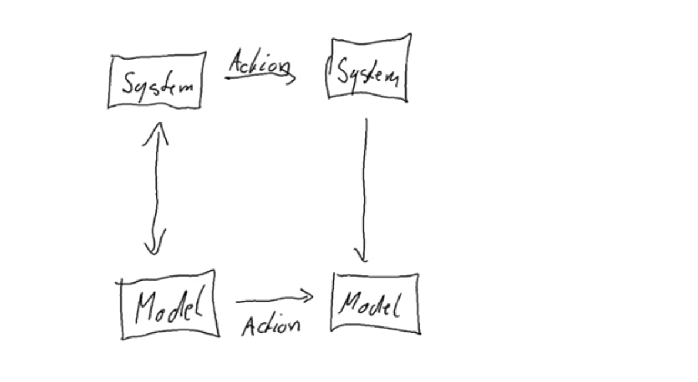
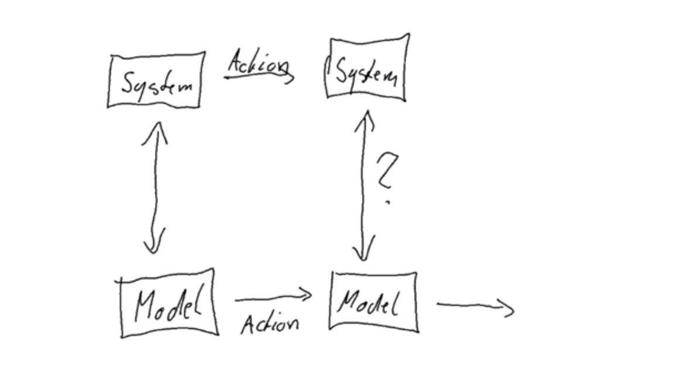
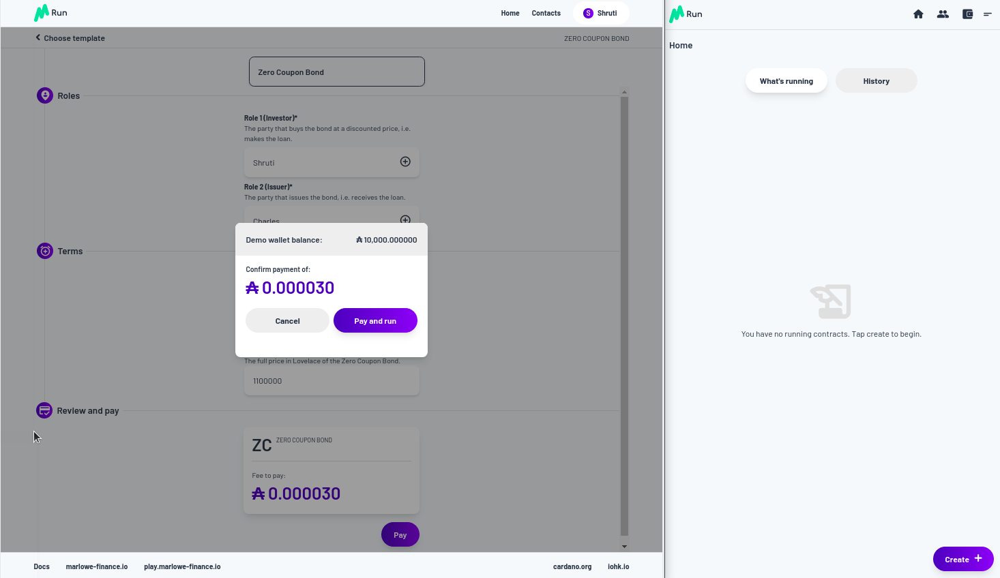
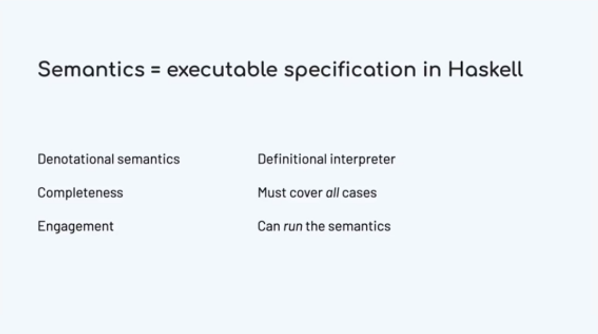
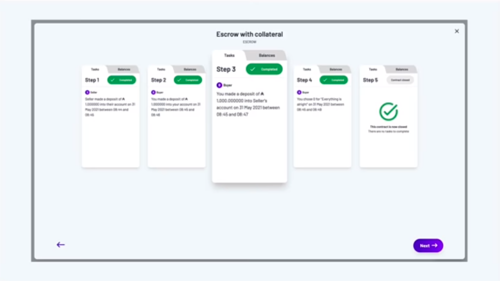

Week 09 - Marlowe
=================

.. note::
    This is a written version of `Lecture
    #9 <https://youtu.be/-RpCqHuxfQQ>`__.

    In this lecture we cover Marlowe - a special-purpose language for financial contracts on Cardano.

Overview
--------

In the previous lectures we have learnt about all the important ingredients for writing a Plutus application.

We have first looked at the extended UTxO model - the accounting model that Cardano uses - and the additions that Plutus brings to it.

Then we have talked about on-chain validation, minting policies, writing off-chain code, we have seen how to deploy smart contracts and also how to test them.

Plutus is a very powerful language. So powerful, in fact, that you can implement other languages on top of it - you can write an interpreter in Plutus for other languages.

One such language is Marlowe. Marlowe is a Domain Specific Language (DSL) for smart contracts.

For this lecture, Professor Simon Thompson, a very prominent figure in the Haskell community who leads the Marlowe team, and his colleague Alex Nemish will give guest lectures to tell us a bit about Marlowe.

Afterwards we will look at the `Marlowe playground <https://play.marlowe-finance.io/>`_ and play with a simple smart contract.

Lecture by Prof. Simon Thompson
-------------------------------

Marlowe is a special-purpose language for writing financial contracts on Cardano.

Why do we build DSLs? 
~~~~~~~~~~~~~~~~~~~~~

One reason is that we want to build languages that are closer to the language of the user and not so much the language of the system. They are 
designed to be in the specific domain of the application. A financial language will talk about payments, for example.

When we write a DSL, we get some advantages. We can write down things in that domain, but we can't perhaps write as much as we could in a general purpose language. And,
if we do work in this more specialised context, we have the advantage of being able to give people better feedback and better error messages. We can also give more
guarantees on program behaviour. That's one of the things that will be stressed in this lecture.

What kind of assurance can we give?
~~~~~~~~~~~~~~~~~~~~~~~~~~~~~~~~~~~

We can give two kinds of assurance. We can make sure that contracts do what they are supposed to do, but we can also make sure that they don't do what they shouldn't. We 
will see both aspects of that as we go along.

We've designed the language to be a simple as possible and the implementation reflects that, and we'll talk a bit about that later on. Contracts are nice and readable, and also
we can easily simulate them, so we can present to users a very clear picture of how their contract in Marlowe will behave.

In fact, we can do more than that. Because they are particularly restricted, we can explore every possible behavior path that a contract can take, before it is executed. So, we 
can give complete guarantees about how a contract will behave, not just on one or two tests, but on every possibly execution sequence.

It's also more straightforward to write mathematical proofs of various kinds of safety, so that is the strongest criteria that we can hit in this kind of world; a mathematical 
proof that the system will do certain things and won't do others.

What does a financial contract do?
~~~~~~~~~~~~~~~~~~~~~~~~~~~~~~~~~~

Let's start by looking at what a financial contract can do. 

A contract can accept payments from participants in the contract.

Depending on choices made by one the participants, it can evolve in different directions. 

.. figure:: img/pic__00011.png

It can make decisions based on external information such as the information coming from a stock exchange. So, information coming from an oracle can determine the future behaviour
of a contract.
 
A contract can also make payments out. If money has been deposited in the contract, that money can be deposited out to participants.

So we have flows of money and choices according to external factors.

One final thing that we have is that the roles in a contract are things that themselves can be owned. We represent that in Marlowe by minting tokens that 
represent those roles. That means that we can use those tokens as evidence that somebody is meant to be playing a role. They are a form of security that a person 
submitting a transaction is allowed to submit that transaction, but also it means that these roles are tradable. A role could be traded by another person or another contract.

Language design
~~~~~~~~~~~~~~~

Now let's think about how to design a language based on these ingredients.

.. figure:: img/pic__00012.png

When we design a language of contracts, what we are really doing is designing a programming language. A smart contract is just a program running on a blockchain.

A contract could, in principle, run forever. And also, more subtly, it could get stuck waiting for an input forever.

It could terminate while holding assets, locking them up forever.

So there's a whole lot of security issues that a program might have.

Designed for safety
+++++++++++++++++++

What we chose to do was to design for safety.

Contracts are finite
____________________

Firstly, contracts are designed to be finite. Their life will be finite, there is no recursion or looping in Marlowe. We will come back to that a bit later on when 
we talk about Marlowe being embedded in other languages.

Contracts will terminate
________________________

We can be sure that contracts will terminate. We do that by putting timeouts on every external action. Every choice, every deposit of money into the contract comes with
a deadline. Marlowe contracts cannot wait forever for somebody to make a choice or for an action to happen. If you hit the timeout then an alternative course is taken.

No assets retained on close
___________________________

We've designed the semantics of the language so that when a contract reaches its close, at the end of its lifetime, any money left in the contract will be 
refunded to participants.

Conservation of value
_____________________

Conservation of value is something that we get for free from the underlying blockchain. The blockchain guarantees that we can't double spend and because we are using 
the transaction mechanisms of the underlying blockchain, we can be sure that we are getting conservation of value.

So this is giving us a lot of guarantees out of the box. These are not guarantees that you get from Plutus contracts in general. A Plutus contract could go on forever, 
it need not terminate and it could terminate while holding a whole collection of assets which then become unreachable.

The Marlowe Language
~~~~~~~~~~~~~~~~~~~~

So what does the language look like? Let's cut to the chase.

.. figure:: img/pic__00013.png

Marlowe, at heart, is represented as a Haskell datatype.

.. code:: haskell

    data Contract = Close
    | Pay Party Payee Value Contract
    | If Observation Contract Contract
    | When [Case Action Contract] Timeout Contract
    | Let ValueId Value Contract
    | Assert Observation Contract
    deriving (Eq,Ord,Show,Read,Generic,Pretty)

We have a *Pay* construct. In that a *Party* in the contract makes a payment to a *Payee* of a particular *Value*, and then the contract continues with what we call the 
continuation contract.

.. code:: haskell

    Pay Party Payee Value Contract
    
We can go in two separate directions. We can observe *If* a particular *Observation* is true or not. If the observation is true we follow the first *Contract*, if it is 
false we follow the second *Contract*.

.. code:: haskell

    If Observation Contract Contract

The most complex construct in Marlowe is the *When* construct. It takes three arguments. The first of those is a list of *Contract*/*Action* pairs - a list of *Case*\s.

.. code:: haskell

    When [Case Action Contract] Timeout Contract

What the *When* construct does is wait for one of a number of *Action*\s. When one of those *Action*\s happens, it performs the corresponding *Contract*. For example, it
could be waiting for a deposit. If we have a case where the first part of the pair is a deposit, then we execute the corresponding second part of the pair. Similarly with 
making a choice or with getting a value from an oracle.

Here we are waiting for external actions and, of course, the contract can't make those actions happen. A contract can't force somebody to make a choice. It can't force
somebody to make a deposit. But what we can do is say that if none of these actions takes place then we will hit the *Timeout*, and when we hit the *Timeout*, we will perform 
the *Contract* represented by the final argument to the *When* construct.

So, we can guarantee that something will happen in the *When* construct, either by one of the actions triggering a successive contract, or we hit the timeout and go to that 
continuation.

Finally we have the *Close* construct which has the semantics defined so that nothing is retained when we close.

That is the Marlowe language, and we will see that we can use these to construct Marlowe contracts in a variety of ways.

The Marlowe Product
~~~~~~~~~~~~~~~~~~~

So that is the language. What is the Marlowe product itself?

We have a suite of things. First we'll look at the overall vision for Marlowe and then look at where we are in terms of fulfilling that vision.

.. figure:: img/pic__00020.png

We have a prototype for Marlowe Run. That is the system through which an end user will interact with contracts running on the Cardano blockchain. You can think of Marlowe 
Run as the Marlowe dApp. It's the things that allows Marlowe contracts to be executed.

We're also building a market where contracts can be uploaded, downloaded, and where we can provide various kinds of assurance about those contracts.

We allow contracts to be simulated interactively and we call that Marlowe Play. We allow contracts to be built in various different ways and we call that Marlowe Build. In 
fact fact what we've done at the moment is bundle those two - Marlowe Play and Build - into what we call the Marlowe Playground.

So as things stand at the moment you can use the Marlowe Playground to simulate and construct Marlowe contracts we're in the process of redesigning the user experience
based on what we've done with Marlowe Run.

What we're releasing very shortly is the prototype of Marlowe Run and this is the prototype of how end users will interact with Marlowe on the blockchain. Our 
intention is that we'll have all these products available running on the Cardano blockchain when we have the full support for this which will involve having the
Plutus Application Backend and the wallet back end and so on working as they should.

Demonstration
~~~~~~~~~~~~~

We'll now look at a demo of what we have in Marlowe Run to give you a sense of what we can do at the moment in terms of giving users the 
experience that they will have when Marlowe is running on blockchain. This will be the app that is going to provide that experience.

At the moment it's running locally but in a few weeks' time we will be releasing a version that runs in a distributed fashion on the simulated blockchain.
Then, as we go into the end of the year we expect to have it running for real on the Cardano blockchain itself.

You can find the Marlowe Playground at

.. code::

    https://staging.marlowe-dash.iohkdev.io/

.. figure:: img/pic__00023.png

Marlowe run runs in the browser and what it does is provide the end user interaction with contracts running on the blockchain.

For the moment we're simulating that blockchain inside the browser but eventually this will be the tool you'll use to run contracts for real on Cardano.

To interact with the contract your wallet needs to be involved to control your your signature and to control your assets, so we link up Marlowe to run with
a wallet. Let's link it up with Shruti's wallet. You can do this by creating a demo wallet, or by selecting an existing wallet.

.. figure:: img/pic__00024.png

In this window we see the world from Shruti's perspective. Let's open up another window and link that window to the world from Charles's perspective.

.. figure:: img/pic__00028.png

At the moment neither of them has any contracts running. They have a blank space, but let's start a contract up. Let's set up a zero coupon bond which is a fancy name
for a loan. You can do this by clicking *Create* and selecting the *Zero Coupon Bond* option.

Let's suppose that Shruti is making a loan to Charles. She's the investor he's the issuer of the bond.

.. figure:: img/pic__00034.png

Charles wants to borrow one Ada from Shruti and he's promised to pay back 1.1 Ada. So we've said who the issuer and investor are we said what the price and
the eventual value will be and we're now going to create the contract. In order to do that we have to make a payment of 30 lovelace to get the contract started.

So let's pay. We are asked to approve and the payment goes through. You can see now in Shruti's Marlowe Run we've got the Zero Coupon Bond running, but also,
if you look at Charles's view of the world, it's running there too for him.

.. figure:: img/pic__00037.png

We're at the first step. If we click through on Charles's contract, it's saying that it's waiting for something from the investor, who is Shruti. 

.. figure:: img/pic__00038.png

So let's see what's happening in her view.

.. figure:: img/pic__00039.png

She's being asked to make a deposit so let's click on that to make the deposit.

.. figure:: img/pic__00040.png

And click to confirm with a fee of 10 lovelace.

Then you can see her view has changed now she's waiting for the issuer to pay her back.

We look in Charles's view, which is incidentally the mobile view, of Marlowe Run, and he's asked to pay his 1 Ada.

.. figure:: img/pic__00041.png

Let's make him do that now. He'll also have to pay a 10 lovelace transaction fee. 

.. figure:: img/pic__00043.png

Let's make that deposit.

.. figure:: img/pic__00045.png

And you see now from both their perspectives that loan is completed you can see the history of what's gone on. You can see, at particular points, the
balances that the contract holds.

If we close that and select *History*, we can see the history of all the contracts that Shruti has taken part in.

.. figure:: img/pic__00046.png

That pretty much covers the basics of what you get from Marlowe Run. It's an intuitive interface to a contract running on the blockchain.
You see that each participant in the contract gets their view of the contract in real time, updated from what is, in this case in the browser, but
eventually what's on the blockchain.

Engineering
~~~~~~~~~~~

Let's now take a look under the hood and see how Marlowe will be executed on Cardano.

Here's a diagram just to give you the context. You'll understand most parts of this diagram already. We a Cardano root node on which Plutus is running, and as you
know, Plutus is a dialect of haskell, more or less.

.. figure:: img/pic__00042.png

Marlowe is embedded in Haskell and Marlowe is executed using Plutus. So Marlowe sits on top of Plutus, but it's also linked to Marlowe Run and has
an attachment to a wallet you'll be able to interact with as an end user with a running Marlowe contract.

Also it gets linked to Oracles and so on sitting out there in the real world.

Now, what does it mean to to execute a Marlowe contract?

.. figure:: img/pic__00044.png

Again this will be familiar to you from Plutus but let's just talk through precisely how it works.

Executing a Marlowe contract will produce a series of transactions on the blockchain. Obviously Plutus running on Cardano
checks the validity of transactions. We have a validation function. 

The validation function for these Marlowe transactions is essentially a Marlowe interpreter. It checks that the transactions indeed conform
to the steps of the Marlowe contract. That's done using the (E)UTxO model, so we pass the current state of the contract and some other information through as 
datum.

The Marlowe interpreter uses that to ensure that the the transactions that are submitted meet the criteria for the particular Marlowe contract.

So that's the on chain part. 

.. figure:: img/pic__00047.png

Obviously off chain there's a component as well. So we have to have Marlowe Run and we'll have to build the transactions that meet the
the validation step on chain.

And, if and when the contract requires crypto assets it will have off chain code to ensure that transactions are appropriately signed so that we will have authorization
for spending crypto assets.

Using Marlowe run and an associated wallet, we construct the transactions.

We get a flow of information in both directions. Marlowe run will submit transactions to the blockchain that then can be validated by the Marlowe interpreter, which
is itself a Plutus contract. It's one of the largest Plutus contracts that exists.

But there's also information flow another way because suppose that the transaction I've submitted is a deposit of money into a running contract, and suppose the 
contract also involves Charles Hoskinson, so my instance of Marlowe Run has submitted that transaction, but Charles also has to be notified about that.

The information flows in the other direction using the companion contract to ensure that every instance of Marlowe Run gets informed about activity in that contract.

Alex will talk some more about the details of the implementation but here you're seeing an outline of how it all how it all works.

Transactions are validated on chain through the interpreter, but they have to be built off chain and in some cases have to be authorized. Essentially the blockchain is
the central synchronization point for the distributed system that is the collection of instances of Marlowe Run that are interacting to execute the contract/

You saw in the demo that, in two separate windows, we were sharing information. That was simulating it locally but in production this will be information that's stored
on the blockchain.

System Design 
~~~~~~~~~~~~~

Let's talk a little bit about how the system is designed in in a high-level way.

Here's a piece of the semantics of Marlowe, and as you can see it's a Haskell function.

.. figure:: img/pic__00047.png

We take an environment, the current state and a contract we executed, and based on what contract that is - a *close* perhaps, or a *pay*, we can reduce we can take 
some steps of computing the results of that contract.

We do that in a way that uses uses Haskell in a quite straightforward way to advance the contract. This specification in Haskell is
an executable specification of the semantics and this gives us some very nice consequences.

.. figure:: img/pic__00048.png

We've got al we've got a high level description of what the semantics are, and we're doing that through something that is effectively an interpreter. So
we're defining at a high level this interpreter in Haskell for Marlowe contracts.

One really nice thing about writing it in this sort of way is that we can be sure we cover all cases because it's a it will be obvious if we're missing some
cases. Writing it as an interpreter ensures that we will hit cases we need to in describing the semantics.

Also it really helps us to understand the semantics. When you're designing a language you have an abstract idea about what it's going to mean, but there's
nothing like having a an implementation of it so you can actually run the semantics.

What would it mean if we were to add this construct? What would it mean if we were to modify the semantics in this way?

If we'd written it in a purely purely logical format, it's difficult to unscramble just from the rules as they're laid out what, precisely, a change in rule
might mean.

What's even nicer is that we can reuse the semantics in a number of different ways.

In the theorem prover Isabelle, we can use the semantics for reasoning and proof and we use pretty much the same semantics because Isabelle uses a functional
language as is as its subject.

.. figure:: img/pic__00050.png

We can run the semantics in Plutus. Plutus is more or less Haskell, perhaps not with all the libraries, but we can, in principle at least, build our 
implementation on blockchain from our semantics, and also we can translate the semantics into PureScript for simulation in the browser.

.. figure:: img/pic__00051.png

Now pure script is not the same exactly the same as Haskell. Isabelle's language is not exactly the same as Haskell. How can we be sure that all these
versions are the same?

One way of doing it is to extract Haskell code from Isabelle and test the original against um this extracted code. We do that on random contracts and that gives 
us a pretty high level of assurance that the two are the same.

Down down the line in our road map we certainly expect to be using a Haskell and Javascript implementation at some point to replace PureScript in the front end 
so we don't have to write a PureScript version of the semantics when we're doing the off chain interpretation building the transactions to be submitted. We can 
use the real haskell implementation by compiling it into Javascript and running that in Marlowe Run in the client code.

So, building the language in Haskell means that though we use various different versions of the semantics, we can get a high level of
assurance that these are the same and indeed we can in some situations replace things like the PureScript by Javascript.

Usability
~~~~~~~~~

That gives us a picture about how how the system is put together. Let's go to another aspect of Marlowe. We we talked about it being a special purpose
language, and that being a DSL promoted usability.

Let's say a bit more about that.

.. figure:: img/pic__00053.png

One way we we promote usability is that we provide different ways of writing contracts. Another way we promote usability is to allow people to explore interactively
how contracts behave before they're actually run in the simulation.

So let's talk about those now.

.. figure:: img/pic__00054.png

We want to write a Marlowe contract, how can we do it? Well, we can write Haskell using the Marlowe data type as text. That's one way we can do it and
that's fine. We have an editor for that inside the playground that supports code completion and will make suggestions and and so on.

So we can build the contracts as pure Marlowe, but there are other routes as well.

We have a visual editor for Marlowe so that you can produce Marlowe contracts visually, putting together blocks in a way that doesn't require you
to be a confident programmer. You can start off by using the visual version as a way of learning to engage with Marlowe if you are a coder. 

Marlowe is embedded in Haskell and in Javascript so we can use facilities like recursion to describe Marlowe contracts. We can say, in Haskell, let's do this particular pattern of
behavior a certain number of times. We can write that in Haskell and then for a particular contract we convert the Haskell into Marlowe, and we can also do that for
Javascript.

Finally, something we're not going to talk about anymore in this talk is that we can generate contracts from initial conditions. We've been
looking at that for the actor standard of financial contracts. On the basis of the contract terms we generate code in Marlowe. We write functions 
whose output is Marlowe code. 

We provide users with a variety of different approaches, leveraging knowledge of Javascript, for example, or leveraging a non-code-based approach for 
describing the contracts

We also allow people to simulate the behavior of contracts. This is something that you can see in the current version of the Marlowe Playground.

.. figure:: img/pic__00055.png

That's something you can play with yourselves. We are looking at different ways of describing the results of a simulation. So at the moment we have a transaction
log. We are allowed to choose an next action to perform, you can undo the last step to take you back and then try another path so you can step interactively 
backwards and forwards through the source code through the application of the contract.

What we're looking at is changing the user interface Marlowe Playground so that we'll use something rather more like the Marlowe Run run description of a running contract.

Assurance 
~~~~~~~~~

We've talked about usability. What about the sort of assurance that Marlowe can give users?

.. figure:: img/pic__00057.png

We've seen we've seen that making the system transparent, that making code readable is itself an advantage. We've seen that there's simulation to
give people to validate their intuition about a contract.

But rather more formally we can use the power of logic to do two things for us. We can do what's called *static analysis* so we can automatically verify
properties of individual contracts. That means we can guarantee this contract will behave as it should, checking every route through the contract.

Also we can do machine-supported proof so, not automatic any longer, written by a user, but we can prove properties of the overall system.

Static Analysis 
+++++++++++++++

.. figure:: img/pic__00058.png

What static analysis allows us to do is check all execution paths through a Marlowe contract. All choices, all choices of slots for a submission of a transaction so
we examine every possible way in which the contract might be executed.

The canonical example here is the example of whether a pay construct might fail. Is it possible a pay construct could fail? The answer is that we
will use what's called an SMT solver An SMT is an automatic logic tool - the one we use is called Z3, although others are available. The SMT solver effectively 
checks all execution parts.

If a property is is satisfied that's fine, we get get the result. If it's not satisfied, we get a counter example. We get told that there's a way 
through this contract that leads to a failed payment - a payment that can't be fulfilled. So it gives an example of how it can go wrong, and that's really 
helpful. It means that if you really want to make sure that a failed payment can't happen, then this gives you a mechanism to understand
and to debug how that eventuality can happen, and so gives you a chance to think about how to avoid it.

So, very powerful and entirely push button. You push a button and you get the results.

.. figure:: img/pic__00059.png

Here you see a fragment of a Marlowe contract. It's an escrow contract where the contract starts with a deposit of 450 lovelace.

Checking the analysis in the playground, we've got the results. Static analysis could not find any any execution that results in any warning, so that's saying
that you're okay - it's not going to give you a warning whatever you do.

But if we change that deposit of 450 lovelace to a deposit of 40 and analyze we then get this warning.

.. figure:: img/pic__00060.png

We get a transaction partial payment. We're told that we get to a payment where we're meant to pay 450 units of lovelace but there are only 40 available, and we
get given a list of transactions that take us there.

So we're able to see from that how we got to that point, and the problem is that we didn't put enough money in and then we reached a place where we needed to make a
payment of 450 lovelace.

So it's easy for us to see that we need to either make the payment smaller or make the initial deposit bigger. As it's entirely push button, we get that sort of assurance for free, as it were.

.. figure:: img/pic__00061.png

But thinking about verification, we can do rather more than that. We can prove properties of the system once and for all.

So, for example, we can prove from the semantics that accounts inside a Marlowe contract never go negative. You can't ever overdraw an account in a Marlowe contract.

We can also prove this theorem of money preservation. We can prove that if we look at all the money that's gone into the contract so far, that's equal to the sum of 
two things - the amount of money that's held inside the contract plus the amount of money that has been paid out. That gives a clear picture of money preservation.

We're also able to to prove other more technical things about the system. For example, that a *Close* construct will never produce any warnings. So, if we're 
analyzing for warnings, we don't need to worry about *Close* constructs. That allows us to optimize the static analysis.

We're also able to prove that the static analysis, which makes a number of simplifications to speed
things up, is sound and complete. That means the static analysis will give us an error warning when the real contract can generate an error warning and 
it won't give us an error warning if the real contract can't do that.

One thing that we haven't done but is on our road map is to do these sorts of proofs for individual contracts or individual contract templates. Things that we 
can't necessarily prove with static analysis, we can prove by proving them by hand.

The system is amenable to having these proofs written about it, and they give us the highest level of assurance about how it works.

We've said enough for the moment about Marlowe. Where can you go to find out more?

.. figure:: img/pic__00062.png

There's a Marlowe GitHub repository that has the semantics and the basics about Marlowe. 

.. code::

    https://github.com/input-output-hk/marlowe

Quite a lot of the implementation of the tools from Marlowe is in the Plutus repository because it has that repository as a dependency.

If you look in the `IOHK online research library <https://iohk.io/en/research/library/>`_ and search for Marlowe you'll find a number of research papers we've written about how the system works.

You'll also find an online tutorial in the Marlowe Playground.

Finally, Alex is going to give some more information in his presentation coming up next.

Summary
~~~~~~~

.. figure:: img/pic__00063.png

Just to summarize, what we have in Marlowe is a DSL, a special-purpose language for financial contracts, running on top of Plutus. Because it's a
DSL it allows us to give assurance that is harder to give for a general purpose language. And we get assurance of they way contracts should and shouldn't behave.

It also allows us to to orient its design around users as well as developers. The language is simple and therefore we get readability. 

We also get simulatability and we get these stronger assurances of static analysis and verification.

Lecture by Alex Nemish
----------------------

Alex Nemish is one of the Marlowe developers and in this presentation, he shows us a bit of Marlowe semantics and Marlowe PAB (Plutus Application Backend) contracts.

We'll start with a brief description of Marlowe Semantics that's implemented in the `Semantics.hs <https://github.com/input-output-hk/marlowe/blob/master/semantics-2.0/Semantics.hs>`_ file.
Then we'll look at the PAB contracts.

Here are the main data types for Marlowe.

.. figure:: img/pic__00065.png

It's a contract. Essentially those are six constructors that you can start to model a contract with and here's the state that is going to be stored on a blockchain.

.. figure:: img/pic__00066.png

So we have a state of balances of accounts by party, we have a map of choices, we have bound values which come from the *Let* constructor, and a *minSlot* which is
the first slot that the contract sees.

.. figure:: img/pic__00067.png

The *Input* data type essentially contains actions for a Marlowe contract. It is either a deposit, a choice, or a notification.

.. figure:: img/pic__00068.png

Here is the *TransactionInput* datatype. This is what we give as an input. Every transaction has a defined slot interval and a list of inputs.

.. figure:: img/pic__00070.png

And we have *TransactionOutput* which contains the payments that we expect to happen, the output state and the output contract.

We also see *MarloweData* which is essentially what is going to be stored on the blockchain. It's the current state of a contract as well as the actual contract.
