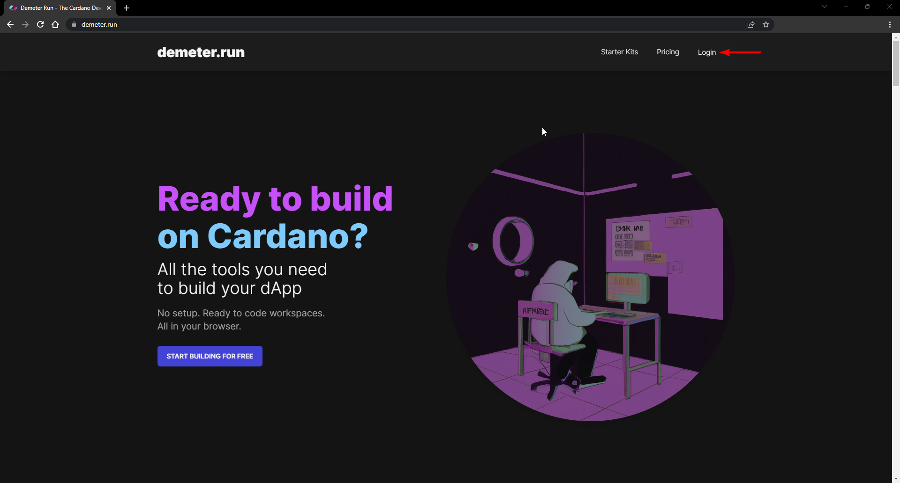

# Using Demeter

[Demeter.run](https://demeter.run/) is a cloud environment that provides all the tools required for building and deploying Cardano applications. Follow the steps below to set up an account and start using this development environment.

## Prerequisites

To use demeter.run you need a web browser running on any operating system and internet access. This guide provides screenshots of using Google Chrome.

## Setup Instructions

Please go through the following instructions to set up and start using demeter.run.

1. Open your browser and navigate to <https://demeter.run/>. You'll see the home page of demeter.run as the image below shows.

    

2. On the demeter.run home page, click on the "Login" option on the top navigation menu as it can be seen in the image below.

    